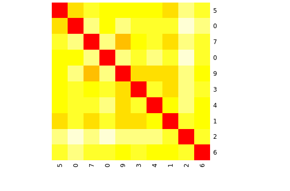
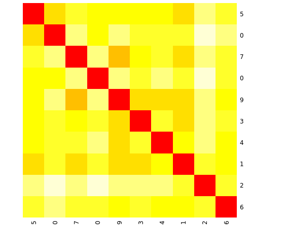
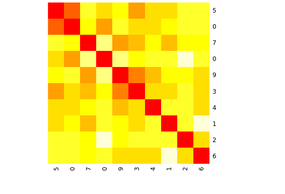
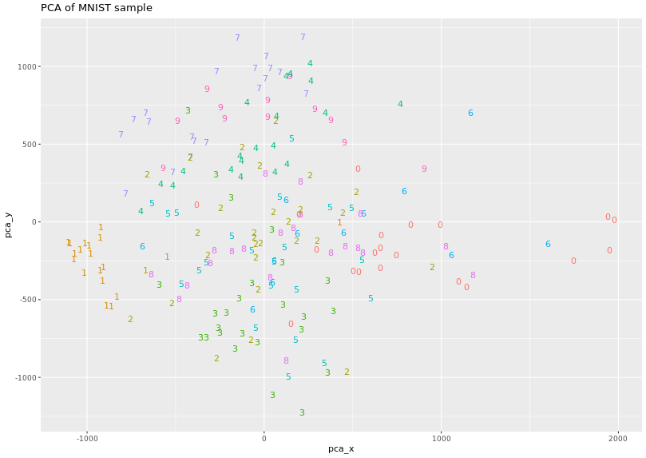
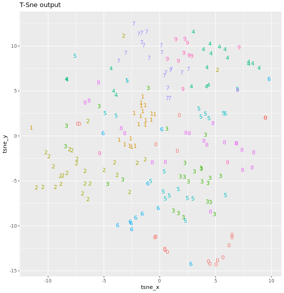

# Chapter 1 - Introduction to Advanced Dimensionality Reduction
## Exploring MNIST dataset

```r

# Have a look at the MNIST dataset names
names(mnist_sample)

# Show the structure
str(mnist_sample)

# Labels of the first 6 digits
head(mnist_sample$label)

```

***

## Digits features

```r

# Plot the histogram of the digit labels
hist(mnist_sample$label)

# Compute the basic statistics of all records
summary(mnist_sample)

# Compute the basic statistics of digits with label 0
summary(mnist_sample[, mnist_sample$label == 0])

```

Output:

```bash
> # Plot the histogram of the digit labels
> hist(mnist_sample$label)
> 
> # Compute the basic statistics of all records
> summary(mnist_sample)
     label           pixel0      pixel1      pixel2      pixel3      pixel4 
 Min.   :0.000   Min.   :0   Min.   :0   Min.   :0   Min.   :0   Min.   :0  
 1st Qu.:2.000   1st Qu.:0   1st Qu.:0   1st Qu.:0   1st Qu.:0   1st Qu.:0  
 Median :4.000   Median :0   Median :0   Median :0   Median :0   Median :0  
 Mean   :4.145   Mean   :0   Mean   :0   Mean   :0   Mean   :0   Mean   :0  
 3rd Qu.:7.000   3rd Qu.:0   3rd Qu.:0   3rd Qu.:0   3rd Qu.:0   3rd Qu.:0  
 Max.   :9.000   Max.   :0   Max.   :0   Max.   :0   Max.   :0   Max.   :0  
     pixel5      pixel6      pixel7      pixel8      pixel9     pixel10 
 Min.   :0   Min.   :0   Min.   :0   Min.   :0   Min.   :0   Min.   :0  
 1st Qu.:0   1st Qu.:0   1st Qu.:0   1st Qu.:0   1st Qu.:0   1st Qu.:0  
 Median :0   Median :0   Median :0   Median :0   Median :0   Median :0  
 Mean   :0   Mean   :0   Mean   :0   Mean   :0   Mean   :0   Mean   :0  
 3rd Qu.:0   3rd Qu.:0   3rd Qu.:0   3rd Qu.:0   3rd Qu.:0   3rd Qu.:0  
 Max.   :0   Max.   :0   Max.   :0   Max.   :0   Max.   :0   Max.   :0  
    pixel11     pixel12     pixel13     pixel14     pixel15     pixel16 
 Min.   :0   Min.   :0   Min.   :0   Min.   :0   Min.   :0   Min.   :0  
 1st Qu.:0   1st Qu.:0   1st Qu.:0   1st Qu.:0   1st Qu.:0   1st Qu.:0  
 Median :0   Median :0   Median :0   Median :0   Median :0   Median :0  
 Mean   :0   Mean   :0   Mean   :0   Mean   :0   Mean   :0   Mean   :0  
 3rd Qu.:0   3rd Qu.:0   3rd Qu.:0   3rd Qu.:0   3rd Qu.:0   3rd Qu.:0  
 Max.   :0   Max.   :0   Max.   :0   Max.   :0   Max.   :0   Max.   :0  
    pixel17     pixel18     pixel19     pixel20     pixel21     pixel22 
 Min.   :0   Min.   :0   Min.   :0   Min.   :0   Min.   :0   Min.   :0  
 1st Qu.:0   1st Qu.:0   1st Qu.:0   1st Qu.:0   1st Qu.:0   1st Qu.:0  
 Median :0   Median :0   Median :0   Median :0   Median :0   Median :0  
 Mean   :0   Mean   :0   Mean   :0   Mean   :0   Mean   :0   Mean   :0  
 3rd Qu.:0   3rd Qu.:0   3rd Qu.:0   3rd Qu.:0   3rd Qu.:0   3rd Qu.:0  
 Max.   :0   Max.   :0   Max.   :0   Max.   :0   Max.   :0   Max.   :0  
    pixel23     pixel24     pixel25     pixel26     pixel27     pixel28 
 Min.   :0   Min.   :0   Min.   :0   Min.   :0   Min.   :0   Min.   :0  
 1st Qu.:0   1st Qu.:0   1st Qu.:0   1st Qu.:0   1st Qu.:0   1st Qu.:0  
 Median :0   Median :0   Median :0   Median :0   Median :0   Median :0  
 Mean   :0   Mean   :0   Mean   :0   Mean   :0   Mean   :0   Mean   :0  
 3rd Qu.:0   3rd Qu.:0   3rd Qu.:0   3rd Qu.:0   3rd Qu.:0   3rd Qu.:0  
 Max.   :0   Max.   :0   Max.   :0   Max.   :0   Max.   :0   Max.   :0  
    pixel29     pixel30     pixel31     pixel32     pixel33     pixel34 
 Min.   :0   Min.   :0   Min.   :0   Min.   :0   Min.   :0   Min.   :0  
 1st Qu.:0   1st Qu.:0   1st Qu.:0   1st Qu.:0   1st Qu.:0   1st Qu.:0  
 Median :0   Median :0   Median :0   Median :0   Median :0   Median :0  
 Mean   :0   Mean   :0   Mean   :0   Mean   :0   Mean   :0   Mean   :0  
 3rd Qu.:0   3rd Qu.:0   3rd Qu.:0   3rd Qu.:0   3rd Qu.:0   3rd Qu.:0  
 Max.   :0   Max.   :0   Max.   :0   Max.   :0   Max.   :0   Max.   :0  
    pixel35     pixel36     pixel37     pixel38     pixel39     pixel40 
 Min.   :0   Min.   :0   Min.   :0   Min.   :0   Min.   :0   Min.   :0  
 1st Qu.:0   1st Qu.:0   1st Qu.:0   1st Qu.:0   1st Qu.:0   1st Qu.:0  
 Median :0   Median :0   Median :0   Median :0   Median :0   Median :0  
 Mean   :0   Mean   :0   Mean   :0   Mean   :0   Mean   :0   Mean   :0  
 3rd Qu.:0   3rd Qu.:0   3rd Qu.:0   3rd Qu.:0   3rd Qu.:0   3rd Qu.:0  
 Max.   :0   Max.   :0   Max.   :0   Max.   :0   Max.   :0   Max.   :0  
    pixel41     pixel42     pixel43     pixel44     pixel45     pixel46 
 Min.   :0   Min.   :0   Min.   :0   Min.   :0   Min.   :0   Min.   :0  
 1st Qu.:0   1st Qu.:0   1st Qu.:0   1st Qu.:0   1st Qu.:0   1st Qu.:0  
 Median :0   Median :0   Median :0   Median :0   Median :0   Median :0  
 Mean   :0   Mean   :0   Mean   :0   Mean   :0   Mean   :0   Mean   :0  
 3rd Qu.:0   3rd Qu.:0   3rd Qu.:0   3rd Qu.:0   3rd Qu.:0   3rd Qu.:0  
 Max.   :0   Max.   :0   Max.   :0   Max.   :0   Max.   :0   Max.   :0  
    pixel47     pixel48     pixel49     pixel50     pixel51     pixel52 
 Min.   :0   Min.   :0   Min.   :0   Min.   :0   Min.   :0   Min.   :0  
 1st Qu.:0   1st Qu.:0   1st Qu.:0   1st Qu.:0   1st Qu.:0   1st Qu.:0  
 Median :0   Median :0   Median :0   Median :0   Median :0   Median :0  
 Mean   :0   Mean   :0   Mean   :0   Mean   :0   Mean   :0   Mean   :0  
 3rd Qu.:0   3rd Qu.:0   3rd Qu.:0   3rd Qu.:0   3rd Qu.:0   3rd Qu.:0  
 Max.   :0   Max.   :0   Max.   :0   Max.   :0   Max.   :0   Max.   :0  
    pixel53     pixel54     pixel55     pixel56     pixel57     pixel58 
 Min.   :0   Min.   :0   Min.   :0   Min.   :0   Min.   :0   Min.   :0  
 1st Qu.:0   1st Qu.:0   1st Qu.:0   1st Qu.:0   1st Qu.:0   1st Qu.:0  
 Median :0   Median :0   Median :0   Median :0   Median :0   Median :0  
 Mean   :0   Mean   :0   Mean   :0   Mean   :0   Mean   :0   Mean   :0  
 3rd Qu.:0   3rd Qu.:0   3rd Qu.:0   3rd Qu.:0   3rd Qu.:0   3rd Qu.:0  
 Max.   :0   Max.   :0   Max.   :0   Max.   :0   Max.   :0   Max.   :0  
    pixel59     pixel60     pixel61     pixel62     pixel63     pixel64 
 Min.   :0   Min.   :0   Min.   :0   Min.   :0   Min.   :0   Min.   :0  
 1st Qu.:0   1st Qu.:0   1st Qu.:0   1st Qu.:0   1st Qu.:0   1st Qu.:0  
 Median :0   Median :0   Median :0   Median :0   Median :0   Median :0  
 Mean   :0   Mean   :0   Mean   :0   Mean   :0   Mean   :0   Mean   :0  
 3rd Qu.:0   3rd Qu.:0   3rd Qu.:0   3rd Qu.:0   3rd Qu.:0   3rd Qu.:0  
 Max.   :0   Max.   :0   Max.   :0   Max.   :0   Max.   :0   Max.   :0  
    pixel65     pixel66     pixel67         pixel68           pixel69      
 Min.   :0   Min.   :0   Min.   : 0.00   Min.   :  0.000   Min.   :  0.00  
 1st Qu.:0   1st Qu.:0   1st Qu.: 0.00   1st Qu.:  0.000   1st Qu.:  0.00  
 Median :0   Median :0   Median : 0.00   Median :  0.000   Median :  0.00  
 Mean   :0   Mean   :0   Mean   : 0.21   Mean   :  1.185   Mean   :  1.32  
 3rd Qu.:0   3rd Qu.:0   3rd Qu.: 0.00   3rd Qu.:  0.000   3rd Qu.:  0.00  
 Max.   :0   Max.   :0   Max.   :42.00   Max.   :192.000   Max.   :238.00  
    pixel70          pixel71          pixel72          pixel73      
 Min.   : 0.000   Min.   :  0.00   Min.   :  0.00   Min.   :  0.00  
 1st Qu.: 0.000   1st Qu.:  0.00   1st Qu.:  0.00   1st Qu.:  0.00  
 Median : 0.000   Median :  0.00   Median :  0.00   Median :  0.00  
 Mean   : 0.665   Mean   :  1.21   Mean   :  2.09   Mean   :  1.71  
 3rd Qu.: 0.000   3rd Qu.:  0.00   3rd Qu.:  0.00   3rd Qu.:  0.00  
 Max.   :88.000   Max.   :229.00   Max.   :253.00   Max.   :216.00  
    pixel74          pixel75          pixel76          pixel77     pixel78 
 Min.   : 0.000   Min.   :  0.00   Min.   :  0.00   Min.   :0   Min.   :0  
 1st Qu.: 0.000   1st Qu.:  0.00   1st Qu.:  0.00   1st Qu.:0   1st Qu.:0  
 Median : 0.000   Median :  0.00   Median :  0.00   Median :0   Median :0  
 Mean   : 0.335   Mean   :  0.99   Mean   :  0.57   Mean   :0   Mean   :0  
 3rd Qu.: 0.000   3rd Qu.:  0.00   3rd Qu.:  0.00   3rd Qu.:0   3rd Qu.:0  
 Max.   :67.000   Max.   :198.00   Max.   :114.00   Max.   :0   Max.   :0  
    pixel79     pixel80     pixel81     pixel82     pixel83     pixel84 
 Min.   :0   Min.   :0   Min.   :0   Min.   :0   Min.   :0   Min.   :0  
 1st Qu.:0   1st Qu.:0   1st Qu.:0   1st Qu.:0   1st Qu.:0   1st Qu.:0  
 Median :0   Median :0   Median :0   Median :0   Median :0   Median :0  
 Mean   :0   Mean   :0   Mean   :0   Mean   :0   Mean   :0   Mean   :0  
 3rd Qu.:0   3rd Qu.:0   3rd Qu.:0   3rd Qu.:0   3rd Qu.:0   3rd Qu.:0  
 Max.   :0   Max.   :0   Max.   :0   Max.   :0   Max.   :0   Max.   :0  
    pixel85     pixel86     pixel87     pixel88     pixel89     pixel90 
 Min.   :0   Min.   :0   Min.   :0   Min.   :0   Min.   :0   Min.   :0  
 1st Qu.:0   1st Qu.:0   1st Qu.:0   1st Qu.:0   1st Qu.:0   1st Qu.:0  
 Median :0   Median :0   Median :0   Median :0   Median :0   Median :0  
 Mean   :0   Mean   :0   Mean   :0   Mean   :0   Mean   :0   Mean   :0  
 3rd Qu.:0   3rd Qu.:0   3rd Qu.:0   3rd Qu.:0   3rd Qu.:0   3rd Qu.:0  
 Max.   :0   Max.   :0   Max.   :0   Max.   :0   Max.   :0   Max.   :0  
    pixel91     pixel92         pixel93          pixel94          pixel95      
 Min.   :0   Min.   : 0.00   Min.   :  0.00   Min.   :  0.00   Min.   :  0.00  
 1st Qu.:0   1st Qu.: 0.00   1st Qu.:  0.00   1st Qu.:  0.00   1st Qu.:  0.00  
 Median :0   Median : 0.00   Median :  0.00   Median :  0.00   Median :  0.00  
 Mean   :0   Mean   : 0.57   Mean   :  2.26   Mean   :  5.55   Mean   :  9.09  
 3rd Qu.:0   3rd Qu.: 0.00   3rd Qu.:  0.00   3rd Qu.:  0.00   3rd Qu.:  0.00  
 Max.   :0   Max.   :64.00   Max.   :177.00   Max.   :255.00   Max.   :255.00  
    pixel96          pixel97          pixel98          pixel99      
 Min.   :  0.00   Min.   :  0.00   Min.   :  0.00   Min.   :  0.00  
 1st Qu.:  0.00   1st Qu.:  0.00   1st Qu.:  0.00   1st Qu.:  0.00  
 Median :  0.00   Median :  0.00   Median :  0.00   Median :  0.00  
 Mean   : 10.19   Mean   : 12.93   Mean   : 16.98   Mean   : 13.23  
 3rd Qu.:  0.00   3rd Qu.:  0.00   3rd Qu.:  0.00   3rd Qu.:  0.00  
 Max.   :255.00   Max.   :255.00   Max.   :255.00   Max.   :255.00  
    pixel100        pixel101         pixel102          pixel103      
 Min.   :  0.0   Min.   :  0.00   Min.   :  0.000   Min.   :  0.000  
 1st Qu.:  0.0   1st Qu.:  0.00   1st Qu.:  0.000   1st Qu.:  0.000  
 Median :  0.0   Median :  0.00   Median :  0.000   Median :  0.000  
 Mean   : 13.1   Mean   : 11.28   Mean   :  7.685   Mean   :  6.875  
 3rd Qu.:  0.0   3rd Qu.:  0.00   3rd Qu.:  0.000   3rd Qu.:  0.000  
 Max.   :255.0   Max.   :255.00   Max.   :254.000   Max.   :252.000  
    pixel104         pixel105          pixel106         pixel107     
 Min.   :  0.00   Min.   :  0.000   Min.   :  0.00   Min.   : 0.000  
 1st Qu.:  0.00   1st Qu.:  0.000   1st Qu.:  0.00   1st Qu.: 0.000  
 Median :  0.00   Median :  0.000   Median :  0.00   Median : 0.000  
 Mean   :  2.73   Mean   :  1.245   Mean   :  1.27   Mean   : 0.405  
 3rd Qu.:  0.00   3rd Qu.:  0.000   3rd Qu.:  0.00   3rd Qu.: 0.000  
 Max.   :219.00   Max.   :238.000   Max.   :254.00   Max.   :81.000  
    pixel108    pixel109    pixel110    pixel111    pixel112    pixel113
 Min.   :0   Min.   :0   Min.   :0   Min.   :0   Min.   :0   Min.   :0  
 1st Qu.:0   1st Qu.:0   1st Qu.:0   1st Qu.:0   1st Qu.:0   1st Qu.:0  
 Median :0   Median :0   Median :0   Median :0   Median :0   Median :0  
 Mean   :0   Mean   :0   Mean   :0   Mean   :0   Mean   :0   Mean   :0  
 3rd Qu.:0   3rd Qu.:0   3rd Qu.:0   3rd Qu.:0   3rd Qu.:0   3rd Qu.:0  
 Max.   :0   Max.   :0   Max.   :0   Max.   :0   Max.   :0   Max.   :0  
    pixel114    pixel115    pixel116    pixel117    pixel118    
 Min.   :0   Min.   :0   Min.   :0   Min.   :0   Min.   : 0.00  
 1st Qu.:0   1st Qu.:0   1st Qu.:0   1st Qu.:0   1st Qu.: 0.00  
 Median :0   Median :0   Median :0   Median :0   Median : 0.00  
 Mean   :0   Mean   :0   Mean   :0   Mean   :0   Mean   : 0.37  
 3rd Qu.:0   3rd Qu.:0   3rd Qu.:0   3rd Qu.:0   3rd Qu.: 0.00  
 Max.   :0   Max.   :0   Max.   :0   Max.   :0   Max.   :74.00  
    pixel119          pixel120         pixel121         pixel122     
 Min.   :  0.000   Min.   :  0.00   Min.   :  0.00   Min.   :  0.00  
 1st Qu.:  0.000   1st Qu.:  0.00   1st Qu.:  0.00   1st Qu.:  0.00  
 Median :  0.000   Median :  0.00   Median :  0.00   Median :  0.00  
 Mean   :  2.655   Mean   :  6.35   Mean   : 11.04   Mean   : 15.52  
 3rd Qu.:  0.000   3rd Qu.:  0.00   3rd Qu.:  0.00   3rd Qu.:  0.00  
 Max.   :201.000   Max.   :254.00   Max.   :255.00   Max.   :255.00  
    pixel123         pixel124         pixel125         pixel126     
 Min.   :  0.00   Min.   :  0.00   Min.   :  0.00   Min.   :  0.00  
 1st Qu.:  0.00   1st Qu.:  0.00   1st Qu.:  0.00   1st Qu.:  0.00  
 Median :  0.00   Median :  0.00   Median :  0.00   Median :  0.00  
 Mean   : 24.97   Mean   : 36.55   Mean   : 50.94   Mean   : 56.81  
 3rd Qu.:  0.00   3rd Qu.:  0.00   3rd Qu.: 41.75   3rd Qu.: 89.00  
 Max.   :255.00   Max.   :255.00   Max.   :255.00   Max.   :255.00  
    pixel127         pixel128         pixel129         pixel130     
 Min.   :  0.00   Min.   :  0.00   Min.   :  0.00   Min.   :  0.00  
 1st Qu.:  0.00   1st Qu.:  0.00   1st Qu.:  0.00   1st Qu.:  0.00  
 Median :  0.00   Median :  0.00   Median :  0.00   Median :  0.00  
 Mean   : 60.04   Mean   : 51.38   Mean   : 42.99   Mean   : 39.24  
 3rd Qu.:120.50   3rd Qu.: 83.25   3rd Qu.: 22.00   3rd Qu.:  0.00  
 Max.   :255.00   Max.   :255.00   Max.   :255.00   Max.   :255.00  
    pixel131         pixel132         pixel133          pixel134      
 Min.   :  0.00   Min.   :  0.00   Min.   :  0.000   Min.   :  0.000  
 1st Qu.:  0.00   1st Qu.:  0.00   1st Qu.:  0.000   1st Qu.:  0.000  
 Median :  0.00   Median :  0.00   Median :  0.000   Median :  0.000  
 Mean   : 30.91   Mean   : 16.59   Mean   :  9.335   Mean   :  8.295  
 3rd Qu.:  0.00   3rd Qu.:  0.00   3rd Qu.:  0.000   3rd Qu.:  0.000  
 Max.   :255.00   Max.   :255.00   Max.   :253.000   Max.   :253.000  
    pixel135          pixel136          pixel137         pixel138    pixel139
 Min.   :  0.000   Min.   :  0.000   Min.   : 0.000   Min.   :0   Min.   :0  
 1st Qu.:  0.000   1st Qu.:  0.000   1st Qu.: 0.000   1st Qu.:0   1st Qu.:0  
 Median :  0.000   Median :  0.000   Median : 0.000   Median :0   Median :0  
 Mean   :  5.035   Mean   :  1.885   Mean   : 0.095   Mean   :0   Mean   :0  
 3rd Qu.:  0.000   3rd Qu.:  0.000   3rd Qu.: 0.000   3rd Qu.:0   3rd Qu.:0  
 Max.   :254.000   Max.   :221.000   Max.   :19.000   Max.   :0   Max.   :0  
    pixel140    pixel141    pixel142    pixel143         pixel144     
 Min.   :0   Min.   :0   Min.   :0   Min.   : 0.000   Min.   : 0.000  
 1st Qu.:0   1st Qu.:0   1st Qu.:0   1st Qu.: 0.000   1st Qu.: 0.000  
 Median :0   Median :0   Median :0   Median : 0.000   Median : 0.000  
 Mean   :0   Mean   :0   Mean   :0   Mean   : 0.055   Mean   : 0.475  
 3rd Qu.:0   3rd Qu.:0   3rd Qu.:0   3rd Qu.: 0.000   3rd Qu.: 0.000  
 Max.   :0   Max.   :0   Max.   :0   Max.   :11.000   Max.   :69.000  
    pixel145          pixel146          pixel147          pixel148     
 Min.   :  0.000   Min.   :  0.000   Min.   :  0.000   Min.   :  0.00  
 1st Qu.:  0.000   1st Qu.:  0.000   1st Qu.:  0.000   1st Qu.:  0.00  
 Median :  0.000   Median :  0.000   Median :  0.000   Median :  0.00  
 Mean   :  1.545   Mean   :  1.805   Mean   :  5.445   Mean   : 13.19  
 3rd Qu.:  0.000   3rd Qu.:  0.000   3rd Qu.:  0.000   3rd Qu.:  0.00  
 Max.   :190.000   Max.   :252.000   Max.   :255.000   Max.   :254.00  
    pixel149         pixel150         pixel151         pixel152     
 Min.   :  0.00   Min.   :  0.00   Min.   :  0.00   Min.   :  0.00  
 1st Qu.:  0.00   1st Qu.:  0.00   1st Qu.:  0.00   1st Qu.:  0.00  
 Median :  0.00   Median :  0.00   Median :  0.00   Median :  0.00  
 Mean   : 21.22   Mean   : 32.42   Mean   : 48.28   Mean   : 66.86  
 3rd Qu.:  0.00   3rd Qu.:  0.25   3rd Qu.: 36.00   3rd Qu.:148.00  
 Max.   :255.00   Max.   :255.00   Max.   :255.00   Max.   :255.00  
    pixel153         pixel154        pixel155         pixel156     
 Min.   :  0.00   Min.   :  0.0   Min.   :  0.00   Min.   :  0.00  
 1st Qu.:  0.00   1st Qu.:  0.0   1st Qu.:  0.00   1st Qu.:  0.00  
 Median :  0.00   Median :  0.0   Median : 13.00   Median : 13.00  
 Mean   : 81.16   Mean   : 94.6   Mean   : 99.89   Mean   : 98.22  
 3rd Qu.:193.75   3rd Qu.:222.5   3rd Qu.:251.25   3rd Qu.:237.25  
 Max.   :255.00   Max.   :255.0   Max.   :255.00   Max.   :255.00  
    pixel157         pixel158         pixel159         pixel160     
 Min.   :  0.00   Min.   :  0.00   Min.   :  0.00   Min.   :  0.00  
 1st Qu.:  0.00   1st Qu.:  0.00   1st Qu.:  0.00   1st Qu.:  0.00  
 Median : 12.50   Median :  0.00   Median :  0.00   Median :  0.00  
 Mean   : 88.07   Mean   : 78.61   Mean   : 65.45   Mean   : 41.86  
 3rd Qu.:195.25   3rd Qu.:184.00   3rd Qu.:138.75   3rd Qu.: 36.00  
 Max.   :255.00   Max.   :255.00   Max.   :255.00   Max.   :254.00  
    pixel161         pixel162         pixel163         pixel164  
 Min.   :  0.00   Min.   :  0.00   Min.   :  0.00   Min.   :  0  
 1st Qu.:  0.00   1st Qu.:  0.00   1st Qu.:  0.00   1st Qu.:  0  
 Median :  0.00   Median :  0.00   Median :  0.00   Median :  0  
 Mean   : 19.68   Mean   :  9.82   Mean   :  7.22   Mean   :  4  
 3rd Qu.:  0.00   3rd Qu.:  0.00   3rd Qu.:  0.00   3rd Qu.:  0  
 Max.   :255.00   Max.   :255.00   Max.   :253.00   Max.   :254  
    pixel165         pixel166         pixel167    pixel168    pixel169
 Min.   :  0.00   Min.   : 0.000   Min.   :0   Min.   :0   Min.   :0  
 1st Qu.:  0.00   1st Qu.: 0.000   1st Qu.:0   1st Qu.:0   1st Qu.:0  
 Median :  0.00   Median : 0.000   Median :0   Median :0   Median :0  
 Mean   :  1.85   Mean   : 0.325   Mean   :0   Mean   :0   Mean   :0  
 3rd Qu.:  0.00   3rd Qu.: 0.000   3rd Qu.:0   3rd Qu.:0   3rd Qu.:0  
 Max.   :255.00   Max.   :65.000   Max.   :0   Max.   :0   Max.   :0  
    pixel170    pixel171    pixel172          pixel173          pixel174     
 Min.   :0   Min.   :0   Min.   :  0.000   Min.   :  0.000   Min.   :  0.00  
 1st Qu.:0   1st Qu.:0   1st Qu.:  0.000   1st Qu.:  0.000   1st Qu.:  0.00  
 Median :0   Median :0   Median :  0.000   Median :  0.000   Median :  0.00  
 Mean   :0   Mean   :0   Mean   :  0.575   Mean   :  2.265   Mean   :  3.44  
 3rd Qu.:0   3rd Qu.:0   3rd Qu.:  0.000   3rd Qu.:  0.000   3rd Qu.:  0.00  
 Max.   :0   Max.   :0   Max.   :115.000   Max.   :254.000   Max.   :139.00  
    pixel175         pixel176        pixel177         pixel178     
 Min.   :  0.00   Min.   :  0.0   Min.   :  0.00   Min.   :  0.00  
 1st Qu.:  0.00   1st Qu.:  0.0   1st Qu.:  0.00   1st Qu.:  0.00  
 Median :  0.00   Median :  0.0   Median :  0.00   Median :  0.00  
 Mean   : 11.72   Mean   : 22.8   Mean   : 35.47   Mean   : 52.48  
 3rd Qu.:  0.00   3rd Qu.:  0.0   3rd Qu.:  0.50   3rd Qu.: 68.50  
 Max.   :253.00   Max.   :253.0   Max.   :255.00   Max.   :255.00  
    pixel179         pixel180         pixel181         pixel182    
 Min.   :  0.00   Min.   :  0.00   Min.   :  0.00   Min.   :  0.0  
 1st Qu.:  0.00   1st Qu.:  0.00   1st Qu.:  0.00   1st Qu.:  0.0  
 Median :  0.00   Median :  7.50   Median : 32.50   Median : 94.5  
 Mean   : 71.59   Mean   : 85.81   Mean   : 97.92   Mean   :112.0  
 3rd Qu.:157.00   3rd Qu.:217.75   3rd Qu.:228.50   3rd Qu.:252.0  
 Max.   :255.00   Max.   :254.00   Max.   :255.00   Max.   :255.0  
    pixel183        pixel184        pixel185        pixel186    
 Min.   :  0.0   Min.   :  0.0   Min.   :  0.0   Min.   :  0.0  
 1st Qu.:  0.0   1st Qu.:  0.0   1st Qu.:  0.0   1st Qu.:  0.0  
 Median :147.0   Median :143.5   Median :129.0   Median : 44.5  
 Mean   :129.2   Mean   :130.2   Mean   :123.5   Mean   :105.9  
 3rd Qu.:252.2   3rd Qu.:253.0   3rd Qu.:252.0   3rd Qu.:247.2  
 Max.   :255.0   Max.   :255.0   Max.   :255.0   Max.   :255.0  
    pixel187         pixel188         pixel189         pixel190     
 Min.   :  0.00   Min.   :  0.00   Min.   :  0.00   Min.   :  0.00  
 1st Qu.:  0.00   1st Qu.:  0.00   1st Qu.:  0.00   1st Qu.:  0.00  
 Median :  3.50   Median :  0.00   Median :  0.00   Median :  0.00  
 Mean   : 85.82   Mean   : 65.34   Mean   : 36.45   Mean   : 17.91  
 3rd Qu.:199.25   3rd Qu.:130.50   3rd Qu.:  6.25   3rd Qu.:  0.00  
 Max.   :255.00   Max.   :255.00   Max.   :254.00   Max.   :254.00  
    pixel191         pixel192          pixel193         pixel194     
 Min.   :  0.00   Min.   :  0.000   Min.   :  0.00   Min.   : 0.000  
 1st Qu.:  0.00   1st Qu.:  0.000   1st Qu.:  0.00   1st Qu.: 0.000  
 Median :  0.00   Median :  0.000   Median :  0.00   Median : 0.000  
 Mean   : 10.63   Mean   :  5.925   Mean   :  1.92   Mean   : 0.155  
 3rd Qu.:  0.00   3rd Qu.:  0.000   3rd Qu.:  0.00   3rd Qu.: 0.000  
 Max.   :255.00   Max.   :253.000   Max.   :188.00   Max.   :31.000  
    pixel195    pixel196    pixel197    pixel198    pixel199    
 Min.   :0   Min.   :0   Min.   :0   Min.   :0   Min.   : 0.00  
 1st Qu.:0   1st Qu.:0   1st Qu.:0   1st Qu.:0   1st Qu.: 0.00  
 Median :0   Median :0   Median :0   Median :0   Median : 0.00  
 Mean   :0   Mean   :0   Mean   :0   Mean   :0   Mean   : 0.37  
 3rd Qu.:0   3rd Qu.:0   3rd Qu.:0   3rd Qu.:0   3rd Qu.: 0.00  
 Max.   :0   Max.   :0   Max.   :0   Max.   :0   Max.   :38.00  
    pixel200          pixel201         pixel202         pixel203     
 Min.   :  0.000   Min.   :  0.00   Min.   :  0.00   Min.   :  0.00  
 1st Qu.:  0.000   1st Qu.:  0.00   1st Qu.:  0.00   1st Qu.:  0.00  
 Median :  0.000   Median :  0.00   Median :  0.00   Median :  0.00  
 Mean   :  2.095   Mean   :  6.07   Mean   : 11.52   Mean   : 20.37  
 3rd Qu.:  0.000   3rd Qu.:  0.00   3rd Qu.:  0.00   3rd Qu.:  0.00  
 Max.   :210.000   Max.   :254.00   Max.   :255.00   Max.   :255.00  
    pixel204         pixel205         pixel206         pixel207     
 Min.   :  0.00   Min.   :  0.00   Min.   :  0.00   Min.   :  0.00  
 1st Qu.:  0.00   1st Qu.:  0.00   1st Qu.:  0.00   1st Qu.:  0.00  
 Median :  0.00   Median :  0.00   Median :  0.00   Median : 20.00  
 Mean   : 35.71   Mean   : 51.73   Mean   : 72.97   Mean   : 96.41  
 3rd Qu.:  0.25   3rd Qu.: 61.00   3rd Qu.:170.50   3rd Qu.:226.00  
 Max.   :255.00   Max.   :255.00   Max.   :255.00   Max.   :255.00  
    pixel208        pixel209        pixel210        pixel211    
 Min.   :  0.0   Min.   :  0.0   Min.   :  0.0   Min.   :  0.0  
 1st Qu.:  0.0   1st Qu.:  0.0   1st Qu.:  0.0   1st Qu.:  0.0  
 Median : 43.5   Median : 71.5   Median :103.5   Median :127.0  
 Mean   :105.0   Mean   :109.7   Mean   :120.0   Mean   :126.1  
 3rd Qu.:240.0   3rd Qu.:251.0   3rd Qu.:252.0   3rd Qu.:252.0  
 Max.   :255.0   Max.   :255.0   Max.   :255.0   Max.   :255.0  
    pixel212        pixel213        pixel214        pixel215    
 Min.   :  0.0   Min.   :  0.0   Min.   :  0.0   Min.   :  0.0  
 1st Qu.:  0.0   1st Qu.:  0.0   1st Qu.:  0.0   1st Qu.:  0.0  
 Median :150.0   Median :134.5   Median :118.5   Median : 61.5  
 Mean   :134.5   Mean   :129.0   Mean   :120.8   Mean   :103.8  
 3rd Qu.:252.0   3rd Qu.:252.0   3rd Qu.:251.2   3rd Qu.:230.5  
 Max.   :255.0   Max.   :255.0   Max.   :255.0   Max.   :255.0  
    pixel216         pixel217         pixel218         pixel219     
 Min.   :  0.00   Min.   :  0.00   Min.   :  0.00   Min.   :  0.00  
 1st Qu.:  0.00   1st Qu.:  0.00   1st Qu.:  0.00   1st Qu.:  0.00  
 Median :  0.00   Median :  0.00   Median :  0.00   Median :  0.00  
 Mean   : 80.76   Mean   : 50.58   Mean   : 27.89   Mean   : 15.47  
 3rd Qu.:211.75   3rd Qu.: 50.00   3rd Qu.:  0.00   3rd Qu.:  0.00  
 Max.   :255.00   Max.   :255.00   Max.   :254.00   Max.   :253.00  
    pixel220         pixel221         pixel222         pixel223    pixel224
 Min.   :  0.00   Min.   :  0.00   Min.   :  0.00   Min.   :0   Min.   :0  
 1st Qu.:  0.00   1st Qu.:  0.00   1st Qu.:  0.00   1st Qu.:0   1st Qu.:0  
 Median :  0.00   Median :  0.00   Median :  0.00   Median :0   Median :0  
 Mean   :  7.61   Mean   :  3.33   Mean   :  0.91   Mean   :0   Mean   :0  
 3rd Qu.:  0.00   3rd Qu.:  0.00   3rd Qu.:  0.00   3rd Qu.:0   3rd Qu.:0  
 Max.   :252.00   Max.   :220.00   Max.   :127.00   Max.   :0   Max.   :0  
    pixel225    pixel226    pixel227        pixel228          pixel229     
 Min.   :0   Min.   :0   Min.   :  0.0   Min.   :  0.000   Min.   :  0.00  
 1st Qu.:0   1st Qu.:0   1st Qu.:  0.0   1st Qu.:  0.000   1st Qu.:  0.00  
 Median :0   Median :0   Median :  0.0   Median :  0.000   Median :  0.00  
 Mean   :0   Mean   :0   Mean   :  1.2   Mean   :  4.105   Mean   :  8.91  
 3rd Qu.:0   3rd Qu.:0   3rd Qu.:  0.0   3rd Qu.:  0.000   3rd Qu.:  0.00  
 Max.   :0   Max.   :0   Max.   :144.0   Max.   :252.000   Max.   :255.00  
    pixel230         pixel231         pixel232         pixel233     
 Min.   :  0.00   Min.   :  0.00   Min.   :  0.00   Min.   :  0.00  
 1st Qu.:  0.00   1st Qu.:  0.00   1st Qu.:  0.00   1st Qu.:  0.00  
 Median :  0.00   Median :  0.00   Median :  0.00   Median :  0.00  
 Mean   : 20.82   Mean   : 32.99   Mean   : 50.49   Mean   : 70.14  
 3rd Qu.:  0.00   3rd Qu.:  0.00   3rd Qu.: 42.50   3rd Qu.:166.00  
 Max.   :255.00   Max.   :255.00   Max.   :255.00   Max.   :255.00  
    pixel234         pixel235        pixel236        pixel237    
 Min.   :  0.00   Min.   :  0.0   Min.   :  0.0   Min.   :  0.0  
 1st Qu.:  0.00   1st Qu.:  0.0   1st Qu.:  0.0   1st Qu.:  0.0  
 Median : 13.50   Median : 46.5   Median : 80.0   Median :101.5  
 Mean   : 90.17   Mean   :106.0   Mean   :114.3   Mean   :117.1  
 3rd Qu.:205.75   3rd Qu.:251.2   3rd Qu.:252.0   3rd Qu.:252.0  
 Max.   :255.00   Max.   :255.0   Max.   :255.0   Max.   :255.0  
    pixel238        pixel239        pixel240        pixel241    
 Min.   :  0.0   Min.   :  0.0   Min.   :  0.0   Min.   :  0.0  
 1st Qu.:  0.0   1st Qu.:  0.0   1st Qu.:  0.0   1st Qu.:  0.0  
 Median : 91.5   Median :116.0   Median :137.5   Median :156.5  
 Mean   :117.2   Mean   :122.4   Mean   :131.5   Mean   :130.5  
 3rd Qu.:253.0   3rd Qu.:252.0   3rd Qu.:252.0   3rd Qu.:253.0  
 Max.   :255.0   Max.   :255.0   Max.   :255.0   Max.   :255.0  
    pixel242        pixel243        pixel244         pixel245     
 Min.   :  0.0   Min.   :  0.0   Min.   :  0.00   Min.   :  0.00  
 1st Qu.:  0.0   1st Qu.:  0.0   1st Qu.:  0.00   1st Qu.:  0.00  
 Median :128.5   Median : 91.0   Median :  0.00   Median :  0.00  
 Mean   :127.7   Mean   :113.0   Mean   : 85.13   Mean   : 52.34  
 3rd Qu.:252.0   3rd Qu.:244.5   3rd Qu.:199.75   3rd Qu.: 72.75  
 Max.   :255.0   Max.   :255.0   Max.   :255.00   Max.   :254.00  
    pixel246         pixel247         pixel248         pixel249      
 Min.   :  0.00   Min.   :  0.00   Min.   :  0.00   Min.   :  0.000  
 1st Qu.:  0.00   1st Qu.:  0.00   1st Qu.:  0.00   1st Qu.:  0.000  
 Median :  0.00   Median :  0.00   Median :  0.00   Median :  0.000  
 Mean   : 31.71   Mean   : 17.48   Mean   :  9.39   Mean   :  5.015  
 3rd Qu.:  0.00   3rd Qu.:  0.00   3rd Qu.:  0.00   3rd Qu.:  0.000  
 Max.   :254.00   Max.   :254.00   Max.   :252.00   Max.   :251.000  
    pixel250          pixel251    pixel252    pixel253    pixel254
 Min.   :  0.000   Min.   :0   Min.   :0   Min.   :0   Min.   :0  
 1st Qu.:  0.000   1st Qu.:0   1st Qu.:0   1st Qu.:0   1st Qu.:0  
 Median :  0.000   Median :0   Median :0   Median :0   Median :0  
 Mean   :  2.215   Mean   :0   Mean   :0   Mean   :0   Mean   :0  
 3rd Qu.:  0.000   3rd Qu.:0   3rd Qu.:0   3rd Qu.:0   3rd Qu.:0  
 Max.   :184.000   Max.   :0   Max.   :0   Max.   :0   Max.   :0  
    pixel255         pixel256        pixel257         pixel258     
 Min.   :  0.00   Min.   :  0.0   Min.   :  0.00   Min.   :  0.00  
 1st Qu.:  0.00   1st Qu.:  0.0   1st Qu.:  0.00   1st Qu.:  0.00  
 Median :  0.00   Median :  0.0   Median :  0.00   Median :  0.00  
 Mean   :  1.96   Mean   :  8.3   Mean   : 11.65   Mean   : 22.97  
 3rd Qu.:  0.00   3rd Qu.:  0.0   3rd Qu.:  0.00   3rd Qu.:  0.00  
 Max.   :253.00   Max.   :255.0   Max.   :255.00   Max.   :255.00  
    pixel259         pixel260         pixel261         pixel262    
 Min.   :  0.00   Min.   :  0.00   Min.   :  0.00   Min.   :  0.0  
 1st Qu.:  0.00   1st Qu.:  0.00   1st Qu.:  0.00   1st Qu.:  0.0  
 Median :  0.00   Median :  0.00   Median :  0.00   Median : 43.5  
 Mean   : 38.91   Mean   : 61.14   Mean   : 86.93   Mean   :104.1  
 3rd Qu.:  0.00   3rd Qu.: 93.75   3rd Qu.:210.50   3rd Qu.:238.2  
 Max.   :255.00   Max.   :255.00   Max.   :255.00   Max.   :255.0  
    pixel263        pixel264        pixel265        pixel266    
 Min.   :  0.0   Min.   :  0.0   Min.   :  0.0   Min.   :  0.0  
 1st Qu.:  0.0   1st Qu.:  0.0   1st Qu.:  0.0   1st Qu.:  0.0  
 Median : 79.0   Median : 42.0   Median : 74.5   Median : 63.5  
 Mean   :109.3   Mean   :110.5   Mean   :110.6   Mean   :105.6  
 3rd Qu.:245.2   3rd Qu.:252.0   3rd Qu.:252.0   3rd Qu.:248.8  
 Max.   :255.0   Max.   :255.0   Max.   :255.0   Max.   :255.0  
    pixel267        pixel268        pixel269        pixel270    
 Min.   :  0.0   Min.   :  0.0   Min.   :  0.0   Min.   :  0.0  
 1st Qu.:  0.0   1st Qu.:  0.0   1st Qu.:  0.0   1st Qu.:  0.0  
 Median : 72.5   Median :107.5   Median : 87.5   Median :107.5  
 Mean   :111.5   Mean   :118.0   Mean   :117.3   Mean   :122.6  
 3rd Qu.:252.0   3rd Qu.:249.2   3rd Qu.:252.0   3rd Qu.:253.0  
 Max.   :255.0   Max.   :255.0   Max.   :255.0   Max.   :255.0  
    pixel271        pixel272         pixel273         pixel274     
 Min.   :  0.0   Min.   :  0.00   Min.   :  0.00   Min.   :  0.00  
 1st Qu.:  0.0   1st Qu.:  0.00   1st Qu.:  0.00   1st Qu.:  0.00  
 Median : 84.0   Median :  0.00   Median :  0.00   Median :  0.00  
 Mean   :114.6   Mean   : 79.63   Mean   : 50.28   Mean   : 32.46  
 3rd Qu.:252.0   3rd Qu.:182.50   3rd Qu.: 38.25   3rd Qu.:  0.00  
 Max.   :255.0   Max.   :255.00   Max.   :254.00   Max.   :253.00  
    pixel275         pixel276          pixel277         pixel278     
 Min.   :  0.00   Min.   :  0.000   Min.   :  0.00   Min.   : 0.000  
 1st Qu.:  0.00   1st Qu.:  0.000   1st Qu.:  0.00   1st Qu.: 0.000  
 Median :  0.00   Median :  0.000   Median :  0.00   Median : 0.000  
 Mean   : 19.32   Mean   :  6.535   Mean   :  2.08   Mean   : 0.365  
 3rd Qu.:  0.00   3rd Qu.:  0.000   3rd Qu.:  0.00   3rd Qu.: 0.000  
 Max.   :254.00   Max.   :254.000   Max.   :129.00   Max.   :38.000  
    pixel279    pixel280    pixel281    pixel282    pixel283     
 Min.   :0   Min.   :0   Min.   :0   Min.   :0   Min.   :  0.00  
 1st Qu.:0   1st Qu.:0   1st Qu.:0   1st Qu.:0   1st Qu.:  0.00  
 Median :0   Median :0   Median :0   Median :0   Median :  0.00  
 Mean   :0   Mean   :0   Mean   :0   Mean   :0   Mean   :  2.71  
 3rd Qu.:0   3rd Qu.:0   3rd Qu.:0   3rd Qu.:0   3rd Qu.:  0.00  
 Max.   :0   Max.   :0   Max.   :0   Max.   :0   Max.   :253.00  
    pixel284          pixel285          pixel286        pixel287     
 Min.   :  0.000   Min.   :  0.000   Min.   :  0.0   Min.   :  0.00  
 1st Qu.:  0.000   1st Qu.:  0.000   1st Qu.:  0.0   1st Qu.:  0.00  
 Median :  0.000   Median :  0.000   Median :  0.0   Median :  0.00  
 Mean   :  7.255   Mean   :  8.445   Mean   : 18.8   Mean   : 35.12  
 3rd Qu.:  0.000   3rd Qu.:  0.000   3rd Qu.:  0.0   3rd Qu.:  4.25  
 Max.   :255.000   Max.   :255.000   Max.   :255.0   Max.   :255.00  
    pixel288         pixel289         pixel290        pixel291    
 Min.   :  0.00   Min.   :  0.00   Min.   :  0.0   Min.   :  0.0  
 1st Qu.:  0.00   1st Qu.:  0.00   1st Qu.:  0.0   1st Qu.:  0.0  
 Median :  0.00   Median :  2.00   Median : 30.0   Median : 40.0  
 Mean   : 63.97   Mean   : 87.92   Mean   :101.0   Mean   :101.1  
 3rd Qu.:122.00   3rd Qu.:215.75   3rd Qu.:246.2   3rd Qu.:250.0  
 Max.   :255.00   Max.   :255.00   Max.   :255.0   Max.   :255.0  
    pixel292         pixel293         pixel294         pixel295     
 Min.   :  0.00   Min.   :  0.00   Min.   :  0.00   Min.   :  0.00  
 1st Qu.:  0.00   1st Qu.:  0.00   1st Qu.:  0.00   1st Qu.:  0.00  
 Median : 16.50   Median : 39.50   Median : 21.50   Median : 27.50  
 Mean   : 97.08   Mean   : 95.34   Mean   : 93.66   Mean   : 94.41  
 3rd Qu.:238.75   3rd Qu.:211.00   3rd Qu.:223.75   3rd Qu.:219.25  
 Max.   :255.00   Max.   :255.00   Max.   :255.00   Max.   :255.00  
    pixel296        pixel297        pixel298        pixel299    
 Min.   :  0.0   Min.   :  0.0   Min.   :  0.0   Min.   :  0.0  
 1st Qu.:  0.0   1st Qu.:  0.0   1st Qu.:  0.0   1st Qu.:  0.0  
 Median : 49.5   Median : 67.5   Median : 76.5   Median : 59.5  
 Mean   :100.1   Mean   :110.0   Mean   :115.6   Mean   :103.8  
 3rd Qu.:211.2   3rd Qu.:247.2   3rd Qu.:252.0   3rd Qu.:235.5  
 Max.   :255.0   Max.   :255.0   Max.   :255.0   Max.   :255.0  
    pixel300        pixel301      pixel302         pixel303        pixel304  
 Min.   :  0.0   Min.   :  0   Min.   :  0.00   Min.   :  0.0   Min.   :  0  
 1st Qu.:  0.0   1st Qu.:  0   1st Qu.:  0.00   1st Qu.:  0.0   1st Qu.:  0  
 Median :  0.0   Median :  0   Median :  0.00   Median :  0.0   Median :  0  
 Mean   : 71.3   Mean   : 45   Mean   : 31.02   Mean   : 15.9   Mean   :  4  
 3rd Qu.:156.8   3rd Qu.:  9   3rd Qu.:  0.00   3rd Qu.:  0.0   3rd Qu.:  0  
 Max.   :255.0   Max.   :254   Max.   :254.00   Max.   :254.0   Max.   :254  
    pixel305        pixel306    pixel307    pixel308    pixel309    pixel310
 Min.   :  0.0   Min.   :0   Min.   :0   Min.   :0   Min.   :0   Min.   :0  
 1st Qu.:  0.0   1st Qu.:0   1st Qu.:0   1st Qu.:0   1st Qu.:0   1st Qu.:0  
 Median :  0.0   Median :0   Median :0   Median :0   Median :0   Median :0  
 Mean   :  1.1   Mean   :0   Mean   :0   Mean   :0   Mean   :0   Mean   :0  
 3rd Qu.:  0.0   3rd Qu.:0   3rd Qu.:0   3rd Qu.:0   3rd Qu.:0   3rd Qu.:0  
 Max.   :220.0   Max.   :0   Max.   :0   Max.   :0   Max.   :0   Max.   :0  
    pixel311        pixel312          pixel313          pixel314     
 Min.   :  0.0   Min.   :  0.000   Min.   :  0.000   Min.   :  0.00  
 1st Qu.:  0.0   1st Qu.:  0.000   1st Qu.:  0.000   1st Qu.:  0.00  
 Median :  0.0   Median :  0.000   Median :  0.000   Median :  0.00  
 Mean   :  1.5   Mean   :  4.285   Mean   :  7.845   Mean   : 18.38  
 3rd Qu.:  0.0   3rd Qu.:  0.000   3rd Qu.:  0.000   3rd Qu.:  0.00  
 Max.   :174.0   Max.   :240.000   Max.   :255.000   Max.   :255.00  
    pixel315         pixel316         pixel317         pixel318     
 Min.   :  0.00   Min.   :  0.00   Min.   :  0.00   Min.   :  0.00  
 1st Qu.:  0.00   1st Qu.:  0.00   1st Qu.:  0.00   1st Qu.:  0.00  
 Median :  0.00   Median :  0.00   Median :  0.00   Median : 12.50  
 Mean   : 38.34   Mean   : 69.12   Mean   : 88.88   Mean   : 99.03  
 3rd Qu.:  6.75   3rd Qu.:160.75   3rd Qu.:237.75   3rd Qu.:246.50  
 Max.   :255.00   Max.   :255.00   Max.   :255.00   Max.   :255.00  
    pixel319         pixel320         pixel321         pixel322     
 Min.   :  0.00   Min.   :  0.00   Min.   :  0.00   Min.   :  0.00  
 1st Qu.:  0.00   1st Qu.:  0.00   1st Qu.:  0.00   1st Qu.:  0.00  
 Median : 24.50   Median :  6.50   Median :  0.00   Median :  4.50  
 Mean   : 93.71   Mean   : 85.53   Mean   : 75.84   Mean   : 79.23  
 3rd Qu.:233.00   3rd Qu.:209.00   3rd Qu.:167.25   3rd Qu.:185.50  
 Max.   :255.00   Max.   :255.00   Max.   :255.00   Max.   :255.00  
    pixel323         pixel324        pixel325        pixel326    
 Min.   :  0.00   Min.   :  0.0   Min.   :  0.0   Min.   :  0.0  
 1st Qu.:  0.00   1st Qu.:  0.0   1st Qu.:  0.0   1st Qu.:  0.0  
 Median : 23.50   Median : 53.5   Median : 93.5   Median : 69.5  
 Mean   : 94.81   Mean   :102.9   Mean   :114.8   Mean   :109.5  
 3rd Qu.:228.00   3rd Qu.:236.5   3rd Qu.:251.2   3rd Qu.:249.5  
 Max.   :255.00   Max.   :255.0   Max.   :255.0   Max.   :255.0  
    pixel327         pixel328         pixel329         pixel330     
 Min.   :  0.00   Min.   :  0.00   Min.   :  0.00   Min.   :  0.00  
 1st Qu.:  0.00   1st Qu.:  0.00   1st Qu.:  0.00   1st Qu.:  0.00  
 Median : 11.00   Median :  0.00   Median :  0.00   Median :  0.00  
 Mean   : 91.89   Mean   : 61.83   Mean   : 38.47   Mean   : 26.32  
 3rd Qu.:233.00   3rd Qu.:112.25   3rd Qu.:  0.00   3rd Qu.:  0.00  
 Max.   :255.00   Max.   :255.00   Max.   :254.00   Max.   :254.00  
    pixel331        pixel332         pixel333         pixel334    pixel335
 Min.   :  0.0   Min.   :  0.00   Min.   : 0.000   Min.   :0   Min.   :0  
 1st Qu.:  0.0   1st Qu.:  0.00   1st Qu.: 0.000   1st Qu.:0   1st Qu.:0  
 Median :  0.0   Median :  0.00   Median : 0.000   Median :0   Median :0  
 Mean   : 15.1   Mean   :  3.62   Mean   : 0.365   Mean   :0   Mean   :0  
 3rd Qu.:  0.0   3rd Qu.:  0.00   3rd Qu.: 0.000   3rd Qu.:0   3rd Qu.:0  
 Max.   :253.0   Max.   :254.00   Max.   :73.000   Max.   :0   Max.   :0  
    pixel336    pixel337    pixel338    pixel339        pixel340      
 Min.   :0   Min.   :0   Min.   :0   Min.   :  0.0   Min.   :  0.000  
 1st Qu.:0   1st Qu.:0   1st Qu.:0   1st Qu.:  0.0   1st Qu.:  0.000  
 Median :0   Median :0   Median :0   Median :  0.0   Median :  0.000  
 Mean   :0   Mean   :0   Mean   :0   Mean   :  0.6   Mean   :  2.065  
 3rd Qu.:0   3rd Qu.:0   3rd Qu.:0   3rd Qu.:  0.0   3rd Qu.:  0.000  
 Max.   :0   Max.   :0   Max.   :0   Max.   :114.0   Max.   :253.000  
    pixel341          pixel342         pixel343         pixel344     
 Min.   :  0.000   Min.   :  0.00   Min.   :  0.00   Min.   :  0.00  
 1st Qu.:  0.000   1st Qu.:  0.00   1st Qu.:  0.00   1st Qu.:  0.00  
 Median :  0.000   Median :  0.00   Median :  0.00   Median :  0.00  
 Mean   :  6.155   Mean   : 17.84   Mean   : 42.56   Mean   : 71.36  
 3rd Qu.:  0.000   3rd Qu.:  0.00   3rd Qu.:  6.00   3rd Qu.:197.75  
 Max.   :255.000   Max.   :255.00   Max.   :255.00   Max.   :255.00  
    pixel345         pixel346         pixel347         pixel348     
 Min.   :  0.00   Min.   :  0.00   Min.   :  0.00   Min.   :  0.00  
 1st Qu.:  0.00   1st Qu.:  0.00   1st Qu.:  0.00   1st Qu.:  0.00  
 Median :  0.00   Median : 23.50   Median : 16.50   Median :  9.50  
 Mean   : 95.96   Mean   : 98.81   Mean   : 89.69   Mean   : 81.26  
 3rd Qu.:243.50   3rd Qu.:233.50   3rd Qu.:224.00   3rd Qu.:163.00  
 Max.   :255.00   Max.   :255.00   Max.   :255.00   Max.   :255.00  
    pixel349        pixel350         pixel351        pixel352    
 Min.   :  0.0   Min.   :  0.00   Min.   :  0.0   Min.   :  0.0  
 1st Qu.:  0.0   1st Qu.:  0.00   1st Qu.:  0.0   1st Qu.:  0.0  
 Median :  9.0   Median : 19.00   Median : 88.0   Median :113.5  
 Mean   : 84.2   Mean   : 97.66   Mean   :113.8   Mean   :119.9  
 3rd Qu.:192.0   3rd Qu.:232.25   3rd Qu.:252.0   3rd Qu.:252.0  
 Max.   :254.0   Max.   :255.00   Max.   :255.0   Max.   :255.0  
    pixel353        pixel354      pixel355         pixel356     
 Min.   :  0.0   Min.   :  0   Min.   :  0.00   Min.   :  0.00  
 1st Qu.:  0.0   1st Qu.:  0   1st Qu.:  0.00   1st Qu.:  0.00  
 Median :127.5   Median : 67   Median :  0.00   Median :  0.00  
 Mean   :124.9   Mean   :110   Mean   : 84.39   Mean   : 56.53  
 3rd Qu.:252.0   3rd Qu.:252   3rd Qu.:207.50   3rd Qu.: 86.50  
 Max.   :255.0   Max.   :255   Max.   :255.00   Max.   :255.00  
    pixel357         pixel358         pixel359         pixel360      
 Min.   :  0.00   Min.   :  0.00   Min.   :  0.00   Min.   :  0.000  
 1st Qu.:  0.00   1st Qu.:  0.00   1st Qu.:  0.00   1st Qu.:  0.000  
 Median :  0.00   Median :  0.00   Median :  0.00   Median :  0.000  
 Mean   : 33.04   Mean   : 21.63   Mean   : 14.09   Mean   :  3.335  
 3rd Qu.:  0.00   3rd Qu.:  0.00   3rd Qu.:  0.00   3rd Qu.:  0.000  
 Max.   :254.00   Max.   :253.00   Max.   :253.00   Max.   :254.000  
    pixel361    pixel362    pixel363    pixel364    pixel365    pixel366
 Min.   :0   Min.   :0   Min.   :0   Min.   :0   Min.   :0   Min.   :0  
 1st Qu.:0   1st Qu.:0   1st Qu.:0   1st Qu.:0   1st Qu.:0   1st Qu.:0  
 Median :0   Median :0   Median :0   Median :0   Median :0   Median :0  
 Mean   :0   Mean   :0   Mean   :0   Mean   :0   Mean   :0   Mean   :0  
 3rd Qu.:0   3rd Qu.:0   3rd Qu.:0   3rd Qu.:0   3rd Qu.:0   3rd Qu.:0  
 Max.   :0   Max.   :0   Max.   :0   Max.   :0   Max.   :0   Max.   :0  
    pixel367         pixel368          pixel369          pixel370    
 Min.   :  0.00   Min.   :  0.000   Min.   :  0.000   Min.   :  0.0  
 1st Qu.:  0.00   1st Qu.:  0.000   1st Qu.:  0.000   1st Qu.:  0.0  
 Median :  0.00   Median :  0.000   Median :  0.000   Median :  0.0  
 Mean   :  1.19   Mean   :  2.865   Mean   :  9.195   Mean   : 23.5  
 3rd Qu.:  0.00   3rd Qu.:  0.000   3rd Qu.:  0.000   3rd Qu.:  0.0  
 Max.   :238.00   Max.   :252.000   Max.   :255.000   Max.   :255.0  
    pixel371         pixel372        pixel373         pixel374     
 Min.   :  0.00   Min.   :  0.0   Min.   :  0.00   Min.   :  0.00  
 1st Qu.:  0.00   1st Qu.:  0.0   1st Qu.:  0.00   1st Qu.:  0.00  
 Median :  0.00   Median :  0.0   Median :  2.00   Median : 37.50  
 Mean   : 48.19   Mean   : 76.7   Mean   : 94.43   Mean   : 95.34  
 3rd Qu.: 21.75   3rd Qu.:200.2   3rd Qu.:250.25   3rd Qu.:215.25  
 Max.   :255.00   Max.   :255.0   Max.   :255.00   Max.   :255.00  
    pixel375         pixel376         pixel377        pixel378    
 Min.   :  0.00   Min.   :  0.00   Min.   :  0.0   Min.   :  0.0  
 1st Qu.:  0.00   1st Qu.:  0.00   1st Qu.:  0.0   1st Qu.:  0.0  
 Median : 18.00   Median :  8.00   Median : 49.0   Median : 85.0  
 Mean   : 91.94   Mean   : 86.39   Mean   :100.0   Mean   :119.6  
 3rd Qu.:230.00   3rd Qu.:223.50   3rd Qu.:239.5   3rd Qu.:252.0  
 Max.   :255.00   Max.   :255.00   Max.   :255.0   Max.   :255.0  
    pixel379        pixel380        pixel381        pixel382    
 Min.   :  0.0   Min.   :  0.0   Min.   :  0.0   Min.   :  0.0  
 1st Qu.:  0.0   1st Qu.:  0.0   1st Qu.:  0.0   1st Qu.:  0.0  
 Median :134.5   Median :157.0   Median :167.0   Median : 79.0  
 Mean   :128.3   Mean   :134.9   Mean   :133.9   Mean   :109.0  
 3rd Qu.:252.2   3rd Qu.:252.0   3rd Qu.:253.0   3rd Qu.:251.2  
 Max.   :255.0   Max.   :255.0   Max.   :255.0   Max.   :255.0  
    pixel383         pixel384         pixel385         pixel386     
 Min.   :  0.00   Min.   :  0.00   Min.   :  0.00   Min.   :  0.00  
 1st Qu.:  0.00   1st Qu.:  0.00   1st Qu.:  0.00   1st Qu.:  0.00  
 Median :  0.00   Median :  0.00   Median :  0.00   Median :  0.00  
 Mean   : 76.45   Mean   : 51.87   Mean   : 32.62   Mean   : 19.43  
 3rd Qu.:177.00   3rd Qu.: 67.00   3rd Qu.:  0.00   3rd Qu.:  0.00  
 Max.   :255.00   Max.   :255.00   Max.   :254.00   Max.   :253.00  
    pixel387         pixel388          pixel389    pixel390    pixel391
 Min.   :  0.00   Min.   :  0.000   Min.   :0   Min.   :0   Min.   :0  
 1st Qu.:  0.00   1st Qu.:  0.000   1st Qu.:0   1st Qu.:0   1st Qu.:0  
 Median :  0.00   Median :  0.000   Median :0   Median :0   Median :0  
 Mean   : 12.16   Mean   :  3.745   Mean   :0   Mean   :0   Mean   :0  
 3rd Qu.:  0.00   3rd Qu.:  0.000   3rd Qu.:0   3rd Qu.:0   3rd Qu.:0  
 Max.   :254.00   Max.   :253.000   Max.   :0   Max.   :0   Max.   :0  
    pixel392    pixel393    pixel394    pixel395          pixel396     
 Min.   :0   Min.   :0   Min.   :0   Min.   :  0.000   Min.   :  0.00  
 1st Qu.:0   1st Qu.:0   1st Qu.:0   1st Qu.:  0.000   1st Qu.:  0.00  
 Median :0   Median :0   Median :0   Median :  0.000   Median :  0.00  
 Mean   :0   Mean   :0   Mean   :0   Mean   :  0.595   Mean   :  2.91  
 3rd Qu.:0   3rd Qu.:0   3rd Qu.:0   3rd Qu.:  0.000   3rd Qu.:  0.00  
 Max.   :0   Max.   :0   Max.   :0   Max.   :119.000   Max.   :195.00  
    pixel397         pixel398         pixel399         pixel400     
 Min.   :  0.00   Min.   :  0.00   Min.   :  0.00   Min.   :  0.00  
 1st Qu.:  0.00   1st Qu.:  0.00   1st Qu.:  0.00   1st Qu.:  0.00  
 Median :  0.00   Median :  0.00   Median :  0.00   Median :  0.00  
 Mean   : 12.86   Mean   : 28.24   Mean   : 47.67   Mean   : 74.64  
 3rd Qu.:  0.00   3rd Qu.:  0.00   3rd Qu.: 25.25   3rd Qu.:205.50  
 Max.   :255.00   Max.   :255.00   Max.   :254.00   Max.   :255.00  
    pixel401         pixel402        pixel403         pixel404    
 Min.   :  0.00   Min.   :  0.0   Min.   :  0.00   Min.   :  0.0  
 1st Qu.:  0.00   1st Qu.:  0.0   1st Qu.:  0.00   1st Qu.:  0.0  
 Median :  4.50   Median : 15.5   Median : 13.50   Median : 48.5  
 Mean   : 90.33   Mean   : 93.4   Mean   : 96.75   Mean   :101.5  
 3rd Qu.:211.75   3rd Qu.:223.2   3rd Qu.:248.75   3rd Qu.:235.0  
 Max.   :255.00   Max.   :255.0   Max.   :255.00   Max.   :255.0  
    pixel405        pixel406        pixel407        pixel408    
 Min.   :  0.0   Min.   :  0.0   Min.   :  0.0   Min.   :  0.0  
 1st Qu.:  0.0   1st Qu.:  0.0   1st Qu.:  0.0   1st Qu.:  0.0  
 Median : 92.0   Median :119.5   Median :184.5   Median :177.0  
 Mean   :116.4   Mean   :128.3   Mean   :143.0   Mean   :140.9  
 3rd Qu.:252.0   3rd Qu.:253.0   3rd Qu.:253.0   3rd Qu.:253.0  
 Max.   :255.0   Max.   :255.0   Max.   :255.0   Max.   :255.0  
    pixel409        pixel410        pixel411         pixel412     
 Min.   :  0.0   Min.   :  0.0   Min.   :  0.00   Min.   :  0.00  
 1st Qu.:  0.0   1st Qu.:  0.0   1st Qu.:  0.00   1st Qu.:  0.00  
 Median :157.5   Median : 56.5   Median :  0.00   Median :  0.00  
 Mean   :133.9   Mean   :108.6   Mean   : 76.67   Mean   : 50.78  
 3rd Qu.:252.0   3rd Qu.:251.2   3rd Qu.:170.00   3rd Qu.: 42.00  
 Max.   :255.0   Max.   :255.0   Max.   :255.00   Max.   :255.00  
    pixel413         pixel414        pixel415         pixel416      
 Min.   :  0.00   Min.   :  0.0   Min.   :  0.00   Min.   :  0.000  
 1st Qu.:  0.00   1st Qu.:  0.0   1st Qu.:  0.00   1st Qu.:  0.000  
 Median :  0.00   Median :  0.0   Median :  0.00   Median :  0.000  
 Mean   : 36.86   Mean   : 22.6   Mean   : 13.47   Mean   :  5.385  
 3rd Qu.:  0.00   3rd Qu.:  0.0   3rd Qu.:  0.00   3rd Qu.:  0.000  
 Max.   :254.00   Max.   :254.0   Max.   :254.00   Max.   :254.000  
    pixel417         pixel418         pixel419         pixel420    pixel421
 Min.   : 0.000   Min.   : 0.000   Min.   : 0.000   Min.   :0   Min.   :0  
 1st Qu.: 0.000   1st Qu.: 0.000   1st Qu.: 0.000   1st Qu.:0   1st Qu.:0  
 Median : 0.000   Median : 0.000   Median : 0.000   Median :0   Median :0  
 Mean   : 0.385   Mean   : 0.165   Mean   : 0.255   Mean   :0   Mean   :0  
 3rd Qu.: 0.000   3rd Qu.: 0.000   3rd Qu.: 0.000   3rd Qu.:0   3rd Qu.:0  
 Max.   :52.000   Max.   :33.000   Max.   :51.000   Max.   :0   Max.   :0  
    pixel422    pixel423    pixel424         pixel425         pixel426    
 Min.   :0   Min.   :0   Min.   :  0.00   Min.   :  0.00   Min.   :  0.0  
 1st Qu.:0   1st Qu.:0   1st Qu.:  0.00   1st Qu.:  0.00   1st Qu.:  0.0  
 Median :0   Median :0   Median :  0.00   Median :  0.00   Median :  0.0  
 Mean   :0   Mean   :0   Mean   :  3.35   Mean   : 13.29   Mean   : 26.1  
 3rd Qu.:0   3rd Qu.:0   3rd Qu.:  0.00   3rd Qu.:  0.00   3rd Qu.:  0.0  
 Max.   :0   Max.   :0   Max.   :254.00   Max.   :255.00   Max.   :255.0  
    pixel427         pixel428         pixel429        pixel430     
 Min.   :  0.00   Min.   :  0.00   Min.   :  0.0   Min.   :  0.00  
 1st Qu.:  0.00   1st Qu.:  0.00   1st Qu.:  0.0   1st Qu.:  0.00  
 Median :  0.00   Median :  0.00   Median :  0.0   Median : 11.00  
 Mean   : 46.08   Mean   : 69.54   Mean   : 88.6   Mean   : 89.83  
 3rd Qu.: 35.50   3rd Qu.:173.25   3rd Qu.:216.0   3rd Qu.:197.25  
 Max.   :255.00   Max.   :255.00   Max.   :255.0   Max.   :255.00  
    pixel431         pixel432        pixel433        pixel434    
 Min.   :  0.00   Min.   :  0.0   Min.   :  0.0   Min.   :  0.0  
 1st Qu.:  0.00   1st Qu.:  0.0   1st Qu.:  0.0   1st Qu.:  0.0  
 Median : 44.00   Median : 97.5   Median :145.0   Median :197.0  
 Mean   : 97.06   Mean   :114.1   Mean   :130.4   Mean   :143.9  
 3rd Qu.:222.50   3rd Qu.:248.8   3rd Qu.:253.0   3rd Qu.:253.0  
 Max.   :255.00   Max.   :255.0   Max.   :255.0   Max.   :255.0  
    pixel435        pixel436        pixel437        pixel438    
 Min.   :  0.0   Min.   :  0.0   Min.   :  0.0   Min.   :  0.0  
 1st Qu.:  0.0   1st Qu.:  0.0   1st Qu.:  0.0   1st Qu.:  0.0  
 Median :182.0   Median :188.0   Median :157.0   Median : 37.0  
 Mean   :142.4   Mean   :139.1   Mean   :129.9   Mean   :102.4  
 3rd Qu.:253.0   3rd Qu.:253.0   3rd Qu.:252.2   3rd Qu.:233.2  
 Max.   :255.0   Max.   :255.0   Max.   :255.0   Max.   :255.0  
    pixel439         pixel440         pixel441         pixel442     
 Min.   :  0.00   Min.   :  0.00   Min.   :  0.00   Min.   :  0.00  
 1st Qu.:  0.00   1st Qu.:  0.00   1st Qu.:  0.00   1st Qu.:  0.00  
 Median :  0.00   Median :  0.00   Median :  0.00   Median :  0.00  
 Mean   : 72.84   Mean   : 51.52   Mean   : 41.06   Mean   : 29.83  
 3rd Qu.:172.25   3rd Qu.: 52.50   3rd Qu.:  0.00   3rd Qu.:  0.00  
 Max.   :255.00   Max.   :254.00   Max.   :254.00   Max.   :254.00  
    pixel443        pixel444          pixel445         pixel446     
 Min.   :  0.0   Min.   :  0.000   Min.   :  0.00   Min.   :  0.00  
 1st Qu.:  0.0   1st Qu.:  0.000   1st Qu.:  0.00   1st Qu.:  0.00  
 Median :  0.0   Median :  0.000   Median :  0.00   Median :  0.00  
 Mean   : 14.6   Mean   :  5.115   Mean   :  1.21   Mean   :  1.21  
 3rd Qu.:  0.0   3rd Qu.:  0.000   3rd Qu.:  0.00   3rd Qu.:  0.00  
 Max.   :253.0   Max.   :242.000   Max.   :158.00   Max.   :242.00  
    pixel447         pixel448    pixel449    pixel450    pixel451
 Min.   :  0.00   Min.   :0   Min.   :0   Min.   :0   Min.   :0  
 1st Qu.:  0.00   1st Qu.:0   1st Qu.:0   1st Qu.:0   1st Qu.:0  
 Median :  0.00   Median :0   Median :0   Median :0   Median :0  
 Mean   :  0.95   Mean   :0   Mean   :0   Mean   :0   Mean   :0  
 3rd Qu.:  0.00   3rd Qu.:0   3rd Qu.:0   3rd Qu.:0   3rd Qu.:0  
 Max.   :190.00   Max.   :0   Max.   :0   Max.   :0   Max.   :0  
    pixel452         pixel453        pixel454        pixel455     
 Min.   :  0.00   Min.   :  0.0   Min.   :  0.0   Min.   :  0.00  
 1st Qu.:  0.00   1st Qu.:  0.0   1st Qu.:  0.0   1st Qu.:  0.00  
 Median :  0.00   Median :  0.0   Median :  0.0   Median :  0.00  
 Mean   :  5.38   Mean   : 16.2   Mean   : 28.2   Mean   : 44.94  
 3rd Qu.:  0.00   3rd Qu.:  0.0   3rd Qu.:  0.0   3rd Qu.: 25.75  
 Max.   :254.00   Max.   :254.0   Max.   :255.0   Max.   :255.00  
    pixel456         pixel457         pixel458         pixel459     
 Min.   :  0.00   Min.   :  0.00   Min.   :  0.00   Min.   :  0.00  
 1st Qu.:  0.00   1st Qu.:  0.00   1st Qu.:  0.00   1st Qu.:  0.00  
 Median :  0.00   Median :  0.00   Median :  0.50   Median : 12.50  
 Mean   : 72.36   Mean   : 92.19   Mean   : 91.69   Mean   : 91.81  
 3rd Qu.:161.00   3rd Qu.:230.50   3rd Qu.:234.25   3rd Qu.:233.00  
 Max.   :255.00   Max.   :255.00   Max.   :255.00   Max.   :255.00  
    pixel460        pixel461        pixel462        pixel463    
 Min.   :  0.0   Min.   :  0.0   Min.   :  0.0   Min.   :  0.0  
 1st Qu.:  0.0   1st Qu.:  0.0   1st Qu.:  0.0   1st Qu.:  0.0  
 Median : 56.5   Median :119.0   Median :126.5   Median :133.5  
 Mean   :109.6   Mean   :123.2   Mean   :128.4   Mean   :131.7  
 3rd Qu.:252.0   3rd Qu.:252.0   3rd Qu.:253.0   3rd Qu.:252.0  
 Max.   :255.0   Max.   :255.0   Max.   :255.0   Max.   :255.0  
    pixel464        pixel465        pixel466         pixel467    
 Min.   :  0.0   Min.   :  0.0   Min.   :  0.00   Min.   :  0.0  
 1st Qu.:  0.0   1st Qu.:  0.0   1st Qu.:  0.00   1st Qu.:  0.0  
 Median :162.0   Median :128.0   Median : 39.00   Median :  0.0  
 Mean   :133.7   Mean   :124.8   Mean   : 95.33   Mean   : 70.8  
 3rd Qu.:253.0   3rd Qu.:252.0   3rd Qu.:218.50   3rd Qu.:153.5  
 Max.   :255.0   Max.   :255.0   Max.   :255.00   Max.   :255.0  
    pixel468         pixel469         pixel470         pixel471     
 Min.   :  0.00   Min.   :  0.00   Min.   :  0.00   Min.   :  0.00  
 1st Qu.:  0.00   1st Qu.:  0.00   1st Qu.:  0.00   1st Qu.:  0.00  
 Median :  0.00   Median :  0.00   Median :  0.00   Median :  0.00  
 Mean   : 54.31   Mean   : 43.30   Mean   : 28.72   Mean   : 15.05  
 3rd Qu.: 77.25   3rd Qu.:  6.25   3rd Qu.:  0.00   3rd Qu.:  0.00  
 Max.   :255.00   Max.   :255.00   Max.   :255.00   Max.   :255.00  
    pixel472         pixel473          pixel474         pixel475     
 Min.   :  0.00   Min.   :  0.000   Min.   :  0.00   Min.   : 0.000  
 1st Qu.:  0.00   1st Qu.:  0.000   1st Qu.:  0.00   1st Qu.: 0.000  
 Median :  0.00   Median :  0.000   Median :  0.00   Median : 0.000  
 Mean   :  6.14   Mean   :  3.165   Mean   :  0.93   Mean   : 0.055  
 3rd Qu.:  0.00   3rd Qu.:  0.000   3rd Qu.:  0.00   3rd Qu.: 0.000  
 Max.   :253.00   Max.   :254.000   Max.   :171.00   Max.   :11.000  
    pixel476    pixel477    pixel478    pixel479    pixel480      
 Min.   :0   Min.   :0   Min.   :0   Min.   :0   Min.   :  0.000  
 1st Qu.:0   1st Qu.:0   1st Qu.:0   1st Qu.:0   1st Qu.:  0.000  
 Median :0   Median :0   Median :0   Median :0   Median :  0.000  
 Mean   :0   Mean   :0   Mean   :0   Mean   :0   Mean   :  9.305  
 3rd Qu.:0   3rd Qu.:0   3rd Qu.:0   3rd Qu.:0   3rd Qu.:  0.000  
 Max.   :0   Max.   :0   Max.   :0   Max.   :0   Max.   :255.000  
    pixel481         pixel482         pixel483         pixel484     
 Min.   :  0.00   Min.   :  0.00   Min.   :  0.00   Min.   :  0.00  
 1st Qu.:  0.00   1st Qu.:  0.00   1st Qu.:  0.00   1st Qu.:  0.00  
 Median :  0.00   Median :  0.00   Median :  0.00   Median :  0.00  
 Mean   : 21.72   Mean   : 31.37   Mean   : 50.48   Mean   : 77.28  
 3rd Qu.:  0.00   3rd Qu.:  0.00   3rd Qu.: 67.00   3rd Qu.:208.00  
 Max.   :255.00   Max.   :255.00   Max.   :255.00   Max.   :255.00  
    pixel485         pixel486         pixel487         pixel488     
 Min.   :  0.00   Min.   :  0.00   Min.   :  0.00   Min.   :  0.00  
 1st Qu.:  0.00   1st Qu.:  0.00   1st Qu.:  0.00   1st Qu.:  0.00  
 Median :  0.00   Median :  0.00   Median :  0.00   Median : 13.50  
 Mean   : 84.92   Mean   : 80.92   Mean   : 81.65   Mean   : 94.05  
 3rd Qu.:228.25   3rd Qu.:192.50   3rd Qu.:191.75   3rd Qu.:235.25  
 Max.   :255.00   Max.   :255.00   Max.   :255.00   Max.   :255.00  
    pixel489        pixel490        pixel491        pixel492      pixel493    
 Min.   :  0.0   Min.   :  0.0   Min.   :  0.0   Min.   :  0   Min.   :  0.0  
 1st Qu.:  0.0   1st Qu.:  0.0   1st Qu.:  0.0   1st Qu.:  0   1st Qu.:  0.0  
 Median : 46.0   Median : 85.0   Median :109.0   Median :127   Median :111.5  
 Mean   :105.9   Mean   :115.1   Mean   :122.9   Mean   :126   Mean   :122.5  
 3rd Qu.:252.0   3rd Qu.:252.0   3rd Qu.:252.2   3rd Qu.:253   3rd Qu.:253.0  
 Max.   :255.0   Max.   :255.0   Max.   :255.0   Max.   :255   Max.   :255.0  
    pixel494        pixel495         pixel496         pixel497     
 Min.   :  0.0   Min.   :  0.00   Min.   :  0.00   Min.   :  0.00  
 1st Qu.:  0.0   1st Qu.:  0.00   1st Qu.:  0.00   1st Qu.:  0.00  
 Median : 35.0   Median :  0.00   Median :  0.00   Median :  0.00  
 Mean   :102.6   Mean   : 79.36   Mean   : 64.92   Mean   : 47.67  
 3rd Qu.:251.0   3rd Qu.:181.50   3rd Qu.:125.00   3rd Qu.: 26.50  
 Max.   :255.0   Max.   :255.00   Max.   :255.00   Max.   :255.00  
    pixel498         pixel499         pixel500         pixel501      
 Min.   :  0.00   Min.   :  0.00   Min.   :  0.00   Min.   :  0.000  
 1st Qu.:  0.00   1st Qu.:  0.00   1st Qu.:  0.00   1st Qu.:  0.000  
 Median :  0.00   Median :  0.00   Median :  0.00   Median :  0.000  
 Mean   : 28.25   Mean   : 13.83   Mean   :  6.89   Mean   :  4.165  
 3rd Qu.:  0.00   3rd Qu.:  0.00   3rd Qu.:  0.00   3rd Qu.:  0.000  
 Max.   :255.00   Max.   :254.00   Max.   :253.00   Max.   :252.000  
    pixel502          pixel503    pixel504    pixel505    pixel506
 Min.   :  0.000   Min.   :0   Min.   :0   Min.   :0   Min.   :0  
 1st Qu.:  0.000   1st Qu.:0   1st Qu.:0   1st Qu.:0   1st Qu.:0  
 Median :  0.000   Median :0   Median :0   Median :0   Median :0  
 Mean   :  1.265   Mean   :0   Mean   :0   Mean   :0   Mean   :0  
 3rd Qu.:  0.000   3rd Qu.:0   3rd Qu.:0   3rd Qu.:0   3rd Qu.:0  
 Max.   :252.000   Max.   :0   Max.   :0   Max.   :0   Max.   :0  
    pixel507         pixel508         pixel509      pixel510     
 Min.   : 0.000   Min.   :  0.00   Min.   :  0   Min.   :  0.00  
 1st Qu.: 0.000   1st Qu.:  0.00   1st Qu.:  0   1st Qu.:  0.00  
 Median : 0.000   Median :  0.00   Median :  0   Median :  0.00  
 Mean   : 0.335   Mean   : 12.88   Mean   : 26   Mean   : 36.48  
 3rd Qu.: 0.000   3rd Qu.:  0.00   3rd Qu.:  0   3rd Qu.:  0.00  
 Max.   :67.000   Max.   :255.00   Max.   :255   Max.   :255.00  
    pixel511         pixel512         pixel513         pixel514     
 Min.   :  0.00   Min.   :  0.00   Min.   :  0.00   Min.   :  0.00  
 1st Qu.:  0.00   1st Qu.:  0.00   1st Qu.:  0.00   1st Qu.:  0.00  
 Median :  0.00   Median :  0.00   Median :  0.00   Median :  0.00  
 Mean   : 53.08   Mean   : 71.75   Mean   : 81.05   Mean   : 75.01  
 3rd Qu.: 80.75   3rd Qu.:178.00   3rd Qu.:214.00   3rd Qu.:176.25  
 Max.   :255.00   Max.   :255.00   Max.   :255.00   Max.   :255.00  
    pixel515         pixel516         pixel517         pixel518    
 Min.   :  0.00   Min.   :  0.00   Min.   :  0.00   Min.   :  0.0  
 1st Qu.:  0.00   1st Qu.:  0.00   1st Qu.:  0.00   1st Qu.:  0.0  
 Median :  0.00   Median :  0.00   Median : 29.00   Median : 58.5  
 Mean   : 73.03   Mean   : 83.28   Mean   : 99.06   Mean   :106.1  
 3rd Qu.:162.50   3rd Qu.:189.75   3rd Qu.:252.00   3rd Qu.:251.0  
 Max.   :255.00   Max.   :255.00   Max.   :255.00   Max.   :255.0  
    pixel519        pixel520        pixel521        pixel522    
 Min.   :  0.0   Min.   :  0.0   Min.   :  0.0   Min.   :  0.0  
 1st Qu.:  0.0   1st Qu.:  0.0   1st Qu.:  0.0   1st Qu.:  0.0  
 Median :116.5   Median :129.5   Median :112.5   Median : 49.0  
 Mean   :119.0   Mean   :125.3   Mean   :118.8   Mean   :103.5  
 3rd Qu.:252.0   3rd Qu.:252.0   3rd Qu.:252.0   3rd Qu.:250.0  
 Max.   :255.0   Max.   :255.0   Max.   :255.0   Max.   :255.0  
    pixel523         pixel524         pixel525         pixel526     
 Min.   :  0.00   Min.   :  0.00   Min.   :  0.00   Min.   :  0.00  
 1st Qu.:  0.00   1st Qu.:  0.00   1st Qu.:  0.00   1st Qu.:  0.00  
 Median :  0.00   Median :  0.00   Median :  0.00   Median :  0.00  
 Mean   : 85.34   Mean   : 67.42   Mean   : 47.95   Mean   : 27.05  
 3rd Qu.:228.00   3rd Qu.:132.50   3rd Qu.: 23.50   3rd Qu.:  0.00  
 Max.   :255.00   Max.   :255.00   Max.   :255.00   Max.   :255.00  
    pixel527         pixel528         pixel529         pixel530     
 Min.   :  0.00   Min.   :  0.00   Min.   :  0.00   Min.   : 0.000  
 1st Qu.:  0.00   1st Qu.:  0.00   1st Qu.:  0.00   1st Qu.: 0.000  
 Median :  0.00   Median :  0.00   Median :  0.00   Median : 0.000  
 Mean   : 12.86   Mean   :  5.21   Mean   :  1.58   Mean   : 0.145  
 3rd Qu.:  0.00   3rd Qu.:  0.00   3rd Qu.:  0.00   3rd Qu.: 0.000  
 Max.   :253.00   Max.   :240.00   Max.   :128.00   Max.   :29.000  
    pixel531    pixel532    pixel533    pixel534         pixel535      
 Min.   :0   Min.   :0   Min.   :0   Min.   :  0.00   Min.   :  0.000  
 1st Qu.:0   1st Qu.:0   1st Qu.:0   1st Qu.:  0.00   1st Qu.:  0.000  
 Median :0   Median :0   Median :0   Median :  0.00   Median :  0.000  
 Mean   :0   Mean   :0   Mean   :0   Mean   :  0.63   Mean   :  2.385  
 3rd Qu.:0   3rd Qu.:0   3rd Qu.:0   3rd Qu.:  0.00   3rd Qu.:  0.000  
 Max.   :0   Max.   :0   Max.   :0   Max.   :126.00   Max.   :226.000  
    pixel536         pixel537         pixel538         pixel539     
 Min.   :  0.00   Min.   :  0.00   Min.   :  0.00   Min.   :  0.00  
 1st Qu.:  0.00   1st Qu.:  0.00   1st Qu.:  0.00   1st Qu.:  0.00  
 Median :  0.00   Median :  0.00   Median :  0.00   Median :  0.00  
 Mean   : 16.11   Mean   : 26.82   Mean   : 39.55   Mean   : 53.16  
 3rd Qu.:  0.00   3rd Qu.:  0.00   3rd Qu.:  0.00   3rd Qu.: 65.50  
 Max.   :255.00   Max.   :255.00   Max.   :255.00   Max.   :255.00  
    pixel540         pixel541         pixel542         pixel543    
 Min.   :  0.00   Min.   :  0.00   Min.   :  0.00   Min.   :  0.0  
 1st Qu.:  0.00   1st Qu.:  0.00   1st Qu.:  0.00   1st Qu.:  0.0  
 Median :  0.00   Median :  0.00   Median :  0.00   Median :  0.0  
 Mean   : 72.79   Mean   : 80.72   Mean   : 78.91   Mean   : 76.8  
 3rd Qu.:182.50   3rd Qu.:195.25   3rd Qu.:202.75   3rd Qu.:184.0  
 Max.   :255.00   Max.   :255.00   Max.   :255.00   Max.   :255.0  
    pixel544         pixel545        pixel546        pixel547    
 Min.   :  0.00   Min.   :  0.0   Min.   :  0.0   Min.   :  0.0  
 1st Qu.:  0.00   1st Qu.:  0.0   1st Qu.:  0.0   1st Qu.:  0.0  
 Median :  0.00   Median : 55.5   Median :102.5   Median :132.5  
 Mean   : 86.53   Mean   :103.0   Mean   :117.0   Mean   :127.1  
 3rd Qu.:228.00   3rd Qu.:242.2   3rd Qu.:252.0   3rd Qu.:252.0  
 Max.   :255.00   Max.   :255.0   Max.   :255.0   Max.   :255.0  
    pixel548        pixel549        pixel550         pixel551     
 Min.   :  0.0   Min.   :  0.0   Min.   :  0.00   Min.   :  0.00  
 1st Qu.:  0.0   1st Qu.:  0.0   1st Qu.:  0.00   1st Qu.:  0.00  
 Median :121.0   Median : 57.0   Median : 21.00   Median :  0.00  
 Mean   :120.7   Mean   :101.8   Mean   : 90.38   Mean   : 78.99  
 3rd Qu.:252.0   3rd Qu.:232.0   3rd Qu.:213.25   3rd Qu.:204.25  
 Max.   :255.0   Max.   :255.0   Max.   :255.00   Max.   :255.00  
    pixel552         pixel553         pixel554         pixel555      
 Min.   :  0.00   Min.   :  0.00   Min.   :  0.00   Min.   :  0.000  
 1st Qu.:  0.00   1st Qu.:  0.00   1st Qu.:  0.00   1st Qu.:  0.000  
 Median :  0.00   Median :  0.00   Median :  0.00   Median :  0.000  
 Mean   : 61.48   Mean   : 40.81   Mean   : 19.68   Mean   :  8.745  
 3rd Qu.: 94.50   3rd Qu.: 17.25   3rd Qu.:  0.00   3rd Qu.:  0.000  
 Max.   :255.00   Max.   :255.00   Max.   :255.00   Max.   :255.000  
    pixel556          pixel557        pixel558    pixel559    pixel560
 Min.   :  0.000   Min.   :0.000   Min.   :0   Min.   :0   Min.   :0  
 1st Qu.:  0.000   1st Qu.:0.000   1st Qu.:0   1st Qu.:0   1st Qu.:0  
 Median :  0.000   Median :0.000   Median :0   Median :0   Median :0  
 Mean   :  2.675   Mean   :0.015   Mean   :0   Mean   :0   Mean   :0  
 3rd Qu.:  0.000   3rd Qu.:0.000   3rd Qu.:0   3rd Qu.:0   3rd Qu.:0  
 Max.   :254.000   Max.   :3.000   Max.   :0   Max.   :0   Max.   :0  
    pixel561    pixel562          pixel563          pixel564     
 Min.   :0   Min.   :  0.000   Min.   :  0.000   Min.   :  0.00  
 1st Qu.:0   1st Qu.:  0.000   1st Qu.:  0.000   1st Qu.:  0.00  
 Median :0   Median :  0.000   Median :  0.000   Median :  0.00  
 Mean   :0   Mean   :  0.705   Mean   :  2.455   Mean   : 13.89  
 3rd Qu.:0   3rd Qu.:  0.000   3rd Qu.:  0.000   3rd Qu.:  0.00  
 Max.   :0   Max.   :141.000   Max.   :253.000   Max.   :254.00  
    pixel565         pixel566         pixel567        pixel568     
 Min.   :  0.00   Min.   :  0.00   Min.   :  0.0   Min.   :  0.00  
 1st Qu.:  0.00   1st Qu.:  0.00   1st Qu.:  0.0   1st Qu.:  0.00  
 Median :  0.00   Median :  0.00   Median :  0.0   Median :  0.00  
 Mean   : 29.18   Mean   : 40.92   Mean   : 51.5   Mean   : 74.55  
 3rd Qu.:  0.00   3rd Qu.: 13.25   3rd Qu.: 56.5   3rd Qu.:200.00  
 Max.   :255.00   Max.   :254.00   Max.   :254.0   Max.   :255.00  
    pixel569         pixel570         pixel571         pixel572    
 Min.   :  0.00   Min.   :  0.00   Min.   :  0.00   Min.   :  0.0  
 1st Qu.:  0.00   1st Qu.:  0.00   1st Qu.:  0.00   1st Qu.:  0.0  
 Median :  0.00   Median :  4.00   Median : 14.50   Median : 53.0  
 Mean   : 89.06   Mean   : 94.88   Mean   : 96.14   Mean   :105.5  
 3rd Qu.:241.25   3rd Qu.:245.50   3rd Qu.:236.00   3rd Qu.:241.5  
 Max.   :255.00   Max.   :255.00   Max.   :255.00   Max.   :255.0  
    pixel573        pixel574        pixel575        pixel576    
 Min.   :  0.0   Min.   :  0.0   Min.   :  0.0   Min.   :  0.0  
 1st Qu.:  0.0   1st Qu.:  0.0   1st Qu.:  0.0   1st Qu.:  0.0  
 Median : 85.5   Median :153.5   Median :136.0   Median : 55.5  
 Mean   :118.9   Mean   :130.9   Mean   :129.4   Mean   :108.6  
 3rd Qu.:252.0   3rd Qu.:253.0   3rd Qu.:253.0   3rd Qu.:247.8  
 Max.   :255.0   Max.   :255.0   Max.   :255.0   Max.   :255.0  
    pixel577         pixel578         pixel579         pixel580     
 Min.   :  0.00   Min.   :  0.00   Min.   :  0.00   Min.   :  0.00  
 1st Qu.:  0.00   1st Qu.:  0.00   1st Qu.:  0.00   1st Qu.:  0.00  
 Median : 14.00   Median :  0.00   Median :  0.00   Median :  0.00  
 Mean   : 91.38   Mean   : 83.42   Mean   : 68.88   Mean   : 50.53  
 3rd Qu.:224.50   3rd Qu.:209.50   3rd Qu.:136.50   3rd Qu.: 57.00  
 Max.   :255.00   Max.   :255.00   Max.   :255.00   Max.   :255.00  
    pixel581         pixel582         pixel583         pixel584     
 Min.   :  0.00   Min.   :  0.00   Min.   :  0.00   Min.   :  0.00  
 1st Qu.:  0.00   1st Qu.:  0.00   1st Qu.:  0.00   1st Qu.:  0.00  
 Median :  0.00   Median :  0.00   Median :  0.00   Median :  0.00  
 Mean   : 29.13   Mean   : 13.38   Mean   :  6.64   Mean   :  2.52  
 3rd Qu.:  0.00   3rd Qu.:  0.00   3rd Qu.:  0.00   3rd Qu.:  0.00  
 Max.   :255.00   Max.   :255.00   Max.   :253.00   Max.   :253.00  
    pixel585       pixel586    pixel587    pixel588    pixel589
 Min.   : 0.0   Min.   :0   Min.   :0   Min.   :0   Min.   :0  
 1st Qu.: 0.0   1st Qu.:0   1st Qu.:0   1st Qu.:0   1st Qu.:0  
 Median : 0.0   Median :0   Median :0   Median :0   Median :0  
 Mean   : 0.3   Mean   :0   Mean   :0   Mean   :0   Mean   :0  
 3rd Qu.: 0.0   3rd Qu.:0   3rd Qu.:0   3rd Qu.:0   3rd Qu.:0  
 Max.   :60.0   Max.   :0   Max.   :0   Max.   :0   Max.   :0  
    pixel590         pixel591         pixel592          pixel593     
 Min.   :  0.00   Min.   :  0.00   Min.   :  0.000   Min.   :  0.00  
 1st Qu.:  0.00   1st Qu.:  0.00   1st Qu.:  0.000   1st Qu.:  0.00  
 Median :  0.00   Median :  0.00   Median :  0.000   Median :  0.00  
 Mean   :  0.55   Mean   :  1.75   Mean   :  9.765   Mean   : 25.75  
 3rd Qu.:  0.00   3rd Qu.:  0.00   3rd Qu.:  0.000   3rd Qu.:  0.00  
 Max.   :110.00   Max.   :208.00   Max.   :255.000   Max.   :254.00  
    pixel594         pixel595         pixel596        pixel597     
 Min.   :  0.00   Min.   :  0.00   Min.   :  0.0   Min.   :  0.00  
 1st Qu.:  0.00   1st Qu.:  0.00   1st Qu.:  0.0   1st Qu.:  0.00  
 Median :  0.00   Median :  0.00   Median :  0.0   Median : 10.00  
 Mean   : 40.09   Mean   : 50.24   Mean   : 74.6   Mean   : 94.17  
 3rd Qu.:  0.00   3rd Qu.: 58.75   3rd Qu.:190.2   3rd Qu.:236.50  
 Max.   :254.00   Max.   :254.00   Max.   :254.0   Max.   :255.00  
    pixel598        pixel599        pixel600        pixel601    
 Min.   :  0.0   Min.   :  0.0   Min.   :  0.0   Min.   :  0.0  
 1st Qu.:  0.0   1st Qu.:  0.0   1st Qu.:  0.0   1st Qu.:  4.0  
 Median : 55.0   Median : 96.0   Median :116.0   Median :185.5  
 Mean   :105.4   Mean   :114.3   Mean   :122.2   Mean   :140.0  
 3rd Qu.:247.2   3rd Qu.:250.2   3rd Qu.:252.0   3rd Qu.:252.0  
 Max.   :255.0   Max.   :255.0   Max.   :255.0   Max.   :255.0  
    pixel602        pixel603        pixel604        pixel605     
 Min.   :  0.0   Min.   :  0.0   Min.   :  0.0   Min.   :  0.00  
 1st Qu.:  0.0   1st Qu.:  0.0   1st Qu.:  0.0   1st Qu.:  0.00  
 Median :199.0   Median :157.5   Median : 67.5   Median :  0.00  
 Mean   :150.5   Mean   :135.0   Mean   :109.8   Mean   : 88.14  
 3rd Qu.:252.2   3rd Qu.:252.0   3rd Qu.:244.0   3rd Qu.:224.50  
 Max.   :255.0   Max.   :255.0   Max.   :255.0   Max.   :255.00  
    pixel606         pixel607         pixel608         pixel609     
 Min.   :  0.00   Min.   :  0.00   Min.   :  0.00   Min.   :  0.00  
 1st Qu.:  0.00   1st Qu.:  0.00   1st Qu.:  0.00   1st Qu.:  0.00  
 Median :  0.00   Median :  0.00   Median :  0.00   Median :  0.00  
 Mean   : 74.13   Mean   : 56.51   Mean   : 34.62   Mean   : 14.85  
 3rd Qu.:173.25   3rd Qu.: 72.50   3rd Qu.:  0.00   3rd Qu.:  0.00  
 Max.   :255.00   Max.   :255.00   Max.   :255.00   Max.   :254.00  
    pixel610          pixel611         pixel612         pixel613      
 Min.   :  0.000   Min.   :  0.00   Min.   :  0.00   Min.   :  0.000  
 1st Qu.:  0.000   1st Qu.:  0.00   1st Qu.:  0.00   1st Qu.:  0.000  
 Median :  0.000   Median :  0.00   Median :  0.00   Median :  0.000  
 Mean   :  7.835   Mean   :  5.11   Mean   :  2.01   Mean   :  1.275  
 3rd Qu.:  0.000   3rd Qu.:  0.00   3rd Qu.:  0.00   3rd Qu.:  0.000  
 Max.   :253.000   Max.   :254.00   Max.   :253.00   Max.   :248.000  
    pixel614    pixel615    pixel616    pixel617    pixel618    pixel619      
 Min.   :0   Min.   :0   Min.   :0   Min.   :0   Min.   :0   Min.   :  0.000  
 1st Qu.:0   1st Qu.:0   1st Qu.:0   1st Qu.:0   1st Qu.:0   1st Qu.:  0.000  
 Median :0   Median :0   Median :0   Median :0   Median :0   Median :  0.000  
 Mean   :0   Mean   :0   Mean   :0   Mean   :0   Mean   :0   Mean   :  1.635  
 3rd Qu.:0   3rd Qu.:0   3rd Qu.:0   3rd Qu.:0   3rd Qu.:0   3rd Qu.:  0.000  
 Max.   :0   Max.   :0   Max.   :0   Max.   :0   Max.   :0   Max.   :182.000  
    pixel620          pixel621         pixel622         pixel623     
 Min.   :  0.000   Min.   :  0.00   Min.   :  0.00   Min.   :  0.00  
 1st Qu.:  0.000   1st Qu.:  0.00   1st Qu.:  0.00   1st Qu.:  0.00  
 Median :  0.000   Median :  0.00   Median :  0.00   Median :  0.00  
 Mean   :  5.725   Mean   : 16.61   Mean   : 30.34   Mean   : 44.43  
 3rd Qu.:  0.000   3rd Qu.:  0.00   3rd Qu.:  0.00   3rd Qu.: 34.50  
 Max.   :252.000   Max.   :254.00   Max.   :254.00   Max.   :254.00  
    pixel624         pixel625         pixel626        pixel627    
 Min.   :  0.00   Min.   :  0.00   Min.   :  0.0   Min.   :  0.0  
 1st Qu.:  0.00   1st Qu.:  0.00   1st Qu.:  0.0   1st Qu.:  0.0  
 Median :  0.00   Median :  0.00   Median : 52.5   Median : 90.5  
 Mean   : 68.29   Mean   : 93.08   Mean   :108.6   Mean   :116.9  
 3rd Qu.:141.50   3rd Qu.:236.25   3rd Qu.:251.2   3rd Qu.:252.0  
 Max.   :254.00   Max.   :255.00   Max.   :255.0   Max.   :255.0  
    pixel628        pixel629        pixel630        pixel631    
 Min.   :  0.0   Min.   :  0.0   Min.   :  0.0   Min.   :  0.0  
 1st Qu.:  0.0   1st Qu.:  0.0   1st Qu.:  0.0   1st Qu.:  0.0  
 Median :139.0   Median :183.0   Median :187.5   Median :123.0  
 Mean   :127.6   Mean   :141.8   Mean   :139.6   Mean   :116.9  
 3rd Qu.:252.0   3rd Qu.:253.0   3rd Qu.:253.0   3rd Qu.:251.0  
 Max.   :255.0   Max.   :255.0   Max.   :255.0   Max.   :255.0  
    pixel632         pixel633         pixel634         pixel635     
 Min.   :  0.00   Min.   :  0.00   Min.   :  0.00   Min.   :  0.00  
 1st Qu.:  0.00   1st Qu.:  0.00   1st Qu.:  0.00   1st Qu.:  0.00  
 Median :  2.00   Median :  0.00   Median :  0.00   Median :  0.00  
 Mean   : 86.03   Mean   : 65.59   Mean   : 50.32   Mean   : 28.34  
 3rd Qu.:195.25   3rd Qu.:142.25   3rd Qu.: 61.75   3rd Qu.:  0.00  
 Max.   :255.00   Max.   :255.00   Max.   :255.00   Max.   :255.00  
    pixel636         pixel637         pixel638          pixel639     
 Min.   :  0.00   Min.   :  0.00   Min.   :  0.000   Min.   :  0.00  
 1st Qu.:  0.00   1st Qu.:  0.00   1st Qu.:  0.000   1st Qu.:  0.00  
 Median :  0.00   Median :  0.00   Median :  0.000   Median :  0.00  
 Mean   : 13.88   Mean   :  9.85   Mean   :  6.495   Mean   :  4.94  
 3rd Qu.:  0.00   3rd Qu.:  0.00   3rd Qu.:  0.000   3rd Qu.:  0.00  
 Max.   :255.00   Max.   :255.00   Max.   :252.000   Max.   :254.00  
    pixel640          pixel641          pixel642    pixel643    pixel644
 Min.   :  0.000   Min.   :  0.000   Min.   :0   Min.   :0   Min.   :0  
 1st Qu.:  0.000   1st Qu.:  0.000   1st Qu.:0   1st Qu.:0   1st Qu.:0  
 Median :  0.000   Median :  0.000   Median :0   Median :0   Median :0  
 Mean   :  2.525   Mean   :  1.225   Mean   :0   Mean   :0   Mean   :0  
 3rd Qu.:  0.000   3rd Qu.:  0.000   3rd Qu.:0   3rd Qu.:0   3rd Qu.:0  
 Max.   :252.000   Max.   :129.000   Max.   :0   Max.   :0   Max.   :0  
    pixel645    pixel646    pixel647         pixel648         pixel649      
 Min.   :0   Min.   :0   Min.   :  0.00   Min.   :  0.00   Min.   :  0.000  
 1st Qu.:0   1st Qu.:0   1st Qu.:  0.00   1st Qu.:  0.00   1st Qu.:  0.000  
 Median :0   Median :0   Median :  0.00   Median :  0.00   Median :  0.000  
 Mean   :0   Mean   :0   Mean   :  0.99   Mean   :  2.62   Mean   :  7.975  
 3rd Qu.:0   3rd Qu.:0   3rd Qu.:  0.00   3rd Qu.:  0.00   3rd Qu.:  0.000  
 Max.   :0   Max.   :0   Max.   :132.00   Max.   :252.00   Max.   :254.000  
    pixel650         pixel651         pixel652         pixel653     
 Min.   :  0.00   Min.   :  0.00   Min.   :  0.00   Min.   :  0.00  
 1st Qu.:  0.00   1st Qu.:  0.00   1st Qu.:  0.00   1st Qu.:  0.00  
 Median :  0.00   Median :  0.00   Median :  0.00   Median :  0.00  
 Mean   : 15.33   Mean   : 28.96   Mean   : 46.02   Mean   : 66.84  
 3rd Qu.:  0.00   3rd Qu.:  0.00   3rd Qu.: 29.00   3rd Qu.:129.25  
 Max.   :254.00   Max.   :255.00   Max.   :254.00   Max.   :255.00  
    pixel654         pixel655         pixel656         pixel657    
 Min.   :  0.00   Min.   :  0.00   Min.   :  0.00   Min.   :  0.0  
 1st Qu.:  0.00   1st Qu.:  0.00   1st Qu.:  0.00   1st Qu.:  0.0  
 Median :  0.00   Median :  0.00   Median : 10.00   Median : 50.0  
 Mean   : 84.97   Mean   : 96.75   Mean   : 98.55   Mean   :101.6  
 3rd Qu.:206.50   3rd Qu.:241.75   3rd Qu.:243.25   3rd Qu.:232.0  
 Max.   :255.00   Max.   :255.00   Max.   :255.00   Max.   :255.0  
    pixel658         pixel659         pixel660         pixel661     
 Min.   :  0.00   Min.   :  0.00   Min.   :  0.00   Min.   :  0.00  
 1st Qu.:  0.00   1st Qu.:  0.00   1st Qu.:  0.00   1st Qu.:  0.00  
 Median : 14.00   Median :  0.00   Median :  0.00   Median :  0.00  
 Mean   : 90.06   Mean   : 69.24   Mean   : 52.25   Mean   : 36.61  
 3rd Qu.:221.00   3rd Qu.:150.00   3rd Qu.: 63.75   3rd Qu.: 13.75  
 Max.   :255.00   Max.   :255.00   Max.   :255.00   Max.   :255.00  
    pixel662         pixel663         pixel664          pixel665    
 Min.   :  0.00   Min.   :  0.00   Min.   :  0.000   Min.   :  0.0  
 1st Qu.:  0.00   1st Qu.:  0.00   1st Qu.:  0.000   1st Qu.:  0.0  
 Median :  0.00   Median :  0.00   Median :  0.000   Median :  0.0  
 Mean   : 21.18   Mean   :  9.16   Mean   :  5.605   Mean   :  5.8  
 3rd Qu.:  0.00   3rd Qu.:  0.00   3rd Qu.:  0.000   3rd Qu.:  0.0  
 Max.   :255.00   Max.   :253.00   Max.   :255.000   Max.   :253.0  
    pixel666         pixel667         pixel668          pixel669      
 Min.   :  0.00   Min.   :  0.00   Min.   :  0.000   Min.   :  0.000  
 1st Qu.:  0.00   1st Qu.:  0.00   1st Qu.:  0.000   1st Qu.:  0.000  
 Median :  0.00   Median :  0.00   Median :  0.000   Median :  0.000  
 Mean   :  3.02   Mean   :  2.68   Mean   :  1.885   Mean   :  0.695  
 3rd Qu.:  0.00   3rd Qu.:  0.00   3rd Qu.:  0.000   3rd Qu.:  0.000  
 Max.   :254.00   Max.   :254.00   Max.   :252.000   Max.   :139.000  
    pixel670    pixel671    pixel672    pixel673    pixel674    pixel675
 Min.   :0   Min.   :0   Min.   :0   Min.   :0   Min.   :0   Min.   :0  
 1st Qu.:0   1st Qu.:0   1st Qu.:0   1st Qu.:0   1st Qu.:0   1st Qu.:0  
 Median :0   Median :0   Median :0   Median :0   Median :0   Median :0  
 Mean   :0   Mean   :0   Mean   :0   Mean   :0   Mean   :0   Mean   :0  
 3rd Qu.:0   3rd Qu.:0   3rd Qu.:0   3rd Qu.:0   3rd Qu.:0   3rd Qu.:0  
 Max.   :0   Max.   :0   Max.   :0   Max.   :0   Max.   :0   Max.   :0  
    pixel676    pixel677          pixel678          pixel679     
 Min.   :0   Min.   :  0.000   Min.   :  0.000   Min.   :  0.00  
 1st Qu.:0   1st Qu.:  0.000   1st Qu.:  0.000   1st Qu.:  0.00  
 Median :0   Median :  0.000   Median :  0.000   Median :  0.00  
 Mean   :0   Mean   :  2.475   Mean   :  4.975   Mean   : 10.88  
 3rd Qu.:0   3rd Qu.:  0.000   3rd Qu.:  0.000   3rd Qu.:  0.00  
 Max.   :0   Max.   :253.000   Max.   :252.000   Max.   :253.00  
    pixel680         pixel681        pixel682         pixel683     
 Min.   :  0.00   Min.   :  0.0   Min.   :  0.00   Min.   :  0.00  
 1st Qu.:  0.00   1st Qu.:  0.0   1st Qu.:  0.00   1st Qu.:  0.00  
 Median :  0.00   Median :  0.0   Median :  0.00   Median :  0.00  
 Mean   : 16.61   Mean   : 24.8   Mean   : 33.94   Mean   : 41.30  
 3rd Qu.:  0.00   3rd Qu.:  0.0   3rd Qu.:  0.00   3rd Qu.:  1.25  
 Max.   :253.00   Max.   :254.0   Max.   :254.00   Max.   :255.00  
    pixel684         pixel685         pixel686         pixel687    
 Min.   :  0.00   Min.   :  0.00   Min.   :  0.00   Min.   :  0.0  
 1st Qu.:  0.00   1st Qu.:  0.00   1st Qu.:  0.00   1st Qu.:  0.0  
 Median :  0.00   Median :  0.00   Median :  0.00   Median :  0.0  
 Mean   : 44.24   Mean   : 48.76   Mean   : 41.69   Mean   : 29.2  
 3rd Qu.: 39.25   3rd Qu.: 60.50   3rd Qu.:  7.25   3rd Qu.:  0.0  
 Max.   :255.00   Max.   :254.00   Max.   :255.00   Max.   :255.0  
    pixel688         pixel689         pixel690          pixel691     
 Min.   :  0.00   Min.   :  0.00   Min.   :  0.000   Min.   :  0.00  
 1st Qu.:  0.00   1st Qu.:  0.00   1st Qu.:  0.000   1st Qu.:  0.00  
 Median :  0.00   Median :  0.00   Median :  0.000   Median :  0.00  
 Mean   : 19.46   Mean   : 15.27   Mean   :  7.115   Mean   :  2.95  
 3rd Qu.:  0.00   3rd Qu.:  0.00   3rd Qu.:  0.000   3rd Qu.:  0.00  
 Max.   :255.00   Max.   :255.00   Max.   :254.000   Max.   :153.00  
    pixel692         pixel693          pixel694         pixel695     
 Min.   :  0.00   Min.   :  0.000   Min.   :  0.00   Min.   :  0.00  
 1st Qu.:  0.00   1st Qu.:  0.000   1st Qu.:  0.00   1st Qu.:  0.00  
 Median :  0.00   Median :  0.000   Median :  0.00   Median :  0.00  
 Mean   :  3.17   Mean   :  2.385   Mean   :  0.74   Mean   :  0.68  
 3rd Qu.:  0.00   3rd Qu.:  0.000   3rd Qu.:  0.00   3rd Qu.:  0.00  
 Max.   :255.00   Max.   :172.000   Max.   :136.00   Max.   :136.00  
    pixel696    pixel697    pixel698    pixel699    pixel700    pixel701
 Min.   :0   Min.   :0   Min.   :0   Min.   :0   Min.   :0   Min.   :0  
 1st Qu.:0   1st Qu.:0   1st Qu.:0   1st Qu.:0   1st Qu.:0   1st Qu.:0  
 Median :0   Median :0   Median :0   Median :0   Median :0   Median :0  
 Mean   :0   Mean   :0   Mean   :0   Mean   :0   Mean   :0   Mean   :0  
 3rd Qu.:0   3rd Qu.:0   3rd Qu.:0   3rd Qu.:0   3rd Qu.:0   3rd Qu.:0  
 Max.   :0   Max.   :0   Max.   :0   Max.   :0   Max.   :0   Max.   :0  
    pixel702    pixel703    pixel704    pixel705        pixel706     
 Min.   :0   Min.   :0   Min.   :0   Min.   :0.000   Min.   :  0.00  
 1st Qu.:0   1st Qu.:0   1st Qu.:0   1st Qu.:0.000   1st Qu.:  0.00  
 Median :0   Median :0   Median :0   Median :0.000   Median :  0.00  
 Mean   :0   Mean   :0   Mean   :0   Mean   :0.015   Mean   :  1.36  
 3rd Qu.:0   3rd Qu.:0   3rd Qu.:0   3rd Qu.:0.000   3rd Qu.:  0.00  
 Max.   :0   Max.   :0   Max.   :0   Max.   :3.000   Max.   :167.00  
    pixel707          pixel708         pixel709         pixel710      
 Min.   :  0.000   Min.   :  0.00   Min.   :  0.00   Min.   :  0.000  
 1st Qu.:  0.000   1st Qu.:  0.00   1st Qu.:  0.00   1st Qu.:  0.000  
 Median :  0.000   Median :  0.00   Median :  0.00   Median :  0.000  
 Mean   :  3.515   Mean   :  5.37   Mean   :  6.39   Mean   :  9.875  
 3rd Qu.:  0.000   3rd Qu.:  0.00   3rd Qu.:  0.00   3rd Qu.:  0.000  
 Max.   :253.000   Max.   :253.00   Max.   :253.00   Max.   :253.000  
    pixel711         pixel712         pixel713         pixel714     
 Min.   :  0.00   Min.   :  0.00   Min.   :  0.00   Min.   :  0.00  
 1st Qu.:  0.00   1st Qu.:  0.00   1st Qu.:  0.00   1st Qu.:  0.00  
 Median :  0.00   Median :  0.00   Median :  0.00   Median :  0.00  
 Mean   : 15.66   Mean   : 21.16   Mean   : 22.25   Mean   : 14.35  
 3rd Qu.:  0.00   3rd Qu.:  0.00   3rd Qu.:  0.00   3rd Qu.:  0.00  
 Max.   :254.00   Max.   :255.00   Max.   :254.00   Max.   :255.00  
    pixel715          pixel716          pixel717          pixel718      
 Min.   :  0.000   Min.   :  0.000   Min.   :  0.000   Min.   :  0.000  
 1st Qu.:  0.000   1st Qu.:  0.000   1st Qu.:  0.000   1st Qu.:  0.000  
 Median :  0.000   Median :  0.000   Median :  0.000   Median :  0.000  
 Mean   :  7.345   Mean   :  5.015   Mean   :  3.355   Mean   :  1.425  
 3rd Qu.:  0.000   3rd Qu.:  0.000   3rd Qu.:  0.000   3rd Qu.:  0.000  
 Max.   :253.000   Max.   :255.000   Max.   :255.000   Max.   :215.000  
    pixel719         pixel720         pixel721          pixel722     
 Min.   : 0.000   Min.   :  0.00   Min.   :  0.000   Min.   : 0.000  
 1st Qu.: 0.000   1st Qu.:  0.00   1st Qu.:  0.000   1st Qu.: 0.000  
 Median : 0.000   Median :  0.00   Median :  0.000   Median : 0.000  
 Mean   : 0.275   Mean   :  1.13   Mean   :  0.705   Mean   : 0.105  
 3rd Qu.: 0.000   3rd Qu.:  0.00   3rd Qu.:  0.000   3rd Qu.: 0.000  
 Max.   :29.000   Max.   :226.00   Max.   :114.000   Max.   :21.000  
    pixel723    pixel724    pixel725    pixel726    pixel727    pixel728
 Min.   :0   Min.   :0   Min.   :0   Min.   :0   Min.   :0   Min.   :0  
 1st Qu.:0   1st Qu.:0   1st Qu.:0   1st Qu.:0   1st Qu.:0   1st Qu.:0  
 Median :0   Median :0   Median :0   Median :0   Median :0   Median :0  
 Mean   :0   Mean   :0   Mean   :0   Mean   :0   Mean   :0   Mean   :0  
 3rd Qu.:0   3rd Qu.:0   3rd Qu.:0   3rd Qu.:0   3rd Qu.:0   3rd Qu.:0  
 Max.   :0   Max.   :0   Max.   :0   Max.   :0   Max.   :0   Max.   :0  
    pixel729    pixel730    pixel731    pixel732    pixel733    
 Min.   :0   Min.   :0   Min.   :0   Min.   :0   Min.   :0.000  
 1st Qu.:0   1st Qu.:0   1st Qu.:0   1st Qu.:0   1st Qu.:0.000  
 Median :0   Median :0   Median :0   Median :0   Median :0.000  
 Mean   :0   Mean   :0   Mean   :0   Mean   :0   Mean   :0.045  
 3rd Qu.:0   3rd Qu.:0   3rd Qu.:0   3rd Qu.:0   3rd Qu.:0.000  
 Max.   :0   Max.   :0   Max.   :0   Max.   :0   Max.   :9.000  
    pixel734          pixel735         pixel736          pixel737     
 Min.   :  0.000   Min.   :  0.00   Min.   :  0.000   Min.   :  0.00  
 1st Qu.:  0.000   1st Qu.:  0.00   1st Qu.:  0.000   1st Qu.:  0.00  
 Median :  0.000   Median :  0.00   Median :  0.000   Median :  0.00  
 Mean   :  0.725   Mean   :  2.27   Mean   :  2.845   Mean   :  2.26  
 3rd Qu.:  0.000   3rd Qu.:  0.00   3rd Qu.:  0.000   3rd Qu.:  0.00  
 Max.   :145.000   Max.   :253.00   Max.   :220.000   Max.   :253.00  
    pixel738          pixel739         pixel740          pixel741      
 Min.   :  0.000   Min.   :  0.00   Min.   :  0.000   Min.   :  0.000  
 1st Qu.:  0.000   1st Qu.:  0.00   1st Qu.:  0.000   1st Qu.:  0.000  
 Median :  0.000   Median :  0.00   Median :  0.000   Median :  0.000  
 Mean   :  4.835   Mean   :  5.73   Mean   :  9.765   Mean   :  9.855  
 3rd Qu.:  0.000   3rd Qu.:  0.00   3rd Qu.:  0.000   3rd Qu.:  0.000  
 Max.   :251.000   Max.   :253.00   Max.   :254.000   Max.   :254.000  
    pixel742          pixel743         pixel744        pixel745    pixel746
 Min.   :  0.000   Min.   :  0.00   Min.   : 0.00   Min.   :0   Min.   :0  
 1st Qu.:  0.000   1st Qu.:  0.00   1st Qu.: 0.00   1st Qu.:0   1st Qu.:0  
 Median :  0.000   Median :  0.00   Median : 0.00   Median :0   Median :0  
 Mean   :  5.115   Mean   :  1.19   Mean   : 0.12   Mean   :0   Mean   :0  
 3rd Qu.:  0.000   3rd Qu.:  0.00   3rd Qu.: 0.00   3rd Qu.:0   3rd Qu.:0  
 Max.   :252.000   Max.   :226.00   Max.   :24.00   Max.   :0   Max.   :0  
    pixel747    pixel748    pixel749         pixel750        pixel751
 Min.   :0   Min.   :0   Min.   : 0.000   Min.   : 0.00   Min.   :0  
 1st Qu.:0   1st Qu.:0   1st Qu.: 0.000   1st Qu.: 0.00   1st Qu.:0  
 Median :0   Median :0   Median : 0.000   Median : 0.00   Median :0  
 Mean   :0   Mean   :0   Mean   : 0.225   Mean   : 0.18   Mean   :0  
 3rd Qu.:0   3rd Qu.:0   3rd Qu.: 0.000   3rd Qu.: 0.00   3rd Qu.:0  
 Max.   :0   Max.   :0   Max.   :45.000   Max.   :36.00   Max.   :0  
    pixel752    pixel753    pixel754    pixel755    pixel756    pixel757
 Min.   :0   Min.   :0   Min.   :0   Min.   :0   Min.   :0   Min.   :0  
 1st Qu.:0   1st Qu.:0   1st Qu.:0   1st Qu.:0   1st Qu.:0   1st Qu.:0  
 Median :0   Median :0   Median :0   Median :0   Median :0   Median :0  
 Mean   :0   Mean   :0   Mean   :0   Mean   :0   Mean   :0   Mean   :0  
 3rd Qu.:0   3rd Qu.:0   3rd Qu.:0   3rd Qu.:0   3rd Qu.:0   3rd Qu.:0  
 Max.   :0   Max.   :0   Max.   :0   Max.   :0   Max.   :0   Max.   :0  
    pixel758    pixel759    pixel760    pixel761    pixel762    pixel763
 Min.   :0   Min.   :0   Min.   :0   Min.   :0   Min.   :0   Min.   :0  
 1st Qu.:0   1st Qu.:0   1st Qu.:0   1st Qu.:0   1st Qu.:0   1st Qu.:0  
 Median :0   Median :0   Median :0   Median :0   Median :0   Median :0  
 Mean   :0   Mean   :0   Mean   :0   Mean   :0   Mean   :0   Mean   :0  
 3rd Qu.:0   3rd Qu.:0   3rd Qu.:0   3rd Qu.:0   3rd Qu.:0   3rd Qu.:0  
 Max.   :0   Max.   :0   Max.   :0   Max.   :0   Max.   :0   Max.   :0  
    pixel764        pixel765          pixel766         pixel767      
 Min.   : 0.00   Min.   :  0.000   Min.   :  0.00   Min.   :  0.000  
 1st Qu.: 0.00   1st Qu.:  0.000   1st Qu.:  0.00   1st Qu.:  0.000  
 Median : 0.00   Median :  0.000   Median :  0.00   Median :  0.000  
 Mean   : 0.44   Mean   :  1.265   Mean   :  1.28   Mean   :  1.265  
 3rd Qu.: 0.00   3rd Qu.:  0.000   3rd Qu.:  0.00   3rd Qu.:  0.000  
 Max.   :88.00   Max.   :253.000   Max.   :145.00   Max.   :253.000  
    pixel768          pixel769          pixel770         pixel771    pixel772
 Min.   :  0.000   Min.   :  0.000   Min.   : 0.000   Min.   :0   Min.   :0  
 1st Qu.:  0.000   1st Qu.:  0.000   1st Qu.: 0.000   1st Qu.:0   1st Qu.:0  
 Median :  0.000   Median :  0.000   Median : 0.000   Median :0   Median :0  
 Mean   :  1.535   Mean   :  1.395   Mean   : 0.455   Mean   :0   Mean   :0  
 3rd Qu.:  0.000   3rd Qu.:  0.000   3rd Qu.: 0.000   3rd Qu.:0   3rd Qu.:0  
 Max.   :253.000   Max.   :197.000   Max.   :91.000   Max.   :0   Max.   :0  
    pixel773    pixel774    pixel775    pixel776    pixel777    pixel778
 Min.   :0   Min.   :0   Min.   :0   Min.   :0   Min.   :0   Min.   :0  
 1st Qu.:0   1st Qu.:0   1st Qu.:0   1st Qu.:0   1st Qu.:0   1st Qu.:0  
 Median :0   Median :0   Median :0   Median :0   Median :0   Median :0  
 Mean   :0   Mean   :0   Mean   :0   Mean   :0   Mean   :0   Mean   :0  
 3rd Qu.:0   3rd Qu.:0   3rd Qu.:0   3rd Qu.:0   3rd Qu.:0   3rd Qu.:0  
 Max.   :0   Max.   :0   Max.   :0   Max.   :0   Max.   :0   Max.   :0  
    pixel779    pixel780    pixel781    pixel782    pixel783
 Min.   :0   Min.   :0   Min.   :0   Min.   :0   Min.   :0  
 1st Qu.:0   1st Qu.:0   1st Qu.:0   1st Qu.:0   1st Qu.:0  
 Median :0   Median :0   Median :0   Median :0   Median :0  
 Mean   :0   Mean   :0   Mean   :0   Mean   :0   Mean   :0  
 3rd Qu.:0   3rd Qu.:0   3rd Qu.:0   3rd Qu.:0   3rd Qu.:0  
 Max.   :0   Max.   :0   Max.   :0   Max.   :0   Max.   :0
> 
> # Compute the basic statistics of digits with label 0
> summary(mnist_sample[, mnist_sample$label == 0])
     pixel0      pixel2     pixel27     pixel29     pixel42     pixel45 
 Min.   :0   Min.   :0   Min.   :0   Min.   :0   Min.   :0   Min.   :0  
 1st Qu.:0   1st Qu.:0   1st Qu.:0   1st Qu.:0   1st Qu.:0   1st Qu.:0  
 Median :0   Median :0   Median :0   Median :0   Median :0   Median :0  
 Mean   :0   Mean   :0   Mean   :0   Mean   :0   Mean   :0   Mean   :0  
 3rd Qu.:0   3rd Qu.:0   3rd Qu.:0   3rd Qu.:0   3rd Qu.:0   3rd Qu.:0  
 Max.   :0   Max.   :0   Max.   :0   Max.   :0   Max.   :0   Max.   :0  
    pixel50     pixel78     pixel108    pixel109    pixel112    pixel113
 Min.   :0   Min.   :0   Min.   :0   Min.   :0   Min.   :0   Min.   :0  
 1st Qu.:0   1st Qu.:0   1st Qu.:0   1st Qu.:0   1st Qu.:0   1st Qu.:0  
 Median :0   Median :0   Median :0   Median :0   Median :0   Median :0  
 Mean   :0   Mean   :0   Mean   :0   Mean   :0   Mean   :0   Mean   :0  
 3rd Qu.:0   3rd Qu.:0   3rd Qu.:0   3rd Qu.:0   3rd Qu.:0   3rd Qu.:0  
 Max.   :0   Max.   :0   Max.   :0   Max.   :0   Max.   :0   Max.   :0  
    pixel115    pixel126         pixel136          pixel145      
 Min.   :0   Min.   :  0.00   Min.   :  0.000   Min.   :  0.000  
 1st Qu.:0   1st Qu.:  0.00   1st Qu.:  0.000   1st Qu.:  0.000  
 Median :0   Median :  0.00   Median :  0.000   Median :  0.000  
 Mean   :0   Mean   : 56.81   Mean   :  1.885   Mean   :  1.545  
 3rd Qu.:0   3rd Qu.: 89.00   3rd Qu.:  0.000   3rd Qu.:  0.000  
 Max.   :0   Max.   :255.00   Max.   :221.000   Max.   :190.000  
    pixel156         pixel175         pixel180         pixel188     
 Min.   :  0.00   Min.   :  0.00   Min.   :  0.00   Min.   :  0.00  
 1st Qu.:  0.00   1st Qu.:  0.00   1st Qu.:  0.00   1st Qu.:  0.00  
 Median : 13.00   Median :  0.00   Median :  7.50   Median :  0.00  
 Mean   : 98.22   Mean   : 11.72   Mean   : 85.81   Mean   : 65.34  
 3rd Qu.:237.25   3rd Qu.:  0.00   3rd Qu.:217.75   3rd Qu.:130.50  
 Max.   :255.00   Max.   :253.00   Max.   :254.00   Max.   :255.00  
    pixel200          pixel202         pixel227        pixel229     
 Min.   :  0.000   Min.   :  0.00   Min.   :  0.0   Min.   :  0.00  
 1st Qu.:  0.000   1st Qu.:  0.00   1st Qu.:  0.0   1st Qu.:  0.00  
 Median :  0.000   Median :  0.00   Median :  0.0   Median :  0.00  
 Mean   :  2.095   Mean   : 11.52   Mean   :  1.2   Mean   :  8.91  
 3rd Qu.:  0.000   3rd Qu.:  0.00   3rd Qu.:  0.0   3rd Qu.:  0.00  
 Max.   :210.000   Max.   :255.00   Max.   :144.0   Max.   :255.00  
    pixel242        pixel245         pixel250          pixel278     
 Min.   :  0.0   Min.   :  0.00   Min.   :  0.000   Min.   : 0.000  
 1st Qu.:  0.0   1st Qu.:  0.00   1st Qu.:  0.000   1st Qu.: 0.000  
 Median :128.5   Median :  0.00   Median :  0.000   Median : 0.000  
 Mean   :127.7   Mean   : 52.34   Mean   :  2.215   Mean   : 0.365  
 3rd Qu.:252.0   3rd Qu.: 72.75   3rd Qu.:  0.000   3rd Qu.: 0.000  
 Max.   :255.0   Max.   :254.00   Max.   :184.000   Max.   :38.000  
    pixel308    pixel309    pixel312          pixel313          pixel315     
 Min.   :0   Min.   :0   Min.   :  0.000   Min.   :  0.000   Min.   :  0.00  
 1st Qu.:0   1st Qu.:0   1st Qu.:  0.000   1st Qu.:  0.000   1st Qu.:  0.00  
 Median :0   Median :0   Median :  0.000   Median :  0.000   Median :  0.00  
 Mean   :0   Mean   :0   Mean   :  4.285   Mean   :  7.845   Mean   : 38.34  
 3rd Qu.:0   3rd Qu.:0   3rd Qu.:  0.000   3rd Qu.:  0.000   3rd Qu.:  6.75  
 Max.   :0   Max.   :0   Max.   :240.000   Max.   :255.000   Max.   :255.00  
    pixel326        pixel336    pixel345         pixel356         pixel375     
 Min.   :  0.0   Min.   :0   Min.   :  0.00   Min.   :  0.00   Min.   :  0.00  
 1st Qu.:  0.0   1st Qu.:0   1st Qu.:  0.00   1st Qu.:  0.00   1st Qu.:  0.00  
 Median : 69.5   Median :0   Median :  0.00   Median :  0.00   Median : 18.00  
 Mean   :109.5   Mean   :0   Mean   : 95.96   Mean   : 56.53   Mean   : 91.94  
 3rd Qu.:249.5   3rd Qu.:0   3rd Qu.:243.50   3rd Qu.: 86.50   3rd Qu.:230.00  
 Max.   :255.0   Max.   :0   Max.   :255.00   Max.   :255.00   Max.   :255.00  
    pixel380        pixel388          pixel400         pixel402    
 Min.   :  0.0   Min.   :  0.000   Min.   :  0.00   Min.   :  0.0  
 1st Qu.:  0.0   1st Qu.:  0.000   1st Qu.:  0.00   1st Qu.:  0.0  
 Median :157.0   Median :  0.000   Median :  0.00   Median : 15.5  
 Mean   :134.9   Mean   :  3.745   Mean   : 74.64   Mean   : 93.4  
 3rd Qu.:252.0   3rd Qu.:  0.000   3rd Qu.:205.50   3rd Qu.:223.2  
 Max.   :255.0   Max.   :253.000   Max.   :255.00   Max.   :255.0  
    pixel427         pixel429        pixel442         pixel445         pixel450
 Min.   :  0.00   Min.   :  0.0   Min.   :  0.00   Min.   :  0.00   Min.   :0  
 1st Qu.:  0.00   1st Qu.:  0.0   1st Qu.:  0.00   1st Qu.:  0.00   1st Qu.:0  
 Median :  0.00   Median :  0.0   Median :  0.00   Median :  0.00   Median :0  
 Mean   : 46.08   Mean   : 88.6   Mean   : 29.83   Mean   :  1.21   Mean   :0  
 3rd Qu.: 35.50   3rd Qu.:216.0   3rd Qu.:  0.00   3rd Qu.:  0.00   3rd Qu.:0  
 Max.   :255.00   Max.   :255.0   Max.   :254.00   Max.   :158.00   Max.   :0  
    pixel478    pixel508         pixel509      pixel512         pixel513     
 Min.   :0   Min.   :  0.00   Min.   :  0   Min.   :  0.00   Min.   :  0.00  
 1st Qu.:0   1st Qu.:  0.00   1st Qu.:  0   1st Qu.:  0.00   1st Qu.:  0.00  
 Median :0   Median :  0.00   Median :  0   Median :  0.00   Median :  0.00  
 Mean   :0   Mean   : 12.88   Mean   : 26   Mean   : 71.75   Mean   : 81.05  
 3rd Qu.:0   3rd Qu.:  0.00   3rd Qu.:  0   3rd Qu.:178.00   3rd Qu.:214.00  
 Max.   :0   Max.   :255.00   Max.   :255   Max.   :255.00   Max.   :255.00  
    pixel515         pixel526         pixel536         pixel545    
 Min.   :  0.00   Min.   :  0.00   Min.   :  0.00   Min.   :  0.0  
 1st Qu.:  0.00   1st Qu.:  0.00   1st Qu.:  0.00   1st Qu.:  0.0  
 Median :  0.00   Median :  0.00   Median :  0.00   Median : 55.5  
 Mean   : 73.03   Mean   : 27.05   Mean   : 16.11   Mean   :103.0  
 3rd Qu.:162.50   3rd Qu.:  0.00   3rd Qu.:  0.00   3rd Qu.:242.2  
 Max.   :255.00   Max.   :255.00   Max.   :255.00   Max.   :255.0  
    pixel556          pixel575        pixel580         pixel588    pixel600    
 Min.   :  0.000   Min.   :  0.0   Min.   :  0.00   Min.   :0   Min.   :  0.0  
 1st Qu.:  0.000   1st Qu.:  0.0   1st Qu.:  0.00   1st Qu.:0   1st Qu.:  0.0  
 Median :  0.000   Median :136.0   Median :  0.00   Median :0   Median :116.0  
 Mean   :  2.675   Mean   :129.4   Mean   : 50.53   Mean   :0   Mean   :122.2  
 3rd Qu.:  0.000   3rd Qu.:253.0   3rd Qu.: 57.00   3rd Qu.:0   3rd Qu.:252.0  
 Max.   :254.000   Max.   :255.0   Max.   :255.00   Max.   :0   Max.   :255.0  
    pixel602        pixel627        pixel629        pixel642    pixel645
 Min.   :  0.0   Min.   :  0.0   Min.   :  0.0   Min.   :0   Min.   :0  
 1st Qu.:  0.0   1st Qu.:  0.0   1st Qu.:  0.0   1st Qu.:0   1st Qu.:0  
 Median :199.0   Median : 90.5   Median :183.0   Median :0   Median :0  
 Mean   :150.5   Mean   :116.9   Mean   :141.8   Mean   :0   Mean   :0  
 3rd Qu.:252.2   3rd Qu.:252.0   3rd Qu.:253.0   3rd Qu.:0   3rd Qu.:0  
 Max.   :255.0   Max.   :255.0   Max.   :255.0   Max.   :0   Max.   :0  
    pixel650         pixel678          pixel708         pixel709     
 Min.   :  0.00   Min.   :  0.000   Min.   :  0.00   Min.   :  0.00  
 1st Qu.:  0.00   1st Qu.:  0.000   1st Qu.:  0.00   1st Qu.:  0.00  
 Median :  0.00   Median :  0.000   Median :  0.00   Median :  0.00  
 Mean   : 15.33   Mean   :  4.975   Mean   :  5.37   Mean   :  6.39  
 3rd Qu.:  0.00   3rd Qu.:  0.000   3rd Qu.:  0.00   3rd Qu.:  0.00  
 Max.   :254.00   Max.   :252.000   Max.   :253.00   Max.   :253.00  
    pixel712         pixel713         pixel715          pixel726
 Min.   :  0.00   Min.   :  0.00   Min.   :  0.000   Min.   :0  
 1st Qu.:  0.00   1st Qu.:  0.00   1st Qu.:  0.000   1st Qu.:0  
 Median :  0.00   Median :  0.00   Median :  0.000   Median :0  
 Mean   : 21.16   Mean   : 22.25   Mean   :  7.345   Mean   :0  
 3rd Qu.:  0.00   3rd Qu.:  0.00   3rd Qu.:  0.000   3rd Qu.:0  
 Max.   :255.00   Max.   :254.00   Max.   :253.000   Max.   :0  
    pixel736          pixel745    pixel756    pixel775    pixel780
 Min.   :  0.000   Min.   :0   Min.   :0   Min.   :0   Min.   :0  
 1st Qu.:  0.000   1st Qu.:0   1st Qu.:0   1st Qu.:0   1st Qu.:0  
 Median :  0.000   Median :0   Median :0   Median :0   Median :0  
 Mean   :  2.845   Mean   :0   Mean   :0   Mean   :0   Mean   :0  
 3rd Qu.:  0.000   3rd Qu.:0   3rd Qu.:0   3rd Qu.:0   3rd Qu.:0  
 Max.   :220.000   Max.   :0   Max.   :0   Max.   :0   Max.   :0
> 

```


***

## Euclidean distance

```r
# Show the labels of the first 10 records
mnist_sample$label[1:10]

# Compute the Euclidean distance of the first 10 records
distances <- dist(mnist_sample[1:10, -1])

# Show the distances values
distances

# Plot the numeric matrix of the distances in a heatmap
heatmap(as.matrix(distances), 
    	Rowv = NA, symm = TRUE, 
        labRow = mnist_sample$label[1:10], 
        labCol = mnist_sample$label[1:10])

```

Output:

```bash

> # Show the labels of the first 10 records
> mnist_sample$label[1:10]
 [1] 5 0 7 0 9 3 4 1 2 6
> 
> # Compute the Euclidean distance of the first 10 records
> distances <- dist(mnist_sample[1:10, -1])
> 
> # Show the distances values
> distances
          1        2        3        4        5        6        7        8
2  2185.551                                                               
3  2656.407 2869.979                                                      
4  2547.027 2341.249 2936.772                                             
5  2406.509 2959.108 1976.406 2870.928                                    
6  2343.982 2759.681 2452.568 2739.470 2125.723                           
7  2464.388 2784.158 2573.667 2870.918 2174.322 2653.703                  
8  2149.872 2668.903 1999.892 2585.980 2067.044 2273.248 2407.962         
9  2959.129 3209.677 2935.262 3413.821 2870.746 3114.508 2980.663 2833.447
10 2728.657 3009.771 2574.752 2832.521 2395.589 2655.864 2464.301 2550.126
          9
2          
3          
4          
5          
6          
7          
8          
9          
10 2695.166
> 
> # Plot the numeric matrix of the distances in a heatmap
> heatmap(as.matrix(distances), 
      	Rowv = NA, symm = TRUE, 
          labRow = mnist_sample$label[1:10], 
          labCol = mnist_sample$label[1:10])
> 


```



***

## Minkowski distance

```r

# Minkowski distance or order 3
distances_3 <- dist(mnist_sample[1:10, -1], method = "minkowski", p = 3)
distances_3
heatmap(as.matrix(distances_3), 
        Rowv = NA, symm = TRUE, 
        labRow = mnist_sample$label[1:10], 
        labCol = mnist_sample$label[1:10])

# Minkowski distance of order 2
distances_2 <- dist(mnist_sample[1:10, -1], method = "minkowski", p = 2)
distances_2
heatmap(as.matrix(distances_2), 
        Rowv = NA, symm = TRUE, 
        labRow = mnist_sample$label[1:10], 
        labCol = mnist_sample$label[1:10])
        
 ```
 
 Output:
 
 ```bash
 > # Minkowski distance or order 3
> distances_3 <- dist(mnist_sample[1:10, -1], method = "minkowski", p = 3)
> distances_3
           1         2         3         4         5         6         7
2  1002.6468                                                            
3  1169.6470 1228.8295                                                  
4  1127.4919 1044.9182 1249.6133                                        
5  1091.3114 1260.3549  941.1654 1231.7432                              
6  1063.7026 1194.1212 1104.2581 1189.9558  996.2687                    
7  1098.4279 1198.8891 1131.4498 1227.7888 1005.7588 1165.4475          
8  1006.9070 1169.4720  950.6812 1143.3503  980.6450 1056.1814 1083.2255
9  1270.0240 1337.2068 1257.4052 1401.2461 1248.0777 1319.2768 1271.7095
10 1186.9620 1268.1539 1134.0371 1219.1388 1084.5416 1166.9129 1096.3586
           8         9
2                     
3                     
4                     
5                     
6                     
7                     
8                     
9  1236.9178          
10 1133.2929 1180.7970
> heatmap(as.matrix(distances_3), 
          Rowv = NA, symm = TRUE, 
          labRow = mnist_sample$label[1:10], 
          labCol = mnist_sample$label[1:10])
> 
> # Minkowski distance of order 2
> distances_2 <- dist(mnist_sample[1:10, -1], method = "minkowski", p = 2)
> distances_2
          1        2        3        4        5        6        7        8
2  2185.551                                                               
3  2656.407 2869.979                                                      
4  2547.027 2341.249 2936.772                                             
5  2406.509 2959.108 1976.406 2870.928                                    
6  2343.982 2759.681 2452.568 2739.470 2125.723                           
7  2464.388 2784.158 2573.667 2870.918 2174.322 2653.703                  
8  2149.872 2668.903 1999.892 2585.980 2067.044 2273.248 2407.962         
9  2959.129 3209.677 2935.262 3413.821 2870.746 3114.508 2980.663 2833.447
10 2728.657 3009.771 2574.752 2832.521 2395.589 2655.864 2464.301 2550.126
          9
2          
3          
4          
5          
6          
7          
8          
9          
10 2695.166
> heatmap(as.matrix(distances_2), 
          Rowv = NA, symm = TRUE, 
          labRow = mnist_sample$label[1:10], 
          labCol = mnist_sample$label[1:10])
> 
 
 ```
 
 
 
 ***
 
 ## KL divergence
 
 ```r
 # Get the first 10 records
mnist_10 <- mnist_sample[1:10, -1]

# Add 1 to avoid NaN when rescaling
mnist_10_prep <- mnist_10 + 1

# Compute the sums per row
sums <- rowSums(mnist_10_prep)

# Compute KL divergence
distances <- distance(mnist_10_prep/sums, method = "kullback-leibler")
heatmap(as.matrix(distances), 
        Rowv = NA, symm = TRUE, 
        labRow = mnist_sample$label[1:10], 
        labCol = mnist_sample$label[1:10])
 
```

Output:


```bash
> # Get the first 10 records
> mnist_10 <- mnist_sample[1:10, -1]
> 
> # Add 1 to avoid NaN when rescaling
> mnist_10_prep <- mnist_10 + 1
> 
> # Compute the sums per row
> sums <- rowSums(mnist_10_prep)
> 
> # Compute KL divergence
> distances <- distance(mnist_10_prep/sums, method = "kullback-leibler")
Metric: 'kullback-leibler' using unit: 'log'.
> heatmap(as.matrix(distances), 
          Rowv = NA, symm = TRUE, 
          labRow = mnist_sample$label[1:10], 
          labCol = mnist_sample$label[1:10])
> 


```

 
 
***

## Generating PCA from MNIST sample

```r
# Get the principal components from PCA
pca_output <- prcomp(mnist_sample[,-1])

# Observe a summary of the output
summary(pca_output)

# Store the first two coordinates and the label in a data frame
pca_plot <- data.frame(pca_x = pca_output$x[, "PC1"], pca_y = pca_output$x[, "PC2"], 
                       label = as.factor(mnist_sample$label))

# Plot the first two principal components using the true labels as color and shape
ggplot(pca_plot, aes(x = pca_x, y = pca_y, color = label)) + 
	ggtitle("PCA of MNIST sample") + 
	geom_text(aes(label = label)) + 
	theme(legend.position = "none")

```

Output:

 

## t-SNE output from MNIST sample

```r

# Explore the tsne_output structure
str(tsne_output)

# Have a look at the first records from the t-SNE output
head(tsne_output)

# Store the first two coordinates and the label in a data.frame
tsne_plot <- data.frame(tsne_x = tsne_output$Y[, 1], tsne_y = tsne_output$Y[, 2], 
                        label = as.factor(mnist_sample$label))

# Plot the t-SNE embedding using the true labels as color and shape
ggplot(tsne_plot, aes(x = tsne_x, y = tsne_y, color = label)) + 
	ggtitle("T-Sne output") + 
	geom_text(aes(label = label)) + 
	theme(legend.position = "none")
     
```

Output:

 

***

