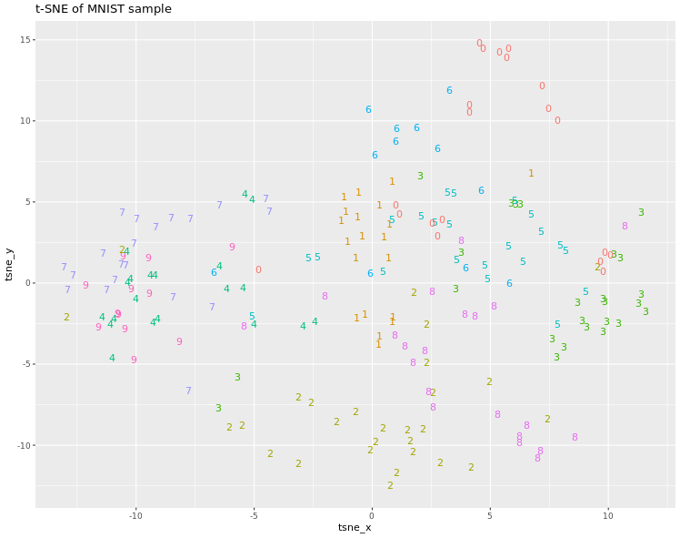

# Chapter 2 - Introduction to t-SNE

## Computing t-SNE

```r

# Compute t-SNE without doing the PCA step
tsne_output <- Rtsne(mnist_sample[,-1], PCA = FALSE, dim = 3)

# Show the obtained embedding coordinates
head(tsne_output$Y)

# Store the first two coordinates and plot them 
tsne_plot <- data.frame(tsne_x = tsne_output$Y[, 1], tsne_y = tsne_output$Y[, 2], 
                        digit = as.factor(mnist_sample$label))

# Plot the coordinates
ggplot(tsne_plot, aes(x = tsne_x, y = tsne_y, color = digit)) + 
	ggtitle("t-SNE of MNIST sample") + 
	geom_text(aes(label = digit)) + 
	theme(legend.position = "none")
  
```
Output:




