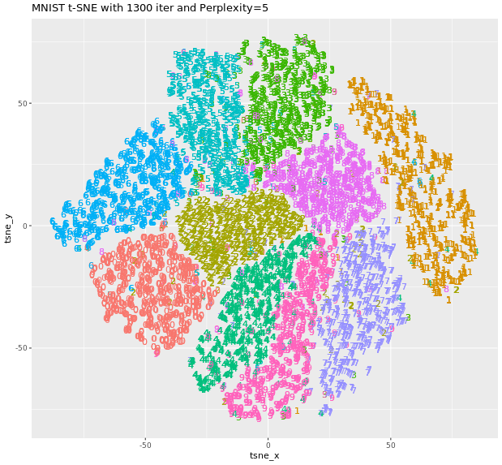
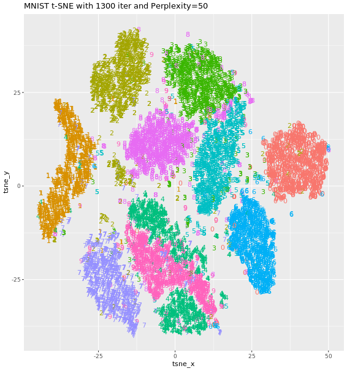

# Chapter 2 - Introduction to t-SNE

## Computing t-SNE

```r

# Compute t-SNE without doing the PCA step
tsne_output <- Rtsne(mnist_sample[,-1], PCA = FALSE, dim = 3)

# Show the obtained embedding coordinates
head(tsne_output$Y)

# Store the first two coordinates and plot them 
tsne_plot <- data.frame(tsne_x = tsne_output$Y[, 1], tsne_y = tsne_output$Y[, 2], 
                        digit = as.factor(mnist_sample$label))

# Plot the coordinates
ggplot(tsne_plot, aes(x = tsne_x, y = tsne_y, color = digit)) + 
	ggtitle("t-SNE of MNIST sample") + 
	geom_text(aes(label = digit)) + 
	theme(legend.position = "none")
  
```
Output:


***

## Understanding t-SNE output

### 1

```r

# Inspect the output object's structure
str(tsne_output)

# Show total costs after each 50th iteration
tsne_output$itercosts

# Plot the evolution of the KL divergence at each 50th iteration
plot(tsne_output$itercosts, type = "l")

```

Output:

```bash
> # Inspect the output object's structure
> str(tsne_output)
List of 13
 $ theta              : num 0.5
 $ perplexity         : num 30
 $ N                  : int 200
 $ origD              : int 50
 $ Y                  : num [1:200, 1:3] -8.02 -11.56 1.53 -14.81 2.34 ...
 $ costs              : num [1:200] 0.002645 0.001583 0.000228 0.00227 0.002102 ...
 $ itercosts          : num [1:20] 53.9 53.2 53.6 53.6 53.2 ...
 $ stop_lying_iter    : int 250
 $ mom_switch_iter    : int 250
 $ momentum           : num 0.5
 $ final_momentum     : num 0.8
 $ eta                : num 200
 $ exaggeration_factor: num 12
> 
> # Show total costs after each 50th iteration
> tsne_output$itercosts
 [1] 53.8745981 53.1551737 53.6059482 53.6002894 53.2182397  0.8566485
 [7]  0.6141291  0.5568897  0.5034298  0.4971228  0.4963416  0.4958101
[13]  0.4943287  0.4941738  0.4922756  0.4894444  0.4906178  0.4893572
[19]  0.4858486  0.4874892
> 
> # Plot the evolution of the KL divergence at each 50th iteration
> plot(tsne_output$itercosts, type = "l")

```


### 2

```r

# Inspect the output object's structure
str(tsne_output)

# Show the K-L divergence of each record after the final iteration
tsne_output$costs

# Plot the K-L divergence of each record after the final iteration
plot(tsne_output$costs, type = "l")

```

Output:


***

## Reproducing results

### 1

```r
# Generate a three-dimensional t-SNE embedding without PCA
tsne_output <- Rtsne(mnist_sample[, -1], PCA = FALSE, dims = 3)

# Generate a new t-SNE embedding with the same hyper-parameter values
tsne_output_new <- Rtsne(mnist_sample[, -1], PCA = FALSE, dims = 3)

# Check if the two outputs are identical
identical(tsne_output, tsne_output_new)

```

Output:

```bash

> identical(tsne_output, tsne_output_new)
[1] FALSE

```

### 2

```r

# Generate a three-dimensional t-SNE embedding without PCA
set.seed(1234)
tsne_output <- Rtsne(mnist_sample[, -1], PCA = FALSE, dims = 3)

# Generate a new t-SNE embedding with the same hyper-parameter values
set.seed(1234)
tsne_output_new <- Rtsne(mnist_sample[, -1], PCA = FALSE, dims = 3)

# Check if the two outputs are identical
identical(tsne_output, tsne_output_new)

```

Output:

```bash
identical(tsne_output, tsne_output_new)
[1] TRUE

```
***

## Optimal number of iterations

```r

# Set seed to ensure reproducible results
set.seed(1234)

# Execute a t-SNE with 2000 iterations
tsne_output <- Rtsne(mnist_sample[, -1], PCA = FALSE, dims = 2, max_iter = 2000)

# Observe the output costs 
tsne_output$itercosts

# Get the 50th iteration with the minimum K-L cost
which.min(tsne_output$itercosts)

```

Output:

```bash

> # Set seed to ensure reproducible results
> set.seed(1234)
> 
> # Execute a t-SNE with 2000 iterations
> tsne_output <- Rtsne(mnist_sample[, -1], PCA = FALSE, dims = 2, max_iter = 2000)
> 
> # Observe the output costs
> tsne_output$itercosts
 [1] 52.6596457 53.8641957 53.0252891 53.9832314 52.4817539  1.2046802
 [7]  0.9377985  0.8408519  0.7573479  0.7102677  0.6977308  0.6916505
[13]  0.6904959  0.6895457  0.6894808  0.6889593  0.6889892  0.6892820
[19]  0.6866307  0.6854598  0.6875342  0.6883889  0.6871596  0.6891454
[25]  0.6894539  0.6881389  0.6874844  0.6879352  0.6877009  0.6866076
[31]  0.6870568  0.6872876  0.6874374  0.6882320  0.6861655  0.6878036
[37]  0.6880305  0.6882310  0.6881256  0.6879645
> 
> # Get the 50th iteration with the minimum K-L cost
> which.min(tsne_output$itercosts)
[1] 20
> 

```

***

## Perplexity of MNIST sample

### 1

```r
# Set seed to ensure reproducible results
set.seed(1234)

# Execute a t-SNE with perplexity 5
tsne_output <- Rtsne(mnist_sample[, -1], PCA = FALSE, dims = 2, max_iter = 1200,perplexity = 5)

# Observe the returned K-L divergence costs at every 50th iteration
tsne_output$itercosts

```
Output:

```bash

# Set seed to ensure reproducible results
set.seed(1234)

# Execute a t-SNE with perplexity 5
tsne_output <- Rtsne(mnist_sample[, -1], PCA = FALSE, dims = 2, max_iter = 1200,perplexity = 5)

# Observe the returned K-L divergence costs at every 50th iteration
tsne_output$itercosts

```

### 2

```r
# Set seed to ensure reproducible results
set.seed(1234)

# Execute a t-SNE with perplexity 20
tsne_output <- Rtsne(mnist_sample[, -1], PCA = FALSE, dims = 2, max_iter = 1200,perplexity = 20)

# Observe the returned K-L divergence costs at every 50th iteration
tsne_output$itercosts

```
Output:

```bash

> # Set seed to ensure reproducible results
> set.seed(1234)
> 
> # Execute a t-SNE with perplexity 20
> tsne_output <- Rtsne(mnist_sample[, -1], PCA = FALSE, dims = 2, max_iter = 1200,perplexity = 20)
> 
> # Observe the returned K-L divergence costs at every 50th iteration
> tsne_output$itercosts
 [1] 57.0959502 59.0885373 57.9375496 58.6200886 58.6269547  1.3830904
 [7]  1.0463436  0.8683861  0.8449753  0.8214504  0.8021813  0.7911419
[13]  0.7839899  0.7751442  0.7697356  0.7687032  0.7695201  0.7681064
[19]  0.7643729  0.7459482  0.7436755  0.7413869  0.7407696  0.7403166
> 

```

### 3

```r
# Set seed to ensure reproducible results
set.seed(1234)

# Execute a t-SNE with perplexity 50
tsne_output <- Rtsne(mnist_sample[, -1], PCA = FALSE, dims = 2, max_iter = 1200,perplexity = 50)


# Observe the returned K-L divergence costs at every 50th iteration
tsne_output$itercosts

```

Output:

```bash

> # Set seed to ensure reproducible results
> set.seed(1234)
> 
> # Execute a t-SNE with perplexity 50
> tsne_output <- Rtsne(mnist_sample[, -1], PCA = FALSE, dims = 2, max_iter = 1200,perplexity = 50)
> 
> 
> # Observe the returned K-L divergence costs at every 50th iteration
> tsne_output$itercosts
 [1] 48.3517109 46.3378258 46.4129364 47.4800522 46.8153939  0.8282014
 [7]  0.6216502  0.5657615  0.5387431  0.5256446  0.5223947  0.5209929
[13]  0.5200978  0.5223227  0.5225258  0.5236308  0.5201374  0.5199099
[19]  0.5194374  0.5168279  0.5155643  0.5141633  0.5143057  0.5147744
> 

```

***

## Perplexity of bigger MNIST dataset

```r

# Observe the K-L divergence costs with perplexity 5 and 50
tsne_output_5$itercosts
tsne_output_50$itercosts


# Generate the data frame to visualize the embedding
tsne_plot_5 <- data.frame(tsne_x = tsne_output_5$Y[,1], tsne_y = tsne_output_5$Y[,2], digit = as.factor(mnist_10k$label))
tsne_plot_50 <- data.frame(tsne_x = tsne_output_50$Y[,1], tsne_y = tsne_output_50$Y[,2], digit = as.factor(mnist_10k$label))

# Plot the obtained embeddings
ggplot(tsne_plot_5, aes(x = tsne_x, y = tsne_y, color = digit)) + 
	ggtitle("MNIST t-SNE with 1300 iter and Perplexity=5") + geom_text(aes(label = digit)) + 
	theme(legend.position="none")
ggplot(tsne_plot_50, aes(x = tsne_x, y = tsne_y, color = digit)) + 
	ggtitle("MNIST t-SNE with 1300 iter and Perplexity=50") + geom_text(aes(label = digit)) + 
	theme(legend.position="none")
	
```

Output:




***


