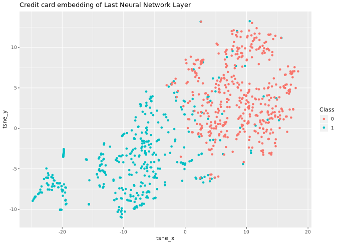

# Chapter 3 - Using t-SNE with Predictive Models
## Exploring credit card fraud dataset


```r
# Look at the data dimensions
dim(creditcard)

# Explore the column names
names(creditcard)

# Explore the structure
str(creditcard)

# Generate a summary
summary(creditcard)

# Plot a histogram of the transaction time
ggplot(creditcard, aes(x = Time)) + 
	geom_histogram()

```
Output:


***

## Generating training and test sets

```r

# Extract positive and negative instances of fraud
creditcard_pos <- creditcard[Class == 1]
creditcard_neg <- creditcard[Class == 0]

# Fix the seed
set.seed(1234)

# Create a new negative balanced dataset by undersampling
creditcard_neg_bal <- creditcard_neg[sample(1:nrow(creditcard_neg), nrow(creditcard_pos))]

# Generate a balanced train set
creditcard_train <- rbind(creditcard_pos, creditcard_neg_bal)


```

***

## Training a random forest with original features

```r

# Fix the seed
set.seed(1234)

# Separate x and y sets
train_x <- creditcard_train[,-31]
train_y <- creditcard_train$Class

# Train a random forests
rf_model <- randomForest(x= train_x, y= train_y, ntree = 100)

# Plot the error evolution and variable importance
plot(rf_model, main = "Error evolution vs number of trees")
varImpPlot(rf_model, main = "Variable importance")

```

Output:


***
## Computing and visualising the t-SNE embedding

```r

# Set the seed
set.seed(1234)

# Generate the t-SNE embedding 
tsne_output <- Rtsne(as.matrix(creditcard_train[, -31]), check_duplicates = FALSE, PCA = FALSE)

# Generate a data frame to plot the result
tsne_plot <- data.frame(tsne_x = tsne_output$Y[,1],
                        tsne_y = tsne_output$Y[,2],
                        Class = creditcard_train$Class)

# Plot the embedding usign ggplot and the label
ggplot(tsne_plot, aes(x = tsne_x, y = tsne_y, color = Class)) + 
  ggtitle("t-SNE of credit card fraud train set") + 
  geom_text(aes(label = Class)) + theme(legend.position = "none")
  
```

Output:


***

## Training a random forest with embedding features

```r

# Fix the seed
set.seed(1234)

# Train a random forest
rf_model_tsne <- randomForest(x=train_tsne_x, y=train_tsne_y, ntree = 100)

# Plot the error evolution
plot(rf_model_tsne)

# Plot the variable importance
varImpPlot(rf_model_tsne)

```

Output:


***

## Predicting data using original features

```r

# Predict on the test set using the random forest 
pred_rf <- predict(rf_model, creditcard_test, type = "prob")

# Plot a probability distibution of the target class
hist(pred_rf[,2])

# Compute the area under the curve
pred <- prediction(pred_rf[,2], creditcard_test$Class)
perf <- performance(pred, measure = "auc") 
perf@y.values

```

Output:

```bash

> # Predict on the test set using the random forest
> pred_rf <- predict(rf_model, creditcard_test, type = "prob")
> 
> # Plot a probability distibution of the target class
> hist(pred_rf[,2])
> 
> # Compute the area under the curve
> pred <- prediction(pred_rf[,2], creditcard_test$Class)
> perf <- performance(pred, measure = "auc")
> perf@y.values
[[1]]
[1] 0.9801234
> 


```


***

## Predicting data using embedding random forest

```r

# Predict on the test set using the random forest generated with t-SNE features
pred_rf <- predict(rf_model_tsne, test_x, type = "prob")

# Plot a probability distibution of the target class
hist(pred_rf[,2])

# Compute the area under the curve
pred <- prediction(pred_rf[,2] , creditcard_test$Class)
perf <- performance(pred, measure = "auc") 
perf@y.values

```

Output:

```bash
# Predict on the test set using the random forest generated with t-SNE features
pred_rf <- predict(rf_model_tsne, test_x, type = "prob")

# Plot a probability distibution of the target class
hist(pred_rf[,2])

# Compute the area under the curve
pred <- prediction(pred_rf[,2] , creditcard_test$Class)
perf <- performance(pred, measure = "auc") 
perf@y.values

```


***

## Exploring neural network layer output

```r

# Observe the dimensions
dim(layer_128_train)

# Show the first six records of the last ten columns
head(layer_128_train[, 119:128])

# Generate a summary of all columns
summary(layer_128_train)

```

Output:

```bash

> # Observe the dimensions
> dim(layer_128_train)
[1] 886 128
> 
> # Show the first six records of the last ten columns
> head(layer_128_train[, 119:128])
  DF.L3.C119 DF.L3.C120 DF.L3.C121 DF.L3.C122 DF.L3.C123 DF.L3.C124 DF.L3.C125
1  0.8501869  0.2365955  0.0000000   2.796039  0.0000000  1.4845802  0.4782449
2  1.8389321  1.4147298  0.0000000   1.778045  0.1266029  2.0880563  0.5225404
3  0.8076189  0.5429960  0.3614228   2.043688  0.6322816  1.7455826  0.1835310
4  0.8717837  0.4979030  0.1223920   3.454019  0.0000000  0.9904315  0.6272245
5  0.9220344  0.0000000  0.0000000   3.462043  0.0000000  0.3738589  0.8182799
6  0.8384486  0.0000000  0.0000000   3.320442  0.0000000  0.5939587  0.8591019
  DF.L3.C126 DF.L3.C127 DF.L3.C128
1 0.00000000   2.318691  0.4161170
2 0.45644153   3.084301  0.3544301
3 0.07970832   2.690254  0.3510467
4 0.00000000   2.837628  0.4186262
5 0.00000000   1.459579  0.3672466
6 0.00000000   1.095666  0.0853229
> 
> # Generate a summary of all columns
> summary(layer_128_train)
    DF.L3.C1    DF.L3.C2         DF.L3.C3          DF.L3.C4     
 Min.   :0   Min.   :0.0000   Min.   :0.06825   Min.   :0.0000  
 1st Qu.:0   1st Qu.:0.0610   1st Qu.:1.22175   1st Qu.:0.8087  
 Median :0   Median :0.2250   Median :1.38019   Median :1.0720  
 Mean   :0   Mean   :0.2513   Mean   :1.39677   Mean   :1.1008  
 3rd Qu.:0   3rd Qu.:0.4008   3rd Qu.:1.52888   3rd Qu.:1.3364  
 Max.   :0   Max.   :1.1181   Max.   :3.57375   Max.   :2.4934
 
 ```
 
 ***
 
 ## Using t-SNE to visualise a neural network layer
 
 ```r
 
 # Set the seed
set.seed(1234)

# Generate the t-SNE
tsne_output <- Rtsne(as.matrix(layer_128_train), check_duplicates = FALSE,
                     max_iter = 400,  perplexity = 50)

# Prepare data.frame
tsne_plot <- data.frame(tsne_x = tsne_output$Y[,1], tsne_y = tsne_output$Y[,2], 
                        Class = creditcard_train$Class)

# Plot the data 
ggplot(tsne_plot, aes(x = tsne_x, y = tsne_y, color = Class)) + 
	geom_point() + 
	ggtitle("Credit card embedding of Last Neural Network Layer")
	
```

Output:


 
