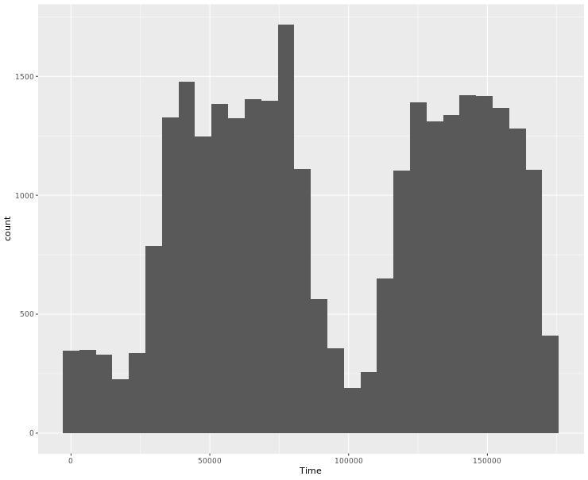
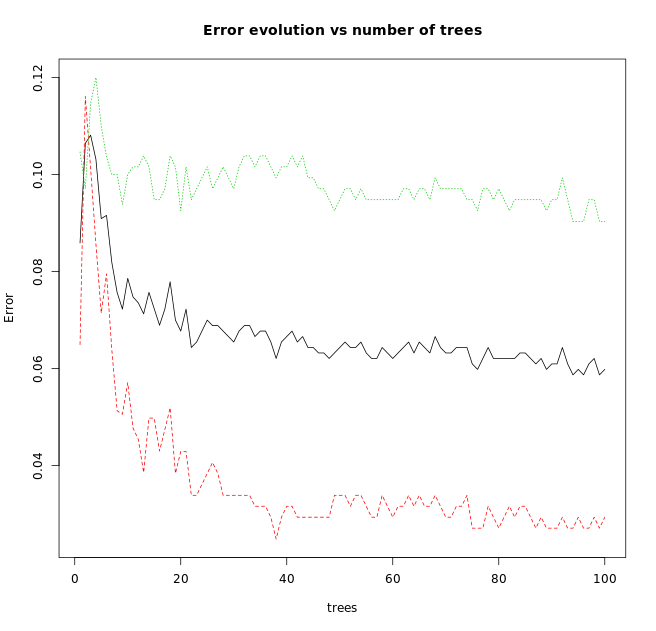
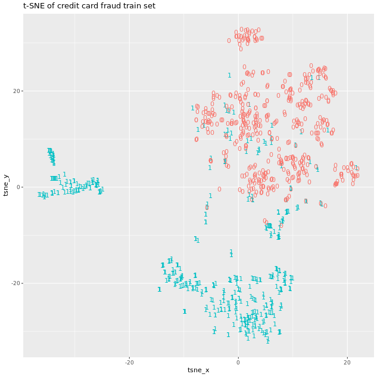
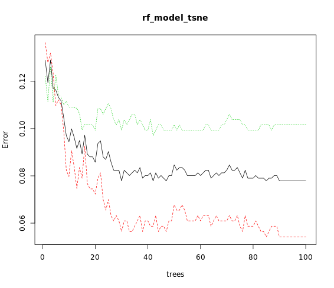

# Chapter 3 - Using t-SNE with Predictive Models
## Exploring credit card fraud dataset


```r
# Look at the data dimensions
dim(creditcard)

# Explore the column names
names(creditcard)

# Explore the structure
str(creditcard)

# Generate a summary
summary(creditcard)

# Plot a histogram of the transaction time
ggplot(creditcard, aes(x = Time)) + 
	geom_histogram()

```
Output:



***

## Generating training and test sets

```r

# Extract positive and negative instances of fraud
creditcard_pos <- creditcard[Class == 1]
creditcard_neg <- creditcard[Class == 0]

# Fix the seed
set.seed(1234)

# Create a new negative balanced dataset by undersampling
creditcard_neg_bal <- creditcard_neg[sample(1:nrow(creditcard_neg), nrow(creditcard_pos))]

# Generate a balanced train set
creditcard_train <- rbind(creditcard_pos, creditcard_neg_bal)


```

***

## Training a random forest with original features

```r

# Fix the seed
set.seed(1234)

# Separate x and y sets
train_x <- creditcard_train[,-31]
train_y <- creditcard_train$Class

# Train a random forests
rf_model <- randomForest(x= train_x, y= train_y, ntree = 100)

# Plot the error evolution and variable importance
plot(rf_model, main = "Error evolution vs number of trees")
varImpPlot(rf_model, main = "Variable importance")

```

Output:




***
## Computing and visualising the t-SNE embedding

```r

# Set the seed
set.seed(1234)

# Generate the t-SNE embedding 
tsne_output <- Rtsne(as.matrix(creditcard_train[, -31]), check_duplicates = FALSE, PCA = FALSE)

# Generate a data frame to plot the result
tsne_plot <- data.frame(tsne_x = tsne_output$Y[,1],
                        tsne_y = tsne_output$Y[,2],
                        Class = creditcard_train$Class)

# Plot the embedding usign ggplot and the label
ggplot(tsne_plot, aes(x = tsne_x, y = tsne_y, color = Class)) + 
  ggtitle("t-SNE of credit card fraud train set") + 
  geom_text(aes(label = Class)) + theme(legend.position = "none")
  
```

Output:



***

## Training a random forest with embedding features

```r

# Fix the seed
set.seed(1234)

# Train a random forest
rf_model_tsne <- randomForest(x=train_tsne_x, y=train_tsne_y, ntree = 100)

# Plot the error evolution
plot(rf_model_tsne)

# Plot the variable importance
varImpPlot(rf_model_tsne)

```

Output:




***

## Predicting data using original features

```r

# Predict on the test set using the random forest 
pred_rf <- predict(rf_model, creditcard_test, type = "prob")

# Plot a probability distibution of the target class
hist(pred_rf[,2])

# Compute the area under the curve
pred <- prediction(pred_rf[,2], creditcard_test$Class)
perf <- performance(pred, measure = "auc") 
perf@y.values

```

Output:

```bash

> # Predict on the test set using the random forest
> pred_rf <- predict(rf_model, creditcard_test, type = "prob")
> 
> # Plot a probability distibution of the target class
> hist(pred_rf[,2])
> 
> # Compute the area under the curve
> pred <- prediction(pred_rf[,2], creditcard_test$Class)
> perf <- performance(pred, measure = "auc")
> perf@y.values
[[1]]
[1] 0.9801234
> 


```


***


