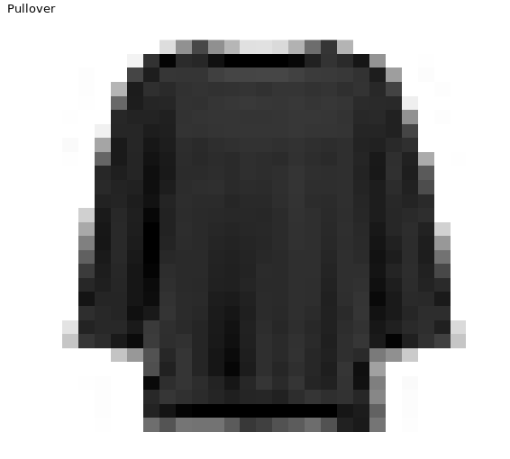

# Chapter 4 - Generalized Low Rank Models (GLRM)
## Exploring fashion MNIST


```r

# Show the dimensions
dim(fashion_mnist)

# Create a summary of the last six columns 
summary(fashion_mnist[, 780:785])

# Table with the class distribution
table(fashion_mnist$label)

```

Output:

```bash

> # Show the dimensions
> dim(fashion_mnist)
[1] 500 785
> 
> # Create a summary of the last six columns
> summary(fashion_mnist[, 780:785])
    pixel779         pixel780         pixel781          pixel782      
 Min.   :  0.00   Min.   :  0.00   Min.   :  0.000   Min.   :  0.000  
 1st Qu.:  0.00   1st Qu.:  0.00   1st Qu.:  0.000   1st Qu.:  0.000  
 Median :  0.00   Median :  0.00   Median :  0.000   Median :  0.000  
 Mean   : 23.54   Mean   : 18.47   Mean   :  7.088   Mean   :  2.288  
 3rd Qu.:  0.00   3rd Qu.:  1.00   3rd Qu.:  0.000   3rd Qu.:  0.000  
 Max.   :224.00   Max.   :233.00   Max.   :204.000   Max.   :171.000  
    pixel783        pixel784
 Min.   : 0.00   Min.   :0  
 1st Qu.: 0.00   1st Qu.:0  
 Median : 0.00   Median :0  
 Mean   : 0.47   Mean   :0  
 3rd Qu.: 0.00   3rd Qu.:0  
 Max.   :77.00   Max.   :0
> 
> # Table with the class distribution
> table(fashion_mnist$label)

 0  1  2  3  4  5  6  7  8  9 
42 44 50 49 53 52 59 54 46 51
> 

```

***

## Visualizing fashion MNIST

```r

# Get the data from the last image
plot_data <- cbind(xy_axis, fill = as.data.frame(t(fashion_mnist[500, -1]))[,1])

# Observe the first records
head(plot_data)

# Plot the image using ggplot()
ggplot(plot_data, aes(x, y, fill = fill)) + 
  ggtitle(class_names[as.integer(fashion_mnist[500, 1])]) + 
  plot_theme 
 
```

Output:

```bash

> # Get the data from the last image
> plot_data <- cbind(xy_axis, fill = as.data.frame(t(fashion_mnist[500, -1]))[,1])
> 
> # Observe the first records
> head(plot_data)
  x  y fill
1 1 28    0
2 2 28    0
3 3 28    0
4 4 28    0
5 5 28    0
6 6 28    0
> 
> # Plot the image using ggplot()
> ggplot(plot_data, aes(x, y, fill = fill)) + 
    ggtitle(class_names[as.integer(fashion_mnist[500, 1])]) + 
    plot_theme
> 

```



***

## Reducing data with GLRM

```r

# Start a connection with the h2o cluster
h2o.init()

# Store the data into h2o cluster
fashion_mnist.hex <- as.h2o(fashion_mnist, "fashion_mnist.hex")

# Launch a GLRM model over fashion_mnist data
model_glrm <- h2o.glrm(training_frame = fashion_mnist.hex,
                       cols = 2:ncol(fashion_mnist), 
                       k = 2,
                       seed = 123,
                       max_iterations = 100)

# Plotting the convergence
plot(model_glrm)

```

Output:


***

## Improving model convergence

```r

# Start a connection with the h2o cluster
h2o.init()

# Store the data into h2o cluster
fashion_mnist.hex <- as.h2o(fashion_mnist, "fashion_mnist.hex")

# Launch a GLRM model with normalized fashion_mnist data  
model_glrm <- h2o.glrm(training_frame = fashion_mnist.hex, transform = "NORMALIZE",
                       cols = 2:ncol(fashion_mnist), 
                       k = 2, 
                       seed = 123,
                       max_iterations = 100)

# Plotting the convergence
plot(model_glrm)

```

Output:


