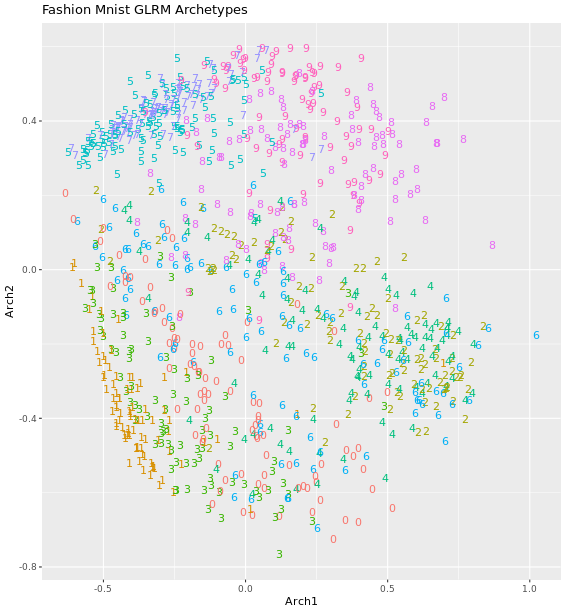
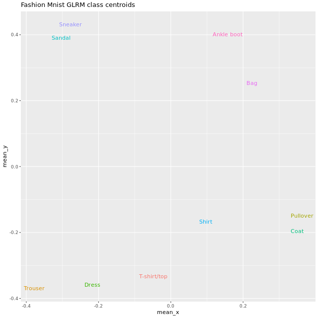

# Chapter 4 - Generalized Low Rank Models (GLRM)
## Exploring fashion MNIST


```r

# Show the dimensions
dim(fashion_mnist)

# Create a summary of the last six columns 
summary(fashion_mnist[, 780:785])

# Table with the class distribution
table(fashion_mnist$label)

```

Output:

```bash

> # Show the dimensions
> dim(fashion_mnist)
[1] 500 785
> 
> # Create a summary of the last six columns
> summary(fashion_mnist[, 780:785])
    pixel779         pixel780         pixel781          pixel782      
 Min.   :  0.00   Min.   :  0.00   Min.   :  0.000   Min.   :  0.000  
 1st Qu.:  0.00   1st Qu.:  0.00   1st Qu.:  0.000   1st Qu.:  0.000  
 Median :  0.00   Median :  0.00   Median :  0.000   Median :  0.000  
 Mean   : 23.54   Mean   : 18.47   Mean   :  7.088   Mean   :  2.288  
 3rd Qu.:  0.00   3rd Qu.:  1.00   3rd Qu.:  0.000   3rd Qu.:  0.000  
 Max.   :224.00   Max.   :233.00   Max.   :204.000   Max.   :171.000  
    pixel783        pixel784
 Min.   : 0.00   Min.   :0  
 1st Qu.: 0.00   1st Qu.:0  
 Median : 0.00   Median :0  
 Mean   : 0.47   Mean   :0  
 3rd Qu.: 0.00   3rd Qu.:0  
 Max.   :77.00   Max.   :0
> 
> # Table with the class distribution
> table(fashion_mnist$label)

 0  1  2  3  4  5  6  7  8  9 
42 44 50 49 53 52 59 54 46 51
> 

```

***

## Visualizing fashion MNIST

```r

# Get the data from the last image
plot_data <- cbind(xy_axis, fill = as.data.frame(t(fashion_mnist[500, -1]))[,1])

# Observe the first records
head(plot_data)

# Plot the image using ggplot()
ggplot(plot_data, aes(x, y, fill = fill)) + 
  ggtitle(class_names[as.integer(fashion_mnist[500, 1])]) + 
  plot_theme 
 
```

Output:

```bash

> # Get the data from the last image
> plot_data <- cbind(xy_axis, fill = as.data.frame(t(fashion_mnist[500, -1]))[,1])
> 
> # Observe the first records
> head(plot_data)
  x  y fill
1 1 28    0
2 2 28    0
3 3 28    0
4 4 28    0
5 5 28    0
6 6 28    0
> 
> # Plot the image using ggplot()
> ggplot(plot_data, aes(x, y, fill = fill)) + 
    ggtitle(class_names[as.integer(fashion_mnist[500, 1])]) + 
    plot_theme
> 

```


***

## Reducing data with GLRM

```r

# Start a connection with the h2o cluster
h2o.init()

# Store the data into h2o cluster
fashion_mnist.hex <- as.h2o(fashion_mnist, "fashion_mnist.hex")

# Launch a GLRM model over fashion_mnist data
model_glrm <- h2o.glrm(training_frame = fashion_mnist.hex,
                       cols = 2:ncol(fashion_mnist), 
                       k = 2,
                       seed = 123,
                       max_iterations = 100)

# Plotting the convergence
plot(model_glrm)

```

Output:


***

## Improving model convergence

```r

# Start a connection with the h2o cluster
h2o.init()

# Store the data into h2o cluster
fashion_mnist.hex <- as.h2o(fashion_mnist, "fashion_mnist.hex")

# Launch a GLRM model with normalized fashion_mnist data  
model_glrm <- h2o.glrm(training_frame = fashion_mnist.hex, transform = "NORMALIZE",
                       cols = 2:ncol(fashion_mnist), 
                       k = 2, 
                       seed = 123,
                       max_iterations = 100)

# Plotting the convergence
plot(model_glrm)

```

Output:


## Visualizing the output of GLRM

```r
# Dimension of X_matrix
dim(X_matrix)

# First records of X_matrix
head(X_matrix)

# Plot the records in the new two dimensional space
ggplot(as.data.table(X_matrix), aes(x= Arch1, y = Arch2, color = fashion_mnist$label)) + 
	ggtitle("Fashion Mnist GLRM Archetypes") + 
	geom_text(aes(label = fashion_mnist$label)) + 
	theme(legend.position="none")

```

Output:

```bash
> # Dimension of X_matrix
> dim(X_matrix)
[1] 1000    2
> 
> # First records of X_matrix
> head(X_matrix)
         Arch1      Arch2
1:  0.05700343 -0.1639712
2: -0.38300397 -0.4796628
3: -0.04673850  0.5104395
4:  0.50123905 -0.3073842
5:  0.12972227  0.1678998
6: -0.41769480 -0.3275776
> 
> # Plot the records in the new two dimensional space
> ggplot(as.data.table(X_matrix), aes(x= Arch1, y = Arch2, color = fashion_mnist$label)) + 
  	ggtitle("Fashion Mnist GLRM Archetypes") + 
  	geom_text(aes(label = fashion_mnist$label)) + 
  	theme(legend.position="none")
> 
```



***

## Visualizing the prototypes

```r
# Store the label of each record and compute the centroids
X_matrix[, label := as.numeric(fashion_mnist$label)]
X_matrix[, mean_x := mean(Arch1), by = label]
X_matrix[, mean_y := mean(Arch2), by = label]

# Get one record per label and create a vector with class names
X_mean <- unique(X_matrix, by = "label")
label_names <- c("T-shirt/top", "Trouser", "Pullover", "Dress", "Coat", "Sandal", "Shirt", "Sneaker", "Bag", "Ankle boot")

# Plot the centroids
ggplot(X_mean, aes(x = mean_x, y = mean_y, color = as.factor(label))) + 
	ggtitle("Fashion Mnist GLRM class centroids") + 
	geom_text(aes(label = label_names[label])) +
	theme(legend.position = "none")
```

Output:

```bash
> # Store the label of each record and compute the centroids
> X_matrix[, label := as.numeric(fashion_mnist$label)]
            Arch1      Arch2 label      mean_x     mean_y
   1:  0.05700343 -0.1639712     7  0.09661581 -0.1668699
   2: -0.38300397 -0.4796628     2 -0.37821659 -0.3690818
   3: -0.04673850  0.5104395     6 -0.30353511  0.3915218
   4:  0.50123905 -0.3073842     5  0.34921720 -0.1954345
   5:  0.12972227  0.1678998     3  0.36277255 -0.1484523
  ---                                                    
 996:  0.36938926 -0.2314351     5  0.34921720 -0.1954345
 997: -0.40357915 -0.3937227     2 -0.37821659 -0.3690818
 998:  0.08617987 -0.4264461     5  0.34921720 -0.1954345
 999:  0.30318054  0.2693688     9  0.22435820  0.2529673
1000:  0.73234498 -0.1756952     3  0.36277255 -0.1484523
> X_matrix[, mean_x := mean(Arch1), by = label]
            Arch1      Arch2 label      mean_x     mean_y
   1:  0.05700343 -0.1639712     7  0.09661581 -0.1668699
   2: -0.38300397 -0.4796628     2 -0.37821659 -0.3690818
   3: -0.04673850  0.5104395     6 -0.30353511  0.3915218
   4:  0.50123905 -0.3073842     5  0.34921720 -0.1954345
   5:  0.12972227  0.1678998     3  0.36277255 -0.1484523
  ---                                                    
 996:  0.36938926 -0.2314351     5  0.34921720 -0.1954345
 997: -0.40357915 -0.3937227     2 -0.37821659 -0.3690818
 998:  0.08617987 -0.4264461     5  0.34921720 -0.1954345
 999:  0.30318054  0.2693688     9  0.22435820  0.2529673
1000:  0.73234498 -0.1756952     3  0.36277255 -0.1484523
> X_matrix[, mean_y := mean(Arch2), by = label]
            Arch1      Arch2 label      mean_x     mean_y
   1:  0.05700343 -0.1639712     7  0.09661581 -0.1668699
   2: -0.38300397 -0.4796628     2 -0.37821659 -0.3690818
   3: -0.04673850  0.5104395     6 -0.30353511  0.3915218
   4:  0.50123905 -0.3073842     5  0.34921720 -0.1954345
   5:  0.12972227  0.1678998     3  0.36277255 -0.1484523
  ---                                                    
 996:  0.36938926 -0.2314351     5  0.34921720 -0.1954345
 997: -0.40357915 -0.3937227     2 -0.37821659 -0.3690818
 998:  0.08617987 -0.4264461     5  0.34921720 -0.1954345
 999:  0.30318054  0.2693688     9  0.22435820  0.2529673
1000:  0.73234498 -0.1756952     3  0.36277255 -0.1484523
> 
> # Get one record per label and create a vector with class names
> X_mean <- unique(X_matrix, by = "label")
> label_names <- c("T-shirt/top", "Trouser", "Pullover", "Dress", "Coat", "Sandal", "Shirt", "Sneaker", "Bag", "Ankle boot")
> 
> # Plot the centroids
> ggplot(X_mean, aes(x = mean_x, y = mean_y, color = as.factor(label))) + 
  	ggtitle("Fashion Mnist GLRM class centroids") + 
  	geom_text(aes(label = label_names[label])) +
  	theme(legend.position = "none")
> 

```




***

## Imputing missing data

