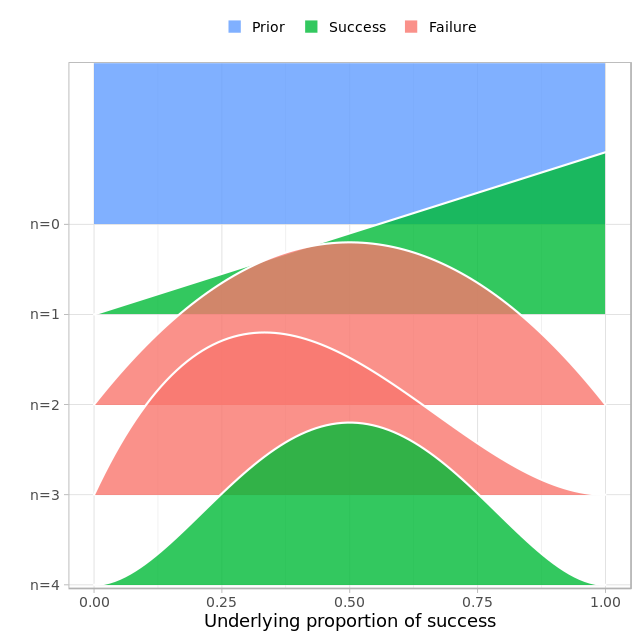
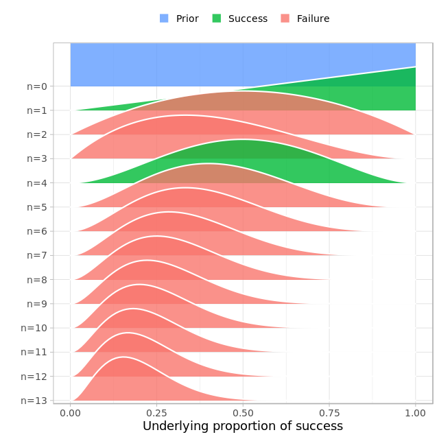

# Fundamentals of Bayesian Data Analysis in R

## What is Bayesian Data Analysis?


## Coin flips with prop_model

```r

data <- c(1, 0, 0, 1)
prop_model(data) # prob_model is a custom made one. 

```

Output:


***


## Zombie drugs with prop_model

```r
data = c(1, 0, 0, 1,0,0,0,0,0,0,0,0,0)
prop_model(data)

```

Ouput:



What proportion of zombies would we expect to turn human if we administered this new drug to the whole zombie population?

> Between 5% to 40%

