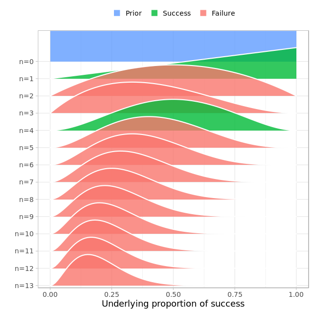
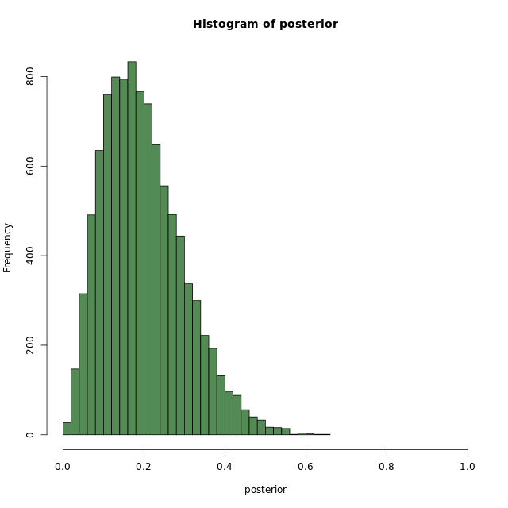

# Chapter 1 - Fundamentals of Bayesian Data Analysis in R

## What is Bayesian Data Analysis?


## Coin flips with prop_model

```r

data <- c(1, 0, 0, 1)
prop_model(data) # prob_model is a custom made one. 

```

Output:


***


## Zombie drugs with prop_model

```r
data = c(1, 0, 0, 1,0,0,0,0,0,0,0,0,0)
prop_model(data)

```

Ouput:


What proportion of zombies would we expect to turn human if we administered this new drug to the whole zombie population?

> Between 5% to 40%

***

## Looking at samples from prop_model

```r

data = c(1, 0, 0, 1, 0, 0,
         0, 0, 0, 0, 0, 0, 0)

# Extract and explore the posterior
posterior <- prop_model(data)
head(posterior)

# Edit the histogram
hist(posterior, breaks = 30, xlim = c(0, 1), col = "palegreen4")

```

Output:

```bash
data = c(1, 0, 0, 1, 0, 0,
         0, 0, 0, 0, 0, 0, 0)

# Extract and explore the posterior
posterior <- prop_model(data)
head(posterior)

# Edit the histogram
hist(posterior, breaks = 30, xlim = c(0, 1), col = "palegreen4")

```
Plots:





***

## Summarizing the zombie drug experiment

Samples from a probability distribution  -> makes it easy to calculate new measures of interest.

```r

data = c(1, 0, 0, 1, 0, 0,
         0, 0, 0, 0, 0, 0, 0)
posterior <- prop_model(data)
hist(posterior, breaks = 30, xlim = c(0, 1), col = "palegreen4")

# Calculate the median
median(posterior)

# Calculate the credible interval
quantile(posterior, c(0.05, 0.95))

# Calculate the probability
sum(posterior > 0.07)/length(posterior)

```

Output:

```bash
> data = c(1, 0, 0, 1, 0, 0,
           0, 0, 0, 0, 0, 0, 0)
> posterior <- prop_model(data)
> hist(posterior, breaks = 30, xlim = c(0, 1), col = "palegreen4")
> 
> # Calculate the median
> median(posterior)
[1] 0.1825229
> 
> # Calculate the credible interval
> quantile(posterior, c(0.05, 0.95))
        5%        95% 
0.06152099 0.38816547
> 
> # Calculate the probability (more than 7% to check our drug is better than competitors)
> sum(posterior > 0.07)/length(posterior)
[1] 0.9285
> 

```

***

*End of Chapter 1*
