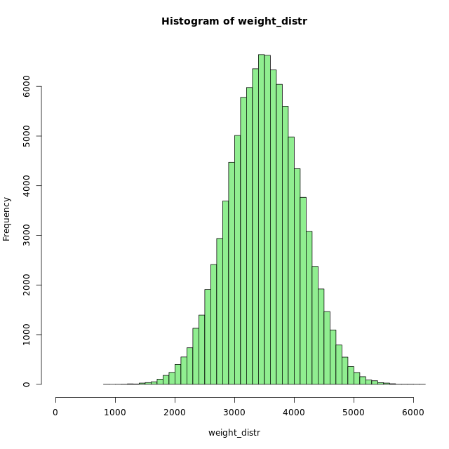
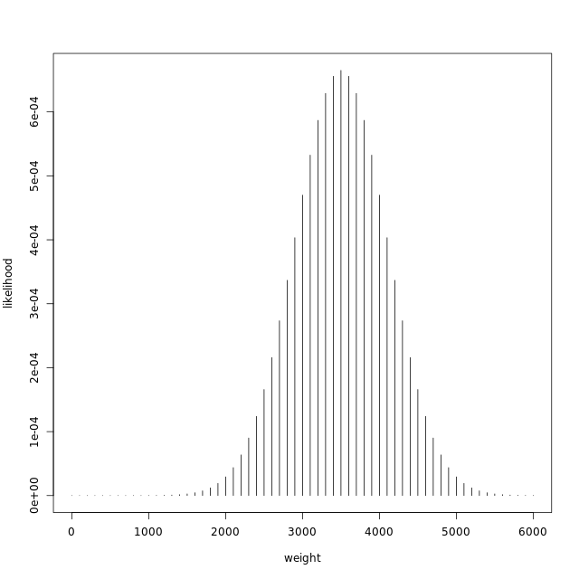
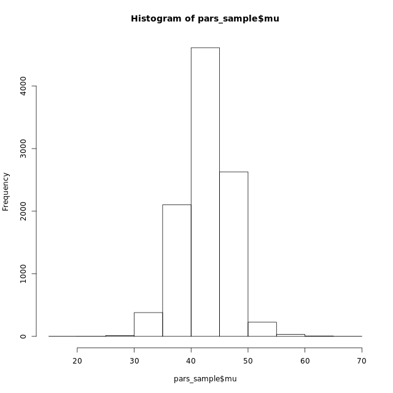
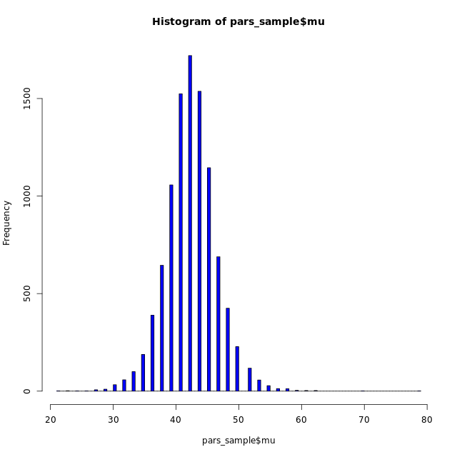

# Chapter 5 - More parameters, more data, and more Bayes
## rnorm, dnorm, and the weight of newborns

```r

# Assign mu and sigma
mu <- 3500
sigma <- 600

weight_distr <- rnorm(n = 100000, mean = mu, sd = sigma)
hist(weight_distr, 60, xlim = c(0, 6000), col = "lightgreen")

# Create weight
weight <- seq(0, 6000, by = 100)

# Calculate likelihood
likelihood <- dnorm(weight, mu, sigma)

# Plot the distribution of weight
plot(weight, likelihood, type = "h")

```

Ouput:





***

## A Bayesian model of Zombie IQ

```r

# The IQ of a bunch of zombies
iq <- c(55, 44, 34, 18, 51, 40, 40, 49, 48, 46)
# Defining the parameter grid
pars <- expand.grid(mu = seq(0, 150, length.out = 100), 
                    sigma = seq(0.1, 50, length.out = 100))
# Defining and calculating the prior density for each parameter combination
pars$mu_prior <- dnorm(pars$mu, mean = 100, sd = 100)
pars$sigma_prior <- dunif(pars$sigma, min = 0.1, max = 50)
pars$prior <- pars$mu_prior * pars$sigma_prior
# Calculating the likelihood for each parameter combination
for(i in 1:nrow(pars)) {
  likelihoods <- dnorm(iq, pars$mu[i], pars$sigma[i])
  pars$likelihood[i] <- prod(likelihoods)
}
# Calculate the probability of each parameter combination
pars$probability <- pars$likelihood*pars$prior
pars$probability <- pars$probability/sum(pars$probability)

```

***

## Sampling from the zombie posterior

### 2

```r
head(pars)
sample_indices <- sample( nrow(pars), size = 10000,
    replace = TRUE, prob = pars$probability)
head(sample_indices)

# Sample from pars to calculate some new measures
pars_sample <- pars[sample_indices, c("mu", "sigma")]

# Visualize the mean IQ
hist(pars_sample$mu)

```
Output:



### 3

```r

head(pars)
sample_indices <- sample( nrow(pars), size = 10000,
    replace = TRUE, prob = pars$probability)
head(sample_indices)

# Sample from pars to calculate some new measures
pars_sample <- pars[sample_indices, c("mu", "sigma")]

# Visualize the mean IQ
hist(pars_sample$mu, 100, col = 'blue')

# Calculate quantiles
quantile(pars_sample$mu, probs = c(0.025,0.5,0.975))

```

Output:

```bash
> head(pars)
        mu sigma    mu_prior sigma_prior        prior likelihood probability
1 0.000000   0.1 0.002419707  0.02004008 4.849113e-05          0           0
2 1.515152   0.1 0.002456367  0.02004008 4.922578e-05          0           0
3 3.030303   0.1 0.002493009  0.02004008 4.996010e-05          0           0
4 4.545455   0.1 0.002529617  0.02004008 5.069373e-05          0           0
5 6.060606   0.1 0.002566174  0.02004008 5.142633e-05          0           0
6 7.575758   0.1 0.002602661  0.02004008 5.215754e-05          0           0
> sample_indices <- sample( nrow(pars), size = 10000,
      replace = TRUE, prob = pars$probability)
> head(sample_indices)
[1] 2429 2029 2726 4832 1930 2531
> 
> # Sample from pars to calculate some new measures
> pars_sample <- pars[sample_indices, c("mu", "sigma")]
> 
> # Visualize the mean IQ
> hist(pars_sample$mu, 100, col = 'blue')
> 
> # Calculate quantiles
> quantile(pars_sample$mu, probs = c(0.025,0.5,0.975))
    2.5%      50%    97.5% 
34.84848 42.42424 50.00000

```



We estimate the mean zombie IQ to be 42 (95% CI: [35, 50])

***

## But how smart will the next zombie be?

```r
head(pars_sample)
pred_iq <- rnorm(10000, mean = pars_sample$mu, 
                 sd = pars_sample$sigma)

# Visualize pred_iq
hist(pred_iq)

# Calculate the probability of a zombie being "smart" (+60 IQ)
nrow(pars_sample[pred_iq >= 60,])/nrow(pars_sample)

```
Output:

```bash

> head(pars_sample)
           mu     sigma
2725 36.36364 13.709091
1931 45.45455  9.676768
2526 37.87879 12.701010
1828 40.90909  9.172727
1728 40.90909  8.668687
3626 37.87879 18.245455
> pred_iq <- rnorm(10000, mean = pars_sample$mu, 
                   sd = pars_sample$sigma)
> 
> # Visualize pred_iq
> hist(pred_iq)
> 
> # Calculate the probability of a zombie being "smart" (+60 IQ)
> nrow(pars_sample[pred_iq >= 60,])/nrow(pars_sample)
[1] 0.0887
> 

```


***

