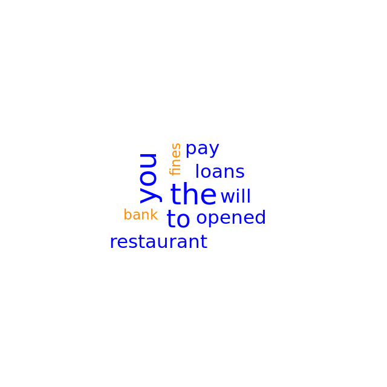
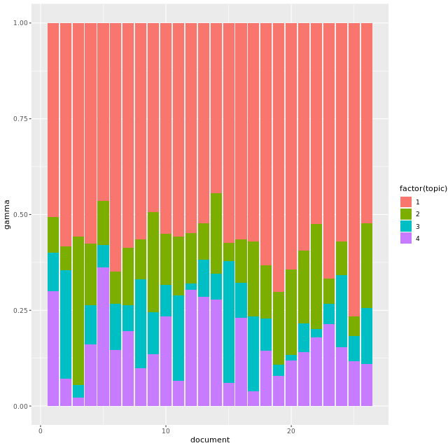
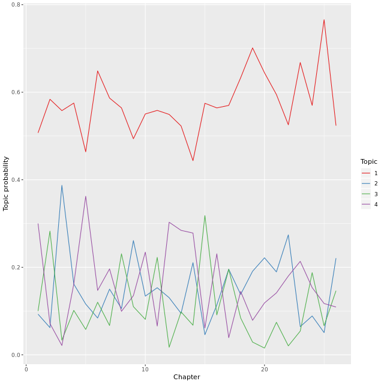
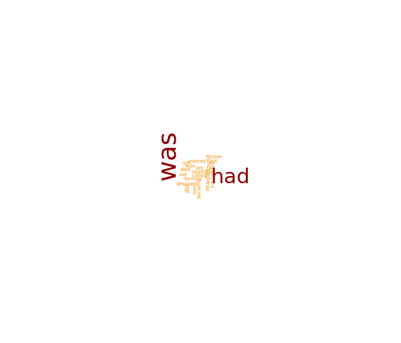
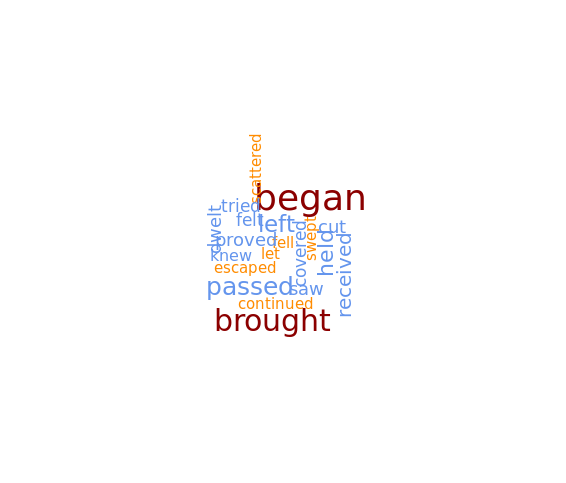
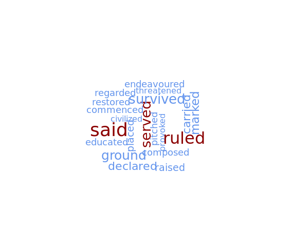
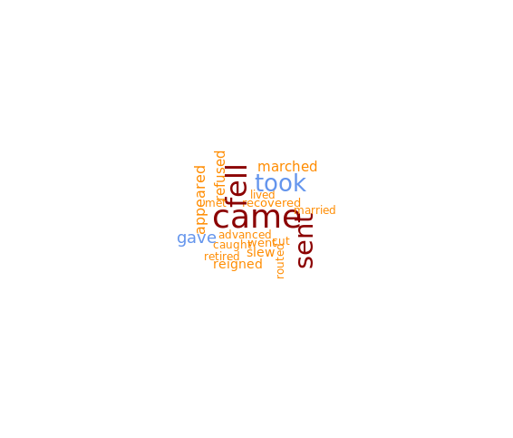

# Chapter 2 - Wordclouds, stopwords, and control arguments

## Probabilities of words in topics

```r
# Display column names
colnames(dtm)

# Fit an LDA model for 2 topics using Gibbs sampling
mod <- LDA(x=dtm, k=2, method="Gibbs", 
           control=list(alpha=1, seed=10005, thin=1))

# Convert matrix beta into tidy format and filter on topic number and term
tidy(mod, matrix="beta") %>%
  filter(topic==2, term=="opened")

```

Ouput:

```bash

> # Display column names
> colnames(dtm)
[1] "bank"       "fines"      "loans"      "pay"        "new"       
[6] "opened"     "restaurant"
> 
> # Fit an LDA model for 2 topics using Gibbs sampling
> mod <- LDA(x=dtm, k=2, method="Gibbs", 
             control=list(alpha=1, seed=10005, thin=1))
> 
> # Convert matrix beta into tidy format and filter on topic number and term
> tidy(mod, matrix="beta") %>%
    filter(topic==2, term=="opened")
# A tibble: 1 x 3
  topic term     beta
  <int> <chr>   <dbl>
1     2 opened 0.0103
> 

```
***

## Effect of argument alpha

### 2

```r
# Fit LDA topic model using Gibbs sampling for 2 topics
mod1 <- LDA(x=dtm, k=2, method="Gibbs",
           control=list(alpha=1, seed=10005, thin=1))

# Display the probabilities of topics in documents side by side
tidy(mod1, matrix="gamma") %>% spread(topic, gamma)

```

Output:

```bash

> # Fit LDA topic model using Gibbs sampling for 2 topics
> mod1 <- LDA(x=dtm, k=2, method="Gibbs",
             control=list(alpha=1, seed=10005, thin=1))
> 
> # Display the probabilities of topics in documents side by side
> tidy(mod1, matrix="gamma") %>% spread(topic, gamma)
# A tibble: 5 x 3
  document   `1`    `2`
  <chr>    <dbl>  <dbl>
1 d_1      0.154 0.846 
2 d_2      0.278 0.722 
3 d_3      0.875 0.125 
4 d_4      0.923 0.0769
5 d_5      0.5   0.5
> 

```

### 3

Change alpha to 25.

```r

# Fit LDA topic model using Gibbs sampling for 2 topics
mod2 <- LDA(x=dtm, k=2, method="Gibbs",
           control=list(alpha=25, seed=10005, thin=1))

# Display the probabilities of topics in documents side by side
tidy(mod2, matrix = "gamma") %>% spread(topic, gamma)

```

Output:

```bash
> # Fit LDA topic model using Gibbs sampling for 2 topics
> mod2 <- LDA(x=dtm, k=2, method="Gibbs",
             control=list(alpha=25, seed=10005, thin=1))
> 
> # Display the probabilities of topics in documents side by side
> tidy(mod2, matrix = "gamma") %>% spread(topic, gamma)
# A tibble: 5 x 3
  document   `1`   `2`
  <chr>    <dbl> <dbl>
1 d_1      0.475 0.525
2 d_2      0.530 0.470
3 d_3      0.482 0.518
4 d_4      0.508 0.492
5 d_5      0.5   0.5
> 

```

***


## Making a dtm - refresher


```r

# Create the document-term matrix
dtm <- corpus %>%
  unnest_tokens(output=word, input=text) %>%
  count(id, word) %>%
  cast_dtm(document=id, term=word, value=n)

# Display dtm as a matrix
as.matrix(dtm)

```

Output:

```bash
> # Create the document-term matrix
> dtm <- corpus %>%
    unnest_tokens(output=word, input=text) %>%
    count(id, word) %>%
    cast_dtm(document=id, term=word, value=n)
> 
> # Display dtm as a matrix
> as.matrix(dtm)
     Terms
Docs  agreed bad bank due fines loans pay the to are face if late off will you
  d_1      1   1    1   1     1     1   1   2  2   0    0  0    0   0    0   0
  d_2      0   0    1   0     1     1   1   1  2   1    1  1    1   1    1   2
  d_3      0   0    0   0     0     0   0   0  0   0    0  0    0   0    0   0
  d_4      0   0    0   0     0     0   0   0  0   0    0  0    0   0    0   0
  d_5      0   0    0   0     0     1   1   2  0   0    0  0    0   1    2   3
     Terms
Docs  your a downtown in new opened restaurant is just on street that there
  d_1    0 0        0  0   0      0          0  0    0  0      0    0     0
  d_2    1 0        0  0   0      0          0  0    0  0      0    0     0
  d_3    0 1        1  1   1      1          1  0    0  0      0    0     0
  d_4    0 1        0  0   1      1          1  1    1  1      1    1     1
  d_5    0 0        0  0   0      1          1  0    0  0      0    0     0
     Terms
Docs  warwick for how need want
  d_1       0   0   0    0    0
  d_2       0   0   0    0    0
  d_3       0   0   0    0    0
  d_4       1   0   0    0    0
  d_5       0   1   1    1    1
> 

```
## Removing stopwords

```r
# Create the document-term matrix with stop words removed
dtm <- corpus %>%
  unnest_tokens(output=word, input=text) %>%
  anti_join(stop_words) %>% 
  count(id, word) %>%
  cast_dtm(document=id, term=word, value=n)

# Display the matrix
as.matrix(dtm)

```
Output:

```bash

> # Create the document-term matrix with stop words removed
> dtm <- corpus %>%
    unnest_tokens(output=word, input=text) %>%
    anti_join(stop_words) %>% 
    count(id, word) %>%
    cast_dtm(document=id, term=word, value=n)
Joining, by = "word"
> 
> # Display the matrix
> as.matrix(dtm)
     Terms
Docs  agreed bad bank due fines loans pay late downtown restaurant street
  d_1      1   1    1   1     1     1   1    0        0          0      0
  d_2      0   0    1   0     1     1   1    1        0          0      0
  d_3      0   0    0   0     0     0   0    0        1          1      0
  d_4      0   0    0   0     0     0   0    0        0          1      1
  d_5      0   0    0   0     0     1   1    0        0          1      0
     Terms
Docs  warwick
  d_1       0
  d_2       0
  d_3       0
  d_4       1
  d_5       0
> 

```
***

## Keeping the needed words

```r

# Perform inner_join with the dictionary table
dtm <- corpus %>%
  unnest_tokens(output=word, input=text) %>%
  inner_join(dictionary) %>% 
  count(id, word) %>%
  cast_dtm(document=id, term=word, value=n)

# Display the summary of dtm
as.matrix(dtm)

```

Output:

```bash
> # Perform inner_join with the dictionary table
> dtm <- corpus %>%
    unnest_tokens(output=word, input=text) %>%
    inner_join(dictionary) %>% 
    count(id, word) %>%
    cast_dtm(document=id, term=word, value=n)
Joining, by = "word"
> 
> # Display the summary of dtm
> as.matrix(dtm)
     Terms
Docs  bank fines loans pay new opened restaurant
  d_1    1     1     1   1   0      0          0
  d_2    1     1     1   1   0      0          0
  d_3    0     0     0   0   1      1          1
  d_4    0     0     0   0   1      1          1
  d_5    0     0     1   1   0      1          1
> 


```

***

## Wordcloud of term frequency

```r

# Generate the counts of words in the corpus
word_frequencies <- corpus %>% 
  unnest_tokens(input=text, output=word) %>%
  count(word)

# Create a wordcloud
wordcloud(words=word_frequencies$word, 
          freq=word_frequencies$n,
          min.freq=1,
          max.words=10,
          colors=c("DarkOrange", "Blue"),
          random.order=FALSE,
          random.color=FALSE)
```

Output:



***

## LDA model fitting - first iteration

```

# Construct a document-term matrix
dtm <- history %>% 
	unnest_tokens(input=text, output=word) %>% 
    anti_join(stop_words) %>% 
    count(chapter, word) %>% 
    cast_dtm(document=chapter, term=word, value=n)

# Insert the missing arguments ( LDA topic model for four topics k=4)
mod <- LDA(x=dtm, k=4, method="Gibbs", 
           control=list(alpha=1, seed=10005))

# Display top 15 words of each topic
terms(mod, k=15)

```
Output:

```bash
> # Construct a document-term matrix
> dtm <- history %>% 
  	unnest_tokens(input=text, output=word) %>% 
      anti_join(stop_words) %>% 
      count(chapter, word) %>% 
      cast_dtm(document=chapter, term=word, value=n)
Joining, by = "word"
> 
> # Insert the missing arguments
> mod <- LDA(x=dtm, k=4, method="Gibbs", 
             control=list(alpha=1, seed=10005))
> 
> # Display top 15 words of each topic
> terms(mod, k=15)
      Topic 1          Topic 2          Topic 3      Topic 4      
 [1,] "emperor"        "alexius"        "roman"      "greek"      
 [2,] "empire"         "constantinople" "city"       "empire"     
 [3,] "army"           "empire"         "italy"      "reign"      
 [4,] "war"            "john"           "goths"      "letter"     
 [5,] "constantinople" "city"           "rome"       "leo"        
 [6,] "time"           "byzantine"      "justinian"  "constantine"
 [7,] "roman"          "asia"           "byzantium"  "byzantine"  
 [8,] "capital"        "turks"          "belisarius" "century"    
 [9,] "imperial"       "brother"        "danube"     "justinian"  
[10,] "son"            "money"          "life"       "saracens"   
[11,] "fell"           "andronicus"     "theodosius" "nicephorus" 
[12,] "found"          "isaac"          "world"      "east"       
[13,] "king"           "crusaders"      "court"      "michael"    
[14,] "provinces"      "walls"          "emperors"   "throne"     
[15,] "hands"          "iii"            "palace"     "basil"
> 

```

***

## Capturing the actions - dtm with verbs

```r

# Display the structure of the verbs dataframe
str(verbs)

# Construct a document-term matrix
dtm <- history %>% 
	unnest_tokens(input=text, output=word) %>% 
    inner_join(verbs, by=c("word"="past")) %>% 
    count(chapter, word) %>% 
    cast_dtm(document=chapter, term=word, value=n)

# Fit LDA for four topics
mod <- LDA(x=dtm, k=4, method="Gibbs",
          control=list(alpha=1, seed=10005))

# Display top 25 words from each topic
terms(mod, k=25)

```

Output:

```bash
> # Display the structure of the verbs dataframe
> str(verbs)
'data.frame':	7522 obs. of  2 variables:
 $ present: chr  "abandon" "abase" "abash" "abate" ...
 $ past   : chr  "abandoned" "abased" "abashed" "abated" ...
> 
> # Construct a document-term matrix
> dtm <- history %>% 
  	unnest_tokens(input=text, output=word) %>% 
      inner_join(verbs, by=c("word"="past")) %>% 
      count(chapter, word) %>% 
      cast_dtm(document=chapter, term=word, value=n)
> 
> # Fit LDA for four topics
> mod <- LDA(x=dtm, k=4, method="Gibbs",
            control=list(alpha=1, seed=10005))
> 
> # Display top 25 words from each topic
> terms(mod, k=25)
      Topic 1     Topic 2        Topic 3       Topic 4     
 [1,] "was"       "began"        "kept"        "came"      
 [2,] "had"       "cut"          "raised"      "fell"      
 [3,] "made"      "dwelt"        "stood"       "sent"      
 [4,] "took"      "covered"      "placed"      "appeared"  
 [5,] "found"     "knew"         "marked"      "laid"      
 [6,] "did"       "continued"    "built"       "reigned"   
 [7,] "died"      "did"          "devoted"     "marched"   
 [8,] "left"      "displayed"    "turned"      "said"      
 [9,] "destined"  "proved"       "headed"      "received"  
[10,] "won"       "chose"        "survived"    "refused"   
[11,] "lost"      "granted"      "celebrated"  "fled"      
[12,] "led"       "burst"        "gave"        "slew"      
[13,] "brought"   "strove"       "provoked"    "began"     
[14,] "called"    "troubled"     "described"   "routed"    
[15,] "formed"    "lasted"       "lived"       "threw"     
[16,] "succeeded" "protracted"   "wrote"       "met"       
[17,] "conquered" "checked"      "educated"    "cut"       
[18,] "followed"  "kept"         "established" "served"    
[19,] "forced"    "stormed"      "ground"      "married"   
[20,] "held"      "fell"         "bound"       "got"       
[21,] "seized"    "loved"        "supported"   "proclaimed"
[22,] "broke"     "spoke"        "developed"   "recovered" 
[23,] "became"    "accomplished" "reorganized" "ruled"     
[24,] "put"       "contrived"    "converted"   "scattered" 
[25,] "named"     "preserved"    "produced"    "defeated"
> 

```
***

## Making a chart

### 2

```r

# Extract matrix gamma and plot it
tidy(mod, "gamma") %>% 
	mutate(document=as.numeric(document)) %>% 
	ggplot(aes(x=document, y=gamma)) + 
	geom_col(aes(fill=factor(topic)))

# Display the words whose probability is above the threshold
terms(mod, threshold=0.0075)

```

Output:

```bash
> # Extract matrix gamma and plot it
> tidy(mod, "gamma") %>% 
  	mutate(document=as.numeric(document)) %>% 
  	ggplot(aes(x=document, y=gamma)) + 
  	geom_col(aes(fill=factor(topic)))
> # Extract matrix gamma and plot it
> tidy(mod, "gamma") %>% 
  	mutate(document=as.numeric(document)) %>% 
  	ggplot(aes(x=document, y=gamma)) + 
  	geom_col(aes(fill=factor(topic)))
> 
> # Display the words whose probability is above the threshold
> terms(mod, threshold=0.0075)
$`Topic 1`
 [1] "destined" "did"      "found"    "had"      "left"     "lost"    
 [7] "made"     "took"     "was"      "won"      "died"    

$`Topic 2`
 [1] "allowed"   "began"     "cast"      "continued" "cut"       "dwelt"    
 [7] "escaped"   "fell"      "held"      "left"      "passed"    "proved"   
[13] "received"  "brought"   "chose"     "covered"   "ended"     "swept"    
[19] "burst"     "divided"   "felt"      "granted"   "let"       "saw"      
[25] "scattered" "strove"    "tried"     "troubled"  "knew"     

$`Topic 3`
 [1] "assumed"     "civilized"   "declared"    "ground"      "marked"     
 [6] "pitched"     "placed"      "ruled"       "said"        "served"     
[11] "stood"       "carried"     "composed"    "entered"     "raised"     
[16] "survived"    "commenced"   "restored"    "spoke"       "threatened" 
[21] "endeavoured" "provoked"    "wrote"       "regarded"    "inflicted"  
[26] "educated"   

$`Topic 4`
 [1] "appeared"   "came"       "crossed"    "cut"        "fell"      
 [6] "gave"       "proclaimed" "recovered"  "refused"    "reigned"   
[11] "took"       "went"       "advanced"   "lived"      "marched"   
[16] "occupied"   "raised"     "sent"       "caught"     "married"   
[21] "slew"       "met"        "retired"    "routed"     "got"
> 

```



### 3


```r

# Extract matrix gamma and plot it
tidy(mod, "gamma") %>% 
	mutate(document=as.numeric(document)) %>% 
	ggplot(aes(x=document, y=gamma)) + 
	geom_line(aes(color=factor(topic))) + 
    labs(x="Chapter", y="Topic probability") +
	scale_color_manual(values=brewer.pal(n=4, "Set1"), name="Topic")
           
```

Output:



***

## Use wordclouds

```r

# Display wordclouds one at a time
for (j in 1:4) {
  # Generate a table with word frequences for topic j
  word_frequencies <- tidy(mod, matrix="beta") %>% 
    mutate(n = trunc(beta * 10000)) %>% 
    filter(topic == j)

  # Display word cloud
  wordcloud(words = word_frequencies$term, 
            freq = word_frequencies$n,
            max.words = 20,
            scale = c(3, 0.5),
            colors = c("DarkOrange", "CornflowerBlue", "DarkRed"), 
            rot.per = 0.3)
}

```

Output:

### 1



### 2



### 3



### 4



***

*End of Chapter 2*

