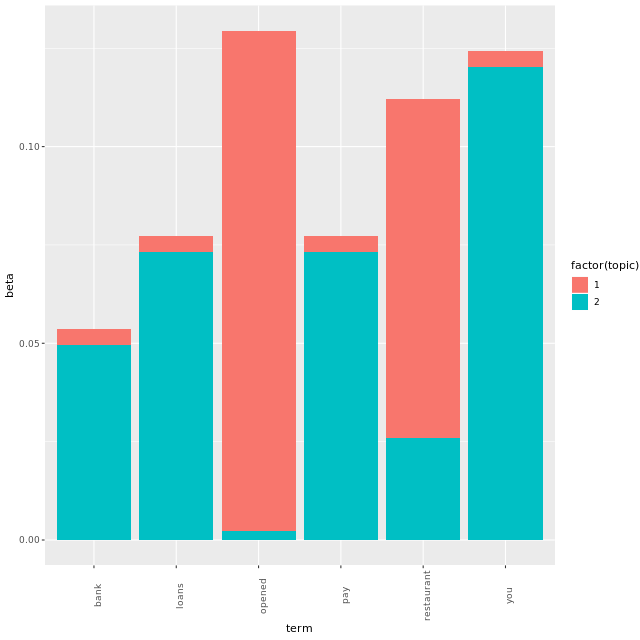
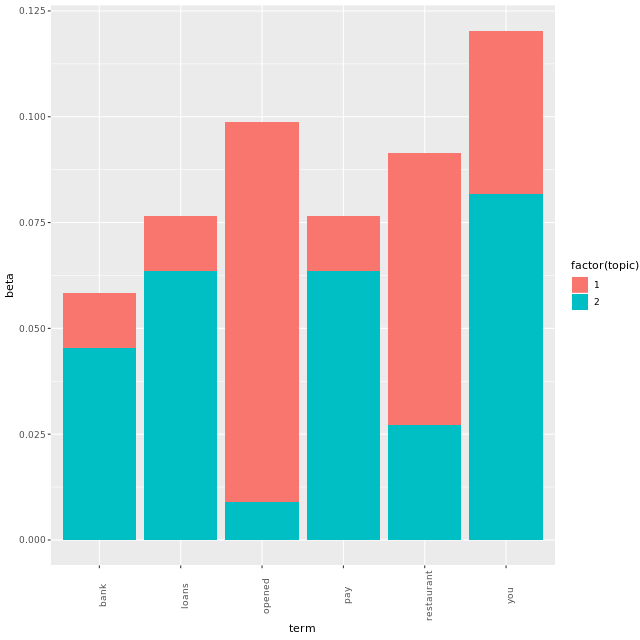

# Chapter 3 - Named entity recognition as unsupervised classification

## Same k, different alpha

```r

# Fit a topic model using LDA with Gibbs sampling
mod = LDA(x=dtm, k=2, method="Gibbs", 
          control=list(iter=500, thin=1,
                       seed = 12345,
                       alpha=NULL))

# Display topic prevalance in documents as a table
tidy(mod, "gamma") %>% spread(topic, gamma)

```

Output:

```bash
> # Fit a topic model using LDA with Gibbs sampling
> mod = LDA(x=dtm, k=2, method="Gibbs", 
            control=list(iter=500, thin=1,
                         seed = 12345,
                         alpha=NULL))
> 
> # Display topic prevalance in documents as a table
> tidy(mod, "gamma") %>% spread(topic, gamma)
# A tibble: 5 x 3
  document   `1`   `2`
  <chr>    <dbl> <dbl>
1 d_1      0.492 0.508
2 d_2      0.5   0.5  
3 d_3      0.5   0.5  
4 d_4      0.525 0.475
5 d_5      0.485 0.515
> 


```

***

## Probabilities of words in topics

### 1

```r

# Fit the model for delta = 0.5
mod <- LDA(x=dtm, k=2, method="Gibbs",
         control=list(iter=500, seed=12345, alpha=1, delta=0.1))

# Define which words we want to examine
my_terms = c("loans", "bank", "opened", "pay", "restaurant", "you")

# Make a tidy table
t <- tidy(mod, "beta") %>% filter(term %in% my_terms)

# Make a stacked column chart
ggplot(t, aes(x=term, y=beta)) + geom_col(aes(fill=factor(topic))) +
  theme(axis.text.x=element_text(angle=90))

```

Output:




### 2

```r

# Fit the model for delta = 0.5
mod <- LDA(x=dtm, k=2, method="Gibbs",
         control=list(iter=500, seed=12345, alpha=1, delta=0.5))

# Define which words we want to examine
my_terms = c("loans", "bank", "opened", "pay", "restaurant", "you")

# Make a tidy table
t <- tidy(mod, "beta") %>% filter(term %in% my_terms)

# Make a stacked column chart
ggplot(t, aes(x=term, y=beta)) + geom_col(aes(fill=factor(topic))) +
  theme(axis.text.x=element_text(angle=90))
 
```

Output:



***
