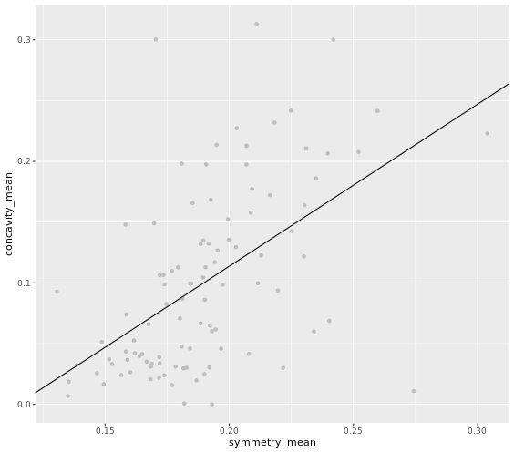

# Chapter 1 - Introduction to hyperparameters

## Model parameters vs. hyperparameters

```r

# Fit a linear model on the breast_cancer_data.
linear_model <- lm(concavity_mean ~ symmetry_mean, breast_cancer_data)

# Look at the summary of the linear_model.
summary(linear_model)

# Extract the coefficients.
coefficients(linear_model)

```

Output:

```bash

# Fit a linear model on the breast_cancer_data.
linear_model <- lm(concavity_mean ~ symmetry_mean, breast_cancer_data)
# Look at the summary of the linear_model.
summary(linear_model)

Call:
lm(formula = concavity_mean ~ symmetry_mean, data = breast_cancer_data)

Residuals:
      Min        1Q    Median        3Q       Max 
-0.201877 -0.039201 -0.008432  0.030655  0.226150 

Coefficients:
              Estimate Std. Error t value Pr(>|t|)    
(Intercept)   -0.15311    0.04086  -3.747 0.000303 ***
symmetry_mean  1.33366    0.21257   6.274 9.57e-09 ***
---
Signif. codes:  0 '***' 0.001 '**' 0.01 '*' 0.05 '.' 0.1 ' ' 1

Residual standard error: 0.06412 on 98 degrees of freedom
Multiple R-squared:  0.2866,	Adjusted R-squared:  0.2793 
F-statistic: 39.36 on 1 and 98 DF,  p-value: 9.575e-09
# Extract the coefficients.
coefficients(linear_model)
  (Intercept) symmetry_mean 
   -0.1531055     1.3336568 


```
***

## What are the coefficients?

```r

library(ggplot2)

# Plot linear relationship.
ggplot(data = breast_cancer_data, 
        aes(x = symmetry_mean, y = concavity_mean)) +
  geom_point(color = "grey") +
  geom_abline(slope = linear_model$coefficients[2], 
      intercept = linear_model$coefficients[1])
      
```

Output:



***


