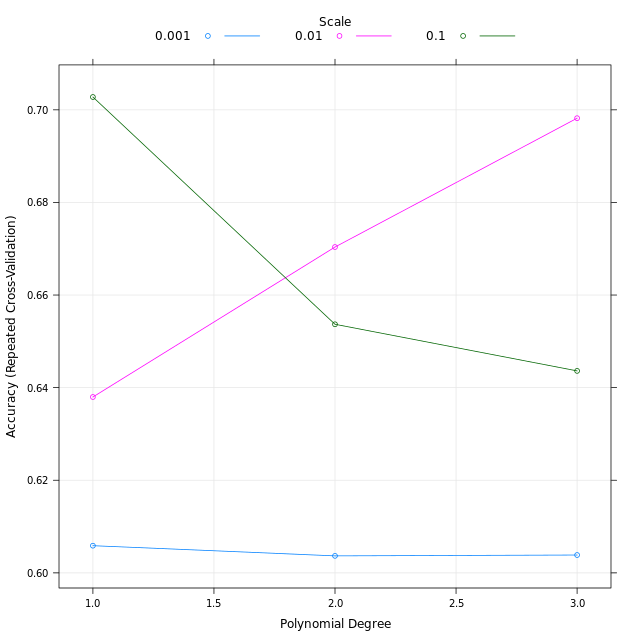
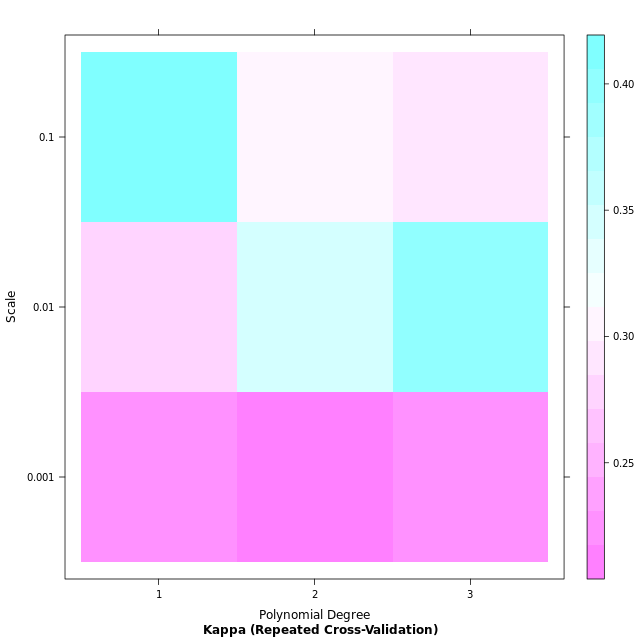

# Chapter 2 - Hyperparameter tuning with caret
## Cartesian grid search in caret

Use the Cartesian grid you defined in the previous step to train a Support Vector Machines with Polynomial Kernel in caret.

```r

# Define Cartesian grid
man_grid <- expand.grid(degree = c(1, 2, 3), 
                        scale = c(0.1, 0.01, 0.001), 
                        C = 0.5)

# Start timer, set seed & train model
tic()
set.seed(42)
svm_model_voters_grid <- train(turnout16_2016 ~ ., 
                   data = voters_train_data, 
                   method = 'svmPoly', 
                   trControl = fitControl,
                   verbose= FALSE,
                   tuneGrid = man_grid)
toc()

```

Output:

```bash

>
svm_model_voters_grid
Support Vector Machines with Polynomial Kernel 

80 samples
39 predictors
 2 classes: 'Did not vote', 'Voted' 

No pre-processing
Resampling: Cross-Validated (3 fold, repeated 5 times) 
Summary of sample sizes: 54, 54, 52, 54, 53, 53, ... 
Resampling results across tuning parameters:

  degree  scale  Accuracy   Kappa    
  1       0.001  0.6058676  0.2216117
  1       0.010  0.6379799  0.2802824
  1       0.100  0.7027676  0.4061258
  2       0.001  0.6036698  0.2172161
  2       0.010  0.6703704  0.3415567
  2       0.100  0.6536834  0.3086577
  3       0.001  0.6038529  0.2175824
  3       0.010  0.6981956  0.3969106
  3       0.100  0.6436169  0.2883813

Tuning parameter 'C' was held constant at a value of 0.5
Accuracy was used to select the optimal model using the largest value.
The final values used for the model were degree = 1, scale = 0.1 and C = 0.5.
>

```

Best degree 1 & scale 0.100

***

## Plot hyperparameter model output

```r

# Plot default
plot(svm_model_voters_grid)

# Plot Kappa level-plot
plot(svm_model_voters_grid, metric = "Kappa", plotType = "level")

```

Output:





***


