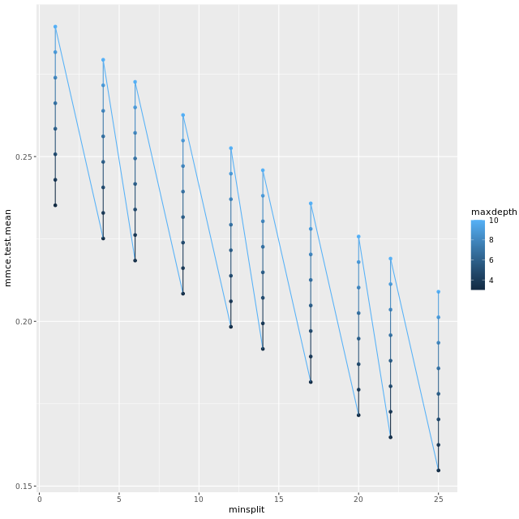

# Chapter 3 - Hyperparameter tuning with mlr
## Modeling with mlr
```r

# Create classification taks
task <- makeClassifTask(data = knowledge_train_data, 
                        target = "UNS")

# Call the list of learners
listLearners() %>%
 as.data.frame() %>%
 select(class, short.name, package) %>%
 filter(grepl("classif.", class))

# Create learner
lrn <- makeLearner("classif.randomForest", 
                   predict.type = "prob", 
                   fix.factors.prediction = TRUE)
```


Ouput:

```bash
# Create classification tasks
task <- makeClassifTask(data = knowledge_train_data, 
                        target = "UNS")
Warning message: Provided data is not a pure data.frame but from class spec_tbl_df, hence it will be converted.
# Call the list of learners
listLearners() %>%
 as.data.frame() %>%
 select(class, short.name, package) %>%
 filter(grepl("classif.", class))
Warning message: The following learners could not be constructed, probably because their packages are not installed:
classif.C50,classif.FDboost,classif.cforest,classif.ctree,classif.cvglmnet,classif.earth,classif.evtree,classif.fdausc.glm,classif.fdausc.kernel,classif.fdausc.knn,classif.fdausc.np,classif.fgam,classif.gamboost,classif.glmboost,classif.glmnet,classif.mda,classif.randomForestSRC,classif.rda,classif.rknn,classif.rrlda,classif.sparseLDA,cluster.MiniBatchKmeans,multilabel.cforest,multilabel.randomForestSRC,regr.FDboost,regr.brnn,regr.cforest,regr.crs,regr.ctree,regr.cvglmnet,regr.earth,regr.evtree,regr.fgam,regr.gamboost,regr.glmboost,regr.glmnet,regr.mars,regr.mob,regr.randomForestSRC,regr.rknn,surv.cforest,surv.cvglmnet,surv.gamboost,surv.glmboost,surv.glmnet,surv.randomForestSRC
Check ?learners to see which packages you need or install mlr with all suggestions.
                            class          short.name                   package
1                     classif.C50                 C50                       C50
2                 classif.FDboost             FDboost            FDboost,mboost
3                     classif.IBk                 ibk                     RWeka
4                     classif.J48                 j48                     RWeka
5                    classif.JRip                jrip                     RWeka
6        classif.LiblineaRL1L2SVC       liblinl1l2svc                 LiblineaR
7       classif.LiblineaRL1LogReg      liblinl1logreg                 LiblineaR
8        classif.LiblineaRL2L1SVC       liblinl2l1svc                 LiblineaR
9       classif.LiblineaRL2LogReg      liblinl2logreg                 LiblineaR
10         classif.LiblineaRL2SVC         liblinl2svc                 LiblineaR
11 classif.LiblineaRMultiClassSVC liblinmulticlasssvc                 LiblineaR
12                   classif.OneR                oner                     RWeka
13                   classif.PART                part                     RWeka
14                    classif.RRF                 RRF                       RRF
15                    classif.ada                 ada                 ada,rpart
16             classif.adaboostm1          adaboostm1                     RWeka
17            classif.bartMachine         bartmachine               bartMachine
18               classif.binomial            binomial                     stats
19               classif.boosting              adabag              adabag,rpart
20                    classif.bst                 bst                 bst,rpart
21                classif.cforest             cforest                     party
22             classif.clusterSVM          clusterSVM        SwarmSVM,LiblineaR
23                  classif.ctree               ctree                     party
24               classif.cvglmnet            cvglmnet                    glmnet
25                 classif.dbnDNN             dbn.dnn                   deepnet
26                  classif.dcSVM               dcSVM            SwarmSVM,e1071
27                  classif.earth                 fda               earth,stats
28                 classif.evtree              evtree                    evtree
29             classif.extraTrees          extraTrees                extraTrees
30             classif.fdausc.glm          fdausc.glm                   fda.usc
31          classif.fdausc.kernel       fdausc.kernel                   fda.usc
32             classif.fdausc.knn          fdausc.knn                   fda.usc
33              classif.fdausc.np           fdausc.np                   fda.usc
34            classif.featureless         featureless                       mlr
35                   classif.fgam                FGAM                    refund
36                    classif.fnn                 fnn                       FNN
37               classif.gamboost            gamboost                    mboost
38               classif.gaterSVM            gaterSVM                  SwarmSVM
39                classif.gausspr             gausspr                   kernlab
40                    classif.gbm                 gbm                       gbm
41                  classif.geoDA               geoda               DiscriMiner
42               classif.glmboost            glmboost                    mboost
43                 classif.glmnet              glmnet                    glmnet
44       classif.h2o.deeplearning              h2o.dl                       h2o
45                classif.h2o.gbm             h2o.gbm                       h2o
46                classif.h2o.glm             h2o.glm                       h2o
47       classif.h2o.randomForest              h2o.rf                       h2o
48                   classif.kknn                kknn                      kknn
49                    classif.knn                 knn                     class
50                   classif.ksvm                ksvm                   kernlab
51                    classif.lda                 lda                      MASS
52                  classif.linDA               linda               DiscriMiner
53                 classif.logreg              logreg                     stats
54                  classif.lssvm               lssvm                   kernlab
55                   classif.lvq1                lvq1                     class
56                    classif.mda                 mda                       mda
57                    classif.mlp                 mlp                     RSNNS
58               classif.multinom            multinom                      nnet
59             classif.naiveBayes              nbayes                     e1071
60              classif.neuralnet           neuralnet                 neuralnet
61                classif.nnTrain            nn.train                   deepnet
62                   classif.nnet                nnet                      nnet
63            classif.nodeHarvest         nodeHarvest               nodeHarvest
64                   classif.pamr                pamr                      pamr
65              classif.penalized           penalized                 penalized
66                    classif.plr                 plr                   stepPlr
67             classif.plsdaCaret          plsdacaret                 caret,pls
68                 classif.probit              probit                     stats
69                    classif.qda                 qda                      MASS
70                  classif.quaDA               quada               DiscriMiner
71                 classif.rFerns              rFerns                    rFerns
72           classif.randomForest                  rf              randomForest
73        classif.randomForestSRC               rfsrc           randomForestSRC
74                 classif.ranger              ranger                    ranger
75                    classif.rda                 rda                      klaR
76                   classif.rknn                rknn                      rknn
77         classif.rotationForest      rotationForest            rotationForest
78                  classif.rpart               rpart                     rpart
79                  classif.rrlda               rrlda                     rrlda
80                 classif.saeDNN             sae.dnn                   deepnet
81                    classif.sda                 sda                       sda
82              classif.sparseLDA           sparseLDA sparseLDA,MASS,elasticnet
83                    classif.svm                 svm                     e1071
84                classif.xgboost             xgboost                   xgboost
# Create learner
lrn <- makeLearner("classif.randomForest", 
                   predict.type = "prob", 
                   fix.factors.prediction = TRUE)


```

***

## Random search with mlr

```r

# Get the parameter set for neural networks of the nnet package
getParamSet("classif.nnet")

# Define set of parameters
param_set <- makeParamSet(
  makeDiscreteParam("size", values = c(2,3,5)),
  makeNumericParam("decay", lower = 0.0001, upper = 0.1)
)

# Print parameter set
print(param_set)

# Define a random search tuning method.
ctrl_random <- makeTuneControlRandom()

```

Output:

```bash

# Get the parameter set for neural networks of the nnet package
getParamSet("classif.nnet")
           Type len    Def      Constr Req Tunable Trafo
size    integer   -      3    0 to Inf   -    TRUE     -
maxit   integer   -    100    1 to Inf   -    TRUE     -
skip    logical   -  FALSE           -   -    TRUE     -
rang    numeric   -    0.7 -Inf to Inf   -    TRUE     -
decay   numeric   -      0 -Inf to Inf   -    TRUE     -
Hess    logical   -  FALSE           -   -    TRUE     -
trace   logical   -   TRUE           -   -   FALSE     -
MaxNWts integer   -   1000    1 to Inf   -   FALSE     -
abstol  numeric   - 0.0001 -Inf to Inf   -    TRUE     -
reltol  numeric   -  1e-08 -Inf to Inf   -    TRUE     -
# Define set of parameters
param_set <- makeParamSet(
  makeDiscreteParam("size", values = c(2,3,5)),
  makeNumericParam("decay", lower = 0.0001, upper = 0.1)
)
# Print parameter set
print(param_set)
          Type len Def        Constr Req Tunable Trafo
size  discrete   -   -         2,3,5   -    TRUE     -
decay  numeric   -   - 0.0001 to 0.1   -    TRUE     -
# Define a random search tuning method.
ctrl_random <- makeTuneControlRandom()

```

***

## Perform hyperparameter tuning with mlr

```r

# Define a random search tuning method.
ctrl_random <- makeTuneControlRandom(maxit = 6)

# Define a 3 x 3 repeated cross-validation scheme
cross_val <- makeResampleDesc("RepCV", folds = 3 * 3)

# Tune hyperparameters
tic()
lrn_tune <- tuneParams(lrn,
                       task,
                       resampling = cross_val,
                       control = ctrl_random,
                       par.set = param_set)
toc()

```
***

## Why to evaluate tuning?

What can you learn from evaluating hyperparameter tuning results?

> Which hyperparameters have a strong effect on model performance.

## Evaluating hyperparameter tuning results

```r

# Create holdout sampling
holdout <- makeResampleDesc("Holdout")

# Perform tuning
lrn_tune <- tuneParams(learner = lrn, task = task, resampling = holdout, control = ctrl_random, par.set = param_set)

# Generate hyperparameter effect data
hyperpar_effects <- generateHyperParsEffectData(lrn_tune, partial.dep = TRUE)

# Plot hyperparameter effects
plotHyperParsEffect(hyperpar_effects, 
    partial.dep.learn = "regr.glm",
    x = "minsplit", y = "mmce.test.mean", z = "maxdepth",
    plot.type = "line")
    
```

Output:



***

## Define aggregated measures

```r

# Create holdout sampling
holdout <- makeResampleDesc("Holdout", predict = "both")

# Perform tuning
lrn_tune <- tuneParams(learner = lrn, 
                       task = task, 
                       resampling = holdout, 
                       control = ctrl_random, 
                       par.set = param_set,
                       measures = list(acc, setAggregation(acc, train.mean), mmce, setAggregation(mmce, train.mean)))
                       
```

***

## Setting hyperparameters

```r
# Set hyperparameters
lrn_best <- setHyperPars(lrn, par.vals = list(size = 1, 
                                              rang = 150, 
                                              decay = 0))

# Train model
model_best <- train(lrn_best, task)

```


***

*End of Chapter 3*


