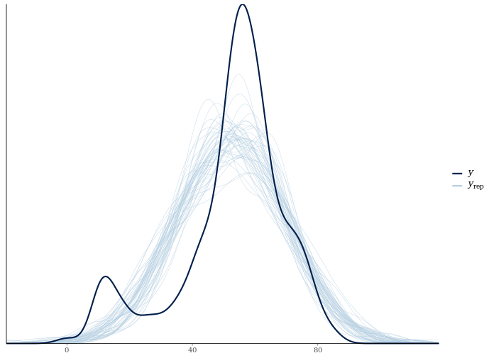
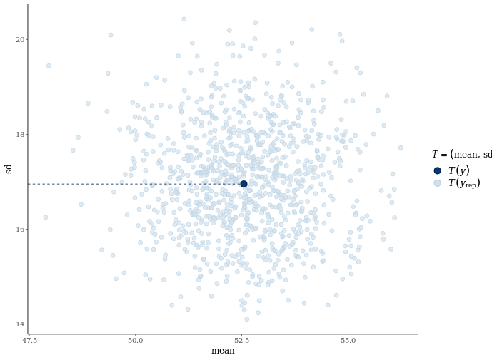

# Chapter 3 - Assessing Model Fit
## Calculating Frequentist R-squared
```r

# Print the R-squared from the linear model
lm_summary$r.squared

# Calulate sums of squares
ss_res <- var(residuals(lm_model))
ss_fit <- var(fitted(lm_model))

# Calculate the R-squared
1 - (ss_res / (ss_res + ss_fit))

```

Output:

```bash

# Print the R-squared from the linear model
lm_summary$r.squared
[1] 0.2305064
# Calulate sums of squares
ss_res <- var(residuals(lm_model))
ss_fit <- var(fitted(lm_model))
# Calculate the R-squared
1 - (ss_res / (ss_res + ss_fit))
[1] 0.2305064

```
***

## R-squared for a Bayesian Model

```r

# Save the variance of residulas
ss_res <- var(residuals(stan_model))

# Save the variance of fitted values
ss_fit <- var(fitted(stan_model))

# Calculate the R-squared
1 - (ss_res / (ss_res + ss_fit))

```

Output:

```bash
# Save the variance of residulas
ss_res <- var(residuals(stan_model))
# Save the variance of fitted values
ss_fit <- var(fitted(stan_model))
# Calculate the R-squared
1 - (ss_res / (ss_res + ss_fit))
[1] 0.2300082


```

***

## Predicted score distributions

```r

# Calculate posterior predictive scores
predictions <- posterior_linpred(stan_model)

# Print a summary of the observed data
summary(songs$popularity )

# Print a summary of the 1st replication
summary(predictions[1,])

# Print a summary of the 10th replication
summary(predictions[10,])

```
Output:

```bash

# Calculate posterior predictive scores
predictions <- posterior_linpred(stan_model)
# Print a summary of the observed data
summary(songs$popularity )
   Min. 1st Qu.  Median    Mean 3rd Qu.    Max. 
   0.00   47.50   56.00   52.55   62.00   85.00 
# Print a summary of the 1st replication
summary(predictions[1,])
   Min. 1st Qu.  Median    Mean 3rd Qu.    Max. 
  39.95   47.96   52.74   52.32   57.20   65.01 
# Print a summary of the 10th replication
summary(predictions[10,])
   Min. 1st Qu.  Median    Mean 3rd Qu.    Max. 
  37.45   46.61   52.06   51.58   57.17   66.09 

```

***

## R-squared Posterior

```r

# Calculate the posterior distribution of the R-squared
r2_posterior <- bayes_R2(stan_model)

# Make a histogram of the distribution
hist(r2_posterior)

```

Output:


***

## Posterior Predictive Testing

```r

# Create density comparison
pp_check(stan_model, "dens_overlay")

# Create scatter plot of means and standard deviations
pp_check(stan_model, "stat_2d")

```

Output:




***

## Calculating the LOO estimate

```r

# Estimate the model with 1 predictor
model_1pred <- stan_glm(popularity ~ song_age, data = songs)

# Print the LOO estimate for the 1 predictor model
loo(model_1pred)

# Estimate the model with both predictors
model_2pred <- stan_glm(popularity ~ song_age * artist_name, data = songs)

# Print the LOO estimates for the 2 predictor model
loo(model_2pred)

```

Output:

```bash

# Estimate the model with 1 predictor
model_1pred <- stan_glm(popularity ~ song_age, data = songs)
# Print the LOO estimate for the 1 predictor model
loo(model_1pred)

Computed from 1000 by 215 log-likelihood matrix

         Estimate   SE
elpd_loo   -888.1 12.9
p_loo         3.3  0.4
looic      1776.2 25.9
------
Monte Carlo SE of elpd_loo is 0.1.

All Pareto k estimates are good (k < 0.5).
See help('pareto-k-diagnostic') for details.
# Estimate the model with both predictors
model_2pred <- stan_glm(popularity ~ song_age * artist_name, data = songs)
# Print the LOO estimates for the 2 predictor model
loo(model_2pred)

Computed from 1000 by 215 log-likelihood matrix

         Estimate   SE
elpd_loo   -864.5 12.6
p_loo         6.3  0.8
looic      1729.0 25.2
------
Monte Carlo SE of elpd_loo is 0.1.

All Pareto k estimates are good (k < 0.5).
See help('pareto-k-diagnostic') for details.

```
***

*End of Chapter 4*

