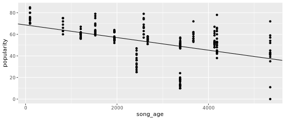
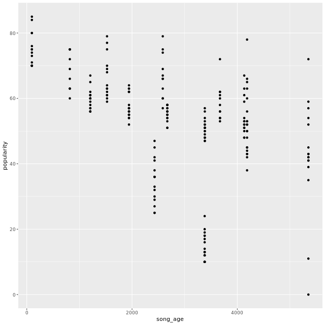
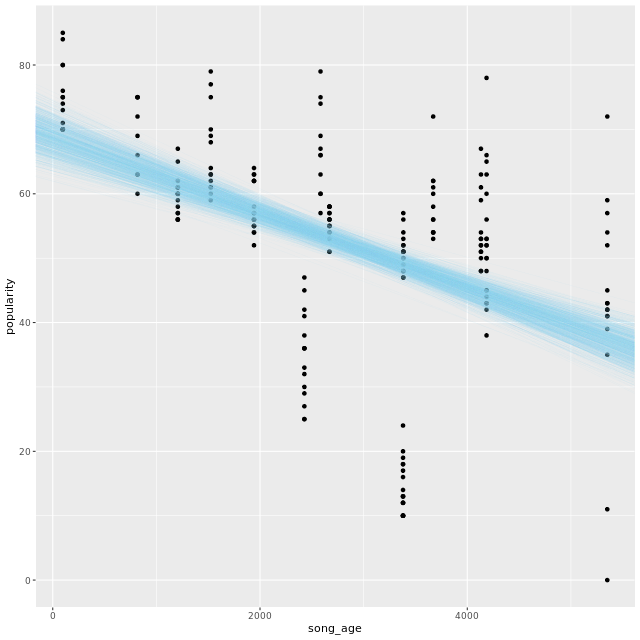
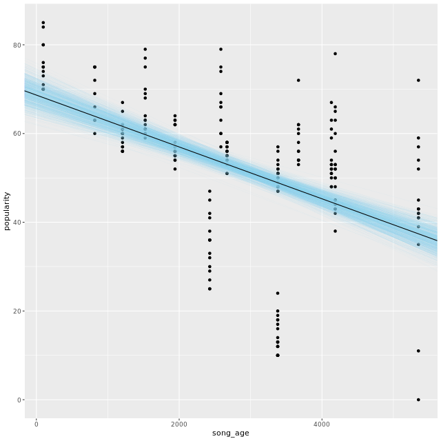
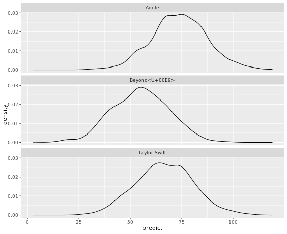

# Chapter 4 - Presenting and Using a Bayesian Regression
## Plotting a Bayesian model

```r

# Save the model parameters
tidy_coef <- tidy(stan_model)

# Extract intercept and slope
model_intercept <- tidy_coef$estimate[1]
model_slope <- tidy_coef$estimate[2]

# Create the plot
ggplot(songs, aes(x = song_age, y = popularity)) +
  geom_point() +
  geom_abline(intercept = model_intercept, slope = model_slope)

```

Output:



***

## Plotting Model Uncertainty

### 1

```r

# Save the values from each draw of the posterior distribution
draws <- spread_draws(stan_model, `(Intercept)`, `song_age`)

# Print the `draws` data frame to the console
draws

```

Output:

```bash

# Print the `draws` data frame to the console
draws
# A tibble: 1,000 x 5
   .chain .iteration .draw `(Intercept)` song_age
    <int>      <int> <int>         <dbl>    <dbl>
 1      1          1     1          65.5 -0.00477
 2      1          2     2          67.6 -0.00546
 3      1          3     3          70.4 -0.00618
 4      1          4     4          69.1 -0.00566
 5      1          5     5          61.9 -0.00432
 6      1          6     6          63.8 -0.00445
 7      1          7     7          69.0 -0.00615
 8      1          8     8          68.5 -0.00557
 9      1          9     9          69.4 -0.00566
10      1         10    10          66.6 -0.00545
# ... with 990 more rows
>

```

### 2

```r

# Save the values from each draw of the posterior distribution
draws <- spread_draws(stan_model, `(Intercept)`, `song_age`)

# Create the plot
ggplot(songs, aes(x = song_age, y = popularity)) +
  geom_point()
```

Output:




### 3

```r

# Save the values from each draw of the posterior distribution
draws <- spread_draws(stan_model, `(Intercept)`, `song_age`)

# Create the plot
ggplot(songs, aes(x = song_age, y = popularity)) +
	geom_point() +
	geom_abline(data = draws, aes(intercept = `(Intercept)`, slope = song_age),
                size = 0.1, alpha = 0.2, color = "skyblue")
```

Output:



### 4

```r

# Save the values from each draw of the posterior distribution
draws <- spread_draws(stan_model, `(Intercept)`, `song_age`)

# Create the plot
ggplot(songs, aes(x = song_age, y = popularity)) +
	geom_point() +
	geom_abline(data = draws, aes(intercept = `(Intercept)`, slope = song_age),
                size = 0.1, alpha = 0.2, color = "skyblue") +
	geom_abline(intercept = model_intercept, slope = model_slope)
  
```

Output:


***

## Popularity for Observed Songs

```r

# Estimate the regression model
stan_model <- stan_glm(popularity ~ song_age + artist_name, data = songs)

# Print the model summary
summary(stan_model)

# Get posteriors of predicted scores for each observation
posteriors <- posterior_predict(stan_model)

# Print 10 predicted scores for 5 songs
posteriors[1:10, 1:5]

```

Output:

```bash

# Estimate the regression model
stan_model <- stan_glm(popularity ~ song_age + artist_name, data = songs)
# Print the model summary
summary(stan_model)

Model Info:
 function:     stan_glm
 family:       gaussian [identity]
 formula:      popularity ~ song_age + artist_name
 algorithm:    sampling
 sample:       1000 (posterior sample size)
 priors:       see help('prior_summary')
 observations: 215
 predictors:   4

Estimates:
                            mean   sd    10%   50%   90%
(Intercept)                73.8    3.0  70.0  73.8  77.7
song_age                    0.0    0.0   0.0   0.0   0.0
artist_nameBeyoncé -19.4    2.9 -23.2 -19.3 -15.6
artist_nameTaylor Swift    -6.6    2.8 -10.2  -6.5  -3.1
sigma                      13.4    0.6  12.6  13.3  14.2

Fit Diagnostics:
           mean   sd   10%   50%   90%
mean_PPD 52.5    1.3 50.9  52.5  54.3 

The mean_ppd is the sample average posterior predictive distribution of the outcome variable (for details see help('summary.stanreg')).

MCMC diagnostics
                          mcse Rhat n_eff
(Intercept)               0.1  1.0   812 
song_age                  0.0  1.0   981 
artist_nameBeyoncé 0.1  1.0   607 
artist_nameTaylor Swift   0.1  1.0   668 
sigma                     0.0  1.0  1014 
mean_PPD                  0.0  1.0   808 
log-posterior             0.1  1.0   374 

For each parameter, mcse is Monte Carlo standard error, n_eff is a crude measure of effective sample size, and Rhat is the potential scale reduction factor on split chains (at convergence Rhat=1).
# Get posteriors of predicted scores for each observation
posteriors <- posterior_predict(stan_model)
# Print 10 predicted scores for 5 songs
posteriors[1:10, 1:5]
             1        2        3        4        5
 [1,] 17.46914 30.08785 17.72675 31.60944 29.24658
 [2,] 39.83186 24.05817 31.68237 31.71318 41.42611
 [3,] 32.38135 17.40279 73.17378 33.81515 33.32722
 [4,] 35.09393 63.19715 27.89605 33.99480 35.35088
 [5,] 22.15076 28.50019 38.02816 31.07715 49.12243
 [6,] 44.08384 35.22214 15.18372 48.27343 58.15500
 [7,] 49.38789 59.00505 36.78425 48.55280 35.32525
 [8,] 49.13213 33.42133 12.31138 63.27161 62.79061
 [9,] 42.67385 58.64308 25.77511 40.25950 27.81686
[10,] 27.04997 24.43449 26.67260 28.02212 33.58651

```

***

## Popularity for New Songs

```r
# Create data frame of new data
predict_data <- data.frame(song_age = 663, artist_name = "Beyoncé")

# Create posterior predictions for Lemonade album
new_predictions <- posterior_predict(stan_model, newdata = predict_data)

# Print first 10 predictions for the new data
new_predictions[1:10,]

# Print a summary of the posterior distribution of predicted popularity
summary(new_predictions[, 1])

```

Output:

```bash

# Create data frame of new data
predict_data <- data.frame(song_age = 663, artist_name = "Beyoncé")
# Create posterior predictions for Lemonade album
new_predictions <- posterior_predict(stan_model, newdata = predict_data)
# Print first 10 predictions for the new data
new_predictions[1:10,]
 [1] 41.36073 54.00650 40.36541 57.63265 58.05184 34.71963 41.42396 70.78077
 [9] 72.99499 44.07136
# Print a summary of the posterior distribution of predicted popularity
summary(new_predictions[, 1])
   Min. 1st Qu.  Median    Mean 3rd Qu.    Max. 
  8.808  42.480  52.040  52.115  61.437  93.781

```

***

## Format prediction posteriors

```r

# View new data predictions
new_predictions[1:10, ]

# Convert to data frame and rename variables
new_predictions <- data.frame(new_predictions)
colnames(new_predictions) <- c("Adele", "Taylor Swift", "Beyoncé")

# Create tidy data structure
plot_posterior <- gather(new_predictions, key = "artist_name", value = "predict")

# Print formated data
head(plot_posterior)

```

Output:

```bash

# View new data predictions
new_predictions[1:10, ]
             1        2        3
 [1,] 68.27328 71.20382 44.99720
 [2,] 79.60502 66.31792 36.42753
 [3,] 64.64074 87.03259 70.04172
 [4,] 65.42589 46.63023 77.19473
 [5,] 78.58974 69.57314 64.07304
 [6,] 86.79833 80.90299 75.42468
 [7,] 76.95109 58.19514 61.89407
 [8,] 91.18109 58.56188 52.35479
 [9,] 67.52289 81.65796 55.79507
[10,] 75.90935 52.76207 74.94122
# Convert to data frame and rename variables
new_predictions <- data.frame(new_predictions)
colnames(new_predictions) <- c("Adele", "Taylor Swift", "Beyoncé")
# Create tidy data structure
plot_posterior <- gather(new_predictions, key = "artist_name", value = "predict")
# Print formated data
head(plot_posterior)
  artist_name  predict
1       Adele 68.27328
2       Adele 79.60502
3       Adele 64.64074
4       Adele 65.42589
5       Adele 78.58974
6       Adele 86.79833

```

***

## Visualize New Predictions

```r

# Create plot of 
ggplot(plot_posterior, aes(x = predict)) +
	facet_wrap(~ artist_name, ncol = 1) +
	geom_density()

```

Output:



***

*End of Chapter 4*


