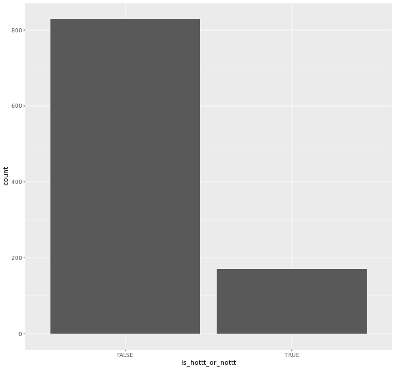
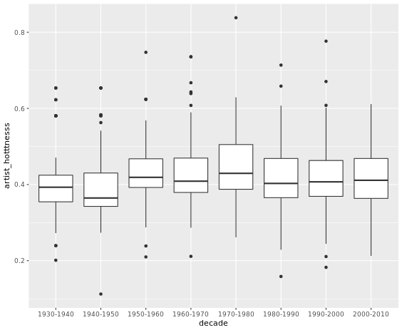
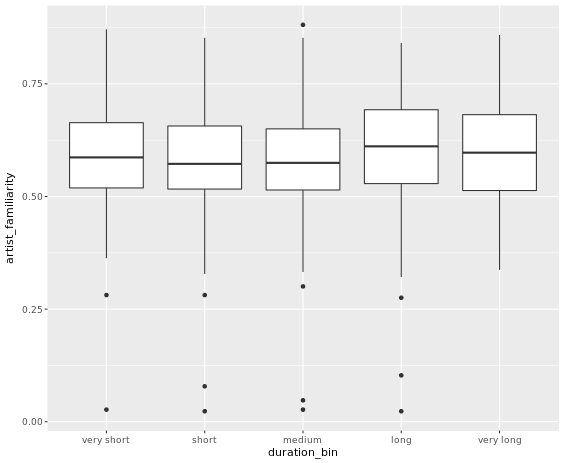

# Chapter 3 - Going Native: Use The Native Interface to Manipulate Spark DataFrames
## Transforming continuous variables to logical


```r
# track_metadata_tbl has been pre-defined
track_metadata_tbl

hotttnesss <- track_metadata_tbl %>%
  # Select artist_hotttnesss
  select(artist_hotttnesss) %>%
  # Binarize to is_hottt_or_nottt
  ft_binarizer("artist_hotttnesss","is_hottt_or_nottt", threshold =0.5) %>%
  # Collect the result
  collect() %>%
  # Convert is_hottt_or_nottt to logical
  mutate(is_hottt_or_nottt = as.logical(is_hottt_or_nottt))

# Draw a barplot of is_hottt_or_nottt
ggplot(hotttnesss, aes(is_hottt_or_nottt)) +
  geom_bar()

```

Output:



***

## Transforming continuous variables into categorical (1)

```r
# track_metadata_tbl, decades, decade_labels have been pre-defined
track_metadata_tbl
decades
decade_labels

hotttnesss_over_time <- track_metadata_tbl %>%
  # Select artist_hotttnesss and year
  select(artist_hotttnesss, year) %>%
  # Convert year to numeric
  mutate(year = as.numeric(year)) %>%
  # Bucketize year to decade using decades vector
  ft_bucketizer("year", "decade", splits = decades ) %>%
  # Collect the result
  collect() %>%
  # Convert decade to factor using decade_labels
  mutate(decade = factor(decade, labels = decade_labels))

# Draw a boxplot of artist_hotttnesss by decade
ggplot(hotttnesss_over_time, aes(decade, artist_hotttnesss)) +
  geom_boxplot()  

```

Output:



***

## Transforming continuous variables into categorical (2)

```r
# track_metadata_tbl, duration_labels have been pre-defined
track_metadata_tbl
duration_labels

familiarity_by_duration <- track_metadata_tbl %>%
  # Select duration and artist_familiarity
  select(duration,artist_familiarity) %>%
  # Bucketize duration
  ft_quantile_discretizer("duration","duration_bin", n.buckets = 5) %>%
  # Collect the result
  collect() %>%
  # Convert duration bin to factor
  mutate(duration_bin = factor(duration_bin, labels = duration_labels))

# Draw a boxplot of artist_familiarity by duration_bin
ggplot(familiarity_by_duration, aes(duration_bin, artist_familiarity)) +
  geom_boxplot()  

```

Output:



***

## More than words: tokenization (1)

```r
# track_metadata_tbl has been pre-defined
track_metadata_tbl

title_text <- track_metadata_tbl %>%
  # Select artist_name, title
  select(artist_name,title) %>%
  # Tokenize title to words
  ft_tokenizer("title", "word") %>%
  # Collect the result
  collect() %>%
  # Flatten the word column 
  mutate(word = lapply(word, as.character)) %>% 
  # Unnest the list column
  unnest(word)

```
Output:

```bash


title_text
# A tibble: 3,248 x 3
   artist_name                     title                   word  
   <chr>                           <chr>                   <chr> 
 1 101 Strings                     The Breeze and I        the   
 2 101 Strings                     The Breeze and I        breeze
 3 101 Strings                     The Breeze and I        and   
 4 101 Strings                     The Breeze and I        i     
 5 John Mayall & The Bluesbreakers Soul Of A Short Fat Man soul  
 6 John Mayall & The Bluesbreakers Soul Of A Short Fat Man of    
 7 John Mayall & The Bluesbreakers Soul Of A Short Fat Man a     
 8 John Mayall & The Bluesbreakers Soul Of A Short Fat Man short 
 9 John Mayall & The Bluesbreakers Soul Of A Short Fat Man fat   
10 John Mayall & The Bluesbreakers Soul Of A Short Fat Man man   
# ... with 3,238 more rows

```

***

## More than words: tokenization (2)

```r
# title_text_tbl, afinn_sentiments_tbl have been pre-defined
title_text_tbl
afinn_sentiments_tbl

sentimental_artists <- title_text_tbl %>%
  # Inner join with sentiments on word field
  inner_join(afinn_sentiments_tbl, by = "word") %>%
  # Group by artist
  group_by(artist_name) %>%
  # Summarize to get positivity
  summarise(positivity = sum(score))

sentimental_artists %>%
  # Arrange by ascending positivity
  arrange(positivity) %>%
  # Get top 5
  top_n(5)

sentimental_artists %>%
  # Arrange by descending positivity
  arrange(desc(positivity)) %>%
  # Get top 5
  top_n(5)

```
Output:

```bash
# title_text_tbl, afinn_sentiments_tbl have been pre-defined
title_text_tbl
# Source:   table<title_text> [?? x 3]
# Database: spark_connection
   artist_name             title                                   word    
   <chr>                   <chr>                                   <chr>   
 1 Charles Mingus          Meditation (For A Pair Of Wire Cutters) of      
 2 Charles Mingus          Meditation (For A Pair Of Wire Cutters) wire    
 3 Charles Mingus          Meditation (For A Pair Of Wire Cutters) cutters)
 4 Barry McGuire           You Were On My Mind                     you     
 5 Barry McGuire           You Were On My Mind                     were    
 6 Barry McGuire           You Were On My Mind                     on      
 7 Barry McGuire           You Were On My Mind                     my      
 8 Barry McGuire           You Were On My Mind                     mind    
 9 The Spencer Davis Group When a Man Loves a Woman                when    
10 The Spencer Davis Group When a Man Loves a Woman                a       
# ... with 3,238 more rows
afinn_sentiments_tbl
# Source:   table<afinn_sentiments> [?? x 2]
# Database: spark_connection
   word        score
   <chr>       <int>
 1 illiteracy     -2
 2 illness        -2
 3 illnesses      -2
 4 imbecile       -3
 5 immobilized    -1
 6 immortal        2
 7 immune          1
 8 impatient      -2
 9 imperfect      -2
10 importance      2
# ... with 2,466 more rows
sentimental_artists <- title_text_tbl %>%
  # Inner join with sentiments on word field
  inner_join(afinn_sentiments_tbl, by = "word") %>%
  # Group by artist
  group_by(artist_name) %>%
  # Summarize to get positivity
  summarise(positivity = sum(score))
sentimental_artists %>%
  # Arrange by ascending positivity
  arrange(positivity) %>%
  # Get top 5
  top_n(5)
Selecting by  positivity
# Source:     lazy query [?? x 2]
# Database:   spark_connection
# Ordered by: positivity
  artist_name       positivity
  <chr>                  <dbl>
1 Percy Mayfield            16
2 Billie Holiday             7
3 Sam Cooke                  7
4 Skip James                 6
5 The Drifters               6
6 Jimmy Witherspoon          6
7 Jimmie Davis               6
8 Nazz                       6
sentimental_artists %>%
  # Arrange by descending positivity
  arrange(desc(positivity)) %>%
  # Get top 5
  top_n(5)
Selecting by  positivity
# Source:     lazy query [?? x 2]
# Database:   spark_connection
# Ordered by: desc(positivity)
  artist_name       positivity
  <chr>                  <dbl>
1 Percy Mayfield            16
2 Billie Holiday             7
3 Sam Cooke                  7
4 Skip James                 6
5 The Drifters               6
6 Jimmy Witherspoon          6
7 Jimmie Davis               6
8 Nazz                       6
>

```

***

## More than words: tokenization (3)


```r
# track_metadata_tbl has been pre-defined
track_metadata_tbl

track_metadata_tbl %>%
  # Select artist_mbid column
  select(artist_mbid) %>%
  # Split it by hyphens
  ft_regex_tokenizer("artist_mbid","artist_mbid_chunks", pattern = "-")
  
```

Output:

```bash
# track_metadata_tbl has been pre-defined
track_metadata_tbl
# Source:   table<track_metadata> [?? x 11]
# Database: spark_connection
   track_id title song_id release artist_id artist_mbid artist_name duration
   <chr>    <chr> <chr>   <chr>   <chr>     <chr>       <chr>          <dbl>
 1 TRSTWXA~ The ~ SOCQMX~ Espana  ARNNU4G1~ 5c176092-c~ 101 Strings     221.
 2 TRQNQZX~ Soul~ SOWULX~ Diary ~ ARJ9DSA1~ 4756395c-5~ John Mayal~     368.
 3 TRTPVEB~ The ~ SOHKYI~ The Bl~ ARQ8CJ61~ 15ab8bb8-7~ Illinois J~     329.
 4 TRZZNFB~ The ~ SOJVHK~ Give M~ ARFAKTH1~ 0174d942-3~ Chairmen O~     193.
 5 TRZAAWN~ Litt~ SORYVB~ Beauti~ ARNMWP51~ 4dca4bb2-2~ Curtis May~     321.
 6 TRRAOAD~ Will~ SODTBY~ Jammys~ ARMDWND1~ 8ee00333-e~ Black Uhuru     179.
 7 TRPGBAO~ Chil~ SOCTEW~ Pure A~ ARBSLZ11~ f940c4dd-f~ Alex de Gr~     162.
 8 TRQLTYD~ Ring~ SONNCT~ Eat To~ ARM7YQQ1~ 4d2956d1-a~ Blondie         210.
 9 TRJNORS~ Chat~ SOGQHH~ Sid Si~ ARBK4PS1~ 637504e3-b~ Sid Vicious     111.
10 TRLSQUC~ Migh~ SOTFGI~ Rockin~ ARRHNLN1~ d86c3c8b-8~ Jelly Roll~     242.
# ... with 990 more rows, and 3 more variables: artist_familiarity <dbl>,
#   artist_hotttnesss <dbl>, year <int>
track_metadata_tbl %>%
  # Select artist_mbid column
  select(artist_mbid) %>%
  # Split it by hyphens
  ft_regex_tokenizer("artist_mbid","artist_mbid_chunks", pattern = "-")
# Source:   table<sparklyr_tmp_111a18afe> [?? x 2]
# Database: spark_connection
   artist_mbid                          artist_mbid_chunks
   <chr>                                <list>            
 1 5c176092-cb4d-4e05-806b-1e9414f2b28c <list [5]>        
 2 4756395c-57ed-4a63-afb2-01117f14dff6 <list [5]>        
 3 15ab8bb8-7348-4377-ab73-b7acdad1459c <list [5]>        
 4 0174d942-39da-4dcd-aa48-d0f3fb4f218d <list [5]>        
 5 4dca4bb2-23ba-4103-97e6-5810311db33a <list [5]>        
 6 8ee00333-ec2c-439b-a619-ae160aca2a15 <list [5]>        
 7 f940c4dd-f687-4c6a-872b-1cce3f78dc0a <list [5]>        
 8 4d2956d1-a3f7-44bb-9a41-67563e1a0c94 <list [5]>        
 9 637504e3-be95-4005-83ee-3ebb91f9fcf9 <list [5]>        
10 d86c3c8b-84d5-44ce-80fa-7cfc537fe5c1 <list [5]>        
# ... with 990 more rows
>

```

***

## Sorting vs. arranging

```r
# track_metadata_tbl has been pre-defined
track_metadata_tbl

# Compare timings of arrange() and sdf_sort()
microbenchmark(
  arranged = track_metadata_tbl %>%
    # Arrange by year, then artist_name, then release, then title
    arrange(year, artist_name, release, title) %>%
    # Collect the result
    collect(),
  sorted = track_metadata_tbl %>%
    # Sort by year, then artist_name, then release, then title
    sdf_sort(c("year","artist_name","release","title")) %>%
    # Collect the result
    collect(),
  times = 5
)

```
Output:

```bash

# track_metadata_tbl has been pre-defined
track_metadata_tbl
# Source:   table<track_metadata> [?? x 11]
# Database: spark_connection
   track_id title song_id release artist_id artist_mbid artist_name duration
   <chr>    <chr> <chr>   <chr>   <chr>     <chr>       <chr>          <dbl>
 1 TRSTWXA~ The ~ SOCQMX~ Espana  ARNNU4G1~ 5c176092-c~ 101 Strings     221.
 2 TRQNQZX~ Soul~ SOWULX~ Diary ~ ARJ9DSA1~ 4756395c-5~ John Mayal~     368.
 3 TRTPVEB~ The ~ SOHKYI~ The Bl~ ARQ8CJ61~ 15ab8bb8-7~ Illinois J~     329.
 4 TRZZNFB~ The ~ SOJVHK~ Give M~ ARFAKTH1~ 0174d942-3~ Chairmen O~     193.
 5 TRZAAWN~ Litt~ SORYVB~ Beauti~ ARNMWP51~ 4dca4bb2-2~ Curtis May~     321.
 6 TRRAOAD~ Will~ SODTBY~ Jammys~ ARMDWND1~ 8ee00333-e~ Black Uhuru     179.
 7 TRPGBAO~ Chil~ SOCTEW~ Pure A~ ARBSLZ11~ f940c4dd-f~ Alex de Gr~     162.
 8 TRQLTYD~ Ring~ SONNCT~ Eat To~ ARM7YQQ1~ 4d2956d1-a~ Blondie         210.
 9 TRJNORS~ Chat~ SOGQHH~ Sid Si~ ARBK4PS1~ 637504e3-b~ Sid Vicious     111.
10 TRLSQUC~ Migh~ SOTFGI~ Rockin~ ARRHNLN1~ d86c3c8b-8~ Jelly Roll~     242.
# ... with 990 more rows, and 3 more variables: artist_familiarity <dbl>,
#   artist_hotttnesss <dbl>, year <int>
# Compare timings of arrange() and sdf_sort()
microbenchmark(
  arranged = track_metadata_tbl %>%
    # Arrange by year, then artist_name, then release, then title
    arrange(year, artist_name, release, title) %>%
    # Collect the result
    collect(),
  sorted = track_metadata_tbl %>%
    # Sort by year, then artist_name, then release, then title
    sdf_sort(c("year","artist_name","release","title")) %>%
    # Collect the result
    collect(),
  times = 5
)
Unit: milliseconds
     expr      min       lq      mean   median        uq      max neval
 arranged 70.07681 73.96621  99.17188 95.50372 114.66852 141.6441     5
   sorted 85.61462 91.22686 100.20810 96.46592  98.53289 129.2002     5

```

***

## Exploring Spark data types

```r
# track_metadata_tbl has been pre-defined
track_metadata_tbl

# Get the schema
(schema <- sdf_schema(track_metadata_tbl))

# Transform the schema
schema %>%
  lapply(function(x) do.call(data_frame, x)) %>%
  bind_rows()

```

Output:

```bash
# track_metadata_tbl has been pre-defined
track_metadata_tbl
# Source:   table<track_metadata> [?? x 11]
# Database: spark_connection
   track_id title song_id release artist_id artist_mbid artist_name duration
   <chr>    <chr> <chr>   <chr>   <chr>     <chr>       <chr>          <dbl>
 1 TRSTWXA~ The ~ SOCQMX~ Espana  ARNNU4G1~ 5c176092-c~ 101 Strings     221.
 2 TRQNQZX~ Soul~ SOWULX~ Diary ~ ARJ9DSA1~ 4756395c-5~ John Mayal~     368.
 3 TRTPVEB~ The ~ SOHKYI~ The Bl~ ARQ8CJ61~ 15ab8bb8-7~ Illinois J~     329.
 4 TRZZNFB~ The ~ SOJVHK~ Give M~ ARFAKTH1~ 0174d942-3~ Chairmen O~     193.
 5 TRZAAWN~ Litt~ SORYVB~ Beauti~ ARNMWP51~ 4dca4bb2-2~ Curtis May~     321.
 6 TRRAOAD~ Will~ SODTBY~ Jammys~ ARMDWND1~ 8ee00333-e~ Black Uhuru     179.
 7 TRPGBAO~ Chil~ SOCTEW~ Pure A~ ARBSLZ11~ f940c4dd-f~ Alex de Gr~     162.
 8 TRQLTYD~ Ring~ SONNCT~ Eat To~ ARM7YQQ1~ 4d2956d1-a~ Blondie         210.
 9 TRJNORS~ Chat~ SOGQHH~ Sid Si~ ARBK4PS1~ 637504e3-b~ Sid Vicious     111.
10 TRLSQUC~ Migh~ SOTFGI~ Rockin~ ARRHNLN1~ d86c3c8b-8~ Jelly Roll~     242.
# ... with 990 more rows, and 3 more variables: artist_familiarity <dbl>,
#   artist_hotttnesss <dbl>, year <int>
# Get the schema
(schema <- sdf_schema(track_metadata_tbl))
$track_id
$track_id$name
[1] "track_id"

$track_id$type
[1] "StringType"


$title
$title$name
[1] "title"

$title$type
[1] "StringType"


$song_id
$song_id$name
[1] "song_id"

$song_id$type
[1] "StringType"


$release
$release$name
[1] "release"

$release$type
[1] "StringType"


$artist_id
$artist_id$name
[1] "artist_id"

$artist_id$type
[1] "StringType"


$artist_mbid
$artist_mbid$name
[1] "artist_mbid"

$artist_mbid$type
[1] "StringType"


$artist_name
$artist_name$name
[1] "artist_name"

$artist_name$type
[1] "StringType"


$duration
$duration$name
[1] "duration"

$duration$type
[1] "DoubleType"


$artist_familiarity
$artist_familiarity$name
[1] "artist_familiarity"

$artist_familiarity$type
[1] "DoubleType"


$artist_hotttnesss
$artist_hotttnesss$name
[1] "artist_hotttnesss"

$artist_hotttnesss$type
[1] "DoubleType"


$year
$year$name
[1] "year"

$year$type
[1] "IntegerType"
# Transform the schema
schema %>%
  lapply(function(x) do.call(data_frame, x)) %>%
  bind_rows()
# A tibble: 11 x 2
   name               type       
   <chr>              <chr>      
 1 track_id           StringType 
 2 title              StringType 
 3 song_id            StringType 
 4 release            StringType 
 5 artist_id          StringType 
 6 artist_mbid        StringType 
 7 artist_name        StringType 
 8 duration           DoubleType 
 9 artist_familiarity DoubleType 
10 artist_hotttnesss  DoubleType 
11 year               IntegerType

```

***

## Shrinking the data by sampling

```r
# track_metadata_tbl has been pre-defined
track_metadata_tbl

track_metadata_tbl %>%
  # Sample the data without replacement
  sdf_sample(fraction = 0.01, replacement = FALSE, seed = 20000229) %>%
  # Compute the result
  compute("sample_track_metadata")

```

Output:

```bash

# track_metadata_tbl has been pre-defined
track_metadata_tbl
# Source:   table<track_metadata> [?? x 11]
# Database: spark_connection
   track_id title song_id release artist_id artist_mbid artist_name duration
   <chr>    <chr> <chr>   <chr>   <chr>     <chr>       <chr>          <dbl>
 1 TRSTWXA~ The ~ SOCQMX~ Espana  ARNNU4G1~ 5c176092-c~ 101 Strings     221.
 2 TRQNQZX~ Soul~ SOWULX~ Diary ~ ARJ9DSA1~ 4756395c-5~ John Mayal~     368.
 3 TRTPVEB~ The ~ SOHKYI~ The Bl~ ARQ8CJ61~ 15ab8bb8-7~ Illinois J~     329.
 4 TRZZNFB~ The ~ SOJVHK~ Give M~ ARFAKTH1~ 0174d942-3~ Chairmen O~     193.
 5 TRZAAWN~ Litt~ SORYVB~ Beauti~ ARNMWP51~ 4dca4bb2-2~ Curtis May~     321.
 6 TRRAOAD~ Will~ SODTBY~ Jammys~ ARMDWND1~ 8ee00333-e~ Black Uhuru     179.
 7 TRPGBAO~ Chil~ SOCTEW~ Pure A~ ARBSLZ11~ f940c4dd-f~ Alex de Gr~     162.
 8 TRQLTYD~ Ring~ SONNCT~ Eat To~ ARM7YQQ1~ 4d2956d1-a~ Blondie         210.
 9 TRJNORS~ Chat~ SOGQHH~ Sid Si~ ARBK4PS1~ 637504e3-b~ Sid Vicious     111.
10 TRLSQUC~ Migh~ SOTFGI~ Rockin~ ARRHNLN1~ d86c3c8b-8~ Jelly Roll~     242.
# ... with 990 more rows, and 3 more variables: artist_familiarity <dbl>,
#   artist_hotttnesss <dbl>, year <int>
track_metadata_tbl %>%
  # Sample the data without replacement
  sdf_sample(fraction = 0.01, replacement = FALSE, seed = 20000229) %>%
  # Compute the result
  compute("sample_track_metadata")
# Source:   table<sample_track_metadata> [?? x 11]
# Database: spark_connection
   track_id title song_id release artist_id artist_mbid artist_name duration
   <chr>    <chr> <chr>   <chr>   <chr>     <chr>       <chr>          <dbl>
 1 TRLLBQO~ As A~ SOXSUM~ Warner~ AREDRYV1~ 6840dcbe-3~ Secos And ~     56.9
 2 TRCRYZP~ All ~ SOLDTB~ Walk A~ ARA1UU51~ 936addc3-9~ The Misfits    107. 
 3 TRXYJTB~ Stup~ SOWHFH~ The Fu~ ARKXBAH1~ 0cf9d983-a~ The Future~     95.0
 4 TRBJQAG~ I'm ~ SONMOG~ To Mum~ AROHGM71~ 4189d03a-8~ Kim Weston     168. 
 5 TRUPFJK~ How ~ SOSABQ~ Nazz V~ ARYWCFZ1~ ""          Nazz           232. 
 6 TRJWBCY~ Tuxe~ SOLPWH~ Tuxedo~ ARV1T931~ 1fd74817-b~ Erskine Ha~    199. 
 7 TRCRVQC~ When~ SORGEZ~ Bowsel~ ARJZKZB1~ 41e2d679-4~ Boswell Si~    190. 
 8 TRBDVYQ~ Kidn~ SOONKH~ The Ve~ ARN0TIW1~ 08d57baf-b~ "Eddie \"C~    206. 
 9 TRGOFOO~ You ~ SOHZTQ~ Mighty~ AR06M3F1~ 8d2651e1-f~ Mississipp~    165. 
10 TRRHLEO~ Cont~ SOKGIQ~ MkII    ARX0VKO1~ 3a787e76-2~ Steamhammer    291. 
# ... with 3 more variables: artist_familiarity <dbl>, artist_hotttnesss <dbl>,
#   year <int>


```

***

## Training/testing partitions

```r
# track_metadata_tbl has been pre-defined
track_metadata_tbl

partitioned <- track_metadata_tbl %>%
  # Partition into training and testing sets
  sdf_partition(training = 0.7, testing = 0.3)

# Get the dimensions of the training set
dim(partitioned[["training"]])

# Get the dimensions of the testing set
dim(partitioned[["testing"]])
```

Output:

```bash

# track_metadata_tbl has been pre-defined
track_metadata_tbl
# Source:   table<track_metadata> [?? x 11]
# Database: spark_connection
   track_id title song_id release artist_id artist_mbid artist_name duration
   <chr>    <chr> <chr>   <chr>   <chr>     <chr>       <chr>          <dbl>
 1 TRSTWXA~ The ~ SOCQMX~ Espana  ARNNU4G1~ 5c176092-c~ 101 Strings     221.
 2 TRQNQZX~ Soul~ SOWULX~ Diary ~ ARJ9DSA1~ 4756395c-5~ John Mayal~     368.
 3 TRTPVEB~ The ~ SOHKYI~ The Bl~ ARQ8CJ61~ 15ab8bb8-7~ Illinois J~     329.
 4 TRZZNFB~ The ~ SOJVHK~ Give M~ ARFAKTH1~ 0174d942-3~ Chairmen O~     193.
 5 TRZAAWN~ Litt~ SORYVB~ Beauti~ ARNMWP51~ 4dca4bb2-2~ Curtis May~     321.
 6 TRRAOAD~ Will~ SODTBY~ Jammys~ ARMDWND1~ 8ee00333-e~ Black Uhuru     179.
 7 TRPGBAO~ Chil~ SOCTEW~ Pure A~ ARBSLZ11~ f940c4dd-f~ Alex de Gr~     162.
 8 TRQLTYD~ Ring~ SONNCT~ Eat To~ ARM7YQQ1~ 4d2956d1-a~ Blondie         210.
 9 TRJNORS~ Chat~ SOGQHH~ Sid Si~ ARBK4PS1~ 637504e3-b~ Sid Vicious     111.
10 TRLSQUC~ Migh~ SOTFGI~ Rockin~ ARRHNLN1~ d86c3c8b-8~ Jelly Roll~     242.
# ... with 990 more rows, and 3 more variables: artist_familiarity <dbl>,
#   artist_hotttnesss <dbl>, year <int>
partitioned <- track_metadata_tbl %>%
  # Partition into training and testing sets
  sdf_partition(training = 0.7, testing = 0.3)
# Get the dimensions of the training set
dim(partitioned[["training"]])
[1] 685  11
# Get the dimensions of the testing set
dim(partitioned[["testing"]])
[1] 315  11


```

***

*End of Chapter 3*
