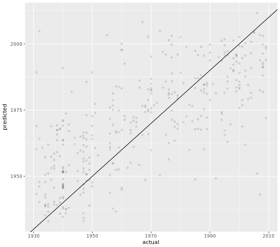
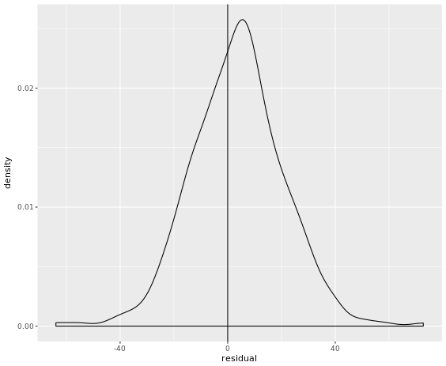
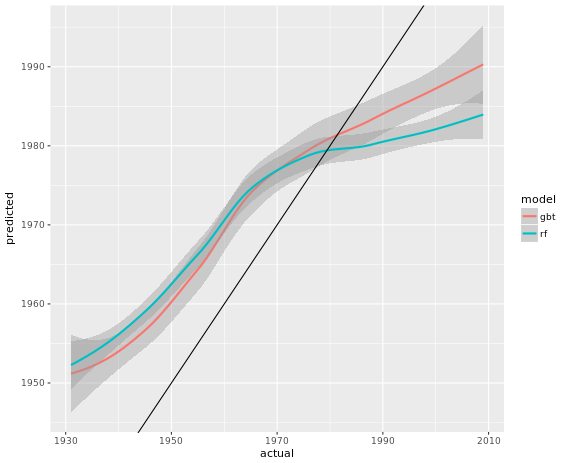
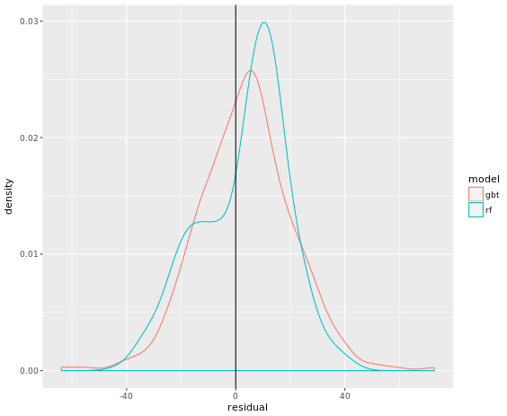

# Chapter 4 - Case Study: Learning to be a Machine: Running Machine Learning Models on Spark
## Machine learning functions

You can see the list of all the machine learning functions using ls()

> ls("package:sparklyr", pattern = "^ml")

```r
a_tibble %>%
  ml_some_model("response", c("a_feature", "another_feature"), some_other_args)

```

What arguments do all the machine learning model functions take?

> A tibble, a string naming the response field, and a character vector naming the explanatory fields.

***

## (Hey you) What's that sound?

```r

# timbre has been pre-defined
timbre

# Calculate column means
(mean_timbre <- colMeans(timbre))

```

Output:

```bash
# Calculate column means
(mean_timbre <- colMeans(timbre))
 [1]  39.244095 -39.408016  41.409616   4.748857  19.444392  22.716039
 [7] -10.596981   6.838041   3.179969   2.454293  -4.799178  12.575696

```

***

***

## Working with parquet files

```r
# parquet_dir has been pre-defined
parquet_dir

# List the files in the parquet dir
filenames <- dir(parquet_dir, full.names = TRUE)

# Show the filenames and their sizes
data_frame(
  filename = basename(filenames),
  size_bytes = file.size(filenames)
)

# Import the data into Spark
timbre_tbl <- spark_read_parquet(spark_conn, "timbre", parquet_dir)

```

Output:

```bash
parquet_dir
[1] "/usr/local/share/datasets/timbre_parquet"
# parquet_dir has been pre-defined
parquet_dir
[1] "/usr/local/share/datasets/timbre_parquet"
# List the files in the parquet dir
filenames <- dir(parquet_dir, full.names = TRUE)
# Show the filenames and their sizes
data_frame(
  filename = basename(filenames),
  size_bytes = file.size(filenames)
)
# A tibble: 2 x 2
  filename                                                         size_bytes
  <chr>                                                                 <dbl>
1 _SUCCESS                                                                  0
2 part-r-00000-720803dc-75ed-4df7-b134-e6fdd8da5f0b.snappy.parquet     112774
# Import the data into Spark
timbre_tbl <- spark_read_parquet(spark_conn, "timbre", parquet_dir)

```
***

## Come together

```r

# track_metadata_tbl, timbre_tbl pre-defined
track_metadata_tbl
timbre_tbl

track_metadata_tbl %>%
  # Inner join to timbre_tbl
  inner_join(timbre_tbl, by = "track_id") %>%
  # Convert year to numeric
  mutate(year = as.numeric(year))
  
```

Output:

```bash

# track_metadata_tbl, timbre_tbl pre-defined
track_metadata_tbl
# Source:   table<track_metadata> [?? x 11]
# Database: spark_connection
   track_id title song_id release artist_id artist_mbid artist_name duration
   <chr>    <chr> <chr>   <chr>   <chr>     <chr>       <chr>          <dbl>
 1 TRSTWXA~ The ~ SOCQMX~ Espana  ARNNU4G1~ 5c176092-c~ 101 Strings     221.
 2 TRQNQZX~ Soul~ SOWULX~ Diary ~ ARJ9DSA1~ 4756395c-5~ John Mayal~     368.
 3 TRTPVEB~ The ~ SOHKYI~ The Bl~ ARQ8CJ61~ 15ab8bb8-7~ Illinois J~     329.
 4 TRZZNFB~ The ~ SOJVHK~ Give M~ ARFAKTH1~ 0174d942-3~ Chairmen O~     193.
 5 TRZAAWN~ Litt~ SORYVB~ Beauti~ ARNMWP51~ 4dca4bb2-2~ Curtis May~     321.
 6 TRRAOAD~ Will~ SODTBY~ Jammys~ ARMDWND1~ 8ee00333-e~ Black Uhuru     179.
 7 TRPGBAO~ Chil~ SOCTEW~ Pure A~ ARBSLZ11~ f940c4dd-f~ Alex de Gr~     162.
 8 TRQLTYD~ Ring~ SONNCT~ Eat To~ ARM7YQQ1~ 4d2956d1-a~ Blondie         210.
 9 TRJNORS~ Chat~ SOGQHH~ Sid Si~ ARBK4PS1~ 637504e3-b~ Sid Vicious     111.
10 TRLSQUC~ Migh~ SOTFGI~ Rockin~ ARRHNLN1~ d86c3c8b-8~ Jelly Roll~     242.
# ... with 990 more rows, and 3 more variables: artist_familiarity <dbl>,
#   artist_hotttnesss <dbl>, year <int>
timbre_tbl
# Source:   table<timbre> [?? x 13]
# Database: spark_connection
   track_id timbre_means1 timbre_means2 timbre_means3 timbre_means4
   <chr>            <dbl>         <dbl>         <dbl>         <dbl>
 1 TRDPMEU~          37.3         -70.2         39.4         12.7  
 2 TRDVOZX~          33.3        -137.          54.5          3.59 
 3 TRDOAKS~          37.9         -17.8         54.8          3.61 
 4 TRDXVNB~          35.7        -142.          72.6         -2.23 
 5 TROHHLM~          29.1        -135.          52.2         -0.671
 6 TROHBNM~          37.4         -89.8         47.5          6.17 
 7 TROZOWG~          30.8         -34.6         71.1         10.5  
 8 TROADRE~          38.6        -108.          93.4         13.7  
 9 TROPIBX~          38.1          18.9         -2.48       -10.9  
10 TROTQNF~          32.1        -111.          39.8          6.93 
# ... with 990 more rows, and 8 more variables: timbre_means5 <dbl>,
#   timbre_means6 <dbl>, timbre_means7 <dbl>, timbre_means8 <dbl>,
#   timbre_means9 <dbl>, timbre_means10 <dbl>, timbre_means11 <dbl>,
#   timbre_means12 <dbl>
track_metadata_tbl %>%
  # Inner join to timbre_tbl
  inner_join(timbre_tbl, by = "track_id") %>%
  # Convert year to numeric
  mutate(year = as.numeric(year))
# Source:   lazy query [?? x 23]
# Database: spark_connection
   track_id title song_id release artist_id artist_mbid artist_name duration
   <chr>    <chr> <chr>   <chr>   <chr>     <chr>       <chr>          <dbl>
 1 TRDVOZX~ Jers~ SOKMEH~ Backwa~ ARDNQ0R1~ dbfd61ef-f~ Lonnie Joh~     178.
 2 TRYKNRH~ She'~ SOVEME~ Roosev~ ARFUFNK1~ 99ab25d6-7~ Roosevelt ~     174.
 3 TRTDSZA~ Blue~ SOGJBO~ Tampa ~ AR576O51~ 1b62df85-0~ Tampa Red       200.
 4 TRKYOZL~ Drop~ SOEIMR~ 1935-1~ ARE2QID1~ 3bef5827-7~ Sleepy Joh~     191.
 5 TRKIDHY~ Penn~ SOHBKZ~ Film F~ ARRL2QH1~ 2437980f-5~ Bing Crosby     192.
 6 TRWVMJQ~ Old ~ SOWJQM~ Tennes~ AR9HABI1~ aff932c2-e~ Red Foley       196.
 7 TRPNSUE~ Summ~ SODXPG~ Begin ~ ARVYGOU1~ e0e03d5f-9~ Artie Shaw~     206.
 8 TRXBTVP~ Devi~ SODACR~ Rhythm~ ARL99WU1~ f205743d-4~ Skip James      179.
 9 TRYGLKZ~ Milk~ SOBJTI~ Kokomo~ ARR6H6G1~ 74a64e96-4~ Kokomo Arn~     193.
10 TROTQNF~ Stra~ SOJXRG~ Blues ~ ARNEL2O1~ 882af819-8~ Bukka White     159.
# ... with 104 more rows, and 15 more variables: artist_familiarity <dbl>,
#   artist_hotttnesss <dbl>, timbre_means1 <dbl>, timbre_means2 <dbl>,
#   timbre_means3 <dbl>, timbre_means4 <dbl>, timbre_means5 <dbl>,
#   timbre_means6 <dbl>, timbre_means7 <dbl>, timbre_means8 <dbl>,
#   timbre_means9 <dbl>, timbre_means10 <dbl>, timbre_means11 <dbl>,
#   timbre_means12 <dbl>, year <dbl>

```

***

## Partitioning data with a group effect

```r
# track_data_tbl has been pre-defined
track_data_tbl

training_testing_artist_ids <- track_data_tbl %>%
  # Select the artist ID
  select(artist_id) %>%
  # Get distinct rows
  distinct() %>%
  # Partition into training/testing sets
  sdf_partition(training = 0.7, testing = 0.3)

track_data_to_model_tbl <- track_data_tbl %>%
  # Inner join to training partition
  inner_join(training_testing_artist_ids[["training"]], by = "artist_id")

track_data_to_predict_tbl <- track_data_tbl %>%
  # Inner join to testing partition
  inner_join(training_testing_artist_ids[["testing"]], by = "artist_id")

```

***

## Gradient boosted trees: modeling

Gradient boosting is a technique to improve the performance of other models. The idea is that you run a weak but easy to calculate model. Then you replace the response values with the residuals from that model, and fit another model. By "adding" the original response prediction model and the new residual prediction model, you get a more accurate model. You can repeat this process over and over, running new models to predict the residuals of the previous models, and adding the results in. With each iteration, the model becomes stronger and stronger.


```r
# track_data_to_model_tbl has been pre-defined
track_data_to_model_tbl

feature_colnames <- track_data_to_model_tbl %>%
  # Get the column names
  colnames() %>%
  # Limit to the timbre columns
  str_subset(pattern= fixed("timbre"))

gradient_boosted_trees_model <- track_data_to_model_tbl %>%
  # Run the gradient boosted trees model
  ml_gradient_boosted_trees(features =feature_colnames, response = "year" )

```


Output:

```bash
# track_data_to_model_tbl has been pre-defined
track_data_to_model_tbl
# Source:   table<track_data> [?? x 14]
# Database: spark_connection
   artist_id  year timbre_means1 timbre_means2 timbre_means3 timbre_means4
   <chr>     <int>         <dbl>         <dbl>         <dbl>         <dbl>
 1 ARDNQ0R1~  1940          37.3         -70.2         39.4          12.7 
 2 ARDNQ0R1~  1940          33.3        -137.          54.5           3.59
 3 AR3MHG01~  1937          37.9         -17.8         54.8           3.61
 4 ARR6H6G1~  1934          30.8         -34.6         71.1          10.5 
 5 ARE2QID1~  1935          38.1          18.9         -2.48        -10.9 
 6 ARDNQ0R1~  1938          32.6        -118.          26.8          42.3 
 7 ARFUFNK1~  1938          35.8         -55.4         28.8          -8.34
 8 ARFUFNK1~  1938          43.0         -14.5          6.40        -15.3 
 9 ARDNQ0R1~  1938          32.7        -118.          27.1          43.7 
10 ARE2QID1~  1938          32.9        -136.          21.6         -11.0 
# ... with 646 more rows, and 8 more variables: timbre_means5 <dbl>,
#   timbre_means6 <dbl>, timbre_means7 <dbl>, timbre_means8 <dbl>,
#   timbre_means9 <dbl>, timbre_means10 <dbl>, timbre_means11 <dbl>,
#   timbre_means12 <dbl>
feature_colnames <- track_data_to_model_tbl %>%
  # Get the column names
  colnames() %>%
  # Limit to the timbre columns
  str_subset(pattern= fixed("timbre"))
gradient_boosted_trees_model <- track_data_to_model_tbl %>%
  # Run the gradient boosted trees model
  ml_gradient_boosted_trees(features =feature_colnames, response = "year" )
* No rows dropped by 'na.omit' call

```

***

## Gradient boosted trees: prediction

```r

# training, testing sets & model are pre-defined
track_data_to_model_tbl
track_data_to_predict_tbl
gradient_boosted_trees_model

responses <- track_data_to_predict_tbl %>%
  # Select the year column
  select(year) %>%
  # Collect the results
  collect() %>%
  # Add in the predictions
  mutate(
    predicted_year = predict(
      gradient_boosted_trees_model,
      track_data_to_predict_tbl
    )
  )
  
```

***

## Gradient boosted trees: visualization

```r

# responses has been pre-defined
responses

# Draw a scatterplot of predicted vs. actual
ggplot(responses, aes(actual, predicted)) +
  # Add the points
  geom_point(alpha = 0.1) +
  # Add a line at actual = predicted
  geom_abline(intercept = 0, slope = 1)

residuals <- responses %>%
  # Transmute response data to residuals
  transmute(residual = predicted - actual)

# Draw a density plot of residuals
ggplot(residuals, aes(residual)) +
    # Add a density curve
    geom_density() +
    # Add a vertical line through zero
    geom_vline(xintercept = 0)
    
```

Output:





***

## Random Forest: modeling

```r
# track_data_to_model_tbl has been pre-defined
track_data_to_model_tbl

# Get the timbre columns
feature_colnames <- track_data_to_model_tbl %>%
    colnames() %>%
    str_subset(pattern = fixed("timbre"))

# Run the random forest model
random_forest_model <- track_data_to_model_tbl %>%
    ml_random_forest(features = feature_colnames, response = "year")

```
***
## Random Forest: prediction

```r

# training, testing sets & model are pre-defined
track_data_to_model_tbl
track_data_to_predict_tbl
random_forest_model

# Create a response vs. actual dataset
responses <- track_data_to_predict_tbl %>%
    select(year) %>%
    collect() %>%
    mutate(
    predicted_year = predict(
      random_forest_model,
      track_data_to_predict_tbl
    )
  )
```

***

## Random Forest: visualization

```r

# both_responses has been pre-defined
both_responses

# Draw a scatterplot of predicted vs. actual
ggplot(both_responses, aes(actual, predicted, color = model)) +
  # Add a smoothed line
  geom_smooth() +
  # Add a line at actual = predicted
  geom_abline(intercept = 0, slope = 1)

# Create a tibble of residuals
residuals <- both_responses %>%
  mutate(residual = predicted - actual)

# Draw a density plot of residuals
ggplot(residuals, aes(residual, color = model)) +
    # Add a density curve
    geom_density() +
    # Add a vertical line through zero
    geom_vline(xintercept = 0)

```

Output:






***

## Comparing model performance

```r

# both_responses has been pre-defined
both_responses

# Create a residual sum of squares dataset
both_responses %>%
    mutate(residual = predicted - actual) %>%
    group_by(model) %>%
    summarize(rmse = sqrt(mean(residual^2)))
    
```

Output:

```bash

# both_responses has been pre-defined
both_responses
# A tibble: 730 x 3
   actual model predicted
    <int> <chr>     <dbl>
 1   1940 gbt       1952.
 2   1934 gbt       1951.
 3   1931 gbt       1969.
 4   1939 gbt       1940.
 5   1940 gbt       1951.
 6   1935 gbt       1938.
 7   1940 gbt       1954.
 8   1936 gbt       1949.
 9   1936 gbt       1969.
10   1940 gbt       1952.
# ... with 720 more rows
# Create a residual sum of squares dataset
both_responses %>%
    mutate(residual = predicted - actual) %>%
    group_by(model) %>%
    summarize(rmse = sqrt(mean(residual^2)))
# A tibble: 2 x 2
  model  rmse
  <chr> <dbl>
1 gbt    17.7
2 rf     16.4


```

*End of Chapter 4*
