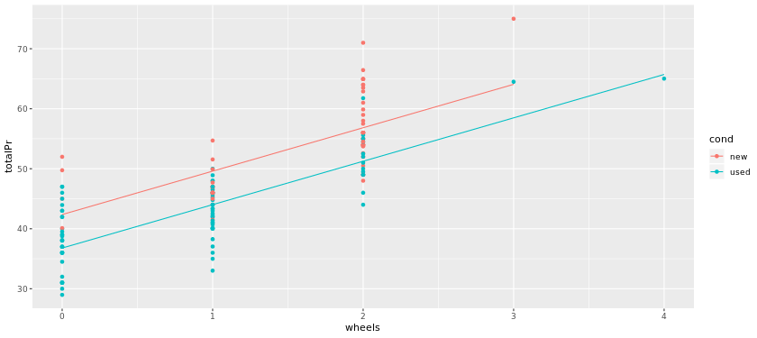

# Multiple and Logistic Regression in R

## Fitting a parallel slopes model

One numertical exp var and one categorical exp var.

> Parrallel lines with different intercepts.


```r

# Explore the data
glimpse(mario_kart)

# fit parallel slopes
lm(formula  = totalPr ~ wheels + factor(cond), data = mario_kart)

```

Output:

```bash

> # Explore the data
> glimpse(mario_kart)
Observations: 141
Variables: 12
$ ID         <dbl> 150377422259, 260483376854, 320432342985, 280405224677, ...
$ duration   <int> 3, 7, 3, 3, 1, 3, 1, 1, 3, 7, 1, 1, 1, 1, 7, 7, 3, 3, 1,...
$ nBids      <int> 20, 13, 16, 18, 20, 19, 13, 15, 29, 8, 15, 15, 13, 16, 6...
$ cond       <fct> new, used, new, new, new, new, used, new, used, used, ne...
$ startPr    <dbl> 0.99, 0.99, 0.99, 0.99, 0.01, 0.99, 0.01, 1.00, 0.99, 19...
$ shipPr     <dbl> 4.00, 3.99, 3.50, 0.00, 0.00, 4.00, 0.00, 2.99, 4.00, 4....
$ totalPr    <dbl> 51.55, 37.04, 45.50, 44.00, 71.00, 45.00, 37.02, 53.99, ...
$ shipSp     <fct> standard, firstClass, firstClass, standard, media, stand...
$ sellerRate <int> 1580, 365, 998, 7, 820, 270144, 7284, 4858, 27, 201, 485...
$ stockPhoto <fct> yes, yes, no, yes, yes, yes, yes, yes, yes, no, yes, yes...
$ wheels     <int> 1, 1, 1, 1, 2, 0, 0, 2, 1, 1, 2, 2, 2, 2, 1, 0, 1, 1, 2,...
$ title      <fct> "~~ Wii MARIO KART &amp; WHEEL ~ NINTENDO Wii ~ BRAND NE...
> 
> # fit parallel slopes
> lm(formula  = totalPr ~ wheels + factor(cond), data = mario_kart)

Call:
lm(formula = totalPr ~ wheels + factor(cond), data = mario_kart)

Coefficients:
     (Intercept)            wheels  factor(cond)used  
          42.370             7.233            -5.585
> 


```

***

## Using geom_line() and augment()

Parallel slopes models are so-named because we can visualize these models in the data space as not one line, but two parallel lines.


```r
# Augment the model
augmented_mod <- augment(mod)
glimpse(augmented_mod)

# scatterplot, with color
data_space <- ggplot(data = augment(mod), aes(x = wheels, y = totalPr, color = cond)) + 
  geom_point()
  
# single call to geom_line()
data_space + 
  geom_line(aes(y = .fitted))
  
```

Output:

```bash

# Augment the model
augmented_mod <- augment(mod)
glimpse(augmented_mod)

# scatterplot, with color
data_space <- ggplot(data = augment(mod), aes(x = wheels, y = totalPr, color = cond)) + 
  geom_point()
  
# single call to geom_line()
data_space + 
  geom_line(aes(y = .fitted))
  
```



***

## Syntax from math

```r

# build model
lm(formula = bwt ~ age + parity, data = babies)

```


Output:

```bash

> # build model
> lm(formula = bwt ~ age + parity, data = babies)

Call:
lm(formula = bwt ~ age + parity, data = babies)

Coefficients:
(Intercept)          age       parity  
  118.27782      0.06315     -1.65248
> 

```


