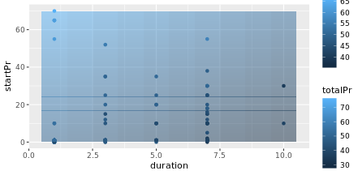
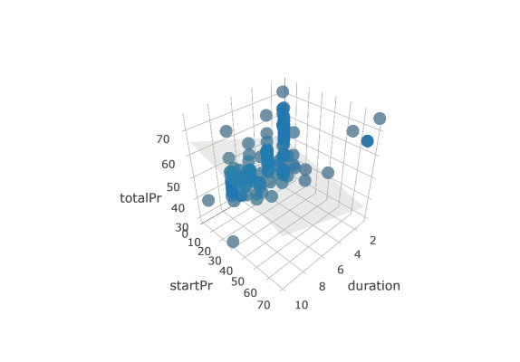

# Multiple Regression
## Fitting a MLR model

```r

# Fit the model using duration and startPr
lm(formula = totalPr ~ duration + startPr, data = mario_kart)

```

Output:

```bash

> # Fit the model using duration and startPr
> lm(formula = totalPr ~ duration + startPr, data = mario_kart)

Call:
lm(formula = totalPr ~ duration + startPr, data = mario_kart)

Coefficients:
(Intercept)     duration      startPr  
     51.030       -1.508        0.233
> 


```

***

## Tiling the plane

Creating heat map

create a grid of the possible pairs of values of the explanatory variables. 
Use augment() with the newdata argument to find the y^'s corresponding to the values in grid.
Add these to the data_space plot by using the fill aesthetic and geom_tile().


```r

# add predictions to grid
price_hats <- augment(mod, newdata = grid)

# tile the plane
data_space + 
  geom_tile(data = price_hats, aes(fill = .fitted), alpha = 0.5)


```

Output:



***

## Models in 3D

* x: a vector of unique values of duration
* y: a vector of unique values of startPr
* plane: a matrix of the fitted values across all combinations of x and y

```r

# draw the 3D scatterplot
p <- plot_ly(data = mario_kart, z = ~totalPr, x = ~duration, y = ~startPr, opacity = 0.6) %>%
  add_markers() 
  
# draw the plane
p %>%
  add_surface(x = ~x, y = ~y, z = ~plane, showscale = FALSE)
  
```

Output:



