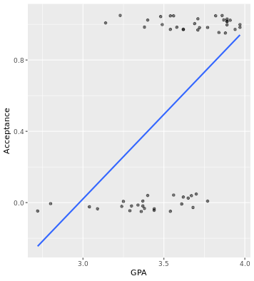

# Chapter 4 - Logistic Regression

## Fitting a line to a binary response


```r

# scatterplot with jitter
data_space <- ggplot(MedGPA, aes(x = GPA , y = Acceptance)) + 
  geom_jitter(width = 0, height = 0.05, alpha = 0.5)

# linear regression line
data_space + 
  geom_smooth(method = "lm", se = FALSE)

```

Output:


