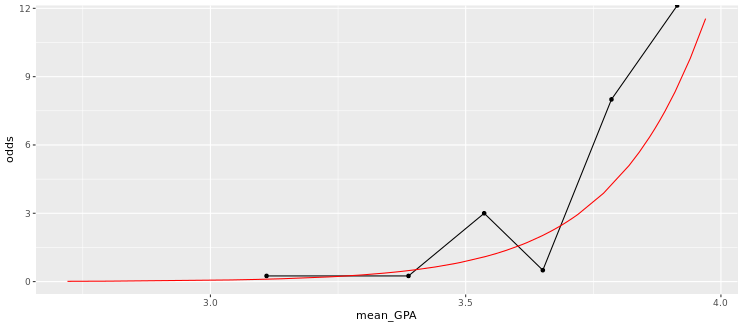
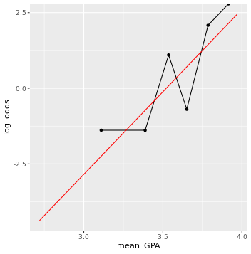

# Chapter 4 - Logistic Regression

## Fitting a line to a binary response


```r

# scatterplot with jitter
data_space <- ggplot(MedGPA, aes(x = GPA , y = Acceptance)) + 
  geom_jitter(width = 0, height = 0.05, alpha = 0.5)

# linear regression line
data_space + 
  geom_smooth(method = "lm", se = FALSE)

```

Output:


***

## Fitting a line to a binary response (2)

* limitation to fitting a linear regression model when we have a binary response variable


```r

# filter
MedGPA_middle <- filter(MedGPA, GPA >= 3.375 & GPA <= 3.77)

# scatterplot with jitter
data_space <- ggplot(MedGPA_middle, aes(x = GPA, y = Acceptance)) + 
  geom_jitter(width = 0, height = 0.05, alpha = 0.5)

# linear regression line
data_space + 
  geom_smooth(method = "lm", se = FALSE)
  

```

Output:


***

## Fitting a model

Logistic regression is a special case of a broader class of generalized linear models, often known as GLMs.


```r

# fit model
glm(Acceptance ~ GPA, data = MedGPA, family = binomial)


```

Output:

```bash

> # fit model
> glm(Acceptance ~ GPA, data = MedGPA, family = binomial)

Call:  glm(formula = Acceptance ~ GPA, family = binomial, data = MedGPA)

Coefficients:
(Intercept)          GPA  
    -19.207        5.454  

Degrees of Freedom: 54 Total (i.e. Null);  53 Residual
Null Deviance:	    75.79 
Residual Deviance: 56.84 	AIC: 60.84
> 

```

***

## Using geom_smooth()

```r

# scatterplot with jitter
data_space <- ggplot(MedGPA, aes(x= GPA, y=Acceptance)) + 
  geom_jitter(width = 0, height = 0.05, alpha = .5)

# add logistic curve
data_space +
  geom_smooth(method = "glm", se= FALSE, method.args = list(family = "binomial"))
  

```

Output:


***

## Using bins


Put the observations into bins based on their GPA value. Within each bin, we can compute the proportion of accepted students, and we can visualize our model as a smooth logistic curve through those binned values.


```r

# binned points and line
data_space <- ggplot(MedGPA_binned, aes(x = mean_GPA, y = acceptance_rate )) + geom_point()+ geom_line()

# augmented model
MedGPA_plus <- augment(mod, type.predict = "response")

# logistic model on probability scale
data_space + geom_line(data = MedGPA_plus, aes(x = GPA, y = .fitted), color = "red")

```

Output:


***

## Odds scale


If the probability of getting accepted is `y`, then the odds are `y/(1−y)`. 
Here we are plotting `y/(1−y)` as a function of `x`, where that function is


```r

# compute odds for bins
MedGPA_binned <- MedGPA_binned %>%
                    mutate(odds = acceptance_rate/(1- acceptance_rate))
                  

# plot binned odds
data_space <- ggplot(MedGPA_binned, aes(x = mean_GPA, y=odds)) + geom_point() + geom_line()

# compute odds for observations
MedGPA_plus <- MedGPA_plus %>%
                mutate(odds_hat = .fitted/(1- .fitted))

# logistic model on odds scale
data_space +
  geom_line(data = MedGPA_plus, aes(x = GPA, y= odds_hat), color = "red")
  
```

Output:



***


## Log-odds scale

```r

# compute log odds for bins
MedGPA_binned <- MedGPA_binned %>%
  mutate(log_odds = log(acceptance_rate/(1-acceptance_rate)))

# plot binned log odds
data_space <- ggplot(MedGPA_binned, aes(x= mean_GPA, y= log_odds)) + geom_point() + geom_line()

# compute log odds for observations
MedGPA_plus <- MedGPA_plus %>%
                mutate(log_odds_hat = log(.fitted/(1- .fitted)))

# logistic model on log odds scale
data_space +
  geom_line(data = MedGPA_plus, aes(x = GPA, y= log_odds_hat), color = "red")
  
```

Output:



***


