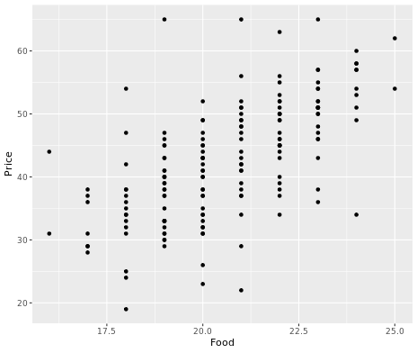
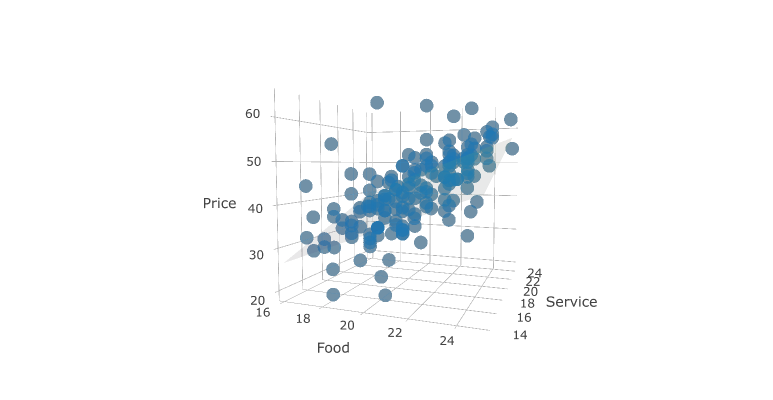

# Case Study: Italian restaurants in NYC
## Exploratory data analysis

Quick technique for jump-starting EDA is to examine all of the pairwise scatterplots in your data. 
This can be achieved using the `pairs()`

```r

pairs(nyc)

```


Output:


## SLR models


```r

# Price by Food plot
ggplot(nyc, aes(x= Food, y = Price)) + geom_point()

# Price by Food model
lm(Price ~ Food, data = nyc)

```


Output:

```bash

> # Price by Food plot
> ggplot(nyc, aes(x= Food, y = Price)) + geom_point()
> 
> # Price by Food model
> lm(Price ~ Food, data = nyc)

Call:
lm(formula = Price ~ Food, data = nyc)

Coefficients:
(Intercept)         Food  
    -17.832        2.939
> 


```


## Parallel lines with location

```bash

> lm(Price ~ Food + East, data = nyc)

Call:
lm(formula = Price ~ Food + East, data = nyc)

Coefficients:
(Intercept)         Food         East  
    -17.430        2.875        1.459
> 

```
***

## A plane in 3D

```r

# fit model
lm(Price ~ Food + Service, data = nyc)

# draw 3D scatterplot
p <- plot_ly(data = nyc, z = ~Price, x = ~Food, y = ~Service, opacity = 0.6) %>%
  add_markers() 

# draw a plane
p %>%
  add_surface(x = ~x, y = ~y, z = ~plane, showscale = FALSE) 
  
```

Output:



***

## Higher dimensions

## Parallel planes with location

```r

# Price by Food and Service and East
lm(Price ~ Food + Service + East, data = nyc)

```

Output:

```bash

> # Price by Food and Service and East
> lm(Price ~ Food + Service + East, data = nyc)

Call:
lm(formula = Price ~ Food + Service + East, data = nyc)

Coefficients:
(Intercept)         Food      Service         East  
   -20.8155       1.4863       1.6647       0.9649
> 

```
***

## Impact of location

```r

# draw 3D scatterplot
p <- plot_ly(data = nyc, z = ~Price, x = ~Food, y = ~Service, opacity = 0.6) %>%
  add_markers(color = ~factor(East)) 

# draw two planes
p %>%
  add_surface(x = ~x, y = ~y, z = ~plane0, showscale = FALSE) %>%
  add_surface(x = ~x, y = ~y, z = ~plane1, showscale = FALSE)
  
```

Output:


***

## Full model

```bash
> lm(Price ~ Food + Service + Decor + East, data = nyc)

Call:
lm(formula = Price ~ Food + Service + Decor + East, data = nyc)

Coefficients:
(Intercept)         Food      Service        Decor         East  
 -24.023800     1.538120    -0.002727     1.910087     2.068050
> 

```


