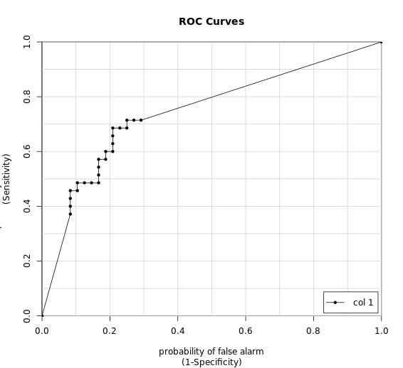

# Chapter 2 - Classification models: fitting them and evaluating their performance
## Try a 60/40 split

```r

# Get the number of observations
n_obs <- nrow(Sonar)

# Shuffle row indices: permuted_rows
permuted_rows <- sample(n_obs)
 
# Randomly order data: Sonar - Sonar_shuffled
Sonar_shuffled <- Sonar[permuted_rows,]

# Identify row to split on: split
split <- round(n_obs * 0.6)

# Create train
train <- Sonar_shuffled[1:split,]

# Create test
test <- Sonar_shuffled[(split + 1):nrow(Sonar_shuffled),]

```

***

## Fit a logistic regression model


```r

# Fit glm model: model
model <- glm(Class ~ .,family = "binomial", train)

# Predict on test: p
p <-  predict(model, test, type = "response")

```
***

## Calculate a confusion matrix

Before you make your confusion matrix, you need to "cut" your predicted probabilities at a given threshold to turn probabilities into a factor of class predictions. Combine ifelse() with factor() as follows:

```r
pos_or_neg <- ifelse(probability_prediction > threshold, positive_class, negative_class)
p_class <- factor(pos_or_neg, levels = levels(test_values))

confusionMatrix(p_class, test_values)

```

```r

# If p exceeds threshold of 0.5, M else R: m_or_r
m_or_r <- ifelse( p > 0.5, "M","R")

# Convert to factor: p_class

p_class <- factor(m_or_r, levels = levels(test[["Class"]]))

# Create confusion matrix
confusionMatrix(p_class, test[["Class"]])

```

Output:

```bash

> # If p exceeds threshold of 0.5, M else R: m_or_r
> m_or_r <- ifelse( p > 0.5, "M","R")
> 
> # Convert to factor: p_class
> 
> p_class <- factor(m_or_r, levels = levels(test[["Class"]]))
> 
> # Create confusion matrix
> confusionMatrix(p_class, test[["Class"]])
Confusion Matrix and Statistics

          Reference
Prediction  M  R
         M 40 17
         R  8 18
                                          
               Accuracy : 0.6988          
                 95% CI : (0.5882, 0.7947)
    No Information Rate : 0.5783          
    P-Value [Acc > NIR] : 0.01616         
                                          
                  Kappa : 0.3602          
                                          
 Mcnemar's Test P-Value : 0.10960         
                                          
            Sensitivity : 0.8333          
            Specificity : 0.5143          
         Pos Pred Value : 0.7018          
         Neg Pred Value : 0.6923          
             Prevalence : 0.5783          
         Detection Rate : 0.4819          
   Detection Prevalence : 0.6867          
      Balanced Accuracy : 0.6738          
                                          
       'Positive' Class : M
> 


```
***

## Probabilities and classes
The relationship between the predicted probabilities and the predicted classes
> Predicted classes are based off of predicted probabilities plus a classification threshold.


## Try another threshold

```r
# If p exceeds threshold of 0.9, M else R: m_or_r
m_or_r <- ifelse(p > 0.9, "M","R")

# Convert to factor: p_class
p_class <- factor(m_or_r, levels = levels(test[["Class"]]))

# Create confusion matrix
confusionMatrix(p_class, test[["Class"]])

```
Output:

```bash

> # If p exceeds threshold of 0.9, M else R: m_or_r
> m_or_r <- ifelse(p > 0.9, "M","R")
> 
> # Convert to factor: p_class
> p_class <- factor(m_or_r, levels = levels(test[["Class"]]))
> 
> # Create confusion matrix
> confusionMatrix(p_class, test[["Class"]])
Confusion Matrix and Statistics

          Reference
Prediction  M  R
         M 40 15
         R  8 20
                                          
               Accuracy : 0.7229          
                 95% CI : (0.6138, 0.8155)
    No Information Rate : 0.5783          
    P-Value [Acc > NIR] : 0.004583        
                                          
                  Kappa : 0.416           
                                          
 Mcnemar's Test P-Value : 0.210903        
                                          
            Sensitivity : 0.8333          
            Specificity : 0.5714          
         Pos Pred Value : 0.7273          
         Neg Pred Value : 0.7143          
             Prevalence : 0.5783          
         Detection Rate : 0.4819          
   Detection Prevalence : 0.6627          
      Balanced Accuracy : 0.7024          
                                          
       'Positive' Class : M
> 

```
***

## From probabilites to confusion matrix

```r
# If p exceeds threshold of 0.1, M else R: m_or_r
m_or_r <- ifelse(p > 0.1, "M","R")

# Convert to factor: p_class
p_class <- factor(m_or_r, levels = levels(test[["Class"]]))

# Create confusion matrix
confusionMatrix(p_class, test[["Class"]])

```

Output:

```bash

> # If p exceeds threshold of 0.1, M else R: m_or_r
> m_or_r <- ifelse(p > 0.1, "M","R")
> 
> # Convert to factor: p_class
> p_class <- factor(m_or_r, levels = levels(test[["Class"]]))
> 
> # Create confusion matrix
> confusionMatrix(p_class, test[["Class"]])
Confusion Matrix and Statistics

          Reference
Prediction  M  R
         M 40 18
         R  8 17
                                          
               Accuracy : 0.6867          
                 95% CI : (0.5756, 0.7841)
    No Information Rate : 0.5783          
    P-Value [Acc > NIR] : 0.02806         
                                          
                  Kappa : 0.3319          
                                          
 Mcnemar's Test P-Value : 0.07756         
                                          
            Sensitivity : 0.8333          
            Specificity : 0.4857          
         Pos Pred Value : 0.6897          
         Neg Pred Value : 0.6800          
             Prevalence : 0.5783          
         Detection Rate : 0.4819          
   Detection Prevalence : 0.6988          
      Balanced Accuracy : 0.6595          
                                          
       'Positive' Class : M
> 

```
## What's the value of a ROC curve?

It evaluates all possible thresholds for splitting predicted probabilities into predicted classes.

## Plot an ROC curve

```r

# Predict on test: p
p <- predict(model, test, type = "response")

# Make ROC curve
colAUC(p, test$Class, plotROC = TRUE)

```

Output:




## Model, ROC, and AUC

AUC of a perfect model = 1

***

## Customizing trainControl

`trainControl()` function in caret to use AUC (instead of acccuracy)
The `twoClassSummary()` convenience function

twoClassSummary()
use:
classProbs = TRUE

```r

# Create trainControl object: myControl
myControl <- trainControl(
  method = "cv",
  number = 10,
  summaryFunction = twoClassSummary,
  classProbs = TRUE, # IMPORTANT!
  verboseIter = TRUE
)

```
***

## Using custom trainControl

```
train(<standard arguments here>, trControl = myControl)
```

***

```r

# Train glm with custom trainControl: model
model = train(Class ~ ., data = Sonar, method = "glm", trControl = myControl)


# Print model to console
model

```

Output:

```bash

> ls()
[1] "Sonar"     "myControl"
> # Train glm with custom trainControl: model
> model = train(Class ~ ., data = Sonar, method = "glm", trControl = myControl)
Warning message: The metric "Accuracy" was not in the result set. ROC will be used instead.
+ Fold01: parameter=none
Warning message: glm.fit: algorithm did not converge
Warning message: glm.fit: fitted probabilities numerically 0 or 1 occurred
- Fold01: parameter=none 
+ Fold02: parameter=none
Warning message: glm.fit: algorithm did not converge
Warning message: glm.fit: fitted probabilities numerically 0 or 1 occurred
- Fold02: parameter=none 
+ Fold03: parameter=none
Warning message: glm.fit: algorithm did not converge
Warning message: glm.fit: fitted probabilities numerically 0 or 1 occurred
- Fold03: parameter=none 
+ Fold04: parameter=none
Warning message: glm.fit: algorithm did not converge
Warning message: glm.fit: fitted probabilities numerically 0 or 1 occurred
- Fold04: parameter=none 
+ Fold05: parameter=none
Warning message: glm.fit: algorithm did not converge
Warning message: glm.fit: fitted probabilities numerically 0 or 1 occurred
- Fold05: parameter=none 
+ Fold06: parameter=none
Warning message: glm.fit: algorithm did not converge
Warning message: glm.fit: fitted probabilities numerically 0 or 1 occurred
- Fold06: parameter=none 
+ Fold07: parameter=none
Warning message: glm.fit: algorithm did not converge
Warning message: glm.fit: fitted probabilities numerically 0 or 1 occurred
- Fold07: parameter=none 
+ Fold08: parameter=none
Warning message: glm.fit: algorithm did not converge
Warning message: glm.fit: fitted probabilities numerically 0 or 1 occurred
- Fold08: parameter=none 
+ Fold09: parameter=none
Warning message: glm.fit: algorithm did not converge
Warning message: glm.fit: fitted probabilities numerically 0 or 1 occurred
- Fold09: parameter=none 
+ Fold10: parameter=none
Warning message: glm.fit: algorithm did not converge
Warning message: glm.fit: fitted probabilities numerically 0 or 1 occurred
- Fold10: parameter=none 
Aggregating results
Fitting final model on full training set
Warning message: glm.fit: algorithm did not converge
Warning message: glm.fit: fitted probabilities numerically 0 or 1 occurred
> 
> 
> # Print model to console
> model
Generalized Linear Model 

208 samples
 60 predictor
  2 classes: 'M', 'R' 

No pre-processing
Resampling: Cross-Validated (10 fold) 
Summary of sample sizes: 186, 188, 187, 188, 187, 188, ... 
Resampling results:

  ROC        Sens       Spec     
  0.7193561  0.7651515  0.6688889
> 

```
***


