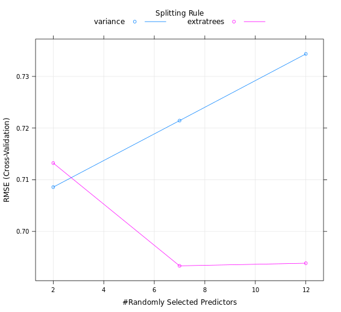
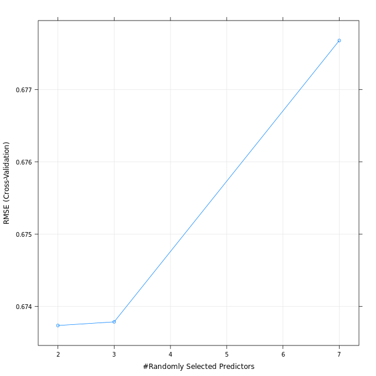

# Chapter 3 - Tuning model parameters to improve performance
## Fit a random forest


```r

# Fit random forest: model
model <- train(
  quality ~ .,
  tuneLength = 1,
  data = wine, 
  method = "ranger",
  trControl = trainControl(
    method = "cv", 
    number = 5, 
    verboseIter = TRUE
  )
)

# Print model to console
model

```

Output:

```bash

> # Fit random forest: model
> model <- train(
    quality ~ .,
    tuneLength = 1,
    data = wine, 
    method = "ranger",
    trControl = trainControl(
      method = "cv", 
      number = 5, 
      verboseIter = TRUE
    )
  )
+ Fold1: mtry=3, min.node.size=5, splitrule=variance 
- Fold1: mtry=3, min.node.size=5, splitrule=variance 
+ Fold1: mtry=3, min.node.size=5, splitrule=extratrees 
- Fold1: mtry=3, min.node.size=5, splitrule=extratrees 
+ Fold2: mtry=3, min.node.size=5, splitrule=variance 
- Fold2: mtry=3, min.node.size=5, splitrule=variance 
+ Fold2: mtry=3, min.node.size=5, splitrule=extratrees 
- Fold2: mtry=3, min.node.size=5, splitrule=extratrees 
+ Fold3: mtry=3, min.node.size=5, splitrule=variance 
- Fold3: mtry=3, min.node.size=5, splitrule=variance 
+ Fold3: mtry=3, min.node.size=5, splitrule=extratrees 
- Fold3: mtry=3, min.node.size=5, splitrule=extratrees 
+ Fold4: mtry=3, min.node.size=5, splitrule=variance 
- Fold4: mtry=3, min.node.size=5, splitrule=variance 
+ Fold4: mtry=3, min.node.size=5, splitrule=extratrees 
- Fold4: mtry=3, min.node.size=5, splitrule=extratrees 
+ Fold5: mtry=3, min.node.size=5, splitrule=variance 
- Fold5: mtry=3, min.node.size=5, splitrule=variance 
+ Fold5: mtry=3, min.node.size=5, splitrule=extratrees 
- Fold5: mtry=3, min.node.size=5, splitrule=extratrees 
Aggregating results
Selecting tuning parameters
Fitting mtry = 3, splitrule = variance, min.node.size = 5 on full training set
> 
> # Print model to console
> model
Random Forest 

100 samples
 12 predictor

No pre-processing
Resampling: Cross-Validated (5 fold) 
Summary of sample sizes: 79, 81, 80, 80, 80 
Resampling results across tuning parameters:

  splitrule   RMSE       Rsquared   MAE      
  variance    0.6472815  0.3129299  0.4958393
  extratrees  0.6790625  0.2429503  0.5139353

Tuning parameter 'mtry' was held constant at a value of 3
Tuning
 parameter 'min.node.size' was held constant at a value of 5
RMSE was used to select the optimal model using the smallest value.
The final values used for the model were mtry = 3, splitrule = variance
 and min.node.size = 5.
> 

```
***

## Try a longer tune length

```r

# Fit random forest: model
model <- train(
  quality ~ .,
  tuneLength = 3,
  data = wine, 
  method = "ranger",
  trControl = trainControl(
    method = "cv", 
    number = 5, 
    verboseIter = TRUE
  )
)

# Print model to console
model

# Plot model
plot(model)

```

Output:

```bash

> # Fit random forest: model
> model <- train(
    quality ~ .,
    tuneLength = 3,
    data = wine, 
    method = "ranger",
    trControl = trainControl(
      method = "cv", 
      number = 5, 
      verboseIter = TRUE
    )
  )
+ Fold1: mtry= 2, min.node.size=5, splitrule=variance 
- Fold1: mtry= 2, min.node.size=5, splitrule=variance 
+ Fold1: mtry= 7, min.node.size=5, splitrule=variance 
- Fold1: mtry= 7, min.node.size=5, splitrule=variance 
+ Fold1: mtry=12, min.node.size=5, splitrule=variance 
- Fold1: mtry=12, min.node.size=5, splitrule=variance 
+ Fold1: mtry= 2, min.node.size=5, splitrule=extratrees 
- Fold1: mtry= 2, min.node.size=5, splitrule=extratrees 
+ Fold1: mtry= 7, min.node.size=5, splitrule=extratrees 
- Fold1: mtry= 7, min.node.size=5, splitrule=extratrees 
+ Fold1: mtry=12, min.node.size=5, splitrule=extratrees 
- Fold1: mtry=12, min.node.size=5, splitrule=extratrees 
+ Fold2: mtry= 2, min.node.size=5, splitrule=variance 
- Fold2: mtry= 2, min.node.size=5, splitrule=variance 
+ Fold2: mtry= 7, min.node.size=5, splitrule=variance 
- Fold2: mtry= 7, min.node.size=5, splitrule=variance 
+ Fold2: mtry=12, min.node.size=5, splitrule=variance 
- Fold2: mtry=12, min.node.size=5, splitrule=variance 
+ Fold2: mtry= 2, min.node.size=5, splitrule=extratrees 
- Fold2: mtry= 2, min.node.size=5, splitrule=extratrees 
+ Fold2: mtry= 7, min.node.size=5, splitrule=extratrees 
- Fold2: mtry= 7, min.node.size=5, splitrule=extratrees 
+ Fold2: mtry=12, min.node.size=5, splitrule=extratrees 
- Fold2: mtry=12, min.node.size=5, splitrule=extratrees 
+ Fold3: mtry= 2, min.node.size=5, splitrule=variance 
- Fold3: mtry= 2, min.node.size=5, splitrule=variance 
+ Fold3: mtry= 7, min.node.size=5, splitrule=variance 
- Fold3: mtry= 7, min.node.size=5, splitrule=variance 
+ Fold3: mtry=12, min.node.size=5, splitrule=variance 
- Fold3: mtry=12, min.node.size=5, splitrule=variance 
+ Fold3: mtry= 2, min.node.size=5, splitrule=extratrees 
- Fold3: mtry= 2, min.node.size=5, splitrule=extratrees 
+ Fold3: mtry= 7, min.node.size=5, splitrule=extratrees 
- Fold3: mtry= 7, min.node.size=5, splitrule=extratrees 
+ Fold3: mtry=12, min.node.size=5, splitrule=extratrees 
- Fold3: mtry=12, min.node.size=5, splitrule=extratrees 
+ Fold4: mtry= 2, min.node.size=5, splitrule=variance 
- Fold4: mtry= 2, min.node.size=5, splitrule=variance 
+ Fold4: mtry= 7, min.node.size=5, splitrule=variance 
- Fold4: mtry= 7, min.node.size=5, splitrule=variance 
+ Fold4: mtry=12, min.node.size=5, splitrule=variance 
- Fold4: mtry=12, min.node.size=5, splitrule=variance 
+ Fold4: mtry= 2, min.node.size=5, splitrule=extratrees 
- Fold4: mtry= 2, min.node.size=5, splitrule=extratrees 
+ Fold4: mtry= 7, min.node.size=5, splitrule=extratrees 
- Fold4: mtry= 7, min.node.size=5, splitrule=extratrees 
+ Fold4: mtry=12, min.node.size=5, splitrule=extratrees 
- Fold4: mtry=12, min.node.size=5, splitrule=extratrees 
+ Fold5: mtry= 2, min.node.size=5, splitrule=variance 
- Fold5: mtry= 2, min.node.size=5, splitrule=variance 
+ Fold5: mtry= 7, min.node.size=5, splitrule=variance 
- Fold5: mtry= 7, min.node.size=5, splitrule=variance 
+ Fold5: mtry=12, min.node.size=5, splitrule=variance 
- Fold5: mtry=12, min.node.size=5, splitrule=variance 
+ Fold5: mtry= 2, min.node.size=5, splitrule=extratrees 
- Fold5: mtry= 2, min.node.size=5, splitrule=extratrees 
+ Fold5: mtry= 7, min.node.size=5, splitrule=extratrees 
- Fold5: mtry= 7, min.node.size=5, splitrule=extratrees 
+ Fold5: mtry=12, min.node.size=5, splitrule=extratrees 
- Fold5: mtry=12, min.node.size=5, splitrule=extratrees 
Aggregating results
Selecting tuning parameters
Fitting mtry = 7, splitrule = extratrees, min.node.size = 5 on full training set
> 
> # Print model to console
> model
Random Forest 

100 samples
 12 predictor

No pre-processing
Resampling: Cross-Validated (5 fold) 
Summary of sample sizes: 81, 80, 81, 79, 79 
Resampling results across tuning parameters:

  mtry  splitrule   RMSE       Rsquared   MAE      
   2    variance    0.7085709  0.4461494  0.5953364
   2    extratrees  0.7132270  0.4591507  0.5883883
   7    variance    0.7214439  0.4197318  0.6093089
   7    extratrees  0.6933306  0.4774437  0.5802985
  12    variance    0.7343570  0.4089651  0.6237680
  12    extratrees  0.6938384  0.4718821  0.5806953

Tuning parameter 'min.node.size' was held constant at a value of 5
RMSE was used to select the optimal model using the smallest value.
The final values used for the model were mtry = 7, splitrule = extratrees
 and min.node.size = 5.
> 
> # Plot model
> plot(model)
> 

```



***

## Fit a random forest with custom tuning

### 1
```r
# Define the tuning grid: tuneGrid
tuneGrid <- data.frame(
  .mtry = c(2,3,7),
  .splitrule = "variance",
  .min.node.size = 5
)

```
### 2

```r

# From previous step
tuneGrid <- data.frame(
  .mtry = c(2, 3, 7),
  .splitrule = "variance",
  .min.node.size = 5
)

# Fit random forest: model
model <- train(
  quality ~ .,
  tuneGrid = tuneGrid,
  data = wine, 
  method = "ranger",
  trControl = trainControl(
    method = "cv", 
    number = 5, 
    verboseIter = TRUE
  )
)

# Print model to console
model

# Plot model
plot(model)

```

Output:

```bash
> # From previous step
> tuneGrid <- data.frame(
    .mtry = c(2, 3, 7),
    .splitrule = "variance",
    .min.node.size = 5
  )
> 
> # Fit random forest: model
> model <- train(
    quality ~ .,
    tuneGrid = tuneGrid,
    data = wine, 
    method = "ranger",
    trControl = trainControl(
      method = "cv", 
      number = 5, 
      verboseIter = TRUE
    )
  )
+ Fold1: mtry=2, splitrule=variance, min.node.size=5 
- Fold1: mtry=2, splitrule=variance, min.node.size=5 
+ Fold1: mtry=3, splitrule=variance, min.node.size=5 
- Fold1: mtry=3, splitrule=variance, min.node.size=5 
+ Fold1: mtry=7, splitrule=variance, min.node.size=5 
- Fold1: mtry=7, splitrule=variance, min.node.size=5 
+ Fold2: mtry=2, splitrule=variance, min.node.size=5 
- Fold2: mtry=2, splitrule=variance, min.node.size=5 
+ Fold2: mtry=3, splitrule=variance, min.node.size=5 
- Fold2: mtry=3, splitrule=variance, min.node.size=5 
+ Fold2: mtry=7, splitrule=variance, min.node.size=5 
- Fold2: mtry=7, splitrule=variance, min.node.size=5 
+ Fold3: mtry=2, splitrule=variance, min.node.size=5 
- Fold3: mtry=2, splitrule=variance, min.node.size=5 
+ Fold3: mtry=3, splitrule=variance, min.node.size=5 
- Fold3: mtry=3, splitrule=variance, min.node.size=5 
+ Fold3: mtry=7, splitrule=variance, min.node.size=5 
- Fold3: mtry=7, splitrule=variance, min.node.size=5 
+ Fold4: mtry=2, splitrule=variance, min.node.size=5 
- Fold4: mtry=2, splitrule=variance, min.node.size=5 
+ Fold4: mtry=3, splitrule=variance, min.node.size=5 
- Fold4: mtry=3, splitrule=variance, min.node.size=5 
+ Fold4: mtry=7, splitrule=variance, min.node.size=5 
- Fold4: mtry=7, splitrule=variance, min.node.size=5 
+ Fold5: mtry=2, splitrule=variance, min.node.size=5 
- Fold5: mtry=2, splitrule=variance, min.node.size=5 
+ Fold5: mtry=3, splitrule=variance, min.node.size=5 
- Fold5: mtry=3, splitrule=variance, min.node.size=5 
+ Fold5: mtry=7, splitrule=variance, min.node.size=5 
- Fold5: mtry=7, splitrule=variance, min.node.size=5 
Aggregating results
Selecting tuning parameters
Fitting mtry = 2, splitrule = variance, min.node.size = 5 on full training set
> 
> # Print model to console
> model
Random Forest 

100 samples
 12 predictor

No pre-processing
Resampling: Cross-Validated (5 fold) 
Summary of sample sizes: 79, 80, 81, 80, 80 
Resampling results across tuning parameters:

  mtry  RMSE       Rsquared   MAE      
  2     0.6737366  0.2261653  0.5110236
  3     0.6737869  0.2260317  0.5094642
  7     0.6776795  0.2210202  0.5125127

Tuning parameter 'splitrule' was held constant at a value of variance

Tuning parameter 'min.node.size' was held constant at a value of 5
RMSE was used to select the optimal model using the smallest value.
The final values used for the model were mtry = 2, splitrule = variance
 and min.node.size = 5.
> 
> # Plot model
> plot(model)
> 

```




