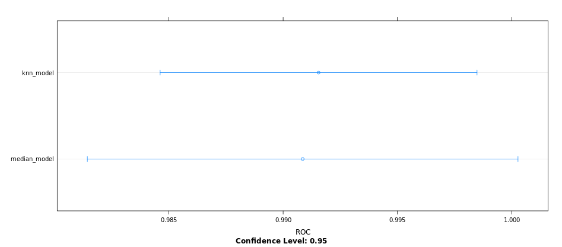

# Preprocessing your data
## Apply median imputation

`train()` function in `caret` contains an argument called `preProcess`

x is an object with samples in rows and features in columns (without outcomes)
y is a numeric or factor vector containing the outcomes.

```r
# Apply median imputation: median_model
median_model <- train(
  x = breast_cancer_x, 
  y = breast_cancer_y,
  method = "glm",
  trControl = myControl,
  preProcess = "medianImpute"
)

# Print median_model to console
median_model

```
Outcome:

```bash
> # Apply median imputation: median_model
> median_model <- train(
    x = breast_cancer_x, 
    y = breast_cancer_y,
    method = "glm",
    trControl = myControl,
    preProcess = "medianImpute"
  )
Warning message: The metric "Accuracy" was not in the result set. ROC will be used instead.
+ Fold01: parameter=none 
- Fold01: parameter=none 
+ Fold02: parameter=none 
- Fold02: parameter=none 
+ Fold03: parameter=none 
- Fold03: parameter=none 
+ Fold04: parameter=none 
- Fold04: parameter=none 
+ Fold05: parameter=none 
- Fold05: parameter=none 
+ Fold06: parameter=none 
- Fold06: parameter=none 
+ Fold07: parameter=none 
- Fold07: parameter=none 
+ Fold08: parameter=none 
- Fold08: parameter=none 
+ Fold09: parameter=none 
- Fold09: parameter=none 
+ Fold10: parameter=none 
- Fold10: parameter=none 
Aggregating results
Fitting final model on full training set
> 
> # Print median_model to console
> median_model
Generalized Linear Model 

699 samples
  9 predictor
  2 classes: 'benign', 'malignant' 

Pre-processing: median imputation (9) 
Resampling: Cross-Validated (10 fold) 
Summary of sample sizes: 629, 629, 629, 629, 629, 629, ... 
Resampling results:

  ROC       Sens      Spec     
  0.992755  0.967343  0.9378333
> 

```
***

## Use KNN imputation

Advanced form of imputation where missing values are replaced with values from other rows that are similar to the current row.

```r

# Apply KNN imputation: knn_model
knn_model <- train(
  x = breast_cancer_x, 
  y = breast_cancer_y,
  method = "glm",
  trControl = myControl,
  preProcess = "knnImpute"
)

# Print knn_model to console
knn_model

```

Output:

```bash

> # Apply KNN imputation: knn_model
> knn_model <- train(
    x = breast_cancer_x, 
    y = breast_cancer_y,
    method = "glm",
    trControl = myControl,
    preProcess = "knnImpute"
  )
Warning message: The metric "Accuracy" was not in the result set. ROC will be used instead.
+ Fold01: parameter=none 
- Fold01: parameter=none 
+ Fold02: parameter=none 
- Fold02: parameter=none 
+ Fold03: parameter=none 
- Fold03: parameter=none 
+ Fold04: parameter=none 
- Fold04: parameter=none 
+ Fold05: parameter=none 
- Fold05: parameter=none 
+ Fold06: parameter=none 
- Fold06: parameter=none 
+ Fold07: parameter=none 
- Fold07: parameter=none 
+ Fold08: parameter=none 
- Fold08: parameter=none 
+ Fold09: parameter=none 
- Fold09: parameter=none 
+ Fold10: parameter=none 
- Fold10: parameter=none 
Aggregating results
Fitting final model on full training set
> 
> # Print knn_model to console
> knn_model
Generalized Linear Model 

699 samples
  9 predictor
  2 classes: 'benign', 'malignant' 

Pre-processing: nearest neighbor imputation (9), centered (9), scaled (9) 
Resampling: Cross-Validated (10 fold) 
Summary of sample sizes: 629, 629, 630, 630, 629, 629, ... 
Resampling results:

  ROC        Sens       Spec     
  0.9924396  0.9715459  0.9416667
> 

```
***

## Compare KNN and median imputation

```r

dotplot(resamples, metric = "ROC")

```

Output:



***

## Combining preprocessing methods

## 1

```r

# Fit glm with median imputation
model <- train(
  x = breast_cancer_x, 
  y = breast_cancer_y,
  method = "glm",
  trControl = myControl,
  preProcess = "medianImpute"
)

# Print model
model

```
Output:

```bash

> # Fit glm with median imputation
> model <- train(
    x = breast_cancer_x, 
    y = breast_cancer_y,
    method = "glm",
    trControl = myControl,
    preProcess = "medianImpute"
  )
Warning message: The metric "Accuracy" was not in the result set. ROC will be used instead.
+ Fold01: parameter=none 
- Fold01: parameter=none 
+ Fold02: parameter=none 
- Fold02: parameter=none 
+ Fold03: parameter=none 
- Fold03: parameter=none 
+ Fold04: parameter=none 
- Fold04: parameter=none 
+ Fold05: parameter=none 
- Fold05: parameter=none 
+ Fold06: parameter=none 
- Fold06: parameter=none 
+ Fold07: parameter=none 
- Fold07: parameter=none 
+ Fold08: parameter=none 
- Fold08: parameter=none 
+ Fold09: parameter=none 
- Fold09: parameter=none 
+ Fold10: parameter=none 
- Fold10: parameter=none 
Aggregating results
Fitting final model on full training set
> 
> # Print model
> model
Generalized Linear Model 

699 samples
  9 predictor
  2 classes: 'benign', 'malignant' 

Pre-processing: median imputation (9) 
Resampling: Cross-Validated (10 fold) 
Summary of sample sizes: 629, 630, 629, 630, 629, 628, ... 
Resampling results:

  ROC        Sens      Spec     
  0.9929992  0.967343  0.9461667
> 

```
## 2

```r

# Update model with standardization
model <- train(
  x = breast_cancer_x, 
  y = breast_cancer_y,
  method = "glm",
  trControl = myControl,
  preProcess = c("medianImpute","center","scale")
)

# Print updated model
model

```

Output:

```bash

> # Update model with standardization
> model <- train(
    x = breast_cancer_x, 
    y = breast_cancer_y,
    method = "glm",
    trControl = myControl,
    preProcess = c("medianImpute","center","scale")
  )
Warning message: The metric "Accuracy" was not in the result set. ROC will be used instead.
+ Fold01: parameter=none 
- Fold01: parameter=none 
+ Fold02: parameter=none 
- Fold02: parameter=none 
+ Fold03: parameter=none 
- Fold03: parameter=none 
+ Fold04: parameter=none 
- Fold04: parameter=none 
+ Fold05: parameter=none 
- Fold05: parameter=none 
+ Fold06: parameter=none 
- Fold06: parameter=none 
+ Fold07: parameter=none 
- Fold07: parameter=none 
+ Fold08: parameter=none 
- Fold08: parameter=none 
+ Fold09: parameter=none 
- Fold09: parameter=none 
+ Fold10: parameter=none 
- Fold10: parameter=none 
Aggregating results
Fitting final model on full training set
> 
> # Print updated model
> model
Generalized Linear Model 

699 samples
  9 predictor
  2 classes: 'benign', 'malignant' 

Pre-processing: median imputation (9), centered (9), scaled (9) 
Resampling: Cross-Validated (10 fold) 
Summary of sample sizes: 630, 629, 629, 630, 629, 629, ... 
Resampling results:

  ROC        Sens       Spec     
  0.9916832  0.9694203  0.9418333
> 

```
***

## Remove near zero variance predictors


