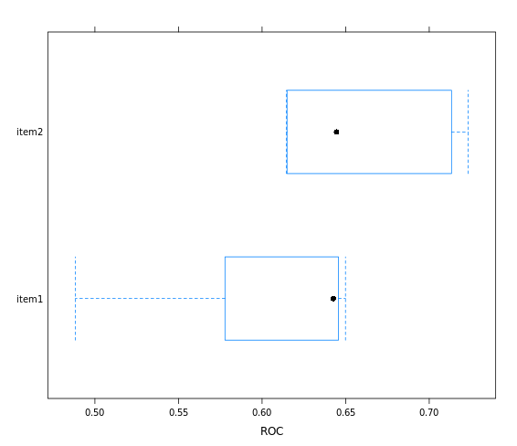
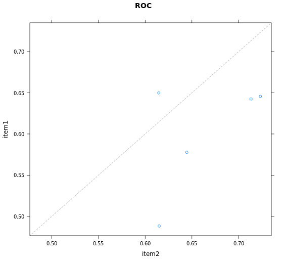

# Chapter 5 - Selecting models: a case study in churn prediction

## Why reuse a trainControl?

you can use the same summaryFunction and tuning parameters for multiple models.
you don't have to repeat code when fitting multiple models.
you can compare models on the exact same training and test data.

All of the above.

***

## Make custom train/test indices

```r

# Create custom indices: myFolds
myFolds <- createFolds(churn_y, k = 5)

# Create reusable trainControl object: myControl
myControl <- trainControl(
  summaryFunction = twoClassSummary,
  classProbs = TRUE, # IMPORTANT!
  verboseIter = TRUE,
  savePredictions = TRUE,
  index = myFolds
)

```
***

## glmnet as a baseline mode

What makes glmnet a good baseline model?

It's simple, fast, and easy to interpret.

## Fit the baseline model


```r

# Fit glmnet model: model_glmnet
model_glmnet <- train(
  x = churn_x, 
  y = churn_y,
  metric = "ROC",
  method = "glmnet",
  trControl = myControl
)

```
***

## Random forest drawback

You no longer have model coefficients to help interpret the model.


## Random forest with custom trainControl

```r

# Fit random forest: model_rf
model_rf <- train(
  x = churn_x, 
  y = churn_y,
  metric = "ROC",
  method = "ranger",
  trControl = myControl
)

```

***

## Matching train/test indices

primary reason that train/test indices need to match when comparing two models
Because otherwise you wouldn't be doing a fair comparison of your models and your results could be due to chance.

***

## Create a resamples object

```r
# Create model_list
model_list <- list(item1 = model_glmnet, item2 = model_rf)

# Pass model_list to resamples(): resamples
resamples <- resamples(model_list)

# Summarize the results
summary(resamples)

```

Output:

```bash

> # Create model_list
> model_list <- list(item1 = model_glmnet, item2 = model_rf)
> 
> # Pass model_list to resamples(): resamples
> resamples <- resamples(model_list)
> 
> # Summarize the results
> summary(resamples)

Call:
summary.resamples(object = resamples)

Models: item1, item2 
Number of resamples: 5 

ROC 
           Min.   1st Qu.    Median      Mean   3rd Qu.      Max. NA's
item1 0.4882759 0.5778073 0.6425287 0.6008432 0.6457143 0.6498901    0
item2 0.6145055 0.6149425 0.6445623 0.6621281 0.7133333 0.7232967    0

Sens 
           Min.   1st Qu.    Median      Mean   3rd Qu.      Max. NA's
item1 0.9367816 0.9371429 0.9425287 0.9472512 0.9542857 0.9655172    0
item2 0.9367816 0.9657143 0.9714286 0.9690378 0.9827586 0.9885057    0

Spec 
            Min.   1st Qu.    Median       Mean   3rd Qu.      Max. NA's
item1 0.03846154 0.0400000 0.1153846 0.08584615 0.1153846 0.1200000    0
item2 0.08000000 0.1153846 0.1200000 0.14000000 0.1538462 0.2307692    0
> 

```

***

## Create a box-and-whisker plot

```r
# Create bwplot
bwplot(resamples,metric = "ROC")

```

Output:



***

## Create a scatterplot

```r

# Create xyplot
xyplot(resamples, metric = "ROC")

```

Output:




***

## Ensembling models

caretEnsemble provides the `caretList()` function for creating multiple caret models at once on the same dataset, using the same resampling folds.

```r

# Create ensemble model: stack
stack <- caretStack(model_list, method = "glm")

# Look at summary
summary(stack)

```

Output:

```bash

> # Create ensemble model: stack
> stack <- caretStack(model_list, method = "glm")
> 
> # Look at summary
> summary(stack)

Call:
NULL

Deviance Residuals: 
    Min       1Q   Median       3Q      Max  
-1.1497  -0.5238  -0.4432  -0.4193   2.2366  

Coefficients:
            Estimate Std. Error z value Pr(>|z|)    
(Intercept) -2.41968    0.13961 -17.331  < 2e-16 ***
item1        0.02305    0.50968   0.045    0.964    
item2        3.07211    0.62227   4.937 7.94e-07 ***
---
Signif. codes:  0 '***' 0.001 '**' 0.01 '*' 0.05 '.' 0.1 ' ' 1

(Dispersion parameter for binomial family taken to be 1)

    Null deviance: 765.13  on 999  degrees of freedom
Residual deviance: 733.68  on 997  degrees of freedom
AIC: 739.68

Number of Fisher Scoring iterations: 4
> 

```

***

*End of Chapter 5*


