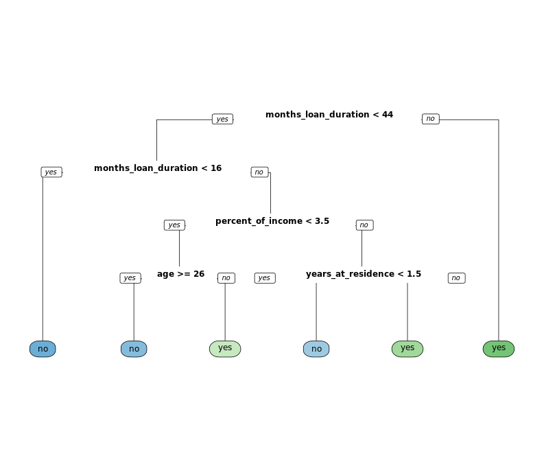

# Chapter 1 - Classification Trees

## Build a classification tree

```r

# Look at the data
str(creditsub)

# Create the model
credit_model <- rpart(formula = default ~ ., 
                      data = creditsub, 
                      method = "class")

# Display the results
rpart.plot(x = credit_model, yesno = 2, type = 0, extra = 0)

```

Output:

```bash

# Look at the data
str(creditsub)

# Create the model
credit_model <- rpart(formula = default ~ ., 
                      data = creditsub, 
                      method = "class")

# Display the results
rpart.plot(x = credit_model, yesno = 2, type = 0, extra = 0)

```

Plot:



***

## Advantages of tree-based methods

What are some advantages of using tree-based methods over other supervised learning methods?

Model interpretability (easy to understand why a prediction is made).
No pre-processing (e.g. normalization) of the data is required.

***
## Train/test split

80% train split.

```r

# Total number of rows in the credit data frame
n <- nrow(credit)

# Number of rows for the training set (80% of the dataset)
n_train <- round(0.8 * n) 

# Create a vector of indices which is an 80% random sample
set.seed(123)
train_indices <- sample(1:n, n_train)

# Subset the credit data frame to training indices only
credit_train <- credit[train_indices, ]  
  
# Exclude the training indices to create the test set
credit_test <- credit[-train_indices, ]  

```

***

## Train a classification tree model

```r

# Train the model (to predict 'default')
credit_model <- rpart(formula = default ~., 
                      data = credit_train, 
                      method = "class")

# Look at the model output                      
print(credit_model)

```

Output:

```bash
> # Train the model (to predict 'default')
> credit_model <- rpart(formula = default ~., 
                        data = credit_train, 
                        method = "class")
> 
> # Look at the model output
> print(credit_model)
n= 800 

node), split, n, loss, yval, (yprob)
      * denotes terminal node

  1) root 800 238 no (0.70250000 0.29750000)  
    2) checking_balance=> 200 DM,unknown 369  45 no (0.87804878 0.12195122) *
    3) checking_balance=< 0 DM,1 - 200 DM 431 193 no (0.55220418 0.44779582)  
      6) months_loan_duration< 20.5 231  84 no (0.63636364 0.36363636)  
       12) credit_history=critical,good,poor 207  66 no (0.68115942 0.31884058)  
         24) amount< 7341 200  60 no (0.70000000 0.30000000) *
         25) amount>=7341 7   1 yes (0.14285714 0.85714286) *
       13) credit_history=perfect,very good 24   6 yes (0.25000000 0.75000000) *
      7) months_loan_duration>=20.5 200  91 yes (0.45500000 0.54500000)  
       14) savings_balance=> 1000 DM,unknown 35   9 no (0.74285714 0.25714286)  
         28) amount>=2079 26   2 no (0.92307692 0.07692308) *
         29) amount< 2079 9   2 yes (0.22222222 0.77777778) *
       15) savings_balance=< 100 DM,100 - 500 DM,500 - 1000 DM 165  65 yes (0.39393939 0.60606061)  
         30) months_loan_duration< 47.5 132  60 yes (0.45454545 0.54545455)  
           60) age>=29.5 77  35 no (0.54545455 0.45454545)  
            120) amount>=2249 62  24 no (0.61290323 0.38709677)  
              240) credit_history=critical,poor,very good 25   5 no (0.80000000 0.20000000) *
              241) credit_history=good,perfect 37  18 yes (0.48648649 0.51351351)  
                482) age< 41 21   7 no (0.66666667 0.33333333) *
                483) age>=41 16   4 yes (0.25000000 0.75000000) *
            121) amount< 2249 15   4 yes (0.26666667 0.73333333) *
           61) age< 29.5 55  18 yes (0.32727273 0.67272727)  
            122) months_loan_duration< 31.5 38  16 yes (0.42105263 0.57894737)  
              244) amount>=3415 17   6 no (0.64705882 0.35294118) *
              245) amount< 3415 21   5 yes (0.23809524 0.76190476) *
            123) months_loan_duration>=31.5 17   2 yes (0.11764706 0.88235294) *
         31) months_loan_duration>=47.5 33   5 yes (0.15151515 0.84848485) *
> 

```
***

## Compute confusion matrix


```r

# Generate predicted classes using the model object
class_prediction <- predict(object = credit_model,  
                        newdata = credit_test,   
                        type = "class")  
                            
# Calculate the confusion matrix for the test set
confusionMatrix(data = class_prediction,       
                reference = credit_test$default)  
                
```

Output:

```bash

> # Generate predicted classes using the model object
> class_prediction <- predict(object = credit_model,  
                          newdata = credit_test,   
                          type = "class")
> 
> # Calculate the confusion matrix for the test set
> confusionMatrix(data = class_prediction,       
                  reference = credit_test$default)
Confusion Matrix and Statistics

          Reference
Prediction  no yes
       no  100  34
       yes  38  28
                                          
               Accuracy : 0.64            
                 95% CI : (0.5693, 0.7065)
    No Information Rate : 0.69            
    P-Value [Acc > NIR] : 0.9443          
                                          
                  Kappa : 0.1732          
 Mcnemar's Test P-Value : 0.7237          
                                          
            Sensitivity : 0.7246          
            Specificity : 0.4516          
         Pos Pred Value : 0.7463          
         Neg Pred Value : 0.4242          
             Prevalence : 0.6900          
         Detection Rate : 0.5000          
   Detection Prevalence : 0.6700          
      Balanced Accuracy : 0.5881          
                                          
       'Positive' Class : no
> 

```

## Compare models with a different splitting criterion


```r

# Train a gini-based model
credit_model1 <- rpart(formula = default ~ ., 
                       data = credit_train, 
                       method = "class",
                       parms = list(split = "gini"))

# Train an information-based model
credit_model2 <- rpart(formula = default ~ ., 
                       data = credit_train, 
                       method = "class",
                       parms = list(split = "information"))

# Generate predictions on the validation set using the gini model
pred1 <- predict(object = credit_model1, 
             newdata = credit_test,
             type = "class")    

# Generate predictions on the validation set using the information model
pred2 <- predict(object = credit_model2, 
             newdata = credit_test,
             type = "class")

# Compare classification error
ce(actual = credit_test$default, 
   predicted = pred1)
ce(actual = credit_test$default, 
   predicted = pred2)  
   
   
```

Output:

```bash
> # Train a gini-based model
> credit_model1 <- rpart(formula = default ~ ., 
                         data = credit_train, 
                         method = "class",
                         parms = list(split = "gini"))
> 
> # Train an information-based model
> credit_model2 <- rpart(formula = default ~ ., 
                         data = credit_train, 
                         method = "class",
                         parms = list(split = "information"))
> 
> # Generate predictions on the validation set using the gini model
> pred1 <- predict(object = credit_model1, 
               newdata = credit_test,
               type = "class")
> 
> # Generate predictions on the validation set using the information model
> pred2 <- predict(object = credit_model2, 
               newdata = credit_test,
               type = "class")
> 
> # Compare classification error
> ce(actual = credit_test$default, 
     predicted = pred1)
[1] 0.295
> ce(actual = credit_test$default, 
     predicted = pred2)
[1] 0.275
> 

```


