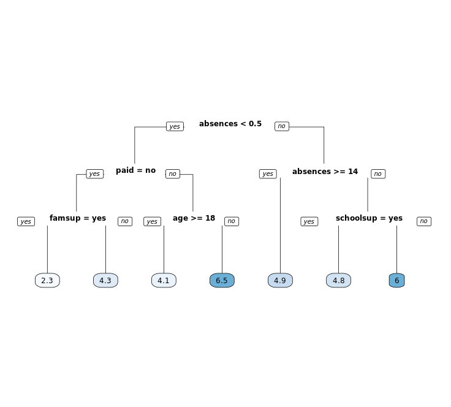

# Chapter 2 - Regression Trees

## Classification vs. regression


* In classification, the response represents a category (e.g. "apples", "oranges", "bananas")
* In regression, the response represents a numeric value (e.g. price of a house).

## Split the data

```r

# Look at the data
str(grade)

# Set seed and create assignment
set.seed(1)
assignment <- sample(1:3, size = nrow(grade), prob = c(0.7,0.15,0.15), replace = TRUE)

# Create a train, validation and tests from the original data frame 
grade_train <- grade[assignment == 1, ]    # subset grade to training indices only
grade_valid <- grade[assignment == 2, ]  # subset grade to validation indices only
grade_test <- grade[assignment == 3, ]   # subset grade to test indices only

```

Output:

```bash

# Look at the data
str(grade)

# Set seed and create assignment
set.seed(1)
assignment <- sample(1:3, size = nrow(grade), prob = c(0.7,0.15,0.15), replace = TRUE)

# Create a train, validation and tests from the original data frame 
grade_train <- grade[assignment == 1, ]    # subset grade to training indices only
grade_valid <- grade[assignment == 2, ]  # subset grade to validation indices only
grade_test <- grade[assignment == 3, ]   # subset grade to test indices only

```

***

## Train a regression tree model

Fitting a classification tree:
```
method = "class"

```
Fitting a regression tree:
```
method = "anova"

```
***

```r

# Train the model
grade_model <- rpart(formula = final_grade ~ ., 
                     data = grade_train, 
                     method = "anova")

# Look at the model output                      
print(grade_model)

# Plot the tree model
rpart.plot(x = grade_model, yesno = 2, type = 0, extra = 0)

```

Output:

```bash
> # Train the model
> grade_model <- rpart(formula = final_grade ~ ., 
                       data = grade_train, 
                       method = "anova")
> 
> # Look at the model output
> print(grade_model)
n= 282 

node), split, n, deviance, yval
      * denotes terminal node

 1) root 282 1519.49700 5.271277  
   2) absences< 0.5 82  884.18600 4.323171  
     4) paid=no 50  565.50500 3.430000  
       8) famsup=yes 22  226.36360 2.272727 *
       9) famsup=no 28  286.52680 4.339286 *
     5) paid=yes 32  216.46880 5.718750  
      10) age>=17.5 10   82.90000 4.100000 *
      11) age< 17.5 22   95.45455 6.454545 *
   3) absences>=0.5 200  531.38000 5.660000  
     6) absences>=13.5 42  111.61900 4.904762 *
     7) absences< 13.5 158  389.43670 5.860759  
      14) schoolsup=yes 23   50.21739 4.847826 *
      15) schoolsup=no 135  311.60000 6.033333  
        30) studytime< 3.5 127  276.30710 5.940945 *
        31) studytime>=3.5 8   17.00000 7.500000 *
> 
> # Plot the tree model
> rpart.plot(x = grade_model, yesno = 2, type = 0, extra = 0)
> 

```


***

## Evaluate a regression tree model

```r

# Generate predictions on a test set
pred <- predict(object = grade_model,   # model object 
                newdata = grade_test)  # test dataset

# Compute the RMSE
rmse(actual = grade_test$final_grade, 
     predicted = pred)
     
```
Output:

```bash

> # Generate predictions on a test set
> pred <- predict(object = grade_model,   # model object 
                  newdata = grade_test)  # test dataset
> 
> # Compute the RMSE
> rmse(actual = grade_test$final_grade, 
       predicted = pred)
[1] 2.278249
> 

```

***

## Tuning the model

prune() - Tune or trim to find "CP"- Complexity Parameter

```r

# Plot the "CP Table"
plotcp(grade_model)

# Print the "CP Table"
print(grade_model$cptable)

# Retrieve optimal cp value based on cross-validated error
opt_index <- which.min(grade_model$cptable[, "xerror"])
cp_opt <- grade_model$cptable[opt_index, "CP"]

# Prune the model (to optimized cp value)
grade_model_opt <- prune(tree = grade_model, 
                         cp = cp_opt)
                          
# Plot the optimized model
rpart.plot(x = grade_model_opt, yesno = 2, type = 0, extra = 0)

```

Output:

```bash

> # Plot the "CP Table"
> plotcp(grade_model)
> 
> # Print the "CP Table"
> print(grade_model$cptable)
          CP nsplit rel error    xerror       xstd
1 0.06839852      0 1.0000000 1.0080595 0.09215642
2 0.06726713      1 0.9316015 1.0920667 0.09543723
3 0.03462630      2 0.8643344 0.9969520 0.08632297
4 0.02508343      3 0.8297080 0.9291298 0.08571411
5 0.01995676      4 0.8046246 0.9357838 0.08560120
6 0.01817661      5 0.7846679 0.9337462 0.08087153
7 0.01203879      6 0.7664912 0.9092646 0.07982862
8 0.01000000      7 0.7544525 0.9407895 0.08399125
> 
> # Retrieve optimal cp value based on cross-validated error
> opt_index <- which.min(grade_model$cptable[, "xerror"])
> cp_opt <- grade_model$cptable[opt_index, "CP"]
> 
> # Prune the model (to optimized cp value)
> grade_model_opt <- prune(tree = grade_model, 
                           cp = cp_opt)
> 
> # Plot the optimized model
> rpart.plot(x = grade_model_opt, yesno = 2, type = 0, extra = 0)
> 


```

### CP Table Plot


## Optimized model Plot



