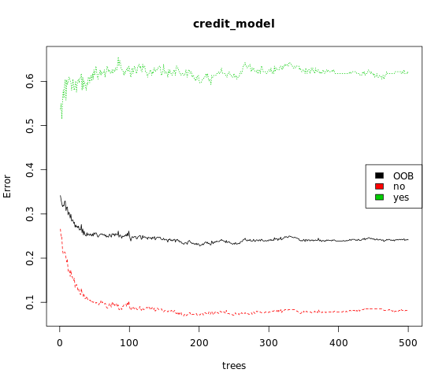

# Random Forests

## Bagged trees vs. Random Forest

In Random Forest, only a subset of features are selected at random at each split in a decision tree. In bagging, all features are used.

## Train a Random Forest model

```r

# Train a Random Forest
set.seed(1)  # for reproducibility
credit_model <- randomForest(formula = default ~ ., 
                             data = credit_train)
                             
# Print the model output                             
print(credit_model)

```

Output:

```bash

> # Train a Random Forest
> set.seed(1)  # for reproducibility
> credit_model <- randomForest(formula = default ~ ., 
                               data = credit_train)
> 
> # Print the model output
> print(credit_model)

Call:
 randomForest(formula = default ~ ., data = credit_train) 
               Type of random forest: classification
                     Number of trees: 500
No. of variables tried at each split: 4

        OOB estimate of  error rate: 23.62%
Confusion matrix:
     no yes class.error
no  518  44  0.07829181
yes 145  93  0.60924370
> 

```
***

## Evaluate out-of-bag error

```r

# Grab OOB error matrix & take a look
err <- credit_model$err.rate
head(err)

# Look at final OOB error rate (last row in err matrix)
oob_err <- err[nrow(err), "OOB"]
print(oob_err)

# Plot the model trained in the previous exercise
plot(credit_model)

# Add a legend since it doesn't have one by default
legend(x = "right", 
       legend = colnames(err),
       fill = 1:ncol(err))
       
       
```

Output:

```bash
> # Grab OOB error matrix & take a look
> err <- credit_model$err.rate
> head(err)
           OOB        no       yes
[1,] 0.3414634 0.2657005 0.5375000
[2,] 0.3311966 0.2462908 0.5496183
[3,] 0.3232831 0.2476636 0.5147929
[4,] 0.3164933 0.2180294 0.5561224
[5,] 0.3197756 0.2095808 0.5801887
[6,] 0.3176944 0.2115385 0.5619469
> 
> # Look at final OOB error rate (last row in err matrix)
> oob_err <- err[nrow(err), "OOB"]
> print(oob_err)
    OOB 
0.24125
> 
> # Plot the model trained in the previous exercise
> plot(credit_model)
> 
> # Add a legend since it doesn't have one by default
> legend(x = "right", 
         legend = colnames(err),
         fill = 1:ncol(err))
> 

```



***

## Evaluate model performance on a test set

```r

# Generate predicted classes using the model object
class_prediction <- predict(object = credit_model,   # model object 
                            newdata = credit_test,  # test dataset
                            type = "class") # return classification labels
                            
# Calculate the confusion matrix for the test set
cm <- confusionMatrix(data = class_prediction,       # predicted classes
                      reference = credit_test$default)  # actual classes
print(cm)

# Compare test set accuracy to OOB accuracy
paste0("Test Accuracy: ", cm$overall[1])
paste0("OOB Accuracy: ", 1 - oob_err)

```

Output:

```bash

> # Generate predicted classes using the model object
> class_prediction <- predict(object = credit_model,   # model object 
                              newdata = credit_test,  # test dataset
                              type = "class") # return classification labels
> 
> # Calculate the confusion matrix for the test set
> cm <- confusionMatrix(data = class_prediction,       # predicted classes
                        reference = credit_test$default)  # actual classes
> print(cm)
Confusion Matrix and Statistics

          Reference
Prediction  no yes
       no  131  40
       yes   7  22
                                       
               Accuracy : 0.765        
                 95% CI : (0.7, 0.8219)
    No Information Rate : 0.69         
    P-Value [Acc > NIR] : 0.01186      
                                       
                  Kappa : 0.3563       
 Mcnemar's Test P-Value : 3.046e-06    
                                       
            Sensitivity : 0.9493       
            Specificity : 0.3548       
         Pos Pred Value : 0.7661       
         Neg Pred Value : 0.7586       
             Prevalence : 0.6900       
         Detection Rate : 0.6550       
   Detection Prevalence : 0.8550       
      Balanced Accuracy : 0.6521       
                                       
       'Positive' Class : no
> 
> # Compare test set accuracy to OOB accuracy
> paste0("Test Accuracy: ", cm$overall[1])
[1] "Test Accuracy: 0.765"
> paste0("OOB Accuracy: ", 1 - oob_err)
[1] "OOB Accuracy: 0.75875"
> 

```
***

## Advantage of OOB error

Main advantage of using OOB error instead of validation or test error:

Evaluate the model using OOB error -> no need to create a seprate test set.

## Evaluate test set AUC

```r

# Generate predictions on the test set
pred <- predict(object = credit_model,
            newdata = credit_test,
            type = "prob")

# `pred` is a matrix
class(pred)
                
# Look at the pred format
head(pred)
                
# Compute the AUC (`actual` must be a binary 1/0 numeric vector)
auc(actual = ifelse(credit_test$default == "yes", 1, 0), 
    predicted = pred[,"yes"])                    
    
    
```

Output:

```bash

> # Generate predictions on the test set
> pred <- predict(object = credit_model,
              newdata = credit_test,
              type = "prob")
> 
> # `pred` is a matrix
> class(pred)
[1] "matrix" "votes"
> 
> # Look at the pred format
> head(pred)
      no   yes
3  0.894 0.106
10 0.294 0.706
11 0.414 0.586
14 0.772 0.228
27 0.760 0.240
28 0.618 0.382
> 
> # Compute the AUC (`actual` must be a binary 1/0 numeric vector)
> auc(actual = ifelse(credit_test$default == "yes", 1, 0), 
      predicted = pred[,"yes"])
[1] 0.8037634
> 


```

***

## Tuning a Random Forest via mtry

```r

# Execute the tuning process
set.seed(1)              
res <- tuneRF(x = subset(credit_train, select = -default),
              y = credit_train$default,
              ntreeTry = 500)
               
# Look at results
print(res)

# Find the mtry value that minimizes OOB Error
mtry_opt <- res[,"mtry"][which.min(res[,"OOBError"])]
print(mtry_opt)

# If you just want to return the best RF model (rather than results)
# you can set `doBest = TRUE` in `tuneRF()` to return the best RF model
# instead of a set performance matrix.

```

Outout:

```bash

# Execute the tuning process
set.seed(1)              
res <- tuneRF(x = subset(credit_train, select = -default),
              y = credit_train$default,
              ntreeTry = 500)
               
# Look at results
print(res)

# Find the mtry value that minimizes OOB Error
mtry_opt <- res[,"mtry"][which.min(res[,"OOBError"])]
print(mtry_opt)

# If you just want to return the best RF model (rather than results)
# you can set `doBest = TRUE` in `tuneRF()` to return the best RF model
# instead of a set performance matrix.


```


