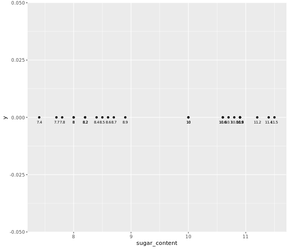
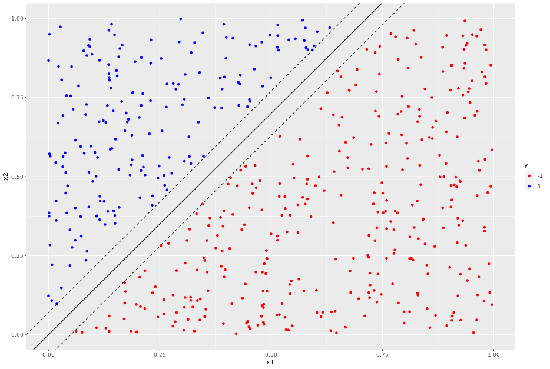

# Support Vector Machines in R

## Visualizing a sugar content dataset

```r

# Load ggplot2
library(ggplot2)
# Print variable names
colnames(df)

# Plot sugar content along the x-axis
plot_df <- ggplot(data = df, aes(x = sugar_content , y = 0)) + 
    geom_point() + 
    geom_text(aes(label = sugar_content), size = 2.5, vjust = 2, hjust = 0.5)

# Display plot
plot_df

```

Output:

```bash

> # Load ggplot2
> library(ggplot2)
> # Print variable names
> colnames(df)
[1] "sample."       "sugar_content"
> 
> # Plot sugar content along the x-axis
> plot_df <- ggplot(data = df, aes(x = sugar_content , y = 0)) + 
      geom_point() + 
      geom_text(aes(label = sugar_content), size = 2.5, vjust = 2, hjust = 0.5)
> 
> # Display plot
> plot_df
> 


```



***

## Find the maximal margin separator

```r
#The maximal margin separator is at the midpoint of the two extreme points in each cluster.
mm_separator <- (8.9 + 10)/2

```

***

## Visualize the maximal margin separator

```r

#create data frame containing the maximum margin separator
separator <- data.frame(sep = mm_separator)

#add ggplot layer 
plot_sep <- plot_ + geom_point(data = separator, aes(x = sep, y = 0), color = "blue", size = 4)

#display plot
plot_sep

```

Output:


***

## Generate a 2d uniformly distributed dataset.

###The Uniform Distribution

These functions provide information about the uniform distribution on the interval from `min` to `max`. 


* `dunif` gives the density, 
* `punif` gives the distribution function 
* `qunif` gives the quantile function and 
* `runif` generates random deviates.

```r

#set seed
set.seed(42)

#set number of data points. 
n <- 600

#Generate data frame with two uniformly distributed predictors lying between 0 and 1.
df <- data.frame(x1 = runif(n), 
                 x2 = runif(n))
                 
```

***

## Create a decision boundary


> y = -1 if x2 < 1.4*x1

> y = 1 if x2 > 1.4*x1


```r
#classify data points depending on location
df$y <- factor(ifelse(df$x2 - 1.4*df$x1 < 0, -1, 1), 
    levels = c(-1, 1))

```
***
## Introduce a margin in the dataset

```r
#set margin
delta <- 0.07

# retain only those points that lie outside the margin
df1 <- df[abs(1.4*df$x1 - df$x2) > delta, ]

#build plot
plot_margins <- ggplot(data = df1, aes(x = x1, y = x2, color = y)) + geom_point() + 
    scale_color_manual(values = c("red", "blue")) + 
    geom_abline(slope = 1.4, intercept = 0)+
    geom_abline(slope = 1.4, intercept = delta, linetype = "dashed") +
    geom_abline(slope = 1.4, intercept = -delta, linetype = "dashed")
 
#display plot 
plot_margins

```

Output:



***


