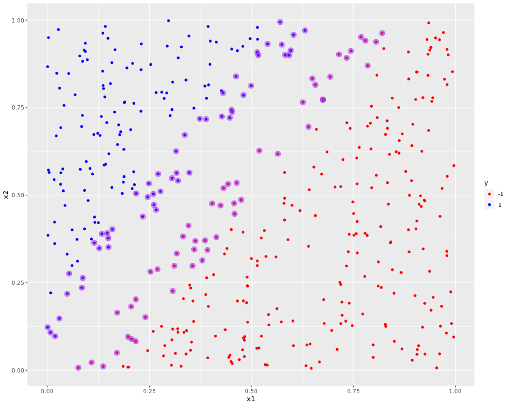
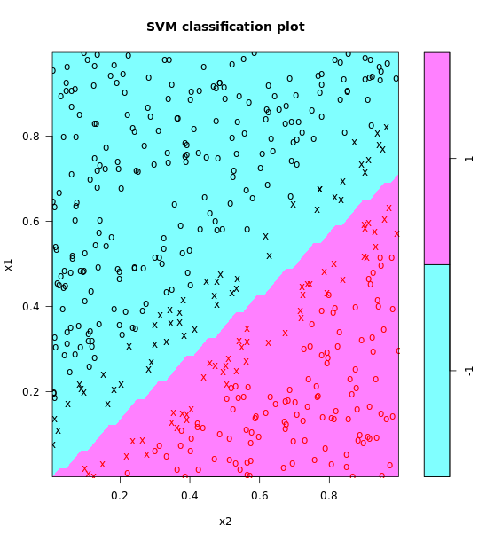
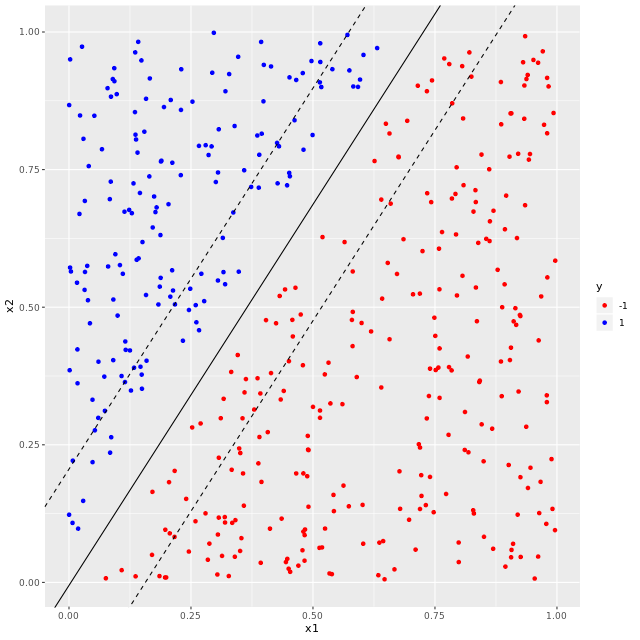
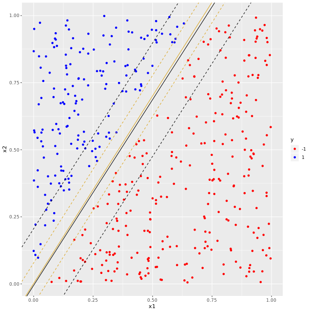
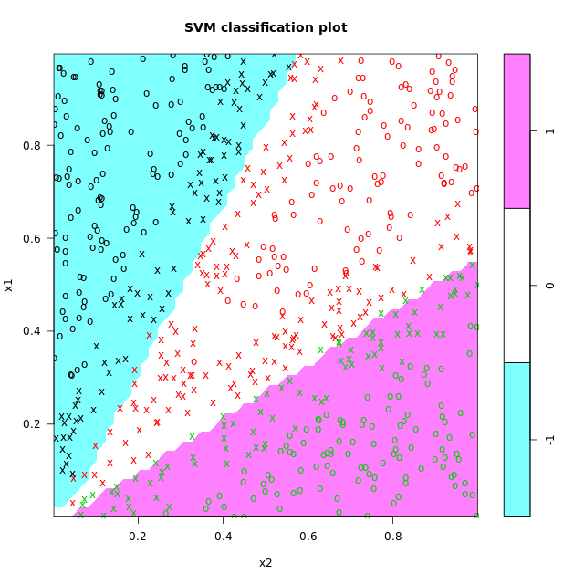

# Support Vector Classifiers - Linear Kernels

## Creating training and test datasets


```r

#split train and test data in an 80/20 proportion
df[, "train"] <- ifelse(runif(nrow(df))<0.8, 1, 0)

#assign training rows to data frame trainset
trainset <- df[df$train == 1, ]
#assign test rows to data frame testset
testset <- df[df$train == 0, ]

#find index of "train" column
trainColNum <- grep("train", names(df))

#remove "train" column from train and test dataset
trainset <- trainset[, -trainColNum]
testset <- testset[, -trainColNum]

```

***

## Building a linear SVM classifier

```r

library(e1071)

#build svm model, setting required parameters
svm_model<- svm(y ~ ., 
                data = trainset, 
                type = "C-classification", 
                kernel = "linear", 
                scale = FALSE)
                
```
***

## Exploring the model and calculating accuracy

### 1

```r

#list components of model
names(svm_model)


```

Output:

```bash

> #list components of model
> names(svm_model)
 [1] "call"            "type"            "kernel"          "cost"           
 [5] "degree"          "gamma"           "coef0"           "nu"             
 [9] "epsilon"         "sparse"          "scaled"          "x.scale"        
[13] "y.scale"         "nclasses"        "levels"          "tot.nSV"        
[17] "nSV"             "labels"          "SV"              "index"          
[21] "rho"             "compprob"        "probA"           "probB"          
[25] "sigma"           "coefs"           "na.action"       "fitted"         
[29] "decision.values" "terms"
> 

```

### 2


```r

#list components of model
names(svm_model)

#list values of the SV, index and rho
svm_model$SV
svm_model$index
svm_model$rho


```

Output:

```bash

> #list components of model
> names(svm_model)
 [1] "call"            "type"            "kernel"          "cost"           
 [5] "degree"          "gamma"           "coef0"           "nu"             
 [9] "epsilon"         "sparse"          "scaled"          "x.scale"        
[13] "y.scale"         "nclasses"        "levels"          "tot.nSV"        
[17] "nSV"             "labels"          "SV"              "index"          
[21] "rho"             "compprob"        "probA"           "probB"          
[25] "sigma"           "coefs"           "na.action"       "fitted"         
[29] "decision.values" "terms"
> 
> #list values of the SV, index and rho
> svm_model$SV
              x1          x2
7   0.4577417762 0.476919189
13  0.4749970816 0.486642912
29  0.3795592405 0.313981685
33  0.4317512489 0.520339758
46  0.6756072745 0.772399305
52  0.6932048204 0.838569788
55  0.2163854151 0.082716837
57  0.1974103423 0.095661407
72  0.7439746463 0.912029979
74  0.6262453445 0.765520479
76  0.2165673110 0.202548483
86  0.3556659538 0.298152283
105 0.4640695513 0.535269056
106 0.7793681615 0.941694443
107 0.7335279596 0.892355152
109 0.1701624813 0.050030747
128 0.4140496817 0.380267640
131 0.1364903601 0.011009041
135 0.7690324257 0.951921815
151 0.4427962683 0.532290264
154 0.2524584394 0.281511990
166 0.8205145481 0.962842692
167 0.3070544004 0.226466750
184 0.2697161783 0.288755647
190 0.3110496188 0.298268895
195 0.2050496121 0.182046106
199 0.7853494422 0.870432480
204 0.4037828147 0.476424339
209 0.1709963905 0.164468810
216 0.3864540118 0.370921416
217 0.3324459905 0.382318948
229 0.3921784570 0.343302177
245 0.5648222226 0.618285144
253 0.6753195773 0.773493237
256 0.3169501573 0.333509587
260 0.3597852497 0.345139100
292 0.6568108753 0.815567016
296 0.0755990995 0.007417523
299 0.1079870730 0.022227321
305 0.2401496081 0.151690785
325 0.3626018071 0.369346223
341 0.6399842701 0.695480783
365 0.5195604505 0.627322678
383 0.6494539515 0.833293378
391 0.4243346907 0.470753220
400 0.3458497624 0.413091426
419 0.2065700251 0.089081859
429 0.7148487861 0.902375512
434 0.8058112133 0.937903824
438 0.4587231132 0.446819442
10  0.4622928225 0.839631285
19  0.4469696281 0.721333573
26  0.0073341469 0.108096598
44  0.2610879638 0.472588875
51  0.2712866147 0.560707851
65  0.3052183695 0.548420829
66  0.0002388966 0.122946701
75  0.2171576982 0.505044580
77  0.3889450287 0.717138722
84  0.4527315726 0.737772155
93  0.2335235255 0.439058027
96  0.6034740848 0.958318281
97  0.6315072989 0.970767964
112 0.1490720524 0.377477208
118 0.0290858189 0.148069276
130 0.4274944656 0.725024226
133 0.5923042425 0.900228734
141 0.1333296183 0.390023998
146 0.0531294835 0.276241161
150 0.5171110556 0.899924811
155 0.2596899802 0.503687580
157 0.4513108502 0.743930877
159 0.5746373343 0.930141046
169 0.0483467767 0.218475638
172 0.1590223818 0.402696270
176 0.0865806018 0.263718613
180 0.1495789951 0.351843507
181 0.4992728804 0.812805236
188 0.5397982858 0.932383237
202 0.3367135401 0.672058288
211 0.0186874117 0.097642665
215 0.3152607968 0.625878707
230 0.3199476011 0.541676977
241 0.4303332213 0.792282316
263 0.3733412449 0.718439230
273 0.5825784358 0.900965292
301 0.0842775232 0.235715229
317 0.5141573721 0.908452330
340 0.1147626776 0.363946523
344 0.3479114065 0.564496977
348 0.5964720468 0.913432184
354 0.2485451805 0.533491509
368 0.1465723943 0.391752972
382 0.1270027745 0.348539336
387 0.2665205784 0.458110426
407 0.2770604359 0.510976796
423 0.5705413527 0.994652604
424 0.2458533479 0.494881822
427 0.4806177358 0.786027395
430 0.3165616125 0.563688410
> svm_model$index
  [1]   7  13  29  33  46  52  55  57  72  74  76  86 105 106 107 109 128 131
 [19] 135 151 154 166 167 184 190 195 199 204 209 216 217 229 245 253 256 260
 [37] 292 296 299 305 325 341 365 383 391 400 419 429 434 438  10  19  26  44
 [55]  51  65  66  75  77  84  93  96  97 112 118 130 133 141 146 150 155 157
 [73] 159 169 172 176 180 181 188 202 211 215 230 241 263 273 301 317 340 344
 [91] 348 354 368 382 387 407 423 424 427 430
> svm_model$rho
[1] 0.02610377
> 


```

### 3

Calculate the training accuracy of the model.

```r
#list components of model
names(svm_model)

#list values of the SV, index and rho
svm_model$SV
svm_model$index
svm_model$rho

#compute training accuracy
pred_train <- predict(svm_model, trainset)
mean(pred_train == trainset$y)


```

Output:

```bash
> #list components of model
> names(svm_model)
 [1] "call"            "type"            "kernel"          "cost"           
 [5] "degree"          "gamma"           "coef0"           "nu"             
 [9] "epsilon"         "sparse"          "scaled"          "x.scale"        
[13] "y.scale"         "nclasses"        "levels"          "tot.nSV"        
[17] "nSV"             "labels"          "SV"              "index"          
[21] "rho"             "compprob"        "probA"           "probB"          
[25] "sigma"           "coefs"           "na.action"       "fitted"         
[29] "decision.values" "terms"
> 
> #list values of the SV, index and rho
> svm_model$SV
              x1          x2
7   0.4577417762 0.476919189
13  0.4749970816 0.486642912
29  0.3795592405 0.313981685
33  0.4317512489 0.520339758
46  0.6756072745 0.772399305
52  0.6932048204 0.838569788
55  0.2163854151 0.082716837
57  0.1974103423 0.095661407
72  0.7439746463 0.912029979
74  0.6262453445 0.765520479
76  0.2165673110 0.202548483
86  0.3556659538 0.298152283
105 0.4640695513 0.535269056
106 0.7793681615 0.941694443
107 0.7335279596 0.892355152
109 0.1701624813 0.050030747
128 0.4140496817 0.380267640
131 0.1364903601 0.011009041
135 0.7690324257 0.951921815
151 0.4427962683 0.532290264
154 0.2524584394 0.281511990
166 0.8205145481 0.962842692
167 0.3070544004 0.226466750
184 0.2697161783 0.288755647
190 0.3110496188 0.298268895
195 0.2050496121 0.182046106
199 0.7853494422 0.870432480
204 0.4037828147 0.476424339
209 0.1709963905 0.164468810
216 0.3864540118 0.370921416
217 0.3324459905 0.382318948
229 0.3921784570 0.343302177
245 0.5648222226 0.618285144
253 0.6753195773 0.773493237
256 0.3169501573 0.333509587
260 0.3597852497 0.345139100
292 0.6568108753 0.815567016
296 0.0755990995 0.007417523
299 0.1079870730 0.022227321
305 0.2401496081 0.151690785
325 0.3626018071 0.369346223
341 0.6399842701 0.695480783
365 0.5195604505 0.627322678
383 0.6494539515 0.833293378
391 0.4243346907 0.470753220
400 0.3458497624 0.413091426
419 0.2065700251 0.089081859
429 0.7148487861 0.902375512
434 0.8058112133 0.937903824
438 0.4587231132 0.446819442
10  0.4622928225 0.839631285
19  0.4469696281 0.721333573
26  0.0073341469 0.108096598
44  0.2610879638 0.472588875
51  0.2712866147 0.560707851
65  0.3052183695 0.548420829
66  0.0002388966 0.122946701
75  0.2171576982 0.505044580
77  0.3889450287 0.717138722
84  0.4527315726 0.737772155
93  0.2335235255 0.439058027
96  0.6034740848 0.958318281
97  0.6315072989 0.970767964
112 0.1490720524 0.377477208
118 0.0290858189 0.148069276
130 0.4274944656 0.725024226
133 0.5923042425 0.900228734
141 0.1333296183 0.390023998
146 0.0531294835 0.276241161
150 0.5171110556 0.899924811
155 0.2596899802 0.503687580
157 0.4513108502 0.743930877
159 0.5746373343 0.930141046
169 0.0483467767 0.218475638
172 0.1590223818 0.402696270
176 0.0865806018 0.263718613
180 0.1495789951 0.351843507
181 0.4992728804 0.812805236
188 0.5397982858 0.932383237
202 0.3367135401 0.672058288
211 0.0186874117 0.097642665
215 0.3152607968 0.625878707
230 0.3199476011 0.541676977
241 0.4303332213 0.792282316
263 0.3733412449 0.718439230
273 0.5825784358 0.900965292
301 0.0842775232 0.235715229
317 0.5141573721 0.908452330
340 0.1147626776 0.363946523
344 0.3479114065 0.564496977
348 0.5964720468 0.913432184
354 0.2485451805 0.533491509
368 0.1465723943 0.391752972
382 0.1270027745 0.348539336
387 0.2665205784 0.458110426
407 0.2770604359 0.510976796
423 0.5705413527 0.994652604
424 0.2458533479 0.494881822
427 0.4806177358 0.786027395
430 0.3165616125 0.563688410
> svm_model$index
  [1]   7  13  29  33  46  52  55  57  72  74  76  86 105 106 107 109 128 131
 [19] 135 151 154 166 167 184 190 195 199 204 209 216 217 229 245 253 256 260
 [37] 292 296 299 305 325 341 365 383 391 400 419 429 434 438  10  19  26  44
 [55]  51  65  66  75  77  84  93  96  97 112 118 130 133 141 146 150 155 157
 [73] 159 169 172 176 180 181 188 202 211 215 230 241 263 273 301 317 340 344
 [91] 348 354 368 382 387 407 423 424 427 430
> svm_model$rho
[1] 0.02610377
> 
> #compute training accuracy
> pred_train <- predict(svm_model, trainset)
> mean(pred_train == trainset$y)
[1] 1
> 

```


### 4

Calculate the test accuracy of the model.


```r
#list components of model
names(svm_model)

#list values of the SV, index and rho
svm_model$SV
svm_model$index
svm_model$rho

#compute training accuracy
pred_train <- predict(svm_model, trainset)
mean(pred_train == trainset$y)

#compute test accuracy
pred_test <- predict(svm_model, testset)
mean(pred_test == testset$y)

```

Output:

```bash

> #list components of model
> names(svm_model)
 [1] "call"            "type"            "kernel"          "cost"           
 [5] "degree"          "gamma"           "coef0"           "nu"             
 [9] "epsilon"         "sparse"          "scaled"          "x.scale"        
[13] "y.scale"         "nclasses"        "levels"          "tot.nSV"        
[17] "nSV"             "labels"          "SV"              "index"          
[21] "rho"             "compprob"        "probA"           "probB"          
[25] "sigma"           "coefs"           "na.action"       "fitted"         
[29] "decision.values" "terms"
> 
> #list values of the SV, index and rho
> svm_model$SV
              x1          x2
7   0.4577417762 0.476919189
13  0.4749970816 0.486642912
29  0.3795592405 0.313981685
33  0.4317512489 0.520339758
46  0.6756072745 0.772399305
52  0.6932048204 0.838569788
55  0.2163854151 0.082716837
57  0.1974103423 0.095661407
72  0.7439746463 0.912029979
74  0.6262453445 0.765520479
76  0.2165673110 0.202548483
86  0.3556659538 0.298152283
105 0.4640695513 0.535269056
106 0.7793681615 0.941694443
107 0.7335279596 0.892355152
109 0.1701624813 0.050030747
128 0.4140496817 0.380267640
131 0.1364903601 0.011009041
135 0.7690324257 0.951921815
151 0.4427962683 0.532290264
154 0.2524584394 0.281511990
166 0.8205145481 0.962842692
167 0.3070544004 0.226466750
184 0.2697161783 0.288755647
190 0.3110496188 0.298268895
195 0.2050496121 0.182046106
199 0.7853494422 0.870432480
204 0.4037828147 0.476424339
209 0.1709963905 0.164468810
216 0.3864540118 0.370921416
217 0.3324459905 0.382318948
229 0.3921784570 0.343302177
245 0.5648222226 0.618285144
253 0.6753195773 0.773493237
256 0.3169501573 0.333509587
260 0.3597852497 0.345139100
292 0.6568108753 0.815567016
296 0.0755990995 0.007417523
299 0.1079870730 0.022227321
305 0.2401496081 0.151690785
325 0.3626018071 0.369346223
341 0.6399842701 0.695480783
365 0.5195604505 0.627322678
383 0.6494539515 0.833293378
391 0.4243346907 0.470753220
400 0.3458497624 0.413091426
419 0.2065700251 0.089081859
429 0.7148487861 0.902375512
434 0.8058112133 0.937903824
438 0.4587231132 0.446819442
10  0.4622928225 0.839631285
19  0.4469696281 0.721333573
26  0.0073341469 0.108096598
44  0.2610879638 0.472588875
51  0.2712866147 0.560707851
65  0.3052183695 0.548420829
66  0.0002388966 0.122946701
75  0.2171576982 0.505044580
77  0.3889450287 0.717138722
84  0.4527315726 0.737772155
93  0.2335235255 0.439058027
96  0.6034740848 0.958318281
97  0.6315072989 0.970767964
112 0.1490720524 0.377477208
118 0.0290858189 0.148069276
130 0.4274944656 0.725024226
133 0.5923042425 0.900228734
141 0.1333296183 0.390023998
146 0.0531294835 0.276241161
150 0.5171110556 0.899924811
155 0.2596899802 0.503687580
157 0.4513108502 0.743930877
159 0.5746373343 0.930141046
169 0.0483467767 0.218475638
172 0.1590223818 0.402696270
176 0.0865806018 0.263718613
180 0.1495789951 0.351843507
181 0.4992728804 0.812805236
188 0.5397982858 0.932383237
202 0.3367135401 0.672058288
211 0.0186874117 0.097642665
215 0.3152607968 0.625878707
230 0.3199476011 0.541676977
241 0.4303332213 0.792282316
263 0.3733412449 0.718439230
273 0.5825784358 0.900965292
301 0.0842775232 0.235715229
317 0.5141573721 0.908452330
340 0.1147626776 0.363946523
344 0.3479114065 0.564496977
348 0.5964720468 0.913432184
354 0.2485451805 0.533491509
368 0.1465723943 0.391752972
382 0.1270027745 0.348539336
387 0.2665205784 0.458110426
407 0.2770604359 0.510976796
423 0.5705413527 0.994652604
424 0.2458533479 0.494881822
427 0.4806177358 0.786027395
430 0.3165616125 0.563688410
> svm_model$index
  [1]   7  13  29  33  46  52  55  57  72  74  76  86 105 106 107 109 128 131
 [19] 135 151 154 166 167 184 190 195 199 204 209 216 217 229 245 253 256 260
 [37] 292 296 299 305 325 341 365 383 391 400 419 429 434 438  10  19  26  44
 [55]  51  65  66  75  77  84  93  96  97 112 118 130 133 141 146 150 155 157
 [73] 159 169 172 176 180 181 188 202 211 215 230 241 263 273 301 317 340 344
 [91] 348 354 368 382 387 407 423 424 427 430
> svm_model$rho
[1] 0.02610377
> 
> #compute training accuracy
> pred_train <- predict(svm_model, trainset)
> mean(pred_train == trainset$y)
[1] 1
> 
> #compute test accuracy
> pred_test <- predict(svm_model, testset)
> mean(pred_test == testset$y)
[1] 1
> 
```

***

## Visualizing support vectors using ggplot

```r

#load ggplot
library(ggplot2)

#build scatter plot of training dataset
scatter_plot <- ggplot(data = trainset, aes(x = x1, y = x2, color = y)) + 
    geom_point() + 
    scale_color_manual(values = c("red", "blue"))
 
#add plot layer marking out the support vectors 
layered_plot <- 
    scatter_plot + geom_point(data = trainset[svm_model$index, ], aes(x = x1, y = x2), color = "purple", size = 4, alpha = 0.5)

#display plot
layered_plot

```

Output:



***

## Visualizing decision & margin bounds using `ggplot2`

```r

#calculate slope and intercept of decision boundary from weight vector and svm model
slope_1 <- -w[1]/w[2]
intercept_1 <- svm_model$rho/w[2]

#build scatter plot of training dataset
scatter_plot <- ggplot(data = trainset, aes(x = x1, y = x2, color = y)) + 
    geom_point() + scale_color_manual(values = c("red", "blue"))
#add decision boundary
plot_decision <- scatter_plot + geom_abline(slope = slope_1, intercept = intercept_1) 
#add margin boundaries
plot_margins <- plot_decision + 
 geom_abline(slope = slope_1, intercept = intercept_1 - 1/w[2], linetype = "dashed")+
 geom_abline(slope = slope_1, intercept = intercept_1 + 1/w[2], linetype = "dashed")
#display plot
plot_margins

```

Output:


***

## Visualizing decision & margin bounds using `plot()`

```r

#load required library
library(e1071)

#build svm model
svm_model<- 
    svm(y ~ ., data = trainset, type = "C-classification", 
        kernel = "linear", scale = FALSE)

#plot decision boundaries and support vectors for the training data
plot(x = svm_model, data = trainset)


```

Output:




***
## Tuning a linear SVM

### 1

```r

#build svm model, cost = 1
svm_model_1 <- svm(y ~ .,
                   data = trainset,
                   type = "C-classification",
                   cost = 1,
                   kernel = "linear",
                   scale = FALSE)

#print model details
svm_model_1

```

Output:

```bash
> #build svm model, cost = 1
> svm_model_1 <- svm(y ~ .,
                     data = trainset,
                     type = "C-classification",
                     cost = 1,
                     kernel = "linear",
                     scale = FALSE)
> 
> #print model details
> svm_model_1

Call:
svm(formula = y ~ ., data = trainset, type = "C-classification", 
    cost = 1, kernel = "linear", scale = FALSE)


Parameters:
   SVM-Type:  C-classification 
 SVM-Kernel:  linear 
       cost:  1 
      gamma:  0.5 

Number of Support Vectors:  100

```

### 2

```r
#build svm model, cost = 100
svm_model_100 <- svm(y ~ .,
                   data = trainset,
                   type = "C-classification",
                   cost = 100,
                   kernel = "linear",
                   scale = FALSE)

#print model details
svm_model_100

```

Output:

```bash
> #build svm model, cost = 100
> svm_model_100 <- svm(y ~ .,
                     data = trainset,
                     type = "C-classification",
                     cost = 100,
                     kernel = "linear",
                     scale = FALSE)
> 
> #print model details
> svm_model_100

Call:
svm(formula = y ~ ., data = trainset, type = "C-classification", 
    cost = 100, kernel = "linear", scale = FALSE)


Parameters:
   SVM-Type:  C-classification 
 SVM-Kernel:  linear 
       cost:  100 
      gamma:  0.5 

Number of Support Vectors:  7
> 
```

***

## Visualizing decision boundaries and margins

### 1

```r

#add decision boundary and margins for cost = 1 to training data scatter plot
train_plot_with_margins <- train_plot + 
    geom_abline(slope = slope_1, intercept = intercept_1) +
    geom_abline(slope = slope_1, intercept = intercept_1-1/w_1[2], linetype = "dashed")+
    geom_abline(slope = slope_1, intercept = intercept_1+1/w_1[2], linetype = "dashed")

#display plot
train_plot_with_margins

```

Output:



### 2

```r

#add decision boundary and margins for cost = 100 to training data scatter plot
train_plot_with_margins <- train_plot_100 + 
    geom_abline(slope = slope_100, intercept = intercept_100, color = "goldenrod") +
    geom_abline(slope = slope_100, intercept = intercept_100-1/w_100[2], linetype = "dashed", color = "goldenrod")+
    geom_abline(slope = slope_100, intercept = intercept_100+1/w_100[2], linetype = "dashed", color = "goldenrod")

#display plot 
train_plot_with_margins


```

Output:



***

## When are soft margin classifiers useful?

Working with a dataset that is almost linearly separable.
press


***

## A multiclass classification problem

### 1

```r

#load library and build svm model
library(e1071)
svm_model<- 
    svm(y ~ ., data = trainset, type = "C-classification", 
        kernel = "linear", scale = FALSE)
        
```

### 2

```r
#load library and build svm model
library(e1071)
svm_model<- 
    svm(y ~ ., data = trainset, type = "C-classification", 
        kernel = "linear", scale = FALSE)

#compute training accuracy
pred_train <- predict(svm_model, trainset)
mean(pred_train == trainset$y)

```

Ouput:

```bash

> #load library and build svm model
> library(e1071)
> svm_model<- 
      svm(y ~ ., data = trainset, type = "C-classification", 
          kernel = "linear", scale = FALSE)
> 
> #compute training accuracy
> pred_train <- predict(svm_model, trainset)
> mean(pred_train == trainset$y)
[1] 0.9875969
> 

```
### 3

```r

#load library and build svm model
library(e1071)
svm_model<- 
    svm(y ~ ., data = trainset, type = "C-classification", 
        kernel = "linear", scale = FALSE)

#compute training accuracy
pred_train <- predict(svm_model, trainset)
mean(pred_train == trainset$y)

#compute test accuracy
pred_test <- predict(svm_model, testset)
mean(pred_test == testset$y)


```

Output:

```bash

> #load library and build svm model
> library(e1071)
> svm_model<- 
      svm(y ~ ., data = trainset, type = "C-classification", 
          kernel = "linear", scale = FALSE)
> 
> #compute training accuracy
> pred_train <- predict(svm_model, trainset)
> mean(pred_train == trainset$y)
[1] 0.9875969
> 
> #compute test accuracy
> pred_test <- predict(svm_model, testset)
> mean(pred_test == testset$y)
[1] 0.9806452
> 

```

### 4

```r

#load library and build svm model
library(e1071)
svm_model<- 
    svm(y ~ ., data = trainset, type = "C-classification", 
        kernel = "linear", scale = FALSE)

#compute training accuracy
pred_train <- predict(svm_model, trainset)
mean(pred_train == trainset$y)

#compute test accuracy
pred_test <- predict(svm_model, testset)
mean(pred_test == testset$y)

#plot
plot(svm_model, trainset)

```

Output:




