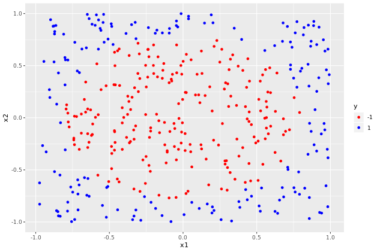
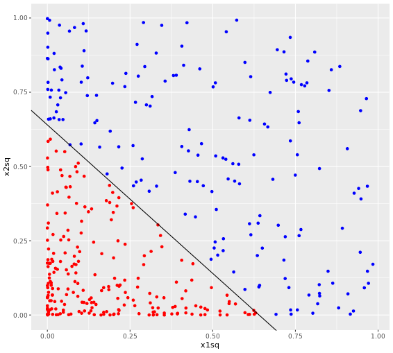

# Polynomial Kernels
## Generating a 2d radially separable dataset


```r

#set number of variables and seed
n <- 400
set.seed(1)

#Generate data frame with two uniformly distributed predictors, x1 and x2
df <- data.frame(x1 = runif(n, min = -1, max = 1), 
                 x2 = runif(n, min = -1, max = 1))

#We want a circular boundary. Set boundary radius 
radius <- 0.8
radius_squared <- radius^2

#create dependent categorical variable, y, with value -1 or 1 depending on whether point lies
#within or outside the circle.
df$y <- factor(ifelse(df$x2^2 + df$x1^2 < radius_squared, -1, 1), levels = c(-1, 1))

```

***

## Visualizing the dataset

```r

#load ggplot
library(ggplot2)

#build scatter plot, distinguish class by color
scatter_plot <- ggplot(data = df, aes(x = x1, y = x2, color = y)) + 
    geom_point() +
    scale_color_manual(values = c("red", "blue"))

#display plot
scatter_plot

```

Output:



## Linear SVM for a radially separable dataset

### 1

```r

#default cost mode;
svm_model_1 <- svm(y ~ ., data = trainset, type = "C-classification", cost = 1, kernel = "linear")

#training accuracy
pred_train <- predict(svm_model_1, trainset)
mean(pred_train == trainset$y)

#test accuracy
pred_test <- predict(svm_model_1, testset)
mean(pred_test == testset$y)

```

Output:

```bash

> #training accuracy
> pred_train <- predict(svm_model_1, trainset)
> mean(pred_train == trainset$y)
[1] 0.5414013
> 
> #test accuracy
> pred_test <- predict(svm_model_1, testset)
> mean(pred_test == testset$y)
[1] 0.5930233
> 

```
### 2

```r
#cost = 100 model
svm_model_2 <- svm(y ~ ., data = trainset, type = "C-classification", cost = 100, kernel = "linear")

#accuracy
pred_train <- predict(svm_model_2, trainset)
mean(pred_train == trainset$y)
pred_test <- predict(svm_model_2, testset)
mean(pred_test == testset$y)

```
Output:

```bash

> #accuracy
> pred_train <- predict(svm_model_2, trainset)
> mean(pred_train == trainset$y)
[1] 0.5414013
> pred_test <- predict(svm_model_2, testset)
> mean(pred_test == testset$y)
[1] 0.5930233
> 
```
***

## Average accuracy for linear SVM

calculate the average accuracy for a default cost linear SVM using 100 different training/test partitions

```r

# Print average accuracy and standard deviation
accuracy <- rep(NA, 100)
set.seed(2)

# Calculate accuracies for 100 training/test partitions
for (i in 1:100){
    df[, "train"] <- ifelse(runif(nrow(df)) < 0.8, 1, 0)
    trainset <- df[df$train == 1, ]
    testset <- df[df$train == 0, ]
    trainColNum <- grep("train", names(trainset))
    trainset <- trainset[, -trainColNum]
    testset <- testset[, -trainColNum]
    svm_model <- svm(y ~ ., data = trainset, type = "C-classification", kernel = "linear")
    pred_test <- predict(svm_model, testset)
    accuracy[i] <- mean(pred_test == testset$y)
}

# Print average accuracy and standard deviation
mean(accuracy)
sd(accuracy)

```

Output:

```bash
> # Print average accuracy and standard deviation
> accuracy <- rep(NA, 100)
> set.seed(2)
> 
> # Calculate accuracies for 100 training/test partitions
> for (i in 1:100){
      df[, "train"] <- ifelse(runif(nrow(df)) < 0.8, 1, 0)
      trainset <- df[df$train == 1, ]
      testset <- df[df$train == 0, ]
      trainColNum <- grep("train", names(trainset))
      trainset <- trainset[, -trainColNum]
      testset <- testset[, -trainColNum]
      svm_model <- svm(y ~ ., data = trainset, type = "C-classification", kernel = "linear")
      pred_test <- predict(svm_model, testset)
      accuracy[i] <- mean(pred_test == testset$y)
  }
> 
> # Print average accuracy and standard deviation
> mean(accuracy)
[1] 0.5554571
> sd(accuracy)
[1] 0.04243524
> 
```

***

## Visualizing transformed radially separable data

```r

#transform data
df1 <- data.frame(x1sq = df$x1^2, x2sq = df$x2^2, y = df$y)

#plot data points in the transformed space
plot_transformed <- ggplot(data = df1, aes(x = x1sq, y = x2sq, color = y)) + 
    geom_point()+ guides(color = FALSE) + 
    scale_color_manual(values = c("red", "blue"))

#add decision boundary and visualize
plot_decision <- plot_transformed + geom_abline(slope = -1, intercept = 0.64)
plot_decision


```

Output:



***

## SVM with polynomial kernel

```r

svm_model<- 
    svm(y ~ ., data = trainset, type = "C-classification", 
        kernel = "polynomial", degree = 2)

#measure training and test accuracy
pred_train <- predict(svm_model, trainset)
mean(pred_train == trainset$y)
pred_test <- predict(svm_model, testset)
mean(pred_test == testset$y)

#plot
plot(svm_model, trainset)

```
Output:

```bash
> mean(pred_train == trainset$y)
[1] 0.9745223
> pred_test <- predict(svm_model, testset)
> mean(pred_test == testset$y)
[1] 0.9651163

```


***


