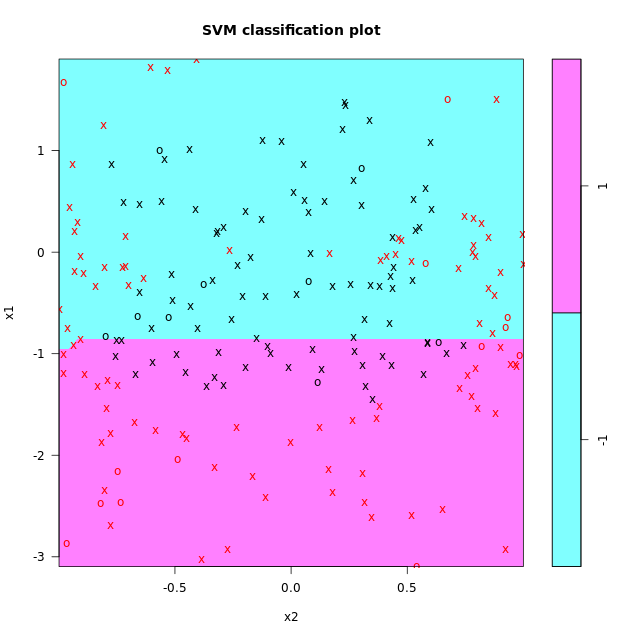
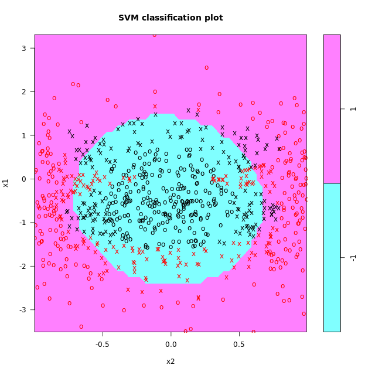
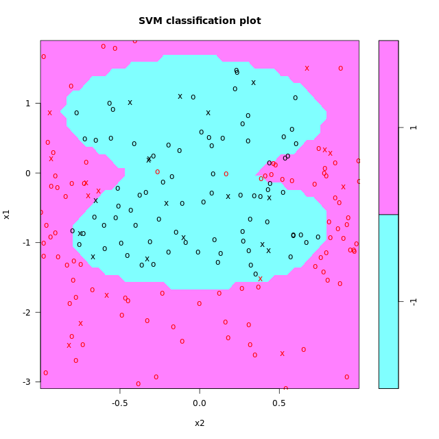

# Chapter 4 - Radial Basis Function Kernels
## Generating a complex dataset - part 1


x1 = normal distribution
x2 = uniform distribution


```r

#number of data points
n <- 1000

#set seed
set.seed(1)

#create dataframe
df <- data.frame(x1 = rnorm(n, mean = -0.5, sd = 1), 
                 x2 = runif(n, min = -1, max = 1))
```
***

## Generating a complex dataset - part 2


The boundary consists of two circles of radius 0.8 units with centers at x1 = -0.8, x2 = 0) and (x1 = 0.8, x2 = 0) that just touch each other at the origin. Define a binary classification variable y such that points that lie within either of the circles have y = -1 and those that lie outside both circle have y = 1.

```r

#set radius and centers
radius <- 0.8
center_1 <- c(-0.8, 0)
center_2 <- c(0.8, 0)
radius_squared <- radius^2

#create binary classification variable
df$y <- factor(ifelse((df$x1-center_1[1])^2 + (df$x2-center_1[2])^2 < radius_squared|
                      (df$x1-center_2[1])^2 + (df$x2-center_2[2])^2 < radius_squared, -1, 1),
                      levels = c(-1, 1))
                      
```

***

## Visualizing the dataset

```r

# Load ggplot2
library(ggplot2)

# Plot x2 vs. x1, colored by y
scatter_plot<- ggplot(data = df, aes(x = x1, y = x2, color = y)) + 
    # Add a point layer
    geom_point() + 
    scale_color_manual(values = c("red", "blue")) +
    # Specify equal coordinates
    coord_equal()
 
scatter_plot 

```
Output:


***

## Linear SVM for complex dataset
```r
#build model
svm_model<- 
    svm(y ~ ., data = trainset, type = "C-classification", 
        kernel = "linear")

#accuracy
pred_train <- predict(svm_model, trainset)
mean(pred_train == trainset$y)
pred_test <- predict(svm_model, testset)
mean(pred_test == testset$y)

#plot model against testset
plot(svm_model,testset)
```
Output:

```bash
> #build model
> svm_model<- 
      svm(y ~ ., data = trainset, type = "C-classification", 
          kernel = "linear")
> 
> #accuracy
> pred_train <- predict(svm_model, trainset)
> mean(pred_train == trainset$y)
[1] 0.5897756
> pred_test <- predict(svm_model, testset)
> mean(pred_test == testset$y)
[1] 0.5959596
> 
> #plot model against testset
> plot(svm_model,testset)
> 

```


## Quadratic SVM for complex dataset

```r

#build model
svm_model<- 
    svm(y ~ ., data = trainset, type = "C-classification", 
        kernel = "polynomial", degree = 2)

#accuracy
pred_train <- predict(svm_model, trainset)
mean(pred_train == trainset$y)
pred_test <- predict(svm_model, testset)
mean(pred_test == testset$y)

#plot model
plot(svm_model, trainset)

```

Output:

```bash
> #build model
> svm_model<- 
      svm(y ~ ., data = trainset, type = "C-classification", 
          kernel = "polynomial", degree = 2)
> 
> #accuracy
> pred_train <- predict(svm_model, trainset)
> mean(pred_train == trainset$y)
[1] 0.8067332
> pred_test <- predict(svm_model, testset)
> mean(pred_test == testset$y)
[1] 0.7979798
> 
> #plot model
> plot(svm_model, trainset)
> 

```




***

## Polynomial SVM on a complex dataset

```r

#create vector to store accuracies and set random number seed
accuracy <- rep(NA, 100)
set.seed(2)

#calculate accuracies for 100 training/test partitions
for (i in 1:100){
    df[, "train"] <- ifelse(runif(nrow(df))<0.8, 1, 0)
    trainset <- df[df$train == 1, ]
    testset <- df[df$train == 0, ]
    trainColNum <- grep("train", names(trainset))
    trainset <- trainset[, -trainColNum]
    testset <- testset[, -trainColNum]
    svm_model<- svm(y ~ ., data = trainset, type = "C-classification", kernel = "polynomial", degree = 2)
    pred_test <- predict(svm_model, testset)
    accuracy[i] <- mean(pred_test == testset$y)
}

#print average accuracy and standard deviation
mean(accuracy)
sd(accuracy)

```

Output:

```bash

> #create vector to store accuracies and set random number seed
> accuracy <- rep(NA, 100)
> set.seed(2)
> 
> #calculate accuracies for 100 training/test partitions
> for (i in 1:100){
      df[, "train"] <- ifelse(runif(nrow(df))<0.8, 1, 0)
      trainset <- df[df$train == 1, ]
      testset <- df[df$train == 0, ]
      trainColNum <- grep("train", names(trainset))
      trainset <- trainset[, -trainColNum]
      testset <- testset[, -trainColNum]
      svm_model<- svm(y ~ ., data = trainset, type = "C-classification", kernel = "polynomial", degree = 2)
      pred_test <- predict(svm_model, testset)
      accuracy[i] <- mean(pred_test == testset$y)
  }
> 
> #print average accuracy and standard deviation
> mean(accuracy)
[1] 0.804765
> sd(accuracy)
[1] 0.02398396
> 

```

***

## RBF SVM on a complex dataset

```r
#create vector to store accuracies and set random number seed
accuracy <- rep(NA, 100)
set.seed(2)

#calculate accuracies for 100 training/test partitions
for (i in 1:100){
    df[, "train"] <- ifelse(runif(nrow(df))<0.8, 1, 0)
    trainset <- df[df$train == 1, ]
    testset <- df[df$train == 0, ]
    trainColNum <- grep("train", names(trainset))
    trainset <- trainset[, -trainColNum]
    testset <- testset[, -trainColNum]
    svm_model<- svm(y ~ ., data = trainset, type = "C-classification", kernel = "radial")
    pred_test <- predict(svm_model, testset)
    accuracy[i] <- mean(pred_test == testset$y)
}

#print average accuracy and standard deviation
mean(accuracy)
sd(accuracy)

```

Output:

```bash

> #create vector to store accuracies and set random number seed
> accuracy <- rep(NA, 100)
> set.seed(2)
> 
> #calculate accuracies for 100 training/test partitions
> for (i in 1:100){
      df[, "train"] <- ifelse(runif(nrow(df))<0.8, 1, 0)
      trainset <- df[df$train == 1, ]
      testset <- df[df$train == 0, ]
      trainColNum <- grep("train", names(trainset))
      trainset <- trainset[, -trainColNum]
      testset <- testset[, -trainColNum]
      svm_model<- svm(y ~ ., data = trainset, type = "C-classification", kernel = "radial")
      pred_test <- predict(svm_model, testset)
      accuracy[i] <- mean(pred_test == testset$y)
  }
> 
> #print average accuracy and standard deviation
> mean(accuracy)
[1] 0.9034203
> sd(accuracy)
[1] 0.01786378
> 

```
***

## Tuning an RBF kernel SVM

```r

#tune model
tune_out <- tune.svm(x = trainset[, -3], y = trainset[, 3], 
                     gamma = 5*10^(-2:2), 
                     cost = c(0.01, 0.1, 1, 10, 100), 
                     type = "C-classification", kernel = "radial")

#build tuned model
svm_model <- svm(y~ ., data = trainset, type = "C-classification", kernel = "radial", 
                 cost = tune_out$best.parameters$cost, 
                 gamma = tune_out$best.parameters$gamma)

#calculate test accuracy
pred_test <- predict(svm_model, testset)
mean(pred_test == testset$y)

#Plot decision boundary against test data
plot(svm_model, testset)

```

Output:

```bash

> #tune model
> tune_out <- tune.svm(x = trainset[, -3], y = trainset[, 3], 
                       gamma = 5*10^(-2:2), 
                       cost = c(0.01, 0.1, 1, 10, 100), 
                       type = "C-classification", kernel = "radial")
> 
> #build tuned model
> svm_model <- svm(y~ ., data = trainset, type = "C-classification", kernel = "radial", 
                   cost = tune_out$best.parameters$cost, 
                   gamma = tune_out$best.parameters$gamma)
> 
> #calculate test accuracy
> pred_test <- predict(svm_model, testset)
> mean(pred_test == testset$y)
[1] 0.959596
> 
> #Plot decision boundary against test data
> plot(svm_model, testset)
> 

```



