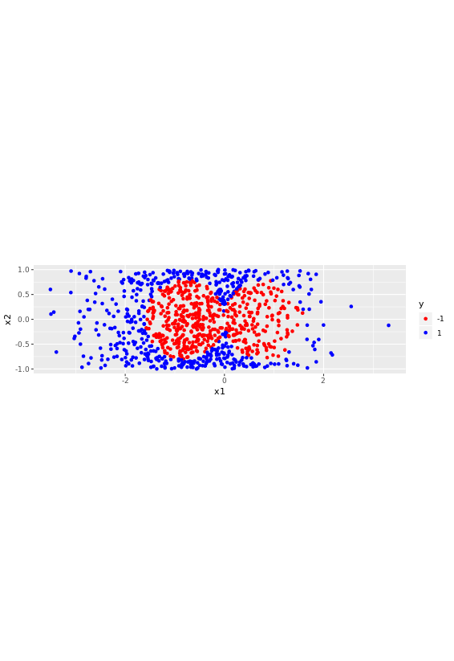

# Radial Basis Function Kernels
## Generating a complex dataset - part 1


x1 = normal distribution
x2 = uniform distribution


```r

#number of data points
n <- 1000

#set seed
set.seed(1)

#create dataframe
df <- data.frame(x1 = rnorm(n, mean = -0.5, sd = 1), 
                 x2 = runif(n, min = -1, max = 1))
```
***

## Generating a complex dataset - part 2


The boundary consists of two circles of radius 0.8 units with centers at x1 = -0.8, x2 = 0) and (x1 = 0.8, x2 = 0) that just touch each other at the origin. Define a binary classification variable y such that points that lie within either of the circles have y = -1 and those that lie outside both circle have y = 1.

```r

#set radius and centers
radius <- 0.8
center_1 <- c(-0.8, 0)
center_2 <- c(0.8, 0)
radius_squared <- radius^2

#create binary classification variable
df$y <- factor(ifelse((df$x1-center_1[1])^2 + (df$x2-center_1[2])^2 < radius_squared|
                      (df$x1-center_2[1])^2 + (df$x2-center_2[2])^2 < radius_squared, -1, 1),
                      levels = c(-1, 1))
                      
```

***

## Visualizing the dataset

```r

# Load ggplot2
library(ggplot2)

# Plot x2 vs. x1, colored by y
scatter_plot<- ggplot(data = df, aes(x = x1, y = x2, color = y)) + 
    # Add a point layer
    geom_point() + 
    scale_color_manual(values = c("red", "blue")) +
    # Specify equal coordinates
    coord_equal()
 
scatter_plot 

```

Output:




