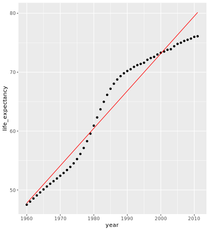

# Machine Learning in the Tidyverse

## Foundations of "tidy" Machine learning
## Nesting your data

```r

# Explore gapminder
head(gapminder)

# Prepare the nested dataframe gap_nested
library(tidyverse)
gap_nested <- gapminder %>% 
  group_by(country) %>% 
  nest()

# Explore gap_nested
head(gap_nested)

```

***

## Unnesting your data

```r

# Create the unnested dataframe called gap_unnnested
gap_unnested <- gap_nested %>% 
  unnest()
  
# Confirm that your data was not modified  
identical(gapminder, gap_unnested)


```
***

## Explore a nested cell

```r

# Extract the data of Algeria
algeria_df <- gap_nested$data[[1]]

# Calculate the minimum of the population vector
min(algeria_df$population)

# Calculate the maximum of the population vector
max(algeria_df$population)

# Calculate the mean of the population vector
mean(algeria_df$population)

```

## Mapping your data

We can append calculated results to df using `mutate()` and `map()`.

`map()` -> alsways return a vecotr of lists, need to use `unnest()` to extract the data in to numveric vector.

```r

# Calculate the mean population for each country
pop_nested <- gap_nested %>%
  mutate(mean_pop = map(data, ~mean(.x$population)))

# Take a look at pop_nested
head(pop_nested)

# Extract the mean_pop value by using unnest
pop_mean <- pop_nested %>% 
  unnest(mean_pop)

# Take a look at pop_mean
head(pop_mean)

```

***

## Expecting mapped output

you can use the `map_*()` family of functions to explicitly try to return that object type instead of a list

```r

# Calculate mean population and store result as a double
pop_mean <- gap_nested %>%
  mutate(mean_pop = map_dbl(data, ~mean(.x$population)))

# Take a look at pop_mean
head(pop_mean)

```
***

## Mapping many models

```r

# Build a linear model for each country
gap_models <- gap_nested %>%
    mutate(model = map(data, ~lm(formula = life_expectancy~year, data = .x)))
    
# Extract the model for Algeria    
algeria_model <- gap_models$model[[1]]

# View the summary for the Algeria model
summary(algeria_model)

```


output:

```bash
> # Build a linear model for each country
> gap_models <- gap_nested %>%
      mutate(model = map(data, ~lm(formula = life_expectancy~year, data = .x)))
> 
> # Extract the model for Algeria
> algeria_model <- gap_models$model[[1]]
> 
> # View the summary for the Algeria model
> summary(algeria_model)

Call:
lm(formula = life_expectancy ~ year, data = .x)

Residuals:
   Min     1Q Median     3Q    Max 
-4.044 -1.577 -0.543  1.700  3.843 

Coefficients:
              Estimate Std. Error t value Pr(>|t|)    
(Intercept) -1.197e+03  3.994e+01  -29.96   <2e-16 ***
year         6.349e-01  2.011e-02   31.56   <2e-16 ***
---
Signif. codes:  0 '***' 0.001 '**' 0.01 '*' 0.05 '.' 0.1 ' ' 1

Residual standard error: 2.177 on 50 degrees of freedom
Multiple R-squared:  0.9522,	Adjusted R-squared:  0.9513 
F-statistic: 996.2 on 1 and 50 DF,  p-value: < 2.2e-16
> 

```

***


## The three ways to tidy your model

Below are the descriptions of the three functions in the broom package. Which ones are correct?

* `tidy()` returns the statistical findings of the model (such as coefficients)

* `glance()` returns a concise one-row summary of the model

* `augment()` adds prediction columns to the data being modeled


## Extracting model statistics tidily

```r

library(broom)

# Extract the coefficients of the algeria_model as a dataframe
tidy(algeria_model)

# Extract the statistics of the algeria_model as a dataframe
glance(algeria_model)

```

Output:

```bash

> library(broom)
> 
> # Extract the coefficients of the algeria_model as a dataframe
> tidy(algeria_model)
# A tibble: 2 x 5
  term         estimate std.error statistic  p.value
  <chr>           <dbl>     <dbl>     <dbl>    <dbl>
1 (Intercept) -1197.      39.9        -30.0 1.32e-33
2 year            0.635    0.0201      31.6 1.11e-34
> 
> # Extract the statistics of the algeria_model as a dataframe
> glance(algeria_model)
# A tibble: 1 x 11
  r.squared adj.r.squared sigma statistic  p.value    df logLik   AIC   BIC
      <dbl>         <dbl> <dbl>     <dbl>    <dbl> <int>  <dbl> <dbl> <dbl>
1     0.952         0.951  2.18      996. 1.11e-34     2  -113.  232.  238.
# ... with 2 more variables: deviance <dbl>, df.residual <int>
> 

```
***

## Augmenting your data

```r

# Build the augmented dataframe
algeria_fitted <- augment(algeria_model)

# Compare the predicted values with the actual values of life expectancy
algeria_fitted %>% 
  ggplot(aes(x = year)) +
  geom_point(aes(y = life_expectancy)) + 
  geom_line(aes(y = .fitted), color = "red")
 
```



