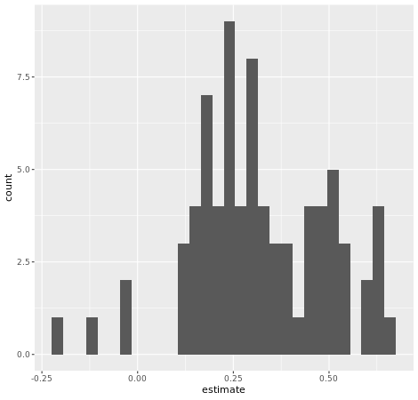
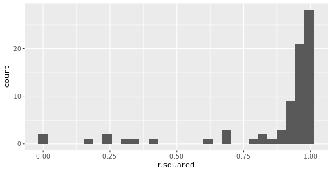
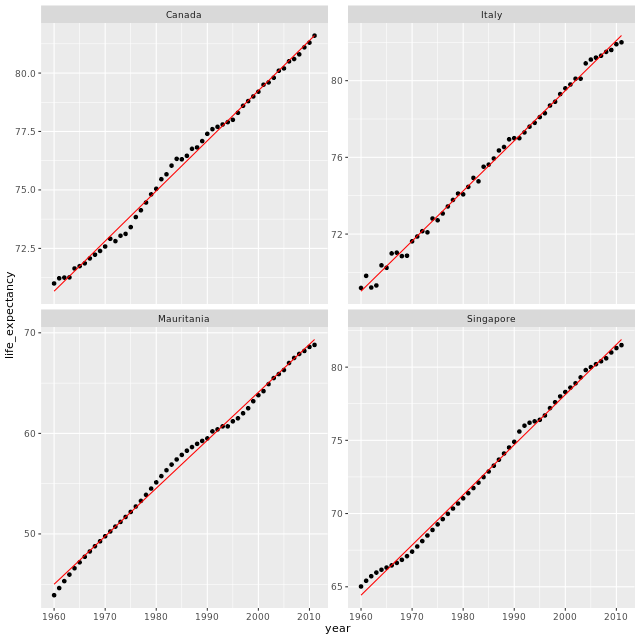
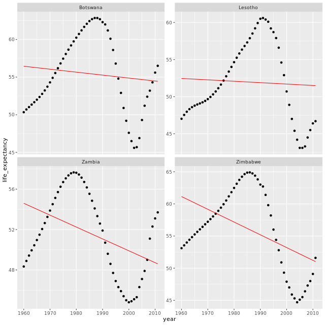

# Multiple Models with broom
## Tidy up the coefficients of your models


```r

# Extract the coefficient statistics of each model into nested dataframes
model_coef_nested <- gap_models %>% 
    mutate(coef = map(model, ~tidy(.x)))
    
# Simplify the coef dataframes for each model    
model_coef <- model_coef_nested %>%
    unnest(coef)

# Plot a histogram of the coefficient estimates for year         
model_coef %>% 
  filter(term == "year") %>% 
  ggplot(aes(x = estimate)) +
  geom_histogram()
  
```




***

## Glance at the fit of your models

`glance()` to calculate how well the linear models fit the data.

```r

# Extract the fit statistics of each model into dataframes
model_perf_nested <- gap_models %>% 
    mutate(fit = map(model, ~glance(.x)))

# Simplify the fit dataframes for each model    
model_perf <- model_perf_nested %>% 
    unnest(model_perf_nested$fit)
    
# Look at the first six rows of model_perf
head(model_perf)

```

Output:

```bash

> # Extract the fit statistics of each model into dataframes
> model_perf_nested <- gap_models %>% 
      mutate(fit = map(model, ~glance(.x)))
> 
> # Simplify the fit dataframes for each model
> model_perf <- model_perf_nested %>% 
      unnest(model_perf_nested$fit)
> 
> # Look at the first six rows of model_perf
> head(model_perf)
# A tibble: 6 x 15
  country data  model fit   r.squared adj.r.squared sigma statistic  p.value
  <fct>   <lis> <lis> <lis>     <dbl>         <dbl> <dbl>     <dbl>    <dbl>
1 Algeria <tib~ <lm>  <tib~     0.952         0.951 2.18       996. 1.11e-34
2 Argent~ <tib~ <lm>  <tib~     0.984         0.984 0.431     3137. 8.78e-47
3 Austra~ <tib~ <lm>  <tib~     0.983         0.983 0.511     2905. 5.83e-46
4 Austria <tib~ <lm>  <tib~     0.987         0.986 0.438     3702. 1.48e-48
5 Bangla~ <tib~ <lm>  <tib~     0.949         0.947 1.83       921. 7.10e-34
6 Belgium <tib~ <lm>  <tib~     0.990         0.990 0.331     5094. 5.54e-52
# ... with 6 more variables: df <int>, logLik <dbl>, AIC <dbl>, BIC <dbl>,
#   deviance <dbl>, df.residual <int>
> 


```

***

## Best and worst fitting models

```r

# Plot a histogram of rsquared for the 77 models    
model_perf %>% 
  ggplot(aes(x = r.squared)) + 
  geom_histogram()  
  
# Extract the 4 best fitting models
best_fit <- model_perf %>% 
  top_n(n = 4, wt = r.squared)

# Extract the 4 models with the worst fit
worst_fit <- model_perf %>% 
  top_n(n = 4, wt = -r.squared)


```

Output:

```bash

> # Plot a histogram of rsquared for the 77 models
> model_perf %>% 
    ggplot(aes(x = r.squared)) + 
    geom_histogram()
`stat_bin()` using `bins = 30`. Pick better value with `binwidth`.
> 
> # Extract the 4 best fitting models
> best_fit <- model_perf %>% 
    top_n(n = 4, wt = r.squared)
> 
> # Extract the 4 models with the worst fit
> worst_fit <- model_perf %>% 
    top_n(n = 4, wt = -r.squared)
> 

```



***

## Augment the fitted values of each model


```r

best_augmented <- best_fit %>% 
  # Build the augmented dataframe for each country model
  mutate(augmented = map(model, ~augment(.x))) %>% 
  # Expand the augmented dataframes
  unnest(augmented)

worst_augmented <- worst_fit %>% 
  # Build the augmented dataframe for each country model
  mutate(augmented = map(model, ~augment(.x))) %>% 
  # Expand the augmented dataframes
  unnest(augmented)
 
 
```


***

## Explore your best and worst fitting models


```r
# Compare the predicted values with the actual values of life expectancy 
# for the top 4 best fitting models
best_augmented %>% 
  ggplot(aes(x = year)) +
  geom_point(aes(y = life_expectancy)) + 
  geom_line(aes(y = .fitted), color = "red") +
  facet_wrap(~country, scales = "free_y")

```

Output:



```r

# Compare the predicted values with the actual values of life expectancy 
# for the top 4 worst fitting models
worst_augmented %>% 
  ggplot(aes(x = year)) +
  geom_point(aes(y = life_expectancy)) + 
  geom_line(aes(y = .fitted), color = "red") +
  facet_wrap(~country, scales = "free_y")

```

Output:




